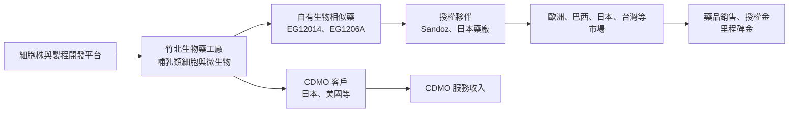
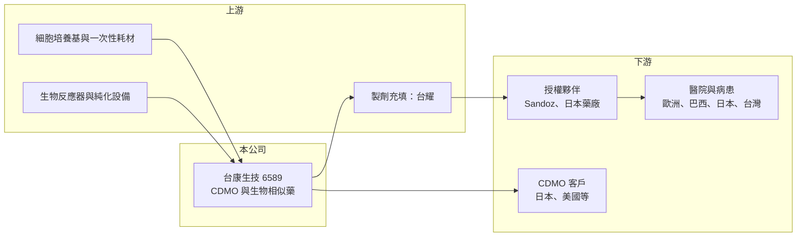

# 6589 台康生技

> 上市｜[[產業索引-生技醫療業|生技醫療業]]｜上市（櫃）日期 2025/07/21

# 第一章：企業模式與商業藍圖

> [!info] 撰寫說明
> 本文由 Claude 依公開資料整理，架構比照 [[2330台積電]] 的四章研究，資料截至 2026-10-08。財務數字來源：Goodinfo 年度經營績效頁（含 2026 年公告與新聞標題）、GeneOnline 2026 年 4 月法說會報導、證交所開放資料（基本資料、2026 年第二季資產負債、綜合損益與營益分析、股利）、本筆記新聞紀錄（2026 年 10 月 EMA 送件重訊）。標示「憑記憶」的歐盟首次核准年份尚未比對原始文件。#待校對

在評估單一個股的長期投資價值時，首要步驟是拆解企業的底層獲利邏輯。本章針對台康生技（股票代號：6589，以下簡稱台康）的商業模式進行定性分析，說明這家公司如何以「生物藥代工＋自有生物相似藥」雙引擎經營，以及乳癌標靶生物相似藥如何從授權走向全球銷售。

## 一、核心定位：CDMO 與生物相似藥雙引擎

台康成立於 2012 年，2025 年 7 月在證交所上市，董事長兼總經理為劉理成，實收資本額約 30.2 億元，英文名稱 EirGenix。公司採雙軌模式：一是生物藥 [[CDMO]]，替其他藥廠進行細胞株開發、製程開發與生產；二是自行開發[[生物相似藥]]，鎖定腫瘤科藥物，透過國際藥廠授權銷售。

台康建立了細胞株平台、連續製程平台、皮下注射劑型技術，以及名為 Mercury Project 的智慧製造數位方案。CDMO 累積的製程經驗可以支援自有產品開發，自有產品的商業化生產又能提高工廠利用率，兩者互相支撐。

## 二、事業板塊：兩項乳癌標靶生物相似藥與 CDMO

* **EG12014（曲妥珠單抗生物相似藥，原廠為賀癌平）：** 全球授權夥伴為 Sandoz，在歐盟已核准上市（首次核准約 2023 年，憑記憶，待校對），2026 年 7 月歐洲藥品管理局再核准 420 毫克劑量包裝變更；2026 年 8 月 Sandoz 向巴西主管機關提交上市申請。台灣已進入四大醫學中心與區域醫院，公司目標三年內取得台灣 30% 市占；美國則規劃於 2026 年下半年重新向 FDA 送件。2026 年 4 月，製劑充填（DP）廠改為 [[4746台耀]]。
* **EG1206A（帕妥珠單抗生物相似藥，原廠為賀疾妥）：** 2025 年 9 月與 FDA、EMA 討論並重新分析免疫原性數據後，公司結束三期臨床，改為直接準備美國 BLA 與歐盟上市申請；媒體報導與原廠羅氏達成專利和解，可能提早上市。2026 年 6 月與日本指標藥廠簽訂日本地區授權銷售合約，2026 年 10 月向歐洲藥品管理局提交 420 毫克液體注射劑上市許可申請。
* **CDMO：** 2026 年 9 月竹北微生物商業化生產廠（微生物二廠）啟用，已承接日本訂單，並確認美國 CDMO 合作；2026 年 4 月法說時，公司表示有兩件美國與歐洲的 CDMO 併購案在洽談中。2026 年 9 月台康也通過經濟部 A+ 計畫。
* **營收結構：** 本次未查得 CDMO 與藥品銷售的營收比重，因此不放圓餅圖。

## 三、資本轉化邏輯：以工廠產能同時服務客戶與自有產品

* **授權而非自銷：** 自有產品交給 Sandoz 等國際藥廠銷售，台康收取授權金、[[里程碑金]]與供貨收入，不需建立全球業務團隊。
* **產能利用率決定毛利：** 生物藥工廠固定成本高，產能填滿前毛利率偏低。2023 至 2025 年毛利率約 19% 至 23%，2026 年上半年回升到 32.7%，反映藥品銷售與授權收入增加。

## 四、企業長期藍圖

台康的長期方向是：自有產品聚焦腫瘤科生物相似藥，CDMO 則以新產能與海外併購擴大規模。董事長在 2026 年法說時指出，到 2034 年前有 118 個生物藥專利到期，其中約 70 個尚無生物相似藥在開發，加上各國簡化生物相似藥三期臨床要求，中小型公司有更多機會切入年銷售額 10 億美元以下的產品。公司估計全球生物相似藥市場 2026 至 2035 年年複合成長約 17%。

# 第二章：護城河深度與競爭優勢

本章分析台康的競爭優勢，說明它在生物相似藥與 CDMO 兩個市場面對哪些對手，以及雙引擎模式的護城河從何而來。

## 一、護城河的核心組成要素

* **歐盟藥證與國際授權夥伴：** EG12014 已取得歐盟上市許可，並由全球學名藥與生物相似藥大廠 Sandoz 銷售，代表產品品質通過國際標準與大廠評估，這是台康最重要的信用背書。
* **製程平台：** 細胞株、連續製程與皮下注射劑型等平台，可以縮短客戶與自有產品的開發時間，是 CDMO 接案的核心賣點。
* **專利和解與上市時機：** EG1206A 與原廠的專利和解，若讓產品能較早上市，將取得先行者優勢。

## 二、全球主要競爭對手格局

| 對手 | 定位 | 與台康的比較 |
|---|---|---|
| 三星生物製劑、Celltrion | 韓國生物相似藥與 CDMO 大廠 | 規模、產品線與產能遠大於台康 |
| Lonza、藥明生物 | 國際生物藥 CDMO | CDMO 市場領導者，客戶基礎深 |
| 印度與中國生物相似藥廠 | 新興市場生物相似藥 | 成本低，在新興市場價格競爭激烈 |
| [[6541泰福-KY]] | 台灣生物相似藥與 CDMO | 模式最接近，同樣開發曲妥珠單抗生物相似藥 |
| [[6472保瑞]] | 台灣製藥 CDMO | 以小分子製劑為主，CDMO 領域部分重疊 |

## 三、優勢轉化：守得住、守不住與觀察重點

* **守得住：** 與 Sandoz 的全球授權關係與已核准的歐盟藥證，讓 EG12014 能持續在多國放量。
* **守不住：** 生物相似藥的價格。曲妥珠單抗已有多家生物相似藥上市，售價持續下滑，獲利空間受壓。
* **觀察重點：** EG12014 美國重新送件與核准、EG1206A 歐美上市申請進度、竹北微生物二廠的訂單量，以及 CDMO 海外併購是否完成。

# 第三章：財務體質與盈利規模

資料日期：2026-10-08。數字取自 Goodinfo 年度經營績效頁與證交所開放資料，表格是撰寫當時的快照；最新月營收、毛利率、累計 EPS 由自動排程寫在本筆記的屬性欄位（月營收、毛利率、累計EPS 等）。#待校對

財務報表是檢驗護城河是否真實存在的最終標準。本章用七年的三率、ROE 與資本報酬，檢視台康從研發投入期走向商業化的過程。

## 一、多年度表格

| 年度 | 營收（新台幣） | [[毛利率]] | [[營業利益率]] | EPS（元） | [[ROE]] |
|---|---|---|---|---|---|
| 2019 | 4.76 億 | 53.5% | -178% | -5.39 | -43.7% |
| 2020 | 10.7 億 | 70.0% | -92.0% | -5.41 | -55.4% |
| 2021 | 17.0 億 | 64.4% | -3.44% | -0.18 | -0.69% |
| 2022 | 14.8 億 | 51.1% | -22.3% | -0.38 | -1.09% |
| 2023 | 10.2 億 | 23.1% | -101% | -3.00 | -8.84% |
| 2024 | 10.1 億 | 21.7% | -94.5% | -2.28 | -7.25% |
| 2025 | 10.1 億 | 19.3% | -80.2% | -2.51 | -8.64% |
| 2026 上半年 | 6.21 億 | 32.7% | -65.9% | -1.12 | 未查得 |

* **營收：** 2021 年 17.0 億元為高峰，當年接近損益兩平，應包含較高的授權與里程碑收入（推估）。2023 至 2025 年營收持平在 10 億元左右，2026 年 1 至 8 月累計營收約 9.96 億元、年增約 78%（證交所資料），重回成長。
* **毛利率：** 2023 至 2025 年降到 20% 上下，反映 CDMO 需求疲弱與產能利用率不足；2026 年上半年回升到 32.7%。
* **營業虧損：** 2026 年上半年營業費用約 6.12 億元，高於毛利約 2.03 億元，研發與新廠費用仍是虧損主因。

## 二、[[ROE]]、資本結構與研發強度

2021 至 2025 年平均 ROE 約 -5.3%（推算），虧損幅度相對新藥公司溫和。2026 年第二季底總資產約 106 億元，總負債約 28.1 億元（非流動負債約 16.8 億元），權益約 77.9 億元，負債比約 27%；流動資產約 39.0 億元，資金相對充裕。2025 年稅後淨損約 7.61 億元，2026 年 3 月董事會擬以資本公積約 7.43 億元彌補虧損，使保留盈餘的累積虧損維持在小幅水準（證交所股利資料）。2026 年公司也執行庫藏股買回並註銷。營業費用率以 2026 年上半年計算約 99%（推算），研發強度高。

## 三、[[ROIC]] 與 [[WACC]]：價值創造利差

**ROIC 推算：** 2025 年營收 10.1 億元、營業利益率 -80.2%，營業損失約 8.10 億元，虧損無所得稅抵減。2026 年第二季底權益約 77.9 億元，有息負債以非流動負債約 16.8 億元推估，投入資本約 94.8 億元，ROIC 約 -8.5%（推算）。

**WACC 推算：** 台灣 10 年期公債殖利率取 1.75%、市場風險溢酬 6%、β 取生物藥 CDMO 與生物相似藥股常見值 1.1（未查得公司實際 β），股東權益成本約 8.35%。負債成本假設 2.5%、稅後約 2.0%；權益約占 82%、負債約占 18%，WACC 約 7.2%（推算）。

**結論：** ROIC 約 -8.5%，低於約 7% 的資金成本，台康目前仍在消耗資本，但幅度比純研發型生技公司小，且 2026 年營收明顯成長、毛利率回升。若 EG12014 與 EG1206A 在歐美順利放量、CDMO 產能填滿，ROIC 有機會在數年內轉正並逐步接近資金成本。

# 第四章：總體風險與地緣政治

任何企業都無法脫離宏觀環境獨立存在。本章分析台康長期必須面對的法規、市場、地緣政治與營運風險。

## 一、地緣政治與政策風險

* **美國藥品關稅與在地化：** 美國若對進口藥品加徵關稅或要求在地生產，會影響台灣生產的生物相似藥進入美國的成本，也影響 CDMO 客戶的產地選擇。
* **生物安全相關立法：** 美國限制特定中國生物科技公司的立法，可能讓部分 CDMO 訂單從中國移出，對台灣 CDMO 是機會，但政策走向仍有變數。

## 二、產業週期與市場結構

* **生物相似藥價格競爭：** 同一原廠藥常有多家生物相似藥競爭，上市後價格逐年下降，獲利空間受壓。
* **CDMO 需求週期：** 生技募資環境冷卻時，客戶的開發與委託生產會延後，2023 至 2025 年毛利率下滑即反映 CDMO 需求疲弱。

## 三、營運與法規風險

* **美國藥證時程：** EG12014 美國送件需補件重送，EG1206A 改走不做三期的路徑，審查結果仍有不確定性。
* **專利訴訟：** 生物相似藥上市常面臨原廠專利訴訟，和解條件會影響上市時點與市場。
* **授權夥伴依賴：** 銷售仰賴 Sandoz 等夥伴，夥伴的產品策略與推廣力度決定台康的收入。
* **併購整合風險：** 若完成海外 CDMO 併購，需面對跨國整合、文化與財務負擔。

# 專有名詞解析

## 金融

- **[[毛利率]]**：營業毛利占營收的比例，反映產品定價能力與生產成本控制。
- **[[營業利益率]]**：扣除營業費用後的營業利益占營收的比例，衡量本業整體獲利能力。
- **[[ROE]]**：股東權益報酬率，稅後淨利除以股東權益，衡量公司運用股東資金的效率。
- **[[ROIC]]**：投入資本報酬率，稅後營業利益除以股東權益與有息負債的合計，衡量本業對所有資金提供者的報酬。
- **[[WACC]]**：加權平均資金成本，依股東權益與負債的比重加權計算的資金成本，ROIC 高於它才代表創造價值。

## 產業

- **[[生物相似藥]]**：原廠生物藥專利到期後，由其他藥廠開發、與原廠品質與療效高度相似的生物藥，價格通常較低。
- **[[CDMO]]**：委託開發暨製造服務，替藥廠從製程開發到量產一條龍代工，類似製藥業的晶圓代工。
- **[[里程碑金]]**：授權合約中，當藥物達成臨床進展、取得藥證或銷售目標等特定里程碑時，被授權方支付的款項。

# 核心供應鏈

## 1. 上游
- 細胞培養基、一次性耗材、生物反應器與純化設備供應商（名稱未查得）
- 製劑充填：[[4746台耀]]（EG12014，2026 年起）

## 2. 本公司
- 台康生技：EG12014、EG1206A 生物相似藥，生物藥 CDMO（竹北哺乳類細胞與微生物廠）

## 3. 下游／客戶
- 授權夥伴：Sandoz（EG12014 全球）、日本指標藥廠（EG1206A 日本，名稱未公開）
- CDMO 客戶：日本與美國客戶（名稱未公開）

## 4. 同業
- 台灣：[[6541泰福-KY]]、[[6472保瑞]]
- 國際：三星生物製劑、Celltrion、Lonza、藥明生物

## 最新新聞
<!-- news:start（自動產生，請勿手動編輯此範圍） -->
- 2026-10-08 📰 媒體 19:51｜營收速報 - 台康生技(6589)9月營收1.17億元年增率高達43.16％｜[鉅亨網](https://news.cnyes.com/news/id/6625901)
- 2026-10-07 🏛️ 重訊 00:06｜本公司向歐盟藥品管理局(EMA)提交生物相似藥EG1206A (Pertuzumab Biosimilar)液體注射劑420毫克產品 之上市許可申請｜[觀測站](https://mops.twse.com.tw/mops/#/web/t05st01)

完整紀錄：[[6589台康生技 新聞]]
<!-- news:end -->

## 相關連結
- [公開資訊觀測站](https://mopsov.twse.com.tw/mops/web/t05st03?step=1&firstin=1&co_id=6589)
- [Goodinfo](https://goodinfo.tw/tw/StockDetail.asp?STOCK_ID=6589)
- [Yahoo 股市](https://tw.stock.yahoo.com/quote/6589)
- [鉅亨網新聞](https://www.cnyes.com/twstock/6589/news)
