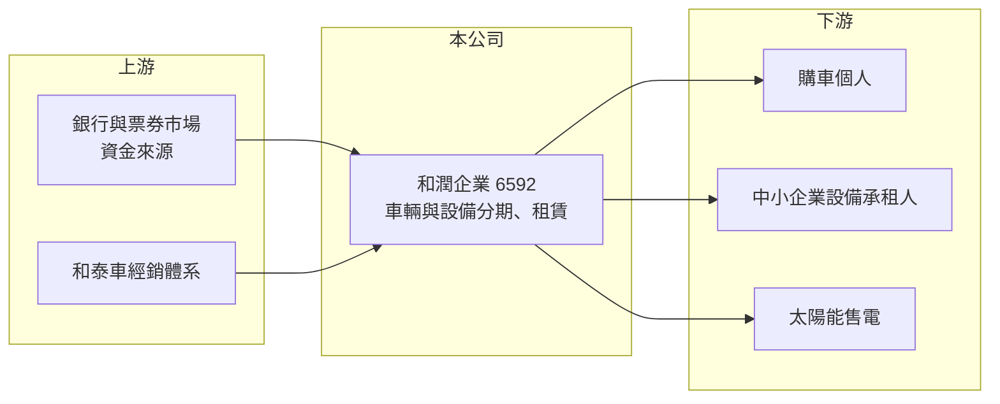

# 6592 和潤企業

> 上市｜[[產業索引-其他業|其他業]]｜上市（櫃）日期 2019/12/09

# 第一章：企業模式與商業藍圖

> [!info] 撰寫說明
> 精簡版，由 Claude 依公開資料整理，架構比照 [[2330台積電]]，資料截至 2026-10-07。來源：nstock.tw 和潤企業公司概況。業務別營收比重與海外據點本次未查到。#待校對

和潤企業是 [[2207和泰車]] 集團旗下的汽車金融與租賃公司，替 TOYOTA、LEXUS 購車人提供分期付款。

- **核心業務：** 和潤從事各種車輛及設備的[[分期付款]]買賣與[[融資租賃]]，並經營太陽能發電相關業務。
- **營收結構：** 本次未查到車輛、設備與太陽能業務的比重；2025 年全年營收 237.04 億元，2026 年 1 至 8 月累計 153.38 億元。
- **營運據點：** 控股股東為和展投資（持股約 45.4%），母公司為和泰汽車；國內通路依附和泰車經銷體系（推估），海外據點本次未查到。
- **長期方向：** 在車貸本業之外，往中小企業設備分期與綠能發電延伸，分散對新車銷售景氣的依賴（推估）。

# 第二章：護城河深度與競爭優勢

和潤的護城河主要來自母集團的汽車通路與較低的資金成本。

- **競爭優勢：** 和泰車是台灣最大汽車代理商，和潤可直接在經銷據點承作購車分期，取得客源的成本低（推估）。
- **主要對手：** [[9941裕融]]、[[5871中租-KY]]、[[6958日盛台駿]] 以及銀行車貸部門。
- **觀察重點：** 放款餘額成長、逾放與呆帳費用變化，以及利率變動對利差的影響。

# 第三章：財務體質與盈利規模

資料日期：2026-10-07，以下數字是撰寫當時的快照；最新月營收、毛利率、累計 EPS 由自動排程寫在本筆記的屬性欄位（月營收、毛利率、累計EPS 等）。#待校對

和潤屬於金融型態公司，毛利率高但淨利率受利息與呆帳費用影響。

- **營收規模：** 2026 年 8 月營收 18.73 億元，1 至 8 月累計 153.38 億元；2025 年全年營收 237.04 億元。
- **獲利：** 2026 年第二季 EPS 1.48 元，上半年累計 2.22 元；第二季[[毛利率]] 61.45%、[[營業利益率]] 20.52%、淨利率 16.8%。
- **財務特色：** 資本額約 74.18 億元，第二季單季 [[ROE]] 2.27%、ROA 0.29%，ROA 低是高財務槓桿的租賃業特性；最新股利為現金 3 元加股票股利 0.3 元。

# 第四章：總體風險與地緣政治

和潤的風險集中在信用品質、資金成本與車市景氣。

- **產業週期：** 新車銷售受景氣、關稅與車價影響，車市轉弱會直接減少新承作的分期案件。
- **營運風險：** 借款人違約增加會提高呆帳費用；高財務槓桿使獲利對信用損失敏感。
- **其他風險：** 利率上升會壓縮[[利差]]；金融監理規範變動，以及太陽能業務的電價與政策風險。

# 專有名詞解析

## 金融

- **[[分期付款]]**：購買者分期支付價款，業者賺取利息收入，是車貸公司的核心業務。
- **[[融資租賃]]**：出租人購入設備或車輛租給承租人，承租人分期支付租金，實質上是一種融資。
- **[[利差]]**：放款利率與資金成本之間的差距，是租賃與融資公司的主要獲利來源。
- **[[ROE]]**：股東權益報酬率，稅後淨利除以股東權益，衡量股東資金的獲利效率。

# 核心供應鏈

- 上游：銀行借款與票券等資金來源（推估）、母公司 [[2207和泰車]] 的經銷通路
- 下游／客戶：購車個人與中小企業，客戶名稱未揭露
- 同業：[[9941裕融]]、[[5871中租-KY]]、[[6958日盛台駿]]

## 最新新聞
<!-- news:start -->
<!-- news:end -->

## 相關連結
- [公開資訊觀測站](https://mopsov.twse.com.tw/mops/web/t05st03?step=1&firstin=1&co_id=6592)
- [Goodinfo](https://goodinfo.tw/tw/StockDetail.asp?STOCK_ID=6592)
- [Yahoo 股市](https://tw.stock.yahoo.com/quote/6592)
- [鉅亨網新聞](https://www.cnyes.com/twstock/6592/news)
