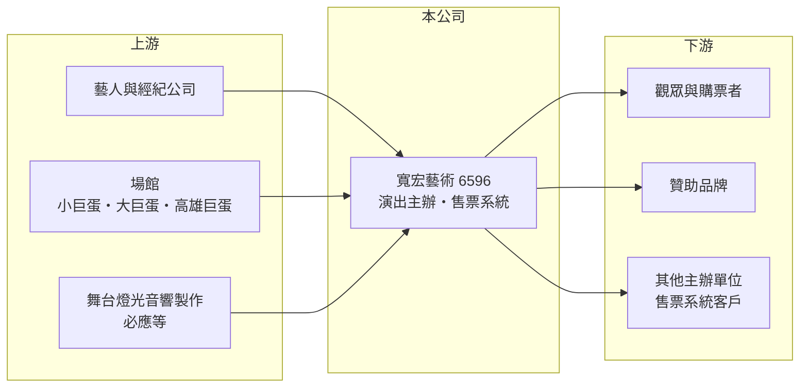

# 6596 寬宏藝術

> 上櫃｜[[產業索引-文化創意業|文化創意業]]｜上市（櫃）日期 2018/01/04

# 第一章：企業模式與商業藍圖

> [!info] 撰寫說明
> 精簡版，由 Claude 依公開資料整理，架構比照 [[2330台積電]] 的四章研究，資料截至 2026-10-08。來源：Goodinfo 基本資料與年度經營績效頁、理財周刊 2025 年報導、櫃買中心開放資料（2026 年第二季綜合損益與資產負債、基本資料、每月營收、本益比殖利率）、財經媒體標題；公司未公開業務別營收比重，產業描述為整理性內容。#待校對

寬宏藝術經紀（股票代號：6596，以下簡稱寬宏）是台灣主要的演唱會與藝文活動主辦商之一，直接受惠於[[演唱會經濟]]。本章說明主辦商如何承擔演出風險、賺取票房差價，以及自有售票系統在這個模式中的角色。

## 一、核心定位：承擔票房風險的[[演出主辦]]商

寬宏成立於 2004 年，2018 年 1 月上櫃，董事長兼總經理為林建寰。依 Goodinfo 基本資料，公司的業務是「國內外演唱會、展覽、藝文活動主辦及執行」，並負責活動製作與票券銷售。依理財周刊整理，公司主辦的節目涵蓋國內外藝人演唱會、展覽、音樂劇、舞蹈與戲劇，也販售藝文周邊商品。

主辦商的商業模式是：先向藝人或經紀公司買下演出權，支付演出費並租用場館、負擔舞台與宣傳成本，再透過賣票回收。票房超過成本的部分就是主辦商的利潤；反過來說，如果票賣不完，虧損也由主辦商承擔。這種模式的報酬與風險都集中在「選對節目」。

## 二、收入來源

公司未揭露業務別比重（未查得），依業務性質可分為：

* **演唱會主辦：** 最主要的收入來源。大型演唱會的單一檔期就能貢獻數億元營收，例如理財周刊報導，江蕙在退隱約 10 年後復出，加場共 23 場，票房收入預估約 8.74 億元。
* **藝文活動與展覽：** 音樂劇、舞蹈、戲劇與展覽的主辦，單場規模較小，但能平衡演唱會的空檔。
* **[[售票系統]]：** 寬宏自建售票系統，即使不是自家主辦的活動，也能賺取售票佣金，並掌握觀眾的購票資料。
* **周邊商品：** 演出相關的藝文周邊商品。

## 三、資本轉化邏輯：預收票款與檔期槓桿

演出主辦的現金流有一個重要特徵：觀眾在演出前幾個月就付款，主辦商先收到大筆現金，演出完成後才認列營收。依櫃買中心資料，2026 年第二季底寬宏的負債約 7.23 億元，幾乎全是流動負債，主要應是預收票款等[[合約負債]]（推估，細項未查得）。這讓主辦商不需要大量自有資金就能運作，但也代表營收會集中在演出月份，單月營收波動很大。

## 四、企業長期藍圖

寬宏的長期成長取決於三件事：第一，能否持續取得一線藝人與國際巡演的台灣場次；第二，售票系統的市占與數據價值，能否讓公司從「一次性票房」轉為「平台佣金」；第三，台灣大型場館增加後，演出場次與規模能否同步擴大。2025 年營收約 30.9 億元，是 2024 年約 17.3 億元的將近兩倍，顯示一線藝人檔期對營收的放大效果。

# 第二章：護城河深度與競爭優勢

在長期價值投資中，「護城河」指企業抵禦競爭、維持超額利潤的保護機制。演出主辦是人脈與信用驅動的產業，本章分析寬宏的優勢能否長期維持。

## 一、寬宏護城河的核心組成要素

* **1. 藝人關係與執行紀錄：** 一線藝人選擇主辦商時，最在意的是售票能力、製作品質與過去的合作紀錄。寬宏長期主辦大型演唱會，累積的信任關係很難在短時間內被新進者取代，這是它能取得江蕙復出演唱會這類節目的原因。
* **2. 自有售票系統：** 售票系統讓寬宏不只賺自家節目的錢，也能從其他主辦的活動收取佣金，並掌握購票者資料作為行銷工具。理財周刊認為，售票收入是寬宏在疫情期間相對抗跌的原因之一。
* **3. 規模與資金調度：** 大型演出需要先付訂金、租場館，規模大的主辦商更有能力同時籌備多個檔期，並承受單一節目失利的損失。

這條護城河屬於「窄護城河」：藝人並沒有與主辦商簽長約，下一次巡演可能改由其他主辦商承辦。

## 二、主要競爭對手格局

| 對手 | 定位 | 對寬宏的威脅 |
|---|---|---|
| 相信音樂、華研等唱片經紀公司 | 自行規劃旗下藝人巡演 | 一線藝人的演出可能由經紀公司自辦 |
| [[6101寬魚國際]] | 演唱會主辦 | 爭取同一批藝人與場館檔期 |
| [[6625必應]] | 演唱會統包製作，2024 年宣布開發自有售票系統 | 屬上游合作夥伴，也可能在售票端競爭 |
| 拓元、KKTIX 等售票平台 | 專業票務平台 | 在售票佣金與平台流量上競爭 |
| 國際演唱會公司 | 掌握歐美與韓國藝人亞洲巡演 | 可能直接在台辦演出，壓縮本土主辦商空間 |

## 三、優勢轉化：哪些守得住、哪些守不住

* **守得住：** 本土一線華語藝人的合作關係，以及售票系統累積的會員與數據。
* **守不住：** 單一年度的獲利水準。2025 年 EPS 18.83 元創新高，主要來自大型檔期，並不代表每年都能複製；2021 年疫情停演時 EPS 為 -2.86 元。
* **觀察重點：** 每年取得的大型檔期數量、售票系統的外部客戶占比，以及新場館帶來的場次增加。

# 第三章：財務體質與盈利規模

資料日期：2026-10-08，表格是撰寫當時的快照；最新月營收、毛利率、累計 EPS 由自動排程寫在本筆記的屬性欄位（月營收、毛利率、累計EPS 等）。#待校對

財務報表是檢驗護城河是否真實存在的最終標準。寬宏的數字顯示演出主辦是「高營運槓桿、高波動」的生意。

## 一、多年度經營績效

| 年度 | 營收（新台幣） | [[毛利率]] | [[營業利益率]] | EPS（元） | [[ROE]] |
|---|---|---|---|---|---|
| 2019 | 16.1 億 | 33.0% | 17.2% | 8.03 | 35.9% |
| 2020 | 9.74 億 | 35.8% | 17.2% | 3.01 | 11.8% |
| 2021 | 3.02 億 | 6.87% | -36.1% | -2.86 | -13.2% |
| 2022 | 12.8 億 | 17.5% | -2.31% | 0.05 | 0.29% |
| 2023 | 13.4 億 | 29.2% | 13.8% | 5.94 | 26.2% |
| 2024 | 17.3 億 | 27.3% | 16.1% | 6.27 | 20.3% |
| 2025 | 30.9 億 | 37.6% | 28.4% | 18.83 | 49.7% |
| 2026 上半年 | 13.22 億 | 33.5% | 25.1% | 7.37 | 不適用（半年） |

資料來源：2019 至 2025 年為 Goodinfo 年度經營績效，2026 上半年為櫃買中心開放資料。

* **毛利率：** 主辦商的成本主要是藝人演出費、場館與製作費，毛利率通常在 30% 上下。票房越好，固定成本被攤得越薄，毛利率越高；2021 年疫情停演時毛利率跌到 6.87%。
* **營業利益率：** 費用相對固定，營收放大時利益率跳升，2025 年達 28.4%，是典型的營運槓桿。
* **長期指標：** 2021 至 2025 年平均 ROE 約 16.7%（推算），但其中包含兩個疫情年度；2020 至 2025 年營收年複合成長率約 26%（推算），受 2025 年大型檔期墊高。

## 二、股利與現金流

寬宏的股利政策是把多數盈餘發放出去。依櫃買中心本益比殖利率資料，最近一次現金股利為每股 18.7 元，相對 2025 年 EPS 18.83 元，配發率接近 100%（推算）。Goodinfo 統計歷年平均現金股利約 4.8 元（一般平均）。由於預收票款帶來現金，資本支出又低，[[自由現金流]]在有演出的年度應為正（推估，現金流量表未查得）。

## 三、[[ROIC]] 與 [[WACC]]

**ROIC 推算：** 2025 年營業利益約 8.78 億元（30.9 億元 × 28.4%），稅後約 7.02 億元。依櫃買中心資料，2026 年第二季底權益約 12.32 億元，負債約 7.23 億元多為預收款，有息負債推估極低，以 0 計。2025 年 ROIC 約 56%（推算）；若用 2021 至 2025 年平均營業利益約 2.40 億元計算，平均 ROIC 約 15.5%（推算）。

**WACC 推算：** 假設台灣 10 年期公債殖利率 1.75%、市場風險溢酬 6%、β 取文創同業常見值 1.0（假設），權益成本約 7.75%；公司幾乎無借款，WACC 約 7.75%（推算）。

**結論：** 以多年平均看，寬宏的 ROIC 約為 WACC 的兩倍，代表主辦業務長期創造價值；但單年 ROIC 從負值到 50% 以上都有可能，投資人應以多年平均而非單一年度評估。

# 第四章：總體風險與地緣政治

任何企業都無法脫離宏觀環境獨立存在。本章分析寬宏長期必須面對的產業週期、營運與其他風險。

## 一、產業週期

* **檔期集中：** 主辦商的營收由少數大型節目決定，某一年缺少一線藝人檔期，營收就可能大幅下滑。2026 年 8 月公司即在月營收公告中說明「本期展演節目較去年同期少」。
* **突發停演：** 2021 年疫情讓演出全面停擺，營收降到約 3.02 億元並出現虧損。疫情、天災或公共安全事件都可能使演出取消或延期。

## 二、營運風險

* **選錯節目：** 主辦商預付演出費並承擔票房風險，若藝人號召力不如預期或票價定價錯誤，單一節目就可能虧損。
* **藝人與經紀公司議價力：** 一線藝人演出費持續上升，經紀公司也可能自行主辦，壓縮主辦商的利潤。
* **場館供給：** 台灣大型場館數量有限，檔期競爭與租金會影響場次與成本。

## 三、其他風險

* **黃牛與售票爭議：** 熱門演唱會常有黃牛與售票系統當機的爭議，相關法規趨嚴，售票系統需要持續投資實名制與防刷票技術。
* **匯率：** 國際藝人演出費多以外幣計價，新台幣貶值會提高成本。

# 專有名詞解析

## 金融

- **[[合約負債]]**：已向客戶收取但尚未交付產品的款項，建商的預售屋訂金即屬此類，可作為未來營收的領先指標。
- **[[ROIC]]**：投入資本報酬率，稅後營業利益除以股東權益與有息負債的合計，衡量本業對所有資金提供者的報酬。
- **[[WACC]]**：加權平均資金成本，依股東權益與負債的比重加權計算的資金成本，ROIC 高於它才代表創造價值。

## 產業

- **[[演唱會經濟]]**：大型演唱會帶動門票、交通、住宿與周邊消費，也帶動舞台設備與技術服務需求。
- **[[演出主辦]]**：向藝人買下演出權、租用場館並負責宣傳與售票的業者，承擔票房盈虧風險。
- **[[售票系統]]**：提供演出與活動線上售票的平台，向主辦單位收取手續費並掌握購票者資料。

# 核心供應鏈

## 1. 上游：藝人、場館與製作
- 藝人與經紀公司：[[8446華研]]等唱片經紀公司
- 舞台與硬體統包：[[6625必應]]
- 場館：台北小巨蛋、台北大巨蛋、高雄巨蛋等

## 2. 本公司
- 寬宏藝術：演唱會、展覽、音樂劇主辦，自有售票系統

## 3. 下游
- 觀眾、贊助品牌、使用售票系統的其他主辦單位

## 4. 同業
- [[6101寬魚國際]]、相信音樂、拓元與 KKTIX 等售票平台

## 最新新聞
<!-- news:start -->
<!-- news:end -->

## 相關連結
- [公開資訊觀測站](https://mopsov.twse.com.tw/mops/web/t05st03?step=1&firstin=1&co_id=6596)
- [Goodinfo](https://goodinfo.tw/tw/StockDetail.asp?STOCK_ID=6596)
- [Yahoo 股市](https://tw.stock.yahoo.com/quote/6596)
- [鉅亨網新聞](https://www.cnyes.com/twstock/6596/news)
