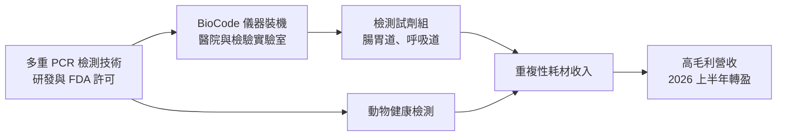
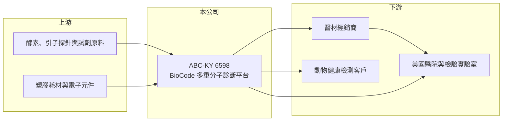

# 6598 ABC-KY

> 上市｜[[產業索引-生技醫療業|生技醫療業]]｜上市（櫃）日期 2020/06/09

# 第一章：企業模式與商業藍圖

> [!info] 撰寫說明
> 本文由 Claude 依公開資料整理，架構比照 [[2330台積電]] 的四章研究，資料截至 2026-10-08。財務數字來源：Goodinfo 年度經營績效頁（含 2026 年公告與新聞標題）、證交所開放資料（基本資料、2026 年第二季資產負債、綜合損益與營益分析、股利）、聯合報 2026 年 ADLM 報導標題。公開資料有限：產品別營收比重未查得；標示「憑記憶」的技術原理、產品核准年份與據點尚未比對原始文件。#待校對

在評估單一個股的長期投資價值時，首要步驟是拆解企業的底層獲利邏輯。本章針對 Applied BioCode（股票代號：6598，中文名瑞磁，以下簡稱瑞磁）的商業模式進行定性分析，說明這家分子診斷公司如何以「儀器＋試劑」的模式經營，以及為什麼它在 2026 年上半年首度轉虧為盈。

## 一、核心定位：高通量多重分子診斷平台

瑞磁的控股公司在開曼群島註冊，成立於 2016 年，2020 年 6 月在證交所上市，董事長為李家榮、總經理為何重人，實收資本額約 10.3 億元。公司開發 BioCode [[多重分子診斷]]平台，能在一次 [[PCR]] 檢測中同時辨識多種病原體，主要用於腸胃道與呼吸道感染的病原檢測（憑記憶，待校對）。營運重心在美國（研發與生產據點位於加州，憑記憶，待校對）。

瑞磁的技術特色是以帶有條碼的磁珠標記不同病原體的探針（憑記憶，待校對），讓一台儀器可以批次處理大量檢體。2026 年公司在美國臨床實驗室年會（ADLM 2026）以「高通量多重分子診斷」為主題展示平台，強調可協助實驗室提升檢測效率。

## 二、事業板塊：人體醫療診斷與動物健康

* **人體醫療診斷：** 腸胃道病原檢測組合是主力產品，已取得美國 [[FDA 510(k)]] 許可（核准年份憑記憶約 2018 年，待校對）；呼吸道病原檢測組合則與流感、新冠等季節性疫情相關。依 2026 年 10 月報導，流感季節帶動營收成長。2026 年 7 月公司與醫材供應商簽署經銷合約，深化美國市場。
* **動物健康：** 依 2026 年 8 月報導，公司形容人體醫療診斷與動物健康是「雙引擎」，把多重分子檢測技術延伸到動物疾病檢測，開拓第二條成長曲線。
* **營收結構：** 本次未查得兩大事業的營收比重，因此不放圓餅圖。

## 三、資本轉化邏輯：儀器裝機帶動試劑耗材收入

* **刮鬍刀與刀片模式：** 分子診斷公司通常以儀器裝機為入口，之後實驗室每做一次檢測都要購買試劑，形成持續性的耗材收入。裝機數越多，試劑營收越穩定，毛利率也越高。瑞磁 2026 年上半年毛利率 67.6%，符合試劑耗材為主的高毛利特性。
* **營運槓桿：** 研發與業務費用相對固定，營收一旦放大，獲利會快速改善。2026 年上半年營收 4.27 億元，營業利益約 0.43 億元，營業利益率 10.1%，是近年首次轉正。

## 四、企業長期藍圖

瑞磁的長期方向是擴大美國醫院與實驗室的裝機數，並以動物健康檢測拓展新市場。感染症分子診斷的需求來自醫院對快速、精準診斷的要求，以及抗生素合理使用的政策推動；多重檢測可以一次排除多種病原，減少重複檢測，具有長期成長性。

# 第二章：護城河深度與競爭優勢

本章分析瑞磁的競爭優勢，說明它在全球多重分子診斷市場面對的大型對手，以及利基定位能否守住。

## 一、護城河的核心組成要素

* **FDA 許可與臨床驗證：** 分子診斷試劑須取得 FDA 許可並通過臨床驗證，新進者需要數年與大量資金才能取得同樣資格。
* **裝機後的轉換成本：** 實驗室導入一套分子診斷平台後，需要人員訓練、流程驗證與資訊系統整合，更換平台的成本高，因此裝機基礎是長期收入的保障。
* **高通量定位：** 相較部分競爭平台以單一檢體、快速出結果為主，瑞磁強調批次處理大量檢體，適合中大型檢驗實驗室，形成差異化。

## 二、全球主要競爭對手格局

| 對手 | 平台 | 與瑞磁的比較 |
|---|---|---|
| bioMérieux（BioFire FilmArray） | 多重 PCR 症候群檢測 | 市場領導者，裝機基礎與檢測項目遠大於瑞磁 |
| 羅氏、Qiagen、Luminex（DiaSorin） | 分子診斷平台 | 大型診斷集團，產品線完整、通路廣 |
| Cepheid（Danaher） | 快速分子檢測 | 在醫院與急診的快速檢測市場占有率高 |
| [[4171瑞基]]、[[4155訊映]] | 台灣檢測與診斷公司 | 同屬台灣診斷產業，產品領域不同 |

## 三、優勢轉化：守得住、守不住與觀察重點

* **守得住：** 已裝機客戶的試劑回購，以及高通量的利基定位。2025 至 2026 年營收大幅成長，代表裝機與試劑需求正在擴大。
* **守不住：** 與大型診斷集團在檢測項目數量與通路上的差距。大廠可以用整合方案綁住醫院，瑞磁在單一醫院的議價力有限。
* **觀察重點：** 美國經銷合作的成效、動物健康業務的營收占比，以及獲利轉正能否在非流感季維持。

# 第三章：財務體質與盈利規模

資料日期：2026-10-08。數字取自 Goodinfo 年度經營績效頁與證交所開放資料，表格是撰寫當時的快照；最新月營收、毛利率、累計 EPS 由自動排程寫在本筆記的屬性欄位（月營收、毛利率、累計EPS 等）。#待校對

財務報表是檢驗護城河是否真實存在的最終標準。本章用七年的三率、ROE 與資本報酬，檢視瑞磁從長期虧損走向損益兩平的過程。

## 一、多年度表格

| 年度 | 營收（新台幣） | [[毛利率]] | [[營業利益率]] | EPS（元） | [[ROE]] |
|---|---|---|---|---|---|
| 2019 | 1.05 億 | 50.6% | -263% | -4.36 | -58.1% |
| 2020 | 2.99 億 | 64.7% | -44.7% | -1.33 | -12.8% |
| 2021 | 3.20 億 | 59.2% | -51.6% | -2.02 | -16.6% |
| 2022 | 3.90 億 | 60.0% | -49.3% | -2.26 | -21.5% |
| 2023 | 3.95 億 | 68.0% | -47.2% | -2.01 | -22.2% |
| 2024 | 3.43 億 | 59.5% | -81.0% | -2.88 | -33.9% |
| 2025 | 4.75 億 | 54.9% | -47.0% | -1.96 | -26.4% |
| 2026 上半年 | 4.27 億 | 67.6% | 10.1% | 0.48 | 未查得 |

* **營收：** 2020 至 2025 年營收從 2.99 億元成長到 4.75 億元，年複合成長約 9.7%（推算）；2026 年上半年營收已接近 2025 年全年的九成，1 至 8 月累計年增約 70%（證交所資料）。
* **[[毛利率]]：** 長期在 55% 至 68%，2026 年上半年回到 67.6%，反映試劑出貨量放大後的規模效益。
* **[[營業利益率]]：** 2020 至 2025 年維持在 -45% 至 -81%，2026 年上半年轉為 10.1%，營業費用約 2.46 億元，營收成長幅度遠大於費用成長，營運槓桿開始發揮。

## 二、[[ROE]]、資本結構與研發強度

2021 至 2025 年平均 ROE 約 -24%（推算）。2025 年稅後淨損約 2.01 億元，截至 2025 年底待彌補虧損約 4.18 億元，未配發股利（證交所股利資料）。2026 年第二季底總資產約 10.7 億元，其中流動資產約 9.34 億元；總負債約 3.72 億元（非流動負債約 2.43 億元），權益約 7.02 億元，負債比約 35%。每股淨值 6.82 元。2026 年上半年營業費用率約 57%（推算），研發與美國業務推廣是主要支出。

## 三、[[ROIC]] 與 [[WACC]]：價值創造利差

**ROIC 推算：** 2025 年營收 4.75 億元、營業利益率 -47%，營業損失約 2.23 億元，虧損無所得稅抵減。2026 年第二季底權益約 7.02 億元，有息負債以非流動負債約 2.43 億元推估，投入資本約 9.45 億元，2025 年 ROIC 約 -24%（推算）。若以 2026 年上半年營業利益約 0.43 億元年化為 0.86 億元、扣除 20% 稅率後約 0.69 億元計算，ROIC 約 7.3%（推算，未考慮季節性）。

**WACC 推算：** 台灣 10 年期公債殖利率取 1.75%、市場風險溢酬 6%、β 取醫療診斷股常見值 1.1（未查得公司實際 β），股東權益成本約 8.35%。負債成本假設 2.5%、稅後約 2.0%；權益約占 74%、負債約占 26%，WACC 約 6.7%（推算）。

**結論：** 2025 年 ROIC 為負，低於資金成本；2026 年上半年年化後的 ROIC 約 7%，首次接近 WACC。這代表瑞磁正處於從消耗資本轉向創造價值的轉折點，但上半年包含流感季節的高峰，全年能否維持仍需觀察。

# 第四章：總體風險與地緣政治

任何企業都無法脫離宏觀環境獨立存在。本章分析瑞磁長期必須面對的市場、法規與營運風險。

## 一、地緣政治與國際市場

* **美國市場集中：** 主要營運與銷售在美國（憑記憶，待校對），美國醫療保險對分子檢測的給付政策，會直接影響實驗室的檢測量與試劑需求。
* **供應鏈：** 試劑原料、塑膠耗材與電子元件的取得，可能受國際物流與關稅影響。

## 二、產業週期與市場結構

* **季節性與疫情依賴：** 呼吸道檢測需求隨流感與新冠疫情起伏，營收容易受季節與疫情強度影響，非流感季的營收可能明顯回落。
* **大廠競爭：** 多重分子診斷市場由國際大廠主導，價格與檢測項目競爭激烈，小型公司需要靠利基定位求生存。

## 三、營運與法規風險

* **給付政策：** 美國聯邦醫療保險曾檢討多重症候群檢測的給付條件，若給付限制收緊，醫院可能減少使用多重檢測組合。
* **FDA 法規：** 新檢測項目與平台升級都需要 FDA 許可，審查時程與要求會影響新產品上市速度。
* **獲利穩定性：** 2026 年上半年才首度轉盈，長期虧損的歷史意味著費用結構與營收規模的平衡仍脆弱，若營收成長放緩，可能再度虧損。

# 專有名詞解析

## 金融

- **[[毛利率]]**：營業毛利占營收的比例，反映產品定價能力與生產成本控制。
- **[[營業利益率]]**：扣除營業費用後的營業利益占營收的比例，衡量本業整體獲利能力。
- **[[ROE]]**：股東權益報酬率，稅後淨利除以股東權益，衡量公司運用股東資金的效率。
- **[[ROIC]]**：投入資本報酬率，稅後營業利益除以股東權益與有息負債的合計，衡量本業對所有資金提供者的報酬。
- **[[WACC]]**：加權平均資金成本，依股東權益與負債的比重加權計算的資金成本，ROIC 高於它才代表創造價值。

## 產業

- **[[多重分子診斷]]**：在一次檢測中同時偵測多種病原體或基因標的的分子檢驗方法，常用於腸胃道與呼吸道感染。
- **[[PCR]]**：聚合酶連鎖反應，把微量 DNA 大量複製以便偵測的技術，是分子診斷最常用的方法。
- **[[FDA 510(k)]]**：美國 FDA 的醫材上市前通報途徑，證明新器材與已上市器材實質相等後即可上市。

# 核心供應鏈

## 1. 上游
- 酵素、引子探針、磁珠等試劑原料，塑膠耗材與電子元件供應商（名稱未查得）

## 2. 本公司
- Applied BioCode（瑞磁）：BioCode 儀器、腸胃道與呼吸道檢測試劑、動物健康檢測

## 3. 下游／客戶
- 美國醫院與檢驗實驗室
- 醫材經銷商（2026 年 7 月簽署經銷合約，名稱未公開）
- 動物健康檢測客戶

## 4. 同業
- 國際分子診斷：bioMérieux（BioFire）、羅氏、Qiagen、DiaSorin（Luminex）、Cepheid
- 台灣診斷：[[4171瑞基]]、[[4155訊映]]

## 最新新聞
<!-- news:start -->
<!-- news:end -->

## 相關連結
- [公開資訊觀測站](https://mopsov.twse.com.tw/mops/web/t05st03?step=1&firstin=1&co_id=6598)
- [Goodinfo](https://goodinfo.tw/tw/StockDetail.asp?STOCK_ID=6598)
- [Yahoo 股市](https://tw.stock.yahoo.com/quote/6598)
- [鉅亨網新聞](https://www.cnyes.com/twstock/6598/news)
