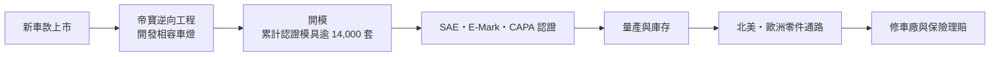
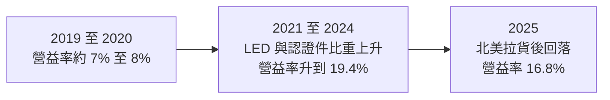
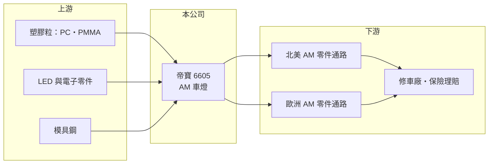

# 6605 帝寶

> 上市｜[[產業索引-汽車工業|汽車工業]]｜上市（櫃）日期 2004/03/17

# 第一章：企業模式與商業藍圖

> [!info] 撰寫說明
> 本文由 Claude 依公開資料整理，架構比照 [[2330台積電]] 的四章研究，資料截至 2026-10-08。財務數字來源：Goodinfo 年度經營績效頁、優分析產業研究整理、證交所開放資料（基本資料、2026 年第二季資產負債與綜合損益、股利）；產業描述為整理性內容，尚未逐條比對原始文件。#待校對

在評估單一個股的長期投資價值時，首要步驟是拆解企業的底層獲利邏輯。本章說明帝寶工業（股票代號：6605，以下簡稱帝寶）如何在一個看似平凡的汽車修理零件市場，建立起靠模具數量與認證累積出來的生意。

## 一、核心定位：全球售後維修市場的車燈供應商

帝寶成立於 1980 年，2004 年上市，實收資本額約 16.6 億元。公司的本業是汽車車燈，但它的主力市場不是新車裝配，而是[[售後維修市場]]（AM，Aftermarket）。當一台車在車禍中撞壞了頭燈或尾燈，修車廠可以選擇原廠零件，也可以選擇價格較低、但規格相容的副廠件，帝寶賣的就是後者。

這門生意的邏輯和新車零件（[[OEM]]）很不同。新車零件靠與車廠的長期合約，量大但價格被壓得很緊；售後零件則面對成千上萬家修車廠、零件通路與保險公司，品項極多、單量小，但只要能覆蓋足夠多的車款，就能長期穩定地接單。一款車在路上跑十幾年，它的車燈就需要被更換十幾年，這讓 AM 市場的需求比新車銷售更穩定。

## 二、市場板塊：北美為主、歐洲為輔

依優分析整理，北美市場約占帝寶總銷售的一半，其餘主要為歐洲及其他地區的 AM 市場（未查得完整的地區與產品比重）。

* **北美：** 美國是全球最大的汽車售後市場，保險公司在理賠時會評估使用副廠件以降低成本。優分析提到保險公司 State Farm 擴大使用 AM 零件，是帝寶的成長動能之一。帝寶在美國的競爭力來自取得大量 [[CAPA 認證]]，有認證的副廠件更容易被保險公司與修車廠接受，售價與毛利也較高。
* **歐洲：** 歐洲市場要求車燈取得 [[E-Mark]] 認證，帝寶在歐洲 AM 市場也有一定地位。
* **產品：** 以頭燈、尾燈、霧燈為主，近年 [[LED 車燈]]的比重上升。LED 頭燈單價遠高於傳統鹵素燈，車款汰換到 LED 的速度，決定了帝寶產品組合的升級速度。

## 三、資本轉化邏輯：模具就是資產

* **模具與認證的累積：** 每推出一款新車，帝寶就要開發對應的車燈並開模，依優分析資料，帝寶通過 SAE 與 E-Mark 認證的車燈模具超過 14,000 套。每一套模具都是一筆前期投資，但只要那款車還在路上，這套模具就能持續帶來訂單。這使帝寶的資產像一個不斷擴大的「產品目錄」，越晚進場的對手越難追上。
* **庫存是必要成本：** AM 通路要求供應商能快速交貨，帝寶必須準備大量品項的庫存。庫存管理能力決定了資金效率，也是 AM 車燈廠財報上存貨金額偏高的原因。
* **定價能力來自組合：** 帝寶毛利率從 2020 年的 24.2% 提升到 2024 年的 34.1%，主要來自 LED 車燈與 CAPA 認證產品比重提升，而不是單純漲價。

## 四、企業長期藍圖

帝寶的長期方向有三個。第一是持續擴大車款覆蓋，特別是近年在美國銷量大的車款，只要覆蓋率領先，就能穩定吃下保險理賠的副廠件需求。第二是提高 LED 與高附加價值車燈比重，車燈從單純照明變成整合感測器與智慧控制的模組，單價持續提高。第三是提高認證件比重，CAPA 認證件在保險理賠流程中有優勢，能支撐較高的毛利。帝寶的生產主要在台灣（另有中國子公司，待校對），營收以美元計價為主，屬於典型的台灣出口型零件廠。

# 第二章：護城河深度與競爭優勢

本章分析帝寶在全球 AM 車燈市場的競爭優勢，以及在車輛電子化與美國貿易政策變化下，這些優勢能否延續。

## 一、護城河的核心組成要素

* **模具與品項數量：** AM 市場的競爭核心是「能不能賣到修車廠要的那一款燈」。帝寶累積上萬套認證模具，代表它能覆蓋大部分主流車款。新進者即使有能力製造，也要花十年以上才能累積同樣的品項數量。
* **認證門檻：** 北美的 CAPA、SAE 與歐洲的 E-Mark 認證需要時間與費用，認證件比非認證件更容易被保險公司接受。帝寶取得的 CAPA 認證數量優於同業，這是毛利率在 2022 至 2024 年持續上升的主要原因之一。
* **通路關係：** 帝寶在北美與歐洲經營 AM 通路數十年，與大型零件經銷商建立長期合作。通路商傾向向品項齊全、交期穩定的供應商集中採購。
* **規模與成本：** 同一套模具量產越多，攤提越低。台灣 AM 車燈產業集中在少數業者手上，規模讓帝寶在報價上有彈性。

## 二、主要競爭對手格局

| 對手 | 定位 | 與帝寶的比較 |
|---|---|---|
| [[1522堤維西]] | 台灣 AM 車燈大廠，兼營 OEM | 最直接的對手，產品線與市場高度重疊 |
| [[1525江申]]、[[1524耿鼎]] | 台灣汽車鈑金與 AM 零件 | 產品不同，但同屬 AM 零件族群 |
| 中國 AM 車燈廠 | 價格低 | 在非認證件市場殺價，受美國關稅限制 |
| 原廠零件（OES） | 車廠授權的原廠件 | 價格高，車廠會以專利與設計權限制副廠件 |

## 三、優勢轉化：守得住、守不住與觀察重點

* **守得住：** 北美認證件市場。保險公司為了控制理賠成本，有長期誘因推動副廠件使用，帝寶在認證件的領先地位難以短期被取代。
* **守不住：** 一般非認證、低價位的車燈，這部分容易被中國廠商以價格搶單。
* **觀察重點：** 第一，車燈從零件變成「整合 ADAS 感測器的電子模組」後，AM 副廠件的開發難度與專利限制是否提高；第二，美國對進口零件的關稅政策；第三，保險業副廠件使用比例的長期趨勢。

# 第三章：財務體質與盈利規模

資料日期：2026-10-08。數字取自 Goodinfo 年度經營績效頁、優分析整理與證交所開放資料，表格是撰寫當時的快照；最新月營收、毛利率、累計 EPS 由自動排程寫在本筆記的屬性欄位（月營收、毛利率、累計EPS 等）。#待校對

財務報表是檢驗護城河是否真實存在的最終標準。本章用多年度的三率、ROE 與資本報酬，檢視帝寶的獲利品質。

## 一、獲利能力的基石：三率

| 年度 | 營收（新台幣） | [[毛利率]] | [[營業利益率]] | EPS（元） | [[ROE]] |
|---|---|---|---|---|---|
| 2019 | 156 億 | 25.4% | 7.82% | 3.89 | 4.62% |
| 2020 | 143 億 | 24.2% | 7.20% | 3.56 | 4.07% |
| 2021 | 161 億 | 27.4% | 10.7% | 6.85 | 7.98% |
| 2022 | 172 億 | 29.6% | 12.6% | 10.86 | 11.8% |
| 2023 | 186 億 | 31.7% | 15.8% | 14.29 | 14.0% |
| 2024 | 202 億 | 34.1% | 19.4% | 18.98 | 17.0% |
| 2025 | 194 億 | 31.5% | 16.8% | 13.97 | 11.6% |
| 2026 上半年 | 96.1 億 | 31.88% | 16.70% | 7.71 | 未查得 |

* **毛利率的長期改善：** 2020 年到 2024 年，帝寶毛利率提升約 10 個百分點，營業利益率提升約 12 個百分點。這段改善持續四年，比較像產品組合與認證件比重的結構性變化，而不是一次性的景氣紅利。
* **營業槓桿：** 帝寶營業費用中有大量固定的通路與管理成本，營收成長時營業利益率擴張更快；反之，2025 年營收小幅下滑，營業利益率就從 19.4% 回落到 16.8%。
* **營收成長：** 2021 至 2025 年營收從 161 億元成長到 194 億元，年複合成長率約 4.8%（推算），AM 市場本身成長穩定，但不算快速。

## 二、[[ROE]]：資本效率

2021 至 2025 年平均 ROE 約 12.5%（推算），2024 年高峰為 17%。帝寶的 ROE 長期不算特別高，原因是股東權益規模大（2026 年第二季底權益約 206 億元，每股淨值約 121 元，證交所開放資料），而 AM 生意需要大量模具與庫存。負債總計約 132 億元，負債比約 39%。

## 三、資本支出、自由現金流與股利

帝寶的資本支出以模具開發與產線自動化為主，每年持續投入，屬於維持競爭力的必要支出。具體金額與自由現金流未查得。股利方面，2025 年度配發現金股利 6.5 元，以 EPS 13.97 元計算配發率約 47%（推算），Goodinfo 統計歷年一般平均現金股利約 3.52 元。帝寶的配息率不高，保留盈餘多用於模具與庫存擴充。

## 四、[[ROIC]] 與 [[WACC]]：價值創造利差

**ROIC 推算：** 2025 年營業利益約 32.6 億元（營收 194 億元 × 營業利益率 16.8%），扣除 20% 稅率後約 26.1 億元。2026 年第二季底權益約 206 億元，負債約 132 億元，假設其中約四成為有息負債（推估約 53 億元，其餘為應付帳款等營運負債），投入資本約 259 億元，ROIC 約 10.1%（推算）。2024 年營業利益約 39.2 億元，同口徑 ROIC 約 12%（推算）。

**WACC 推算：** 假設台灣 10 年期公債殖利率 1.75%、市場風險溢酬 6%、β 取汽車零件業常見值 0.9，股東權益成本約 7.15%。負債成本假設 2.5%，稅後約 2.0%；以帳面價值計權益約占 80%、負債約占 20%，WACC 約 6.1%（推算）。

**結論：** 帝寶 ROIC 約 10% 至 12%，高於約 6% 的資金成本，利差約 4 至 6 個百分點，代表公司在 2022 年之後穩定創造價值。2019 至 2020 年營業利益率只有 7% 左右時，ROIC 很可能低於資金成本，這段歷史說明帝寶的價值創造高度依賴產品組合升級能否持續。

# 第四章：總體風險與地緣政治

任何企業都無法脫離宏觀環境獨立存在。本章分析帝寶長期必須面對的貿易、產業結構、營運與科技風險。

## 一、地緣政治與貿易

* **美國關稅：** 北美占帝寶約一半銷售，美國若對台灣或汽車零件加徵關稅，會直接影響售價競爭力或毛利。雖然中國同業受關稅影響更大，台灣廠商相對受惠，但關稅政策變動頻繁，屬於長期不確定因素。
* **匯率：** 營收以美元為主，新台幣升值會壓縮以台幣計的營收與毛利。

## 二、產業週期與市場結構

* **AM 需求的穩定性：** 售後市場需求主要來自車禍維修與老車更換，和新車銷售的關聯較低，景氣循環比新車零件溫和。但通路商的庫存調整仍會造成短期波動，例如 2024 年底北美客戶提前拉貨，使 2025 年初營收轉弱。
* **車齡與行駛里程：** 美國平均車齡長期上升，對 AM 市場有利；但若自動駕駛普及降低車禍率，長期會減少碰撞維修需求。

## 三、營運環境的隱性風險

* **庫存與模具減損：** 品項多、庫存大，一旦車款銷量不如預期，相關庫存與模具可能需要提列跌價或減損。
* **原廠的專利與設計權：** 車廠為保護原廠零件市場，會以外觀設計專利限制副廠件，相關訴訟或法規變化可能影響帝寶能開發的車款範圍。
* **保險業政策：** 保險公司對副廠件的使用政策若轉向保守，會影響認證件的需求。

## 四、科技演進

車燈正從照明零件變成整合 [[ADAS]] 感測器、自適應遠光與動態訊號的電子模組。這對帝寶有兩面影響：產品單價提高、產品組合升級；但開發難度、電子零件成本與與車廠電子系統相容的門檻也同步提高。帝寶能否在智慧車燈時代維持 AM 市場的覆蓋率，是十年尺度上最重要的觀察點。

# 專有名詞解析

## 應用

- **[[LED 車燈]]**：以發光二極體為光源的車燈，比鹵素燈省電、壽命長，單價也較高。
- **[[ADAS]]**：先進駕駛輔助系統，包含自動緊急煞車、車道維持等功能，需要攝影機、雷達等感測器。

## 金融

- **[[ROIC]]**：投入資本報酬率，稅後營業利益除以股東權益與有息負債的合計，衡量本業對所有資金提供者的報酬。
- **[[WACC]]**：加權平均資金成本，依股東權益與負債的比重加權計算的資金成本，ROIC 高於它才代表創造價值。

## 產業

- **[[售後維修市場]]**：新車出廠後的維修、保養與改裝零件市場，簡稱 AM，品項多、需求穩定。
- **[[OEM]]**：原廠委託製造，零件直接供應車廠裝配在新車上，量大但價格受車廠主導。
- **[[CAPA 認證]]**：美國認證汽車零件協會的認證，確認副廠件品質與原廠件相當，保險理賠較常採用。
- **[[E-Mark]]**：歐盟對車輛零件的安全認證標章，車燈等零件需取得才能在歐洲銷售。

# 核心供應鏈

## 1. 上游：材料與零件
- 車燈外殼與燈罩用的 PC、PMMA 塑膠原料
- LED 光源與驅動電子零件

## 2. 中游：帝寶本身與同業
- 台灣 AM 車燈同業：[[1522堤維西]]
- 台灣 AM 零件族群：[[1525江申]]、[[1524耿鼎]]

## 3. 下游：通路與終端
- 北美與歐洲的汽車零件經銷商與連鎖通路
- 碰撞維修廠與產物保險公司（例如 State Farm 的副廠件政策）

## 最新新聞
<!-- news:start -->
<!-- news:end -->

## 相關連結
- [公開資訊觀測站](https://mopsov.twse.com.tw/mops/web/t05st03?step=1&firstin=1&co_id=6605)
- [Goodinfo](https://goodinfo.tw/tw/StockDetail.asp?STOCK_ID=6605)
- [Yahoo 股市](https://tw.stock.yahoo.com/quote/6605)
- [鉅亨網新聞](https://www.cnyes.com/twstock/6605/news)
