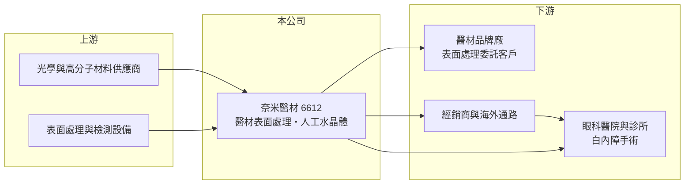

# 6612 奈米醫材

> 上櫃｜[[產業索引-生技醫療業|生技醫療業]]｜上市（櫃）日期 2018/07/18

# 第一章：企業模式與商業藍圖

> [!info] 撰寫說明
> 精簡版，由 Claude 依公開資料整理，架構比照 [[2330台積電]] 的四章研究，資料截至 2026-10-08。來源：櫃買中心開放資料快照（基本資料、2026 年第二季綜合損益與資產負債、本益比）、Goodinfo 經營績效頁、nStock 公司簡介、CMoney 個股筆記標題。公開資料有限，產品細節與營收比重未查得。#待校對

本章說明應用奈米醫材科技（股票代號：6612，以下簡稱奈米醫材）靠什麼賺錢，以及它為何從一家技術服務公司，逐步走向眼科醫材的製造與銷售。

- **核心業務：** 奈米醫材 2011 年在新竹科學園區核准設立，總部位於竹北，2018 年 7 月在櫃買中心上櫃。依公司揭露的營業項目，它一方面替植入式與非植入式的高階[[醫療器材]]提供奈米級表面處理服務，另一方面自行設計、開發、製造並銷售[[人工水晶體]]等眼科醫材。表面處理決定醫材與人體組織接觸時的相容性與抗沾黏能力，是醫材廠不一定自己具備的關鍵製程，這讓公司同時扮演代工夥伴與產品廠兩種角色。
- **營收結構：** 公司沒有在可查得的公開資料中穩定揭露產品別營收比重，因此本文不畫圓餅圖。從財務數字來看，2019 年至 2022 年毛利率長期維持在 80% 左右，代表當時營收以高附加價值的技術服務與自有產品為主；2023 年起營收快速放大、毛利率卻一路降到 2025 年的 59%，顯示新增的營收來自毛利較低的產品或通路（推估）。CMoney 等財經整理多把公司定位為「白內障手術」相關醫材供應商，意味著人工水晶體已是主要營收來源之一（待校對）。
- **營運據點：** 研發與生產集中在新竹竹北。合併報表中存在非控制權益，2026 年上半年歸屬母公司淨利（0.73 億元）高於合併淨利（0.38 億元），表示有部分持股的子公司仍在虧損（依櫃買中心資料推算）。子公司名稱與業務本文未查得。
- **長期方向：** 白內障是隨年齡增加幾乎人人都會遇到的眼疾，全球人口老化讓人工水晶體成為長期需求穩定成長的醫材。奈米醫材的長期課題是把表面處理技術轉化為產品差異化，例如更好的光學表現或降低術後併發症，並在營收放大的同時把毛利率穩住。

# 第二章：護城河深度與競爭優勢

護城河是企業抵禦競爭、維持超額利潤的保護機制。本章檢視奈米醫材在一個由國際大廠主導的眼科醫材市場裡，能依靠哪些優勢立足。

- **競爭優勢：** 第一是製程技術。醫材的表面處理需要通過生物相容性測試與各國主管機關的審查，客戶一旦把某家廠商的製程寫進醫材的許可證文件，更換供應商就得重新驗證，形成轉換成本。第二是法規門檻。人工水晶體屬於植入人體的高風險醫材，從設計、臨床到取得上市許可往往需要數年，新進者很難短期複製。
- **主要對手：** 人工水晶體全球市場由愛爾康（Alcon）、嬌生視力保健（Johnson & Johnson Vision）、博士倫（Bausch + Lomb）等國際大廠主導，它們擁有完整的手術設備與醫師教育體系。台灣的眼科醫材同業則以隱形眼鏡為主，例如 [[1565精華]]、[[6491晶碩]]、[[6782視陽]]，在光學材料與量產製程上與奈米醫材有部分重疊，但產品線不同。
- **觀察重點：** 第一，毛利率能否在營收擴大後止跌，這反映新產品是否具備定價能力。第二，虧損子公司何時轉盈，否則合併淨利會持續低於本業表現。第三，海外市場的上市許可進度，因為台灣市場規模有限，國際認證才是長期成長的關鍵。

# 第三章：財務體質與盈利規模

資料日期：2026-10-08，表格是撰寫當時的快照；最新月營收、毛利率、累計 EPS 由自動排程寫在本筆記的屬性欄位（月營收、毛利率、累計EPS 等）。#待校對

財務報表是檢驗護城河是否真實存在的標準。本章用多年度的營收、三率與資本報酬，觀察奈米醫材從高毛利小公司轉向規模化的過程。

| 年度 | 營收（新台幣） | [[毛利率]] | [[營業利益率]] | EPS（元） | [[ROE]] |
|---|---|---|---|---|---|
| 2021 | 3.94 億 | 82.0% | 22.3% | 1.74 | 4.91%（待校對） |
| 2022 | 5.12 億 | 81.6% | 24.4% | 3.81 | 12.6% |
| 2023 | 6.05 億 | 79.7% | 17.9% | 2.81 | 4.94%（待校對） |
| 2024 | 8.60 億 | 69.8% | 14.3% | 2.41 | 3.18%（待校對） |
| 2025 | 11.30 億 | 59.1% | 11.4% | 1.09 | 0.16%（待校對） |
| 2026 上半年 | 6.46 億 | 53.8% | 11.3% | 1.53 | 約 7.7%（年化推算） |

資料來源：2021 至 2025 年為 Goodinfo 經營績效頁（合併報表）；Goodinfo 的 ROE 數字與 EPS、淨值的推算結果落差較大，標為待校對。2026 上半年為櫃買中心綜合損益與資產負債快照，ROE 以歸屬母公司淨利年化除以母公司權益 18.95 億元推算。

- **營收規模：** 2020 年營收 3.63 億元，2025 年成長到 11.30 億元，五年年複合成長率約 25%（推算），是同規模醫材公司中成長相當快的一家。2026 年 1 至 8 月累計營收 8.97 億元，較去年同期成長約 20%（櫃買中心月營收資料）。
- **獲利：** 營收放大但毛利率從 80% 左右降到 2026 年上半年的 53.8%，營業利益率也從 20% 以上降到 11% 左右，EPS 因此沒有隨營收同步成長，2025 年 EPS 1.09 元是近五年低點。這說明新增營收的單位利潤明顯較低，加上配股擴大股本，稀釋了每股獲利。
- **財務特色：** 2026 年第二季總資產 32.0 億元、負債 12.1 億元，負債比約 38%，權益 20.0 億元，每股淨值 40.19 元。股利以「小額現金加股票股利」為主，依 nStock 整理，2024 年度配發現金 0.3 元與股票股利 1 元，2025 年度配發現金 0.3 元與股票股利 1.01 元。持續配股讓股本擴大，投資人看 EPS 時需要留意稀釋效果。
- **[[ROIC]] 與 [[WACC]]：** 有息負債未查得，本文以非流動負債 3.51 億元近似。以 2025 年營業利益約 1.29 億元（營收 11.30 億元乘營業利益率 11.4%）計算，稅後營業利益約 1.03 億元，投入資本為權益 19.96 億元加 3.51 億元，共 23.47 億元，ROIC 約 4.4%（推算）；以 2026 年上半年營業利益 0.73 億元年化，ROIC 約 5.0%（推算）。WACC 方面，台灣 10 年期公債取 1.75%、市場風險溢酬 6%，β 未查得，取中小型醫材股常見的 0.9 至 1.1，股東權益成本約 7.2% 至 8.4%；負債成本假設 2.5%，稅後 2.0%，以市值約 34 億元（股價淨值比 1.81 倍乘母公司權益）與負債 3.51 億元估算權重，WACC 約 6.7% 至 7.8%（推算）。ROIC 目前低於 WACC，代表擴張階段的資本尚未賺回資金成本；2019 年至 2022 年營業利益率超過 20% 時，ROIC 應高於 WACC（推估）。長期能否創造價值，取決於毛利率能否回到 60% 以上並讓子公司轉盈。

# 第四章：總體風險與地緣政治

醫材公司的風險多半來自法規、競爭與產品組合。本章整理奈米醫材長期必須面對的外部與內部風險。

- **產業週期：** 白內障手術屬於必要醫療，需求受景氣影響小，但各國健保或集中採購制度會壓低植入物價格。若主要市場推動帶量採購，人工水晶體的單價可能大幅下降，侵蝕毛利。
- **營運風險：** 毛利率連續多年下滑是最需要追蹤的訊號，可能代表產品組合改變、價格競爭或新產線尚未達經濟規模。虧損子公司若長期無法轉盈，會持續拖累合併獲利。公司規模仍小，單一大客戶或單一產品的變化都可能明顯影響營收。
- **其他風險：** 植入式醫材的法規要求持續提高，美國 FDA、歐盟 MDR 等規範更新會增加認證成本與上市時間。國際大廠在產品線與醫師關係上占優勢，奈米醫材若要進入歐美主流市場，需要投入大量臨床與行銷資源。外銷部分則承擔匯率風險。

# 專有名詞解析

## 金融

- **[[毛利率]]**：營業毛利除以營業收入，反映產品扣除直接成本後的獲利空間。
- **[[營業利益率]]**：營業利益除以營業收入，反映本業扣除營業費用後的獲利能力。
- **[[ROE]]**：股東權益報酬率，稅後淨利除以股東權益，衡量公司運用股東資金賺錢的效率。
- **[[ROIC]]**：投入資本報酬率，稅後營業利益除以股東權益與有息負債的合計，衡量本業對所有資金提供者的報酬。
- **[[WACC]]**：加權平均資金成本，依股東權益與負債的比重加權計算的資金成本，ROIC 高於它才代表創造價值。

## 產業

- **[[醫療器材]]**：用於診斷、治療或矯正的器具與設備，上市前需取得各國衛生主管機關許可，生產須符合品質系統規範。
- **[[人工水晶體]]**：白內障手術時植入眼內、取代混濁水晶體的人工鏡片，屬於高風險植入式醫材。

# 核心供應鏈

- 上游：光學級高分子材料與表面處理、檢測設備供應商（未查得具體廠商）。
- 下游／客戶：委託表面處理的醫材廠商、眼科醫院與診所，以及國內外經銷通路。
- 同業：國際人工水晶體大廠愛爾康（Alcon）、嬌生視力保健、博士倫；台灣眼科醫材同業 [[1565精華]]、[[6491晶碩]]、[[6782視陽]]（以隱形眼鏡為主）。

## 最新新聞
<!-- news:start（自動產生，請勿手動編輯此範圍） -->
- 2026-10-08 🏛️ 重訊 15:35｜公告本公司第3次買回庫藏股期間屆滿執行情形｜[觀測站](https://mops.twse.com.tw/mops/#/web/t05st01)

完整紀錄：[[6612奈米醫材 新聞]]
<!-- news:end -->

## 相關連結
- [公開資訊觀測站](https://mopsov.twse.com.tw/mops/web/t05st03?step=1&firstin=1&co_id=6612)
- [Goodinfo](https://goodinfo.tw/tw/StockDetail.asp?STOCK_ID=6612)
- [Yahoo 股市](https://tw.stock.yahoo.com/quote/6612)
- [鉅亨網新聞](https://www.cnyes.com/twstock/6612/news)
