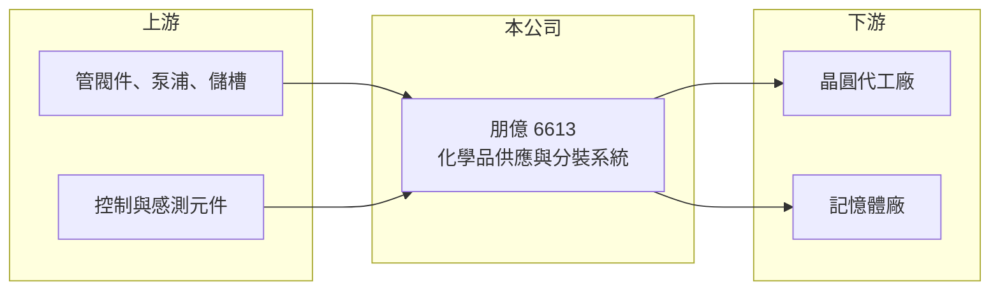

# 6613 朋億

> 上櫃｜[[產業索引-其他電子業|其他電子業]]｜上市（櫃）日期 2017/12/28

# 第一章：企業模式與商業藍圖

> [!info] 撰寫說明
> 精簡版，由 Claude 依公開資料整理，架構比照 [[2330台積電]]，資料截至 2026-10-07。來源：聯合新聞網（朋億 2026 年第一季財報）、winvest 朋億 2026 年 8 月營收快訊。#待校對

朋億提供半導體與高科技廠的高潔淨度化學品供應系統，營運隨晶圓廠擴廠潮快速成長。

- **核心業務：** 設計、製造與安裝[[化學品供應系統]]與分裝設備，把[[電子級化學品]]從儲槽穩定送到生產機台，屬[[廠務工程]]的一環。
- **營收結構：** 公開資料未列出產品別比重；營收主要來自半導體與記憶體客戶的擴廠專案。
- **營運據點：** 以台灣為主，跟隨客戶擴廠承接專案（海外據點細節待查）。
- **長期方向：** 受惠 AI 晶片帶動的客戶資本支出，大型專案陸續進入設備出貨與安裝階段。

# 第二章：護城河深度與競爭優勢

朋億的優勢在潔淨度要求極高的化學品系統，客戶驗證後不易更換。

- **競爭優勢：** 化學品純度直接影響晶片[[良率]]，系統需經客戶長期驗證，形成轉換成本；連續七屆名列公司治理評鑑前 5%。
- **主要對手：** [[6725矽科宏晟]]、[[6667信紘科]]，以及大型廠務工程商 [[2404漢唐]]、[[6196帆宣]]。
- **觀察重點：** 2026 年第一季[[在手訂單]] 127 億元、年增 81% 創新高，後續認列速度與毛利率能否維持是關鍵。

# 第三章：財務體質與盈利規模

資料日期：2026-10-07，以下數字是撰寫當時的快照；最新月營收、毛利率、累計 EPS 由自動排程寫在本筆記的屬性欄位（月營收、毛利率、累計EPS 等）。#待校對

朋億 2026 年營收與獲利同步創高。

- **營收規模：** 2026 年第一季營收 23.41 億元、年增 9%；8 月營收 16.91 億元、年增 186.82%，1 至 8 月累計 91.12 億元、年增 63.62%。
- **獲利：** 2025 年全年 EPS 13.37 元；2026 年第一季 EPS 3.84 元、[[毛利率]] 32.08%、營業利益率 20.15%，第二季 EPS 4.67 元，上半年合計 8.51 元。
- **財務特色：** 專案型營收依工程進度認列，月營收波動大，在手訂單是判斷未來營收的主要指標。

# 第四章：總體風險與地緣政治

朋億的風險在於營收高度連動半導體擴廠。

- **產業週期：** 晶圓廠資本支出一旦放緩，新案減少會在一至兩年後反映到營收。
- **營運風險：** 專案集中在少數大客戶，工期延誤或成本上升會壓縮毛利。
- **其他風險：** 客戶海外設廠帶來跨國施工與人力調度挑戰，也涉及當地法規與匯率風險。

# 專有名詞解析

## 半導體

- **[[電子級化學品]]**：純度極高、雜質控制到 ppb 等級的化學品，用於晶圓清洗、蝕刻與顯影。
- **[[良率]]**：合格產品占總產出的比例，是製造成本與獲利的關鍵指標。

## 產業

- **[[化學品供應系統]]**：把酸、鹼、溶劑等製程化學品從儲槽經管路穩定輸送到生產機台的系統，需維持極高潔淨度。
- **[[廠務工程]]**：晶圓廠、面板廠等的無塵室、氣體、化學品、水電等基礎設施工程。
- **[[在手訂單]]**：已簽約但尚未認列營收的訂單金額，可用來推估未來營收。

# 核心供應鏈

- 上游：管閥件、泵浦、儲槽與控制元件供應商（推估）
- 下游／客戶：半導體與記憶體廠（具體客戶名單待查）
- 同業：[[6725矽科宏晟]]、[[6667信紘科]]、[[2404漢唐]]、[[6196帆宣]]

## 最新新聞
<!-- news:start -->
<!-- news:end -->

## 相關連結
- [公開資訊觀測站](https://mopsov.twse.com.tw/mops/web/t05st03?step=1&firstin=1&co_id=6613)
- [Goodinfo](https://goodinfo.tw/tw/StockDetail.asp?STOCK_ID=6613)
- [Yahoo 股市](https://tw.stock.yahoo.com/quote/6613)
- [鉅亨網新聞](https://www.cnyes.com/twstock/6613/news)
