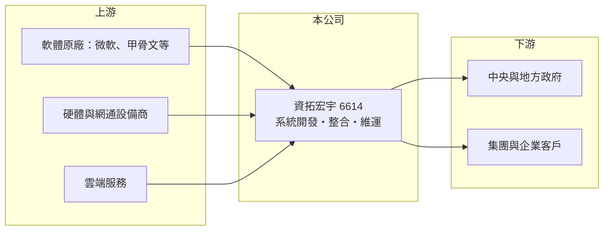

# 6614 資拓宏宇

> 上市｜[[產業索引-數位雲端|數位雲端]]｜上市（櫃）日期 2025/11/25

# 第一章：企業模式與商業藍圖

> [!info] 撰寫說明
> 精簡版，由 Claude 依公開資料整理，架構比照 [[2330台積電]]，資料截至 2026-10-08。來源：證交所開放資料（基本資料、營益分析、資產負債、綜合損益、本益比殖利率）、Goodinfo 年度經營績效、MoneyDJ 公司基本資料（營收比重、股利）。集團關係與主要專案為整理性描述，尚未逐條比對原始文件。#待校對

本章說明資拓宏宇（6614）以勞務為主的[[系統整合]]商業模式。

- **核心業務：** 資拓宏宇成立於 2008 年，2025 年 11 月在證交所上市，英文簡稱 IISI，總部在新北市板橋。公司主要替政府機關與大型企業開發、建置與維運資訊系統，屬於中華電信集團的資訊服務成員（持股比例請校對）。這類業務的價值在於把客戶的作業流程轉成穩定運作的系統，並在上線後長期負責維護。
- **營收結構：** 依 MoneyDJ 2025 年資料，勞務收入占 79.8%，軟體與硬體產品占 20.2%。勞務占比高代表營收主要來自工程師的人力投入，毛利率雖然不高，但比轉售硬體穩定，也較不受硬體價格波動影響。
- **營運模式：** 公部門專案多透過公開招標取得，合約期間從一年到數年不等，系統上線後通常還有維護合約延續。資產負債表上流動負債約 27.7 億元，遠高於非流動負債，推估多為專案預收款與應付款（細項未查得），這是專案型資訊服務公司的典型結構。
- **長期方向：** 政府數位轉型、資安法規趨嚴與雲端化是長期需求來源。資拓宏宇的課題是從人力密集的客製開發，逐步累積可重複使用的平台與產品，以提高毛利率與人均產值。

# 第二章：護城河深度與競爭優勢

本章分析資拓宏宇在政府資訊服務市場的護城河。

- **競爭優勢：** 公部門系統牽涉大量法規、資料與既有架構，原承包商最了解系統細節，後續擴充與維護標案具有明顯的在位優勢。加上集團背景帶來的信用與大型專案履約能力，在大型標案的資格審查上較有利。
- **主要對手：** 政府與企業資訊服務市場的主要同業包括 [[2468華經]]、[[6214精誠]]、[[6811宏碁資訊]]、[[2453凌群]] 與 [[5410國眾]] 等，各家在不同部會與產業各有據點。標案競爭以價格與實績為主，差異化空間有限。
- **觀察重點：** 第一是毛利率能否止跌，2020 年 17.1% 降到 2025 年 12.9%，反映人力成本上升與低價競標。第二是大型專案的驗收進度與是否出現虧損合約。第三是上市後資本規模擴大，能否用於產品化與併購。

# 第三章：財務體質與盈利規模

資料日期：2026-10-08，表格是撰寫當時的快照；最新月營收、毛利率、累計 EPS 由自動排程寫在本筆記的屬性欄位（月營收、毛利率、累計EPS 等）。#待校對

本章用多年度數字檢視資拓宏宇的成長與獲利品質。

| 年度 | 營收（新台幣） | [[毛利率]] | [[營業利益率]] | EPS（元） | [[ROE]] |
|---|---|---|---|---|---|
| 2021 | 33.4 億 | 14.9% | 5.17% | 2.10 | 14.0% |
| 2022 | 38.0 億 | 15.0% | 5.73% | 2.62 | 16.6% |
| 2023 | 44.2 億 | 13.5% | 4.25% | 2.31 | 14.0% |
| 2024 | 50.8 億 | 12.3% | 2.28% | 1.70 | 10.2% |
| 2025 | 49.6 億 | 12.9% | 3.83% | 2.08 | 10.9% |

- **營收規模：** 2020 年營收 26.5 億元，2020 至 2025 年營收年複合成長率約 13.4%，規模成長穩定。依證交所資料，2026 年上半年營收約 24.9 億元、EPS 0.53 元，營業利益率 1.8%。
- **獲利：** 營收雖然成長，但毛利率與營業利益率逐年下滑，代表新增的專案獲利能力較低。近五年平均 ROE 約 13.1%，呈下降趨勢。
- **財務特色：** 2026 年第二季歸屬母公司權益約 15.2 億元，每股淨值 18.87 元；非流動負債僅約 0.7 億元，長期負債很低。依 MoneyDJ，近兩年現金股利分別為 1.50 元與 1.65 元，配息率約七至八成。
- **[[ROIC]] 與 [[WACC]]：** 2025 年營業利益約 1.90 億元（49.6 億 × 3.83%），稅後約 1.52 億元；投入資本以股東權益 15.2 億元加上以非流動負債 0.7 億元近似的有息負債，約 15.9 億元，ROIC 約 9.6%（推算）。WACC 以 CAPM 推估：無風險利率 1.75%、市場風險溢酬 6%、β 用資訊服務業常見值 0.8，股東權益成本約 6.55%；負債成本 2.5%、稅後 2.0%；股權權重約 96%，WACC 約 6.4%（推算）。ROIC 高於 WACC 約 3 個百分點，仍在創造價值，但利差隨利潤率下滑而縮小。

# 第四章：總體風險與地緣政治

本章整理資拓宏宇長期必須面對的風險。

- **產業週期：** 政府資訊預算相對穩定，不像消費電子有明顯景氣循環，但會受政府年度預算編列與政策優先順序影響。選舉與政策更替可能讓部分專案延後或縮小。
- **營運風險：** 固定價格的專案若需求變更或時程延誤，成本超支由廠商吸收，可能出現虧損合約。工程師薪資持續上漲，若無法轉嫁到標價，毛利率會繼續被壓縮。
- **其他風險：** 政府系統承載大量個資，一旦發生資安事件，除了賠償與商譽損失，也可能影響後續投標資格。對公部門與集團客戶的依賴度高，客戶集中也是風險。

# 專有名詞解析

## 應用

- **[[系統整合]]**：把軟體、硬體與網路整合成符合客戶需求的完整資訊系統，並負責建置與維運的服務。

## 金融

- **[[ROIC]]**：投入資本報酬率，稅後營業利益除以投入資本，衡量本業運用資金創造報酬的能力。
- **[[WACC]]**：加權平均資金成本，股東與債權人要求報酬率的加權平均，ROIC 高於 WACC 才代表創造價值。

## 產業

- **[[勞務收入]]**：以人力提供開發、顧問與維運服務所認列的收入，資訊服務業的主要收入型態。

# 核心供應鏈

- 上游：軟體原廠如 [[MSFT微軟]]、資料庫與中介軟體廠商、伺服器與網通設備商，以及公有雲服務（實際合作對象請校對）。
- 下游／客戶：中央部會、地方政府、公營事業與集團企業。
- 同業：[[2468華經]]、[[6214精誠]]、[[6811宏碁資訊]]、[[2453凌群]]、[[5410國眾]]。

## 最新新聞
<!-- news:start -->
<!-- news:end -->

## 相關連結
- [公開資訊觀測站](https://mopsov.twse.com.tw/mops/web/t05st03?step=1&firstin=1&co_id=6614)
- [Goodinfo](https://goodinfo.tw/tw/StockDetail.asp?STOCK_ID=6614)
- [Yahoo 股市](https://tw.stock.yahoo.com/quote/6614)
- [鉅亨網新聞](https://www.cnyes.com/twstock/6614/news)
