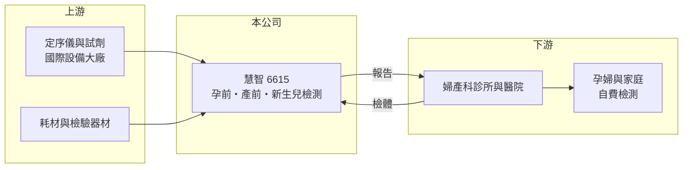

# 6615 慧智

> 上櫃｜[[產業索引-生技醫療業|生技醫療業]]｜上市（櫃）日期 2018/01/22

# 第一章：企業模式與商業藍圖

> [!info] 撰寫說明
> 精簡版，由 Claude 依公開資料整理，架構比照 [[2330台積電]] 的四章研究，資料截至 2026-10-08。來源：櫃買中心開放資料快照（基本資料、2026 年第二季綜合損益與資產負債、每月營收、本益比）、Goodinfo 經營績效頁、nStock 公司簡介。公開資料有限，檢測項目別營收比重未查得。#待校對

本章說明慧智基因（股票代號：6615，以下簡稱慧智）的商業模式：一家以孕產與新生兒為主軸的檢驗服務公司，如何把醫院與診所的檢體轉換成營收。

- **核心業務：** 慧智 2012 年設立，2018 年 1 月在櫃買中心上櫃，主要提供孕前、產前與新生兒的[[基因檢測]]與醫療檢驗服務。它的角色是「檢驗實驗室」：婦產科診所或醫院替孕婦採檢後，把檢體送到慧智分析，再由醫師向家屬解釋報告。董事長蘇怡寧為婦產科醫師出身（待校對），使公司與婦產科醫療體系的連結較深。
- **營收結構：** 營收來自各項檢測的收費，包括產前染色體與基因篩檢、帶因者篩檢與新生兒相關檢測等（項目別比重未查得）。這類檢驗多為自費項目，價格由市場決定，因此營收同時受到檢測件數、檢測單價與項目組合影響。
- **營運據點：** 以台灣為主要市場，實驗室設在台灣（地址細節未列）。檢測服務高度仰賴醫師轉介，業務據點的意義在於與婦產科院所的合作網絡，而不是工廠或門市。
- **長期方向：** 基因檢測的技術從傳統染色體分析走向[[次世代定序]]，單次可分析的範圍越來越大、成本越來越低。慧智的長期機會在於把技術進步轉化為新的檢測項目；長期挑戰則是台灣出生數持續下滑，使孕產檢測的總市場難以成長，公司必須靠提高每位孕婦的檢測項目數或擴展到其他族群來彌補。

# 第二章：護城河深度與競爭優勢

在一個技術日益普及的檢驗產業裡，護城河往往不在技術本身，而在通路與信任。本章分析慧智能守住什麼、守不住什麼。

- **競爭優勢：** 第一是醫師通路。產前檢測由婦產科醫師推薦，醫師習慣與信任某家實驗室的報告品質後，通常不會輕易更換，這是慧智最主要的轉換成本來源。第二是品質與認證。檢驗實驗室需要取得認證並維持報告準確度，誤判的代價很高，因此醫師與家屬偏好有長期紀錄的實驗室。
- **主要對手：** 台灣同業包括 [[4160訊聯基因]]（[[1784訊聯]] 轉投資）等基因檢測公司，以及醫院自建的檢驗部門；國際上則有 Illumina 等定序設備大廠支援的大型檢驗實驗室。由於定序設備與試劑可以向國際廠商採購，技術門檻逐年降低，新進者能以價格競爭搶單。
- **觀察重點：** 毛利率從 2019 年的 38.9% 降到 2025 年的 25.7%，是價格競爭加劇的明確訊號（Goodinfo）。投資人應觀察公司能否推出差異化的新檢測項目、能否把服務擴展到孕產以外的族群，以及檢測件數在出生數下滑下能否維持。

# 第三章：財務體質與盈利規模

資料日期：2026-10-08，表格是撰寫當時的快照；最新月營收、毛利率、累計 EPS 由自動排程寫在本筆記的屬性欄位（月營收、毛利率、累計EPS 等）。#待校對

財務數字最能看出一家檢驗公司的定價能力是否還在。本章用近六年資料檢視慧智的營收、毛利與資本報酬趨勢。

| 年度 | 營收（新台幣） | [[毛利率]] | [[營業利益率]] | EPS（元） | [[ROE]] |
|---|---|---|---|---|---|
| 2021 | 5.08 億 | 34.8% | 6.93% | 2.68 | 9.64% |
| 2022 | 4.96 億 | 30.1% | 0.76% | 2.00 | 6.89% |
| 2023 | 4.67 億 | 27.8% | -3.40% | 0.54 | 1.91% |
| 2024 | 4.53 億 | 29.9% | -0.74% | 0.86 | 3.03% |
| 2025 | 3.86 億 | 25.7% | -8.75% | -0.43 | -1.39% |
| 2026 上半年 | 1.90 億 | 27.9% | -2.2% | 0.92 | 約 6.2%（年化推算） |

資料來源：2021 至 2025 年為 Goodinfo 經營績效頁（合併報表）；2026 上半年為櫃買中心綜合損益快照。

- **營收規模：** 2020 年營收 4.89 億元，2025 年降到 3.86 億元，五年年複合成長率約 -4.6%（推算）。2026 年 1 至 8 月累計營收 2.54 億元，較去年同期減少約 2%，營收規模長期處於緩步下滑。
- **獲利：** 營業利益率自 2023 年起轉為負值，表示本業收入已不足以支應實驗室與業務費用。2026 年上半年 EPS 0.92 元，但營業利益為 -0.04 億元，獲利主要來自約 0.24 億元的業外收益（推算），本業仍未轉正。2021 年至 2025 年平均 ROE 約 4.0%（推算），遠低於早年水準。
- **財務特色：** 財務結構非常保守，2026 年第二季總資產 7.36 億元、負債只有 0.88 億元，權益 6.48 億元，每股淨值 30.02 元，股價淨值比約 1.11 倍。股利不穩定，依 nStock 整理，2023 年除息 1 元、2024 年度配發 0.3 元，2025 年度因虧損未配息。
- **[[ROIC]] 與 [[WACC]]：** 公司幾乎沒有有息負債，以非流動負債 0.19 億元近似，投入資本約 6.66 億元。2025 年營業利益約 -0.34 億元，ROIC 約 -4.1%（推算）；2026 年上半年年化約 -1.0%（推算）。WACC 方面，台灣 10 年期公債取 1.75%、市場風險溢酬 6%，β 未查得，取醫療服務業常見的 0.8 至 1.0，股東權益成本約 6.6% 至 7.8%，因負債極少，WACC 約 6.4% 至 7.6%（推算）。ROIC 為負代表本業目前在消耗股東資本而非創造價值；要讓 ROIC 回到 WACC 之上，毛利率至少需要回到 2021 年的 35% 左右水準。

# 第四章：總體風險與地緣政治

檢驗服務業的風險多來自人口結構、價格競爭與法規。本章整理慧智長期需要面對的主要風險。

- **產業週期：** 台灣出生數逐年下滑，孕產相關檢測的總需求跟著縮小，這不是景氣循環，而是結構性的長期壓力。公司必須靠新檢測項目或新族群才能抵銷。
- **營運風險：** 檢測技術與設備日益標準化，價格競爭使毛利率持續下滑；實驗室的人力與設備屬固定成本，件數下降時營業利益會被放大衰退。檢測結果的準確度攸關醫療糾紛與商譽，一次重大誤判就可能影響醫師轉介。
- **其他風險：** 基因檢測的法規管理持續強化，例如實驗室開發檢測（LDTs）的管理制度，會增加合規成本。健保若將部分檢測納入給付，可能擴大市場，也可能壓低單價，影響方向需要個別判斷。定序試劑與設備多向國外採購，也存在匯率與供應風險。

# 專有名詞解析

## 金融

- **[[毛利率]]**：營業毛利除以營業收入，反映產品扣除直接成本後的獲利空間。
- **[[營業利益率]]**：營業利益除以營業收入，反映本業扣除營業費用後的獲利能力。
- **[[ROE]]**：股東權益報酬率，稅後淨利除以股東權益，衡量公司運用股東資金賺錢的效率。
- **[[ROIC]]**：投入資本報酬率，稅後營業利益除以股東權益與有息負債的合計，衡量本業對所有資金提供者的報酬。
- **[[WACC]]**：加權平均資金成本，依股東權益與負債的比重加權計算的資金成本，ROIC 高於它才代表創造價值。

## 產業

- **[[基因檢測]]**：分析人體 DNA 以判斷疾病風險、遺傳狀況或用藥反應的檢驗服務。
- **[[次世代定序]]**：可同時讀取大量 DNA 片段的定序技術，讓基因檢測成本大幅下降。

# 核心供應鏈

- 上游：定序儀、試劑與檢驗耗材，多向國際設備大廠採購（廠商名稱未查得）。
- 下游／客戶：婦產科診所與醫院，最終付費者多為自費檢測的孕婦與家庭。
- 同業：[[4160訊聯基因]]、[[1784訊聯]]，以及醫院自設檢驗部門。

## 最新新聞
<!-- news:start -->
<!-- news:end -->

## 相關連結
- [公開資訊觀測站](https://mopsov.twse.com.tw/mops/web/t05st03?step=1&firstin=1&co_id=6615)
- [Goodinfo](https://goodinfo.tw/tw/StockDetail.asp?STOCK_ID=6615)
- [Yahoo 股市](https://tw.stock.yahoo.com/quote/6615)
- [鉅亨網新聞](https://www.cnyes.com/twstock/6615/news)
