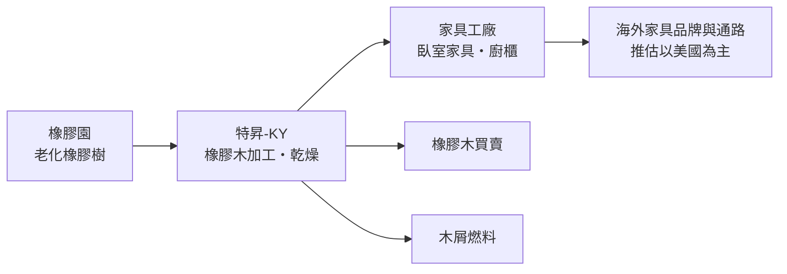
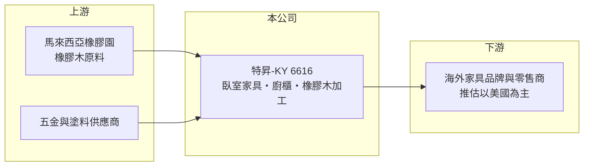

# 6616 特昇-KY

> 上櫃｜[[產業索引-居家生活|居家生活]]｜上市（櫃）日期 2018/01/10

# 第一章：企業模式與商業藍圖

> [!info] 撰寫說明
> 本文由 Claude 依公開資料整理，架構比照 [[2330台積電]] 的四章研究，資料截至 2026-10-08。財務數字來源：Goodinfo 年度經營績效頁、nStock 公司簡介、CMoney 投資快訊。公開資料有限，產品別營收比重、出口市場與主要客戶未查得，產業描述為整理性內容。#待校對

在評估單一個股的長期投資價值時，首要步驟是拆解企業的底層獲利邏輯。本章說明特昇國際（股票代號：6616，以下簡稱特昇-KY）這家以馬來西亞為基地的木製家具製造商。

## 一、核心定位：馬來西亞的木製臥室家具製造商

- **核心業務：** 特昇-KY 是在台灣掛牌的境外公司（[[KY股]]），營運基地在馬來西亞。依公開資料，合併公司主要業務為家具製造與銷售、[[橡膠木]]買賣、燃料製造與銷售，以及機器設備出租。媒體介紹它是馬來西亞前五大的木製臥室家具製造商，產品以美式風格的木製臥室家具與廚櫃為主，並自行加工橡膠木原料。
- **營收結構：** 公司未揭露產品別比重。推估家具製造是主要營收來源，橡膠木買賣與以木材下腳料製成的燃料屬於附屬業務，可以提高原料的利用率。2025 年全年營收約 10.28 億元，資本額約 3.55 億元。
- **營運據點：** 生產基地在馬來西亞。馬來西亞是全球主要的木製家具出口國之一，橡膠木資源豐富，產業以替歐美品牌與通路代工為主，推估特昇-KY 的客戶也以美國等海外家具品牌與零售商為主（推估，具體客戶未查得）。

## 二、資本轉化邏輯：原料自給的代工製造

- **垂直整合：** 從橡膠木加工、家具生產到木料副產品的再利用，特昇-KY 的模式是把原料到成品的流程盡量留在自己手上。這種整合可以降低原料成本、穩定供應，但也代表工廠設備與存貨的資本需求較高。
- **獲利特性：** 家具[[OEM]] 的毛利率通常不高，特昇-KY 的毛利率在 2020 年約 19%，之後多在 10% 至 18% 之間，獲利高度依賴產能利用率與美國訂單的多寡。

## 三、長期方向

- **長期方向：** 公開資料沒有具體的長期計畫。可以觀察的方向包括：利用環保材質趨勢（橡膠木屬於橡膠園更新後的再利用木材）爭取歐美客戶、提高廚櫃等較高附加價值產品的比重，以及在美國對東南亞的關稅政策下調整客戶與市場結構。

# 第二章：護城河深度與競爭優勢

「護城河」指企業抵禦競爭、維持超額利潤的保護機制。本章分析特昇-KY 在東南亞家具代工產業中的位置。

## 一、護城河評估

- **競爭優勢：** 特昇-KY 的優勢主要來自地理位置與原料。馬來西亞擁有大量橡膠木與成熟的家具產業聚落，橡膠木加工的整合能力可以降低成本；在馬來西亞前五大木製臥室家具廠的規模，也讓它能承接大型通路的訂單。不過家具代工的轉換成本低，客戶可以在越南、馬來西亞、印尼之間調整採購，這類優勢較難稱為深厚的護城河。
- **主要對手：** 越南是全球最大的木製家具出口國之一，規模與成本都具競爭力；中國家具廠則在美國關稅下逐步外移東南亞。馬來西亞本地也有大量同業。

## 二、優勢轉化：守得住／守不住／觀察重點

- **守得住：** 與長期合作客戶的關係，以及原料到成品的整合成本優勢。
- **守不住：** 價格。2021 至 2025 年五年中有四年虧損，代表在美國需求疲弱、同業競價的環境下，公司很難維持穩定的利潤。
- **觀察重點：** 美國對馬來西亞家具的關稅待遇、美國房市與家具零售的需求，以及公司是否能回到營業獲利。

# 第三章：財務體質與盈利規模

資料日期：2026-10-08。數字取自 Goodinfo 年度經營績效頁，表格是撰寫當時的快照；最新月營收、毛利率、累計 EPS 由自動排程寫在本筆記的屬性欄位（月營收、毛利率、累計EPS 等）。#待校對

財務報表是檢驗護城河是否真實存在的最終標準。本章用六年的數字檢視特昇-KY 的獲利波動。

## 一、多年度經營績效

| 年度 | 營收（新台幣） | [[毛利率]] | [[營業利益率]] | EPS（元） | [[ROE]] |
|---|---|---|---|---|---|
| 2020 | 12.6 億 | 19.4% | 7.87% | 2.60 | 14.1% |
| 2021 | 8.94 億 | 14.0% | 2.38% | -1.08 | -9.27% |
| 2022 | 11.5 億 | 17.6% | 3.52% | 1.09 | 6.80% |
| 2023 | 10.1 億 | 9.94% | -2.54% | -0.78 | -6.12% |
| 2024 | 11.6 億 | 11.8% | 0.45% | -1.39 | -12.6% |
| 2025 | 10.3 億 | 11.3% | -1.19% | -0.61 | -4.87% |

- **營收規模：** 2020 至 2025 年營收年複合成長率約 -3.9%（推算），營收在 9 億至 13 億元之間波動，沒有明確的成長趨勢。2021 年營收大減，推估與馬來西亞疫情封鎖影響生產有關（推估）。
- **獲利：** 2020 年是近六年唯一較好的年度，EPS 2.60 元；2021 年後五年中有四年虧損。毛利率從約 19% 降到約 11%，2024 年營業微利但業外損失約 0.53 億元，使全年仍虧損。
- **財務特色：** 2021 至 2025 年平均 ROE 約 -5.2%（推算），每股淨值從 2020 年的 15.61 元降到 2025 年的約 12.63 元。Goodinfo 統計長期平均現金股利約 0.71 元，近年虧損下配息能力有限。

## 二、[[ROIC]] 與 [[WACC]]

**ROIC 推算：** 2025 年營業虧損約 0.12 億元。股東權益約 4.35 億元（每股淨值 12.63 元 × 約 0.344 億股），依 ROA -2.85% 推算總資產約 7.4 億元、總負債約 3 億元，假設其中有息負債約 2 億元（推估），投入資本約 6.35 億元，ROIC 約 -1.9%（推算）。2020 年營業利益約 0.99 億元，稅後約 0.79 億元，當年股東權益約 3.66 億元（每股淨值 15.61 元 × 約 0.235 億股），加上同樣假設的有息負債約 2 億元，ROIC 約 14%（推算）。股數從約 0.235 億股增加到約 0.344 億股，推估期間曾辦理增資。

**WACC 推算：** 假設台灣 10 年期公債 1.75%、市場風險溢酬 6%、β 取小型代工股常見值 1.0（推估），股東權益成本約 7.75%；馬來西亞借款利率較高，負債成本假設 4%、稅後 3.2%，權益占資本約 70%（推估），WACC 約 6.4%（推算）。

**結論：** 除了 2020 年，特昇-KY 的 ROIC 長期低於 WACC，近年持續毀損經濟價值。對長期投資人而言，這家公司的價值取決於美國家具需求的回升與毛利率能否回到 15% 以上。

# 第四章：總體風險與地緣政治

任何企業都無法脫離宏觀環境獨立存在。本章分析特昇-KY 長期面對的風險。

## 一、產業與結構風險

- **產業週期：** 木製家具需求跟著美國房市與消費景氣走，房屋成交與新屋開工減少時，家具零售商會降低庫存、減少下單，代工廠受到的衝擊會被放大。美國通路的庫存調整往往持續一至兩年。
- **營運風險：** 營收規模小，固定成本占比高，產能利用率下降時毛利率很快惡化。客戶集中度未查得，若主要客戶轉單，對營收影響大。

## 二、其他風險

- **地緣政治與關稅：** 美國對東南亞國家的關稅政策反覆變動，馬來西亞家具出口商曾為了趕在關稅寬限期前出貨而集中出貨，政策不確定性會打亂訂單節奏。
- **匯率與原物料：** 營收以美元為主，成本以馬來西亞令吉計，兩種貨幣與新台幣的匯率變動都會影響報表獲利。橡膠木供應受橡膠園更新進度與原木價格影響。
- **資訊透明度：** 作為 KY 股，公開資訊多以年報與財報為主，產品與客戶揭露較少，投資人追蹤營運較困難。

# 專有名詞解析

## 金融

- **[[ROIC]]**：投入資本報酬率，稅後營業利益除以股東權益加有息負債，衡量本業運用資本的效率。
- **[[WACC]]**：加權平均資金成本，股東與債權人要求報酬的加權平均，ROIC 高於它才代表創造價值。

## 產業

- **[[KY股]]**：在台灣掛牌的境外註冊公司，代號後加 KY，主要營運據點多在海外。
- **[[橡膠木]]**：橡膠樹割膠年限到期後砍伐再利用的木材，是東南亞家具業的主要原料。
- **[[OEM]]**：代工生產，依客戶設計與品牌製造產品。

# 核心供應鏈

## 1. 上游：原料
- 馬來西亞橡膠木原料、家具五金與塗料（具體供應商未查得）

## 2. 中游：特昇-KY
- 木製臥室家具、廚櫃、橡膠木買賣、木屑燃料、機器設備出租

## 3. 下游與同業
- 客戶：海外家具品牌與零售商（具體客戶未查得）
- 同業：越南、馬來西亞、印尼的木製家具代工廠

## 最新新聞
<!-- news:start -->
<!-- news:end -->

## 相關連結
- [公開資訊觀測站](https://mopsov.twse.com.tw/mops/web/t05st03?step=1&firstin=1&co_id=6616)
- [Goodinfo](https://goodinfo.tw/tw/StockDetail.asp?STOCK_ID=6616)
- [Yahoo 股市](https://tw.stock.yahoo.com/quote/6616)
- [鉅亨網新聞](https://www.cnyes.com/twstock/6616/news)
