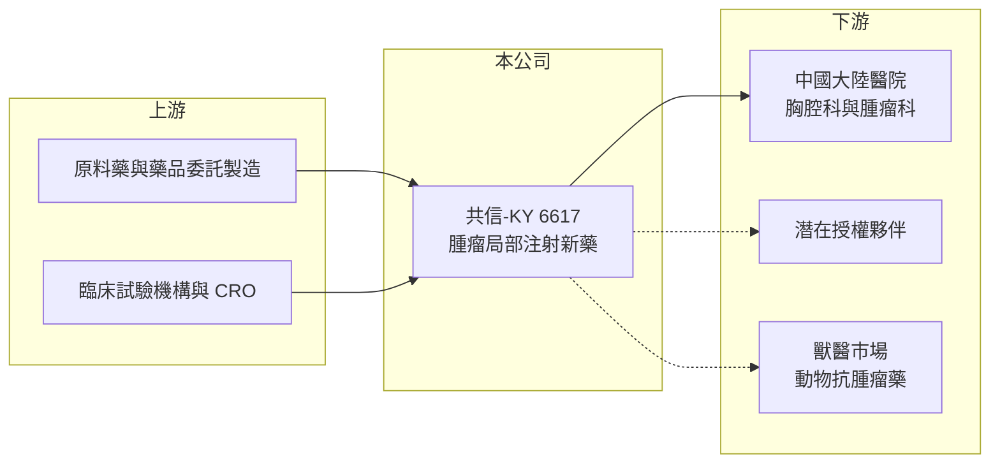

# 6617 共信-KY

> 上櫃｜[[產業索引-生技醫療業|生技醫療業]]｜上市（櫃）日期 2024/06/18

# 第一章：企業模式與商業藍圖

> [!info] 撰寫說明
> 精簡版，由 Claude 依公開資料整理，架構比照 [[2330台積電]] 的四章研究，資料截至 2026-10-08。來源：櫃買中心開放資料快照（基本資料、2026 年第二季綜合損益與資產負債、每月營收、本益比）、Goodinfo 經營績效頁、nStock 公司簡介與新聞標題。公開資料有限，臨床管線的最新進度未查得。#待校對

本章說明共信醫藥（股票代號：6617，以下簡稱共信-KY）的商業模式：一家尚未穩定獲利的新藥公司，價值主要取決於藥證與市場推廣，而不是目前的營收。

- **核心業務：** 共信-KY 是 2014 年在開曼群島設立的控股公司，屬於 [[KY股]]，2015 年取得營運主體 PTS International, Inc. 的全部股權完成重組，2024 年 6 月在櫃買中心上櫃。營業項目包括醫藥研發、藥品檢驗、技術諮詢與轉讓、生物技術服務及[[新藥]]銷售。公司主力是以腫瘤內局部注射方式治療癌症的藥物，依記憶，核心成分為對甲苯磺醯胺（PTS），用於非小細胞肺癌造成的中央氣道阻塞（待校對）。
- **營收結構：** 營收規模很小，2023 年至 2025 年每年約 0.19 億至 0.36 億元，主要來自新藥上市後的初期銷售與相關服務（推估）。依 nStock 整理的新聞，2022 年 11 月公司的肺癌注射液在中國完成藥證審批，這是目前唯一可確認的商業化產品，營收起步慢反映醫院進藥與醫師使用習慣需要時間建立。
- **營運據點：** 控股公司在開曼，營運主體與研發、臨床在台灣與中國大陸進行（推估，待校對）。中國是目前取得藥證的市場，因此銷售推廣與醫院准入是當前營運重心。
- **長期方向：** 除了人用肺癌適應症，依 2022 年 6 月新聞，公司也啟動動物抗腫瘤新藥的田間試驗，嘗試把同一個藥物平台延伸到獸醫市場。長期價值取決於三件事：中國銷售能否放量、能否在其他國家取得藥證或授權，以及新適應症的[[臨床試驗]]成果。

# 第二章：護城河深度與競爭優勢

新藥公司的護城河來自專利、藥證與臨床數據，而不是規模。本章檢視共信-KY 的保護機制與面臨的競爭。

- **競爭優勢：** 第一是藥證本身。新藥在中國取得上市許可需要完整的臨床試驗與審查，已取得藥證就形成後進者難以快速複製的門檻。第二是給藥方式的差異化。局部注射腫瘤的做法可以針對阻塞氣道的腫瘤快速縮小，屬於現有手術、支架與放療之外的選項，在特定病人族群中有明確定位（待校對）。
- **主要對手：** 治療中央氣道阻塞的替代方案包括氣管鏡下的雷射、冷凍、支架與放射治療，這些是共信-KY 必須爭取醫師改變習慣的對象。台灣以癌症新藥為主的上市櫃同業有 [[4174浩鼎]]、[[4162智擎]]、[[6550北極星藥業-KY]] 等，但治療機轉與市場各不相同，彼此較少直接競爭。
- **觀察重點：** 第一，中國市場營收能否從每年數千萬元級距走向億元以上，這決定公司能否靠本業養活研發。第二，是否取得國際授權夥伴，授權能帶來[[授權金]]並借助夥伴的通路。第三，現金消耗速度與增資需求，這直接影響股東權益是否被稀釋。

# 第三章：財務體質與盈利規模

資料日期：2026-10-08，表格是撰寫當時的快照；最新月營收、毛利率、累計 EPS 由自動排程寫在本筆記的屬性欄位（月營收、毛利率、累計EPS 等）。#待校對

對尚在虧損的新藥公司，財務分析的重點是「燒錢速度」與「還能撐多久」，而不是本益比。本章用多年度數字觀察共信-KY 的研發投入與資本狀況。

| 年度 | 營收（新台幣） | [[毛利率]] | [[營業利益率]] | EPS（元） | [[ROE]] |
|---|---|---|---|---|---|
| 2021 | 0.01 億 | 94.3% | 營收過小，不具意義 | -1.11 | -12.3% |
| 2022 | 0.01 億 | 93.3% | 營收過小，不具意義 | -2.29 | -24.7% |
| 2023 | 0.19 億 | 59.2% | -705% | -0.81 | -7.54% |
| 2024 | 0.32 億 | 27.1% | -506% | -0.68 | -4.17% |
| 2025 | 0.36 億 | 71.6% | -569% | -0.92 | -4.31% |
| 2026 上半年 | 0.22 億 | 55.6% | -521% | -0.67 | 約 -7.0%（年化推算） |

資料來源：2021 至 2025 年為 Goodinfo 經營績效頁（合併報表）；2026 上半年為櫃買中心綜合損益快照。

- **營收規模：** 2026 年 1 至 8 月累計營收 0.31 億元，較去年同期的 0.23 億元成長約 32%（櫃買中心月營收），方向是成長，但絕對金額仍遠不足以支應營運。
- **獲利：** 2026 年上半年營業費用 1.28 億元，是同期營收的近 6 倍，營業損失 1.15 億元，主要反映研發、臨床與市場推廣支出。以此推算每年營運現金消耗約 2 億元上下（推估）。新藥公司在授權或銷售放量之前，虧損是常態，但虧損金額相對資本的比例決定了增資壓力。
- **財務特色：** 2026 年第二季流動資產 17.21 億元、總負債只有 3.17 億元，權益 23.26 億元，每股淨值 19.21 元。以目前虧損速度，流動資產可支應多年營運（推估，流動資產不全為現金）。股本 12.75 億元，股價淨值比 6.59 倍，代表市場給予的價值主要來自對未來藥品銷售的期待，而不是帳上資產。2024 年曾有買回庫藏股的決議（nStock 新聞標題，待校對）。
- **[[ROIC]] 與 [[WACC]]：** 公司幾乎沒有有息負債，以非流動負債 1.07 億元近似，投入資本約 24.33 億元。2025 年營業損失約 2.05 億元（營收 0.36 億元乘營業利益率 -569%），稅後約 -1.64 億元，ROIC 約 -6.7%（推算）；2026 年上半年年化約 -7.6%（推算）。WACC 方面，台灣 10 年期公債取 1.75%、市場風險溢酬 6%，β 未查得，新藥股波動大，取 1.2 至 1.5，股東權益成本約 9.0% 至 10.8%，負債比重極低，WACC 約 9% 至 10.7%（推算）。ROIC 為負是研發階段公司的正常現象，代表目前在消耗資本換取未來的藥品價值；判斷是否值得，要看中國銷售與授權能否在資金耗盡前讓 ROIC 轉正。

# 第四章：總體風險與地緣政治

新藥公司的風險集中在臨床、法規與資金三方面。本章整理共信-KY 長期需要面對的主要風險。

- **產業週期：** 生技新藥股的評價高度受資本市場資金情緒影響，募資環境轉差時，研發公司增資會更困難、條件更差。這與公司本身的研發進度無關，卻會影響股東權益。
- **營運風險：** 單一產品集中度高，若中國銷售推廣不如預期，或醫師持續偏好既有的氣管鏡介入治療，營收成長會很緩慢。臨床試驗結果具有不確定性，新適應症或新市場的試驗失敗，會直接影響公司價值。
- **其他風險：** 中國大陸的藥品政策變動大，國家醫保談判與集中採購可能壓低藥價；兩岸關係緊張也會影響在中國的營運。公司為開曼控股架構，投資人的法律保障與台灣本地公司不同，資訊揭露也以英文營運主體為主，需要留意。

# 專有名詞解析

## 金融

- **[[KY股]]**：在開曼群島等海外註冊、回台灣上市櫃的公司，營運主體多在海外，股票代號後加 KY。
- **[[ROIC]]**：投入資本報酬率，稅後營業利益除以股東權益與有息負債的合計，衡量本業對所有資金提供者的報酬。
- **[[WACC]]**：加權平均資金成本，依股東權益與負債的比重加權計算的資金成本，ROIC 高於它才代表創造價值。

## 產業

- **[[新藥]]**：含有新成分、新療效或新給藥途徑，需完成完整臨床試驗才能取得上市許可的藥品。
- **[[臨床試驗]]**：新藥上市前在人體進行的分階段試驗，一期看安全性、二期看初步療效、三期確認療效。
- **[[授權金]]**：藥廠將藥物開發或銷售權利授權給其他公司時收取的簽約金與里程碑金，通常屬一次性收入。

# 核心供應鏈

- 上游：原料藥、委託製造廠與臨床試驗服務機構（具體廠商未查得）。
- 下游／客戶：中國大陸醫院的胸腔科與腫瘤科、未來可能的國際授權夥伴，以及動物醫療市場。
- 同業：台灣癌症新藥公司 [[4174浩鼎]]、[[4162智擎]]、[[6550北極星藥業-KY]]。

## 最新新聞
<!-- news:start（自動產生，請勿手動編輯此範圍） -->
- 2026-10-05 📰 媒體 17:50｜營收速報 - 共信-KY(6617)9月營收670萬元年增率高達32.59％｜[鉅亨網](https://news.cnyes.com/news/id/6621842)

完整紀錄：[[6617共信-KY 新聞]]
<!-- news:end -->

## 相關連結
- [公開資訊觀測站](https://mopsov.twse.com.tw/mops/web/t05st03?step=1&firstin=1&co_id=6617)
- [Goodinfo](https://goodinfo.tw/tw/StockDetail.asp?STOCK_ID=6617)
- [Yahoo 股市](https://tw.stock.yahoo.com/quote/6617)
- [鉅亨網新聞](https://www.cnyes.com/twstock/6617/news)
