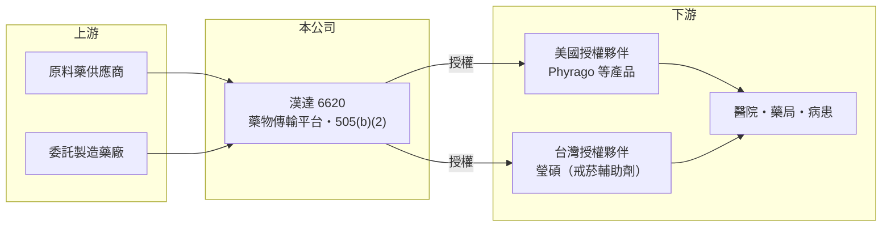

# 6620 漢達

> 上櫃｜[[產業索引-生技醫療業|生技醫療業]]｜上市（櫃）日期 2025/12/23

# 第一章：企業模式與商業藍圖

> [!info] 撰寫說明
> 精簡版，由 Claude 依公開資料整理，架構比照 [[2330台積電]] 的四章研究，資料截至 2026-10-08。來源：櫃買中心開放資料快照（基本資料、2026 年第二季綜合損益與資產負債、每月營收與備註、本益比）、Goodinfo 經營績效頁、nStock 公司簡介與新聞標題、科技新報與優分析 2025 年新聞標題。產品與授權對象的部分細節憑記憶整理，已標待校對。#待校對

本章說明漢達生技醫藥（股票代號：6620，以下簡稱漢達）的商業模式：它不從零開發全新分子，而是用藥物傳輸技術改良既有藥物，再透過授權把產品推向美國市場。

- **核心業務：** 漢達 2014 年設立，2025 年 12 月在櫃買中心上櫃，董事長為劉芳宇。公司以藥物傳輸與控釋技術平台為核心，開發美國 [[505(b)(2)]] 途徑的改良型新藥，以及技術門檻較高的利基型[[學名藥]]。505(b)(2) 的好處是可以引用原廠藥已證實的安全性資料，只需補做較小規模的試驗，開發時間與成本都比全新藥物低很多，成功率也較高。
- **營收結構：** 營收主要來自產品授權給美國等地夥伴後收取的[[授權金]]、[[里程碑金]]與銷售分潤，金額依合約進度認列，因此年度之間波動很大。櫃買中心月營收備註指出，2025 年 4 月與 8 月認列了 Phyrago 授權相關收入，這是 2025 年營收跳升到 17.3 億元的主因；2026 年 1 至 8 月累計營收 5.60 億元，較去年同期 13.41 億元大幅減少，正是缺少同類一次性收入。
- **營運據點：** 研發總部在台灣，產品生產委託合作藥廠，美國市場的銷售交給被授權夥伴（推估）。這是典型的輕資產研發授權模式，公司本身不需要龐大的工廠與業務團隊。
- **長期方向：** 依優分析 2025 年 12 月報導標題，公司目標是「每年一藥品上市」；科技新報 2025 年 11 月報導提到多靶點癌症用藥爭取 2026 年取得美國藥證，並以多發性硬化症口溶錠 Tascenso 為已上市產品案例（產品細節待校對）。公司長期策略是累積多個已上市產品，讓分潤收入逐漸取代一次性授權金，使營收曲線變得平滑。

# 第二章：護城河深度與競爭優勢

505(b)(2) 公司的護城河，在於配方技術、專利與搶先上市的時間優勢。本章分析漢達的競爭地位。

- **競爭優勢：** 第一是配方與製程技術。改良劑型（例如口溶錠、改變溶離或吸收特性）需要掌握藥物傳輸的專業知識，並取得配方專利，能在原廠專利到期後形成另一道保護。第二是產品組合策略。漢達同時布局癌症、神經等不同領域，降低單一產品失敗的衝擊。第三是授權經驗，已有多項產品完成授權並在美國上市，累積了與國際藥廠談判與合作的紀錄。
- **主要對手：** 台灣以 505(b)(2) 或改良劑型為主的同業包括 [[6535順藥]]、[[6576逸達]]；以學名藥為主的則有 [[1795美時]]。國際上則是眾多美國與印度的特殊學名藥公司，同一個原廠藥常有多家廠商同時開發改良劑型，搶先取得藥證的公司才能享有較好的市場地位。
- **觀察重點：** 第一，2026 年癌症用藥的美國藥證審查結果（依 2025 年報導目標，待校對）。第二，已上市產品的銷售分潤能否逐年成長，這是公司擺脫「授權金年度起伏」的關鍵。第三，2023 年曾發生戒菸輔助劑美國藥證需補件、癌症新藥上市承諾取消等事件（nStock 新聞標題），顯示 FDA 審查的時程風險不容忽視。

# 第三章：財務體質與盈利規模

資料日期：2026-10-08，表格是撰寫當時的快照；最新月營收、毛利率、累計 EPS 由自動排程寫在本筆記的屬性欄位（月營收、毛利率、累計EPS 等）。#待校對

授權型生技公司的財報起伏很大，看單一年度容易誤判，必須用多年度資料觀察。本章整理漢達從虧損到獲利的轉折。

| 年度 | 營收（新台幣） | [[毛利率]] | [[營業利益率]] | EPS（元） | [[ROE]] |
|---|---|---|---|---|---|
| 2021 | 0.29 億 | 95.0% | 營收過小，不具意義 | -2.10 | -49.4% |
| 2022 | 1.98 億 | 90.5% | -44.6% | -0.32 | -6.76% |
| 2023 | 11.1 億 | 99.9% | 62.7% | 5.41 | 41.8% |
| 2024 | 8.31 億 | 99.9% | 50.3% | 3.37 | 16.1% |
| 2025 | 17.3 億 | 84.5% | 54.0% | 4.85 | 17.1% |
| 2026 上半年 | 4.22 億 | 80.5% | 25.4% | 0.65 | 約 4.3%（年化推算） |

資料來源：2021 至 2025 年為 Goodinfo 經營績效頁（合併報表）；2026 上半年為櫃買中心綜合損益快照。

- **營收規模：** 2022 年以前營收不到 2 億元，2023 年起因授權收入跳升到 8 億至 17 億元的級距。營收高度依賴授權合約的里程碑時點，年複合成長率不具參考意義；2023 年至 2025 年三年合計營收約 36.7 億元，可視為公司目前的授權收入規模。
- **獲利：** 授權收入幾乎沒有直接成本，因此毛利率接近 100%，營業利益率在 50% 以上。2023 年至 2025 年 ROE 平均約 25%（推算），但 2026 年上半年缺少大額授權收入，營業利益率降到 25.4%，年化 ROE 只有 4% 左右，充分說明這類公司獲利的跳躍性。
- **財務特色：** 2025 年 12 月上櫃後資本充實，2026 年第二季流動資產 41.71 億元、總負債 5.58 億元，權益 50.23 億元，每股淨值 30.90 元，幾乎沒有財務壓力。依櫃買中心本益比資料，最近年度每股股利約 2.07 元，配息率約四成（以 2025 年 EPS 推算），顯示公司在獲利年度願意回饋股東。
- **[[ROIC]] 與 [[WACC]]：** 有息負債未查得，以非流動負債 0.93 億元近似，投入資本約 51.16 億元。2025 年營業利益約 9.34 億元，稅後約 7.47 億元，ROIC 約 14.6%（推算）；2026 年上半年年化僅約 3.3%（推算）。需注意 2025 年的投入資本以上櫃增資後的權益計算，會低估當年的實際 ROIC。WACC 方面，台灣 10 年期公債取 1.75%、市場風險溢酬 6%，β 未查得，取生技股常見的 1.0 至 1.3，股東權益成本約 7.8% 至 9.6%，負債極少，WACC 約 7.7% 至 9.5%（推算）。授權大年 ROIC 明顯高於 WACC，小年則低於 WACC；長期是否創造價值，要看多年平均，以 2023 年至 2025 年的獲利水準來看，平均 ROIC 高於資金成本（推估）。

# 第四章：總體風險與地緣政治

授權型新藥公司的風險，主要來自 FDA 審查、合作夥伴表現與收入集中。本章整理漢達需要長期關注的風險。

- **產業週期：** 美國學名藥與改良劑型市場競爭激烈，藥價常在多家廠商進入後快速下滑，使銷售分潤縮水。生技股的資金環境也會影響公司評價與後續募資條件。
- **營運風險：** 收入高度依賴少數授權合約，里程碑時點一旦延後，年度營收可能大幅衰退，2026 年上半年就是例子。FDA 可能要求補件或拒絕核准，2023 年的補件事件顯示審查時程存在不確定性。產品上市後的銷售由夥伴主導，漢達對行銷力度的控制有限。
- **其他風險：** 專利訴訟是 505(b)(2) 與學名藥公司常見的風險，原廠藥公司可能以專利侵權起訴，拖延上市時間。授權收入多以美元計價，新台幣升值會降低帳面收入。美國藥價改革政策若壓低整體藥價，也會影響分潤。

# 專有名詞解析

## 金融

- **[[ROIC]]**：投入資本報酬率，稅後營業利益除以股東權益與有息負債的合計，衡量本業對所有資金提供者的報酬。
- **[[WACC]]**：加權平均資金成本，依股東權益與負債的比重加權計算的資金成本，ROIC 高於它才代表創造價值。

## 產業

- **[[505(b)(2)]]**：美國 FDA 的新藥申請途徑，可引用既有藥品的資料，用於新劑型、新配方等改良型新藥。
- **[[學名藥]]**：專利到期後由其他廠商生產的同成分產品，農藥與西藥都有這種模式。
- **[[授權金]]**：藥廠將藥物開發或銷售權利授權給其他公司時收取的簽約金與里程碑金，通常屬一次性收入。
- **[[里程碑金]]**：授權合約中，被授權方在臨床、藥證或銷售達到約定進度時支付給授權方的款項。

# 核心供應鏈

- 上游：原料藥供應商與委託製造藥廠（具體廠商未查得）。
- 下游／客戶：美國授權夥伴（Phyrago 等產品的被授權方，名稱未查得）、2023 年取得戒菸輔助劑台灣授權的瑩碩（nStock 新聞標題），最終使用者為醫院、藥局與病患。
- 同業：[[6535順藥]]、[[6576逸達]]、[[1795美時]]。

## 最新新聞
<!-- news:start -->
<!-- news:end -->

## 相關連結
- [公開資訊觀測站](https://mopsov.twse.com.tw/mops/web/t05st03?step=1&firstin=1&co_id=6620)
- [Goodinfo](https://goodinfo.tw/tw/StockDetail.asp?STOCK_ID=6620)
- [Yahoo 股市](https://tw.stock.yahoo.com/quote/6620)
- [鉅亨網新聞](https://www.cnyes.com/twstock/6620/news)
