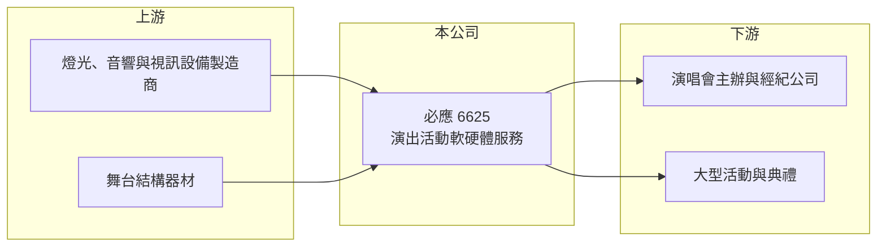

# 6625 必應

> 上市｜[[產業索引-其他業|其他業]]｜上市（櫃）日期 2018/02/07

# 第一章：企業模式與商業藍圖

> [!info] 撰寫說明
> 精簡版，由 Claude 依公開資料整理，架構比照 [[2330台積電]]，資料截至 2026-10-07。來源：nstock.tw 必應公司概況、winvest.tw 營收快訊。公開資料有限，業務與地區別比重、主要客戶本次未查到。#待校對

必應是替演唱會等大型演出提供燈光、音響、視訊與舞台結構的技術服務公司。

- **核心業務：** 必應提供各類演出活動的軟硬體服務，包括製作設計，以及燈光、音響、視訊、樂器與結構器材等硬體設備。
- **營收結構：** 本次未查到業務或地區別比重；營收隨演出檔期起伏，2026 年 5 月營收 7.67 億元、6 月僅 2.61 億元，單月波動很大。
- **營運據點：** 營運據點本次未查到，本文不推測。
- **長期方向：** 受惠[[演唱會經濟]]與大型巡演增加，2025 年全年營收達 43.71 億元，持續擴大設備規模與承接大型演出（推估）。

# 第二章：護城河深度與競爭優勢

必應的優勢在於設備規模與大型演出的執行經驗。

- **競爭優勢：** 大型巡演對設備數量與現場技術團隊要求高，累積的設備庫存與執行紀錄是新進者不易複製的門檻（推估）。
- **主要對手：** 國內外舞台燈光音響工程商，本次未查到具體上市同業。
- **觀察重點：** 年度大型巡演檔期多寡、設備投資回收效率，以及毛利率能否維持在兩成五以上。

# 第三章：財務體質與盈利規模

資料日期：2026-10-07，以下數字是撰寫當時的快照；最新月營收、毛利率、累計 EPS 由自動排程寫在本筆記的屬性欄位（月營收、毛利率、累計EPS 等）。#待校對

必應 2026 年上半年獲利成長，但單月營收波動大。

- **營收規模：** 2025 年全年營收 43.71 億元；2026 年 7 月營收 3.76 億元、年增 26.53%，8 月 3.77 億元、年減 12.35%；1 至 7 月累計 25.25 億元，年增 20.89%。
- **獲利：** 2026 年第二季 EPS 3.21 元，上半年累計 4.63 元；第二季[[毛利率]] 26.17%、[[營業利益率]] 19.93%、淨利率 13.45%。
- **財務特色：** 資本額約 5.8 億元，第二季單季 [[ROE]] 10.37%；2025 年度配發現金股利 5 元。設備購置屬於持續性的 [[CapEx]]（推估）。

# 第四章：總體風險與地緣政治

必應的風險集中在演出檔期的不確定性。

- **產業週期：** 演出市場受景氣、消費力與藝人巡演排程影響，熱潮退燒時需求會明顯下滑。
- **營運風險：** 營收集中在少數大型檔期，延期或取消會造成單季營收大幅波動；設備閒置時折舊仍需負擔。
- **其他風險：** 疫情等公共衛生事件曾讓演出全面停擺；海外演出則有匯率與當地法規風險。

# 專有名詞解析

## 金融

- **[[CapEx]]**：資本支出，企業購買土地、廠房與設備的支出。
- **[[ROE]]**：股東權益報酬率，稅後淨利除以股東權益，衡量股東資金的獲利效率。

## 產業

- **[[演唱會經濟]]**：大型演唱會帶動門票、交通、住宿與周邊消費，也帶動舞台設備與技術服務需求。
- **[[舞台技術服務]]**：提供演出所需的燈光、音響、視訊與結構設備，並派技術人員現場架設與操作。

# 核心供應鏈

- 上游：燈光、音響、視訊與舞台結構設備製造商（推估）
- 下游／客戶：演唱會主辦單位、經紀公司與大型活動主辦方，客戶名稱未揭露
- 同業：國內外舞台燈光音響工程商

## 最新新聞
<!-- news:start -->
<!-- news:end -->

## 相關連結
- [公開資訊觀測站](https://mopsov.twse.com.tw/mops/web/t05st03?step=1&firstin=1&co_id=6625)
- [Goodinfo](https://goodinfo.tw/tw/StockDetail.asp?STOCK_ID=6625)
- [Yahoo 股市](https://tw.stock.yahoo.com/quote/6625)
- [鉅亨網新聞](https://www.cnyes.com/twstock/6625/news)
