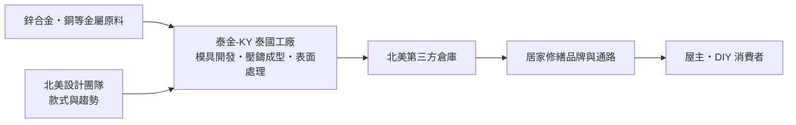
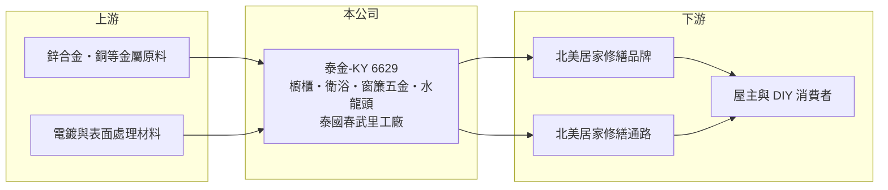

# 6629 泰金-KY

> 上櫃｜[[產業索引-居家生活|居家生活]]｜上市（櫃）日期 2019/06/06

# 第一章：企業模式與商業藍圖

> [!info] 撰寫說明
> 本文由 Claude 依公開資料整理，架構比照 [[2330台積電]] 的四章研究，資料截至 2026-10-08。財務數字來源：Goodinfo 年度經營績效頁、富果研究 2025 年 5 月法說會整理、優分析報導標題；產品別營收比重僅有 2019 年數字，尚未逐條比對原始文件。#待校對

在評估單一個股的長期投資價值時，首要步驟是拆解企業的底層獲利邏輯。本章說明泰金寶國際（股票代號：6629，以下簡稱泰金-KY）如何以泰國工廠為北美居家修繕通路生產裝飾五金。

## 一、核心定位：泰國生產、賣給北美的居家五金製造商

- **核心業務：** 泰金-KY 是在台灣掛牌的[[KY股]]，以 B2B 模式生產時尚、高品質的居家裝飾五金，產品包括櫥櫃把手與五金、衛浴五金、窗簾五金與水龍頭，應用範圍涵蓋廚房、衛浴、客廳到臥室。客戶主要是北美大型居家修繕品牌與通路，終端使用者是屋主與 DIY 愛好者。
- **營收結構：** 櫥櫃五金在 2019 年曾占營收約 80%，之後比重持續下降，衛浴與窗簾五金比重提高，最新比重未查得。營收九成以上以美元計價，主要市場在北美。產品多元化的目的是降低對單一品類與單一客戶的依賴。
- **營運據點：** 工廠位於泰國春武里府，廠區超過 12 萬平方公尺，另有超過 13 萬平方公尺的土地儲備，現有廠房旁正增建三棟新廠。北美設有設計團隊與第三方倉庫，財務與投資人關係設於台灣。

## 二、資本轉化邏輯：一條龍壓鑄與表面處理

- **垂直整合：** 泰金-KY 從模具開發、[[鋅合金壓鑄]]成型到電鍍與表面處理都在自家工廠完成。裝飾五金的價值很大部分在外觀，表面處理的顏色、質感與耐久度決定產品能否打進高階通路，掌握整條製程可以加快打樣與量產速度。
- **獲利特性：** 毛利率在 2020 至 2025 年介於約 21% 至 33%，營業利益率約 15% 至 26%，明顯高於一般代工製造業。原因是產品款式多、單價低但設計附加價值高，加上北美設計團隊貼近客戶需求。

## 三、長期方向

- **長期方向：** 公司短中期以擴大規模為優先，泰國新廠完成後將提升產能；產品線預計延伸到門鎖與門窗五金，並導入自動化降低成本。在美國對東南亞各國課徵不同關稅的情況下，公司認為泰國的稅率相對越南與柬埔寨有利，有機會承接[[供應鏈移轉]]的訂單。2024 年曾辦理現金增資與發行可轉換公司債，為擴廠籌措資金。

# 第二章：護城河深度與競爭優勢

「護城河」指企業抵禦競爭、維持超額利潤的保護機制。本章分析泰金-KY 的優勢與競爭環境。

## 一、護城河的核心組成

- **競爭優勢：** 第一是設計與快速打樣能力，北美設計團隊掌握流行趨勢，加上泰國工廠一條龍生產，可以快速把新款式推上通路貨架。第二是通路關係，北美大型居家修繕通路的供應商資格審核嚴格，涵蓋品質、交期與社會責任稽核，一旦成為合格供應商，訂單通常有延續性。第三是生產地點，泰國工廠讓公司避開美國對中國產品的高關稅，也具備土地儲備可持續擴產。
- **主要對手：** 中國的五金壓鑄廠仍是全球主要供應來源，越南、柬埔寨的新設工廠也在承接轉單。台灣同業在家具五金領域有 [[2059川湖]]（以滑軌為主，定位不同），國際品牌則有歐洲的 Blum、Hettich 等。

## 二、優勢轉化：守得住／守不住／觀察重點

- **守得住：** 已建立合作的北美通路客戶與設計導向的產品，毛利率長期維持在兩成以上。
- **守不住：** 客戶集中與匯率。營收九成以上是美元，客戶集中在北美通路，美國居家修繕需求轉弱或新台幣升值時，報表獲利會明顯波動，例如 2022 年毛利率從 27.4% 降到 20.8%。
- **觀察重點：** 泰國新廠的產能開出與利用率、門鎖等新產品能否打入客戶，以及美國對泰國的關稅待遇。

# 第三章：財務體質與盈利規模

資料日期：2026-10-08。數字取自 Goodinfo 年度經營績效與富果研究法說會整理，表格是撰寫當時的快照；最新月營收、毛利率、累計 EPS 由自動排程寫在本筆記的屬性欄位（月營收、毛利率、累計EPS 等）。#待校對

財務報表是檢驗護城河是否真實存在的最終標準。本章用六年的數字檢視泰金-KY 的獲利能力與資本效率。

## 一、多年度經營績效

| 年度 | 營收（新台幣） | [[毛利率]] | [[營業利益率]] | EPS（元） | [[ROE]] |
|---|---|---|---|---|---|
| 2020 | 12.6 億 | 26.7% | 19.2% | 6.61 | 27.9% |
| 2021 | 13.6 億 | 27.4% | 20.9% | 6.51 | 26.5% |
| 2022 | 13.5 億 | 20.8% | 14.6% | 4.53 | 17.6% |
| 2023 | 11.8 億 | 23.5% | 16.8% | 4.66 | 16.2% |
| 2024 | 16.2 億 | 32.7% | 26.1% | 11.49 | 30.9% |
| 2025 | 17.4 億 | 26.4% | 20.3% | 6.46 | 14.8% |

- **營收規模：** 2020 至 2025 年營收年複合成長率約 6.7%（推算），2024 年起擺脫 2022 至 2023 年北美庫存調整的低谷，2025 年營收 17.4 億元創近年新高。
- **獲利：** 營業利益率六年都在 14% 以上，業外損益金額小，獲利品質主要來自本業。2024 年毛利率 32.7%、EPS 11.49 元是高峰；2025 年營收成長但 EPS 降為 6.46 元，推估與新台幣升值的匯損、新廠費用及增資後股本擴大有關（推估）。
- **財務特色：** 2021 至 2025 年平均 ROE 約 21.2%（推算）。2024 年現金股利[[配息率]]約 80%，公司傾向把大部分盈餘分給股東。2024 年增資與發行可轉債後流動比率超過 500%，負債比率逐年下降，財務結構穩健。

## 二、[[ROIC]] 與 [[WACC]]

**ROIC 推算：** 2025 年營業利益約 3.53 億元（17.4 億 × 20.3%），稅後約 2.83 億元。股東權益約 17.0 億元（每股淨值 44.47 元 × 約 0.382 億股），依 ROA 10.2% 推算總資產約 24 億元、總負債約 7 億元，其中可轉債等有息負債假設約 3 億元（推估），投入資本約 20 億元，ROIC 約 14%（推算）；若有息負債更少，ROIC 接近 17%。2024 年同樣算法，稅後營業利益約 3.38 億元、股東權益約 15.5 億元，ROIC 約 18% 至 22%（推算）。

**WACC 推算：** 假設台灣 10 年期公債 1.75%、市場風險溢酬 6%、β 取中小型製造股常見值 0.9（推估），股東權益成本約 7.15%；負債以可轉債為主，成本假設 2%、稅後 1.6%，權益約占資本 85%（推估），WACC 約 6.3%（推算）。

**結論：** 泰金-KY 的 ROIC 長期約為 WACC 的兩倍以上，即使在 2022 至 2023 年的低谷也高於資金成本，屬於持續創造經濟價值的製造商。擴廠完成後，關鍵是新增產能能否維持相同的報酬率，而不是被新廠折舊與匯率稀釋。

# 第四章：總體風險與地緣政治

任何企業都無法脫離宏觀環境獨立存在。本章分析泰金-KY 長期面對的風險。

## 一、產業與結構風險

- **產業週期：** 居家裝飾五金的需求跟著北美房市、舊屋翻修與 DIY 消費走。利率上升時房屋交易與裝修減少，通路會降低庫存，代工廠的訂單因此出現[[長鞭效應]]式的放大波動，2022 至 2023 年的營收下滑就是例子。
- **營運風險：** 客戶集中在北美大型通路，議價力偏向買方；擴廠期間若遇到泰國雨季等因素延誤，或新產能利用率不足，新廠折舊會壓低毛利率。

## 二、其他風險

- **地緣政治與關稅：** 美國對各國的關稅政策反覆變動，公司過去提到泰國稅率約 36%、越南約 49%、柬埔寨約 46%，泰國相對有利，但相對優勢可能隨談判結果改變。
- **匯率：** 營收九成以上是美元，又持有較多美元資金，新台幣升值會同時影響營收換算與評價匯損。
- **原物料：** 鋅、銅等金屬價格波動會影響成本，產品價格調整通常落後原料變動。

# 專有名詞解析

## 金融

- **[[配息率]]**：現金股利占每股盈餘的比例，反映公司把多少獲利分給股東。
- **[[ROIC]]**：投入資本報酬率，稅後營業利益除以股東權益加有息負債，衡量本業運用資本的效率。

## 產業

- **[[KY股]]**：在台灣掛牌的境外註冊公司，代號後加 KY，主要營運據點多在海外。
- **[[鋅合金壓鑄]]**：把熔化的鋅合金注入模具成型的製程，適合大量生產外型複雜的把手與五金零件。
- **[[供應鏈移轉]]**：品牌與通路為了降低關稅與地緣政治風險，把採購從中國轉到東南亞等地的趨勢。
- **[[長鞭效應]]**：終端需求的小幅變動，沿供應鏈往上游傳遞時被逐級放大，造成上游庫存與訂單劇烈波動。

# 核心供應鏈

## 1. 上游：原料
- 鋅合金、銅等金屬原料與表面處理材料（具體供應商未查得）

## 2. 中游：泰金-KY
- 泰國春武里府一條龍生產，北美設計團隊與第三方倉庫

## 3. 下游與同業
- 客戶：北美大型居家修繕品牌與通路（具體名稱未查得）
- 同業：中國、越南、柬埔寨五金壓鑄廠；[[2059川湖]]（家具五金，定位不同）；Blum、Hettich

## 最新新聞
<!-- news:start -->
<!-- news:end -->

## 相關連結
- [公開資訊觀測站](https://mopsov.twse.com.tw/mops/web/t05st03?step=1&firstin=1&co_id=6629)
- [Goodinfo](https://goodinfo.tw/tw/StockDetail.asp?STOCK_ID=6629)
- [Yahoo 股市](https://tw.stock.yahoo.com/quote/6629)
- [鉅亨網新聞](https://www.cnyes.com/twstock/6629/news)
