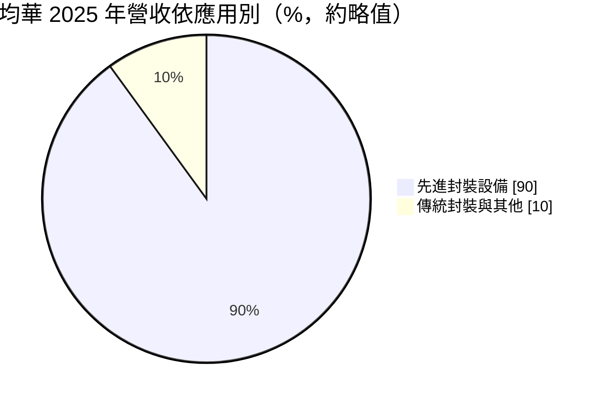
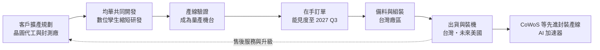
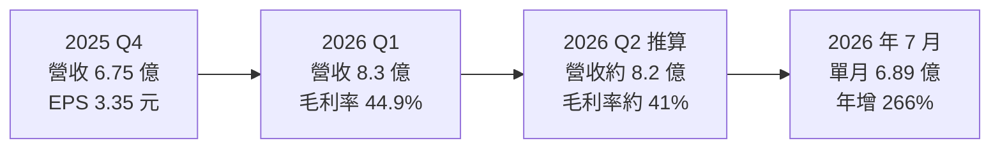
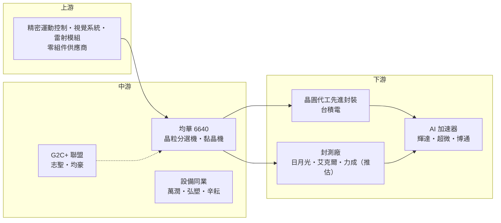

# 6640 均華

> 上櫃｜[[產業索引-半導體業|半導體業]]｜上市（櫃）日期 2018/10/23

# 第一章：企業模式與商業藍圖

> [!info] 撰寫說明
> 本文由 Claude 依公開資料整理，架構比照 [[2330台積電]] 的四章研究，資料截至 2026-10-07。財務數字來源：富果研究均華法說會筆記（2026 年 3 月、8 月）、方格子 2026 年 6 月法說會整理、CMoney 2025 年上半年財報整理；產業描述為整理性內容，尚未逐條比對原始文件。#待校對

在評估單一個股的長期投資價值時，首要步驟是拆解企業的底層獲利邏輯。本章針對均華精密（股票代號：6640，以下簡稱均華）的商業模式進行定性分析，說明一家傳統封測設備商如何靠精密取放技術轉型為 AI [[先進封裝]]設備供應商，以及產品結構從分選機走向黏晶機的意義。

## 一、核心定位：先進封裝的精密取放設備商

均華是台灣上櫃的半導體後段設備廠，屬於志聖、均豪、均華組成的設備聯盟（市場稱 G2C+ 聯盟）成員。均華的核心技術是[[精密取放]]（Pick and Place），公司表示這項技術已有超過 25 年的傳承。簡單說，就是用機械手臂把晶圓切割後的晶粒，以微米等級的精度拿起、檢查、分類，再放到正確的位置上。

在 AI 晶片封裝之前，取放設備多用在傳統封測的分選與黏晶；但到了 [[CoWoS]] 這類 2.5D／3D 先進封裝，晶粒必須先分選出良品（[[KGD]]），再精準放到中介層（[[Interposer]]）或載板上，對精度、速度與潔淨度的要求大幅提高。這帶來兩個商業意義：

* **單價與毛利同步提高：** 先進封裝用的設備規格更嚴，單價明顯高於傳統機種，毛利率也跟著提升。
* **在地化設備的機會：** 先進封裝產能快速擴張，客戶需要交期短、能就近調機的設備商，台灣在地廠因此取得導入機會。

先進封裝設備占均華營收比重從 2020 年的 45% 提升到 2025 年的約 90%，公司預估 2026 年將達 90% 至 95%。

## 二、產品板塊：從分選機走向黏晶機

* **晶粒分選機（[[Chip Sorter]]）：** 均華長期的主力產品，把切割後的晶粒依測試結果分類，並整合 AI 檢測軟體進行瑕疵篩選。先進封裝要求的分選精度與檢測能力，使分選機單價明顯高於傳統機種。
* **晶粒黏著機（[[Die Bonder]]）：** 把晶粒精準放置並黏合到中介層或載板上，是均華成長最快的產品。Die Bonder 營收占比從 2022 年的 6% 提升到 2025 年的 22%，富果研究法說筆記指出，2026 年 7 月單月已超過 50%，公司預期下半年 Bonder 營收將超越 Chip Sorter。
* **雷射與其他設備：** 貢獻較小。
* **新產品：** 公司規劃推出 [[CPO]] 與[[矽光子]]相關設備，作為下一階段的成長來源。

## 三、資本轉化邏輯：接單、驗證、出貨的設備循環

* **客戶與據點：** 均華表示與全球前十大封測廠均有合作，方格子整理的法說內容確認 [[2330台積電]] 與 [[3711日月光投控]] 為客戶，但管理層不評論單一客戶占比。生產與研發主要在台灣，2026 年 5 月董事會通過成立美國子公司，並已購置員工宿舍、積極尋找廠房，準備跟著客戶到美國提供服務。
* **研發效率：** 均華導入[[數位孿生]]與 AI 模擬技術，公司表示可把研發時程從實體開發的數個月壓縮到約 1 個月，有助於快速回應客戶的新製程需求。
* **訂單能見度：** 訂單能見度已延伸至 2027 年第三季，在手訂單約為 2026 年 7 月月營收的 5 倍以上。

## 四、企業長期藍圖

* **產品結構升級：** 從單價較低的分選機，轉向單價較高、技術門檻更高的黏晶機，提高平均售價與[[毛利率]]。
* **擴大客戶基礎：** 從晶圓代工延伸到 [[OSAT]] 封測廠的先進封裝產線，並跟著客戶到美國。
* **聯盟綜效：** 與志聖（壓膜、烘烤）、均豪（檢測、研磨）在先進封裝提供多站點設備組合，增加對客戶的議價與整體方案能力。

# 第二章：護城河深度與競爭優勢

在長期價值投資中，「護城河」指企業抵禦競爭、維持超額利潤的保護機制。本章分析均華的護城河構成、面對國際黏晶設備大廠時的競爭位置，以及下一代鍵合技術對其優勢的影響。

## 一、護城河的核心組成要素

均華的護城河屬於「窄但正在加深」，由四個要素組成：

* **1. 精密取放技術累積：** 25 年以上的取放經驗，以及在先進封裝量產線上累積的參數與[[良率]]資料，是新進者需要時間追上的。
* **2. 客戶共同開發與驗證：** 先進封裝設備需要在客戶產線長時間驗證，一旦成為量產機台，同一世代製程內很少更換供應商。
* **3. 在地服務與交期：** 相比歐美日設備大廠，台灣在地設備商能提供更快的交期、調機與客製化服務，這在客戶快速擴產時是關鍵優勢。
* **4. 聯盟整合：** G2C+ 聯盟讓均華能和志聖、均豪共同提案，降低客戶導入在地設備的整合成本。

## 二、全球主要競爭對手格局

| 對手 | 定位 | 對均華的威脅 |
|---|---|---|
| BESI（荷蘭） | 高階黏晶與混合鍵合設備領導者 | 下一代 Hybrid Bonding 技術領先 |
| ASMPT（香港） | 封裝設備大廠，具熱壓接合設備 | TCB 與高階黏晶直接競爭 |
| Kulicke & Soffa、Shinkawa、Yamaha | 國際打線、黏晶與封裝設備商 | 品牌與裝機基礎深厚 |
| [[6187萬潤]]、[[3131弘塑]] | 台灣先進封裝設備同業 | 部分站點重疊，爭取在地化訂單 |
| 中國設備商 | 國產化政策支持 | 以低價主攻中國封測廠 |

[[2467志聖]] 雖然是設備同業，但屬同聯盟、站點互補，較接近合作夥伴。

## 三、優勢轉化：哪些市場守得住、哪些守不住

* **守得住：** 在台灣先進封裝產線的分選站點已有穩固地位，黏晶機也快速導入；在手訂單能見度延伸到 2027 年第三季，顯示客戶依賴度提高。
* **守不住：** 最高階的熱壓接合（[[TCB]]）與混合鍵合（[[Hybrid Bonding]]）設備，BESI、ASMPT 等國際大廠仍具技術領先，均華若無法跨入這些下一代鍵合設備，未來在先進封裝的價值占比可能受限。
* **觀察重點：** Die Bonder 占比能否穩定超過五成、毛利率能否維持在 43% 以上，以及美國子公司與 CPO 設備的進度。

# 第三章：財務體質與盈利規模

資料日期：2026-10-07。數字取自富果研究法說會筆記與方格子、CMoney 整理，表格是撰寫當時的快照；最新月營收、毛利率、累計 EPS 由自動排程寫在本筆記的屬性欄位（月營收、毛利率、累計EPS 等）。#待校對

財務報表是檢驗護城河是否真實存在的最終標準。本章用三率、ROE、現金流與資本報酬，檢視均華在 AI 先進封裝擴產潮中的獲利品質，以及設備業特有的營運資金壓力。

## 一、獲利能力的基石：三率

| 項目 | 2025 全年 | 2025 Q4 | 2026 Q1 | 2026 Q2（推算） |
|---|---|---|---|---|
| 營收（新台幣） | 26.9 億 | 6.75 億 | 8.3 億 | 約 8.2 億 |
| [[毛利率]] | 39.1% | 未查得 | 44.9% | 約 41% |
| [[營業利益率]] | 約 15%（推算） | 未查得 | 未查得 | 未查得 |
| EPS（元） | 12.75 | 3.35 | 5.19 | 約 4.31 |

* **推算說明：** 2026 年第二季數字以上半年（營收約 16.5 億元、毛利率 43%、EPS 9.5 元）減去第一季推算，僅供參考。2025 年營業利益率以營業利益 4.04 億元除以營收 26.9 億元推算。
* **2025 年：** 營收年增 10%，毛利率由 2024 年的 37.8% 提升至 39.1%，稅後淨利 3.58 億元。
* **2026 年上半年：** 第一季營收年增 93%、EPS 年增 216%，毛利率 44.9% 創歷史新高；上半年 EPS 9.5 元亦創同期新高。第二季毛利率回落，與新機種導入初期成本較高有關。
* **下半年：** 2026 年 7 月營收約 6.89 億元、年增 266%，創單月新高；1 至 7 月累計約 23 億元，已達 2025 年全年的八成五以上。公司預期下半年優於上半年，毛利率目標維持上半年 43% 的水準。

## 二、[[ROE]]：資本效率

均華股本較小，2025 年 EPS 12.75 元、2026 年上半年已達 9.5 元，在輕資產的設備業模式下，股東權益報酬率處於高水準（推估，精確數字未查得）。設備業的 ROE 會隨客戶擴產週期大幅波動，高峰期的數字不宜直接外推。

## 三、資本支出與自由現金流

* **[[CapEx]]：** 主要用於廠房擴充、員工宿舍與美國子公司設立，具體金額未查得。
* **[[自由現金流]]：** 設備業需提前備料，訂單快速成長時存貨與應收帳款會同步增加，營運現金流可能落後於獲利成長；在手訂單與客戶預付款是觀察重點。
* **股利：** 2025 年度股利本文未查得。

## 四、[[ROIC]] 與 [[WACC]]：價值創造利差

均華的投入資本以營運資金（存貨、應收帳款）為主，固定資產相對少。在 2026 年毛利率 40% 以上、EPS 大幅成長的情況下，ROIC 推估明顯高於 WACC（具體數值未查得）。需要留意的是，美國子公司與新廠房的投入會擴大資本基數，若海外營運初期效率偏低，ROIC 可能短暫被稀釋。

# 第四章：總體風險與地緣政治

任何企業都無法脫離宏觀環境獨立存在。本章分析均華未來必須面對的地緣政治、AI 資本支出週期、營運與技術路線風險。

## 一、地緣政治

* **跟著客戶赴美：** 主要客戶在美國擴建先進封裝產能，均華成立美國子公司跟進，可掌握訂單，但海外營運成本、人才與管理難度較高。
* **中國市場：** 中國封測廠推動設備國產化，加上美國對先進封裝技術的出口管制，均華在中國市場的成長空間受限。
* **台灣集中風險：** 研發、生產與主要客戶都在台灣，面臨兩岸地緣政治風險。

## 二、產業週期與市場結構

* **AI 資本支出週期：** 先進封裝設備占營收九成以上，若 AI 晶片需求或客戶擴產放緩，訂單會快速下滑。設備業位在供應鏈上游，[[長鞭效應]]明顯。
* **客戶集中：** 營收高度依賴少數晶圓代工與封測大廠的擴產計畫。
* **匯率：** 外銷以外幣計價，新台幣升值影響營收與毛利。

## 三、營運環境的隱性風險

* **供應鏈成本與交期：** 法說會提到供應鏈成本上揚與交期急縮是主要挑戰，零件缺貨可能延誤出貨。
* **快速擴張的管理壓力：** 營收在一年內大幅成長，人才招募、品質管理與美國據點建置都考驗管理能力。
* **毛利率波動：** 新機種導入初期成本較高，可能影響毛利率表現，第二季毛利率較第一季回落即為例。

## 四、科技或法規演進

先進封裝鍵合技術正從傳統黏晶走向熱壓接合與混合鍵合，若均華無法跟上下一代鍵合技術，黏晶機的成長可能只維持一到兩個世代。CPO 與矽光子設備仍在早期，能否形成規模也有不確定性。

# 專有名詞解析

## 半導體

- **[[精密取放]]**：用機械手臂以微米級精度拿起晶粒、檢查後放到指定位置的技術，是分選機與黏晶機的核心。
- **[[KGD]]**：Known Good Die，已確認功能正常的良品晶粒；先進封裝把多顆晶粒封在一起，必須先篩出良品。
- **[[Chip Sorter]]**：晶粒分選機，依測試結果把切割後的晶粒分類、挑出瑕疵品的設備。
- **[[Die Bonder]]**：晶粒黏著機，把晶粒精準放到載板或中介層上並固定的設備。
- **[[TCB]]**：熱壓接合，以加熱加壓方式把晶片接到基板上，用於 HBM 堆疊與高階先進封裝。
- **[[Hybrid Bonding]]**：混合鍵合，以銅對銅直接接合兩片晶圓或晶片，不需凸塊，可大幅提高連接密度。
- **[[CoWoS]]**：台積電的 2.5D 先進封裝技術，把 GPU 與 HBM 並排放在矽中介層上，是 AI 晶片的主流封裝。
- **[[Interposer]]**：中介層，放在晶片與載板之間、內含細微線路的矽片，用來連接並排的多顆晶片。
- **[[CPO]]**：共同封裝光學，把光收發元件與交換器或運算晶片封裝在一起，縮短電訊號距離、降低功耗。
- **[[矽光子]]**：在矽晶片上製作光學元件，以光取代電傳輸資料，可降低 AI 資料中心的傳輸耗電。

## 金融

- **[[長鞭效應]]**：終端需求的小幅變動，沿供應鏈往上游傳遞時被逐級放大，造成上游庫存與訂單劇烈波動。

## 產業

- **[[數位孿生]]**：在電腦中建立與實體設備相同的虛擬模型，先模擬測試再實作，以縮短研發時間。
- **[[OSAT]]**：委外封裝測試廠，專門替晶片公司做封裝與測試的業者，例如日月光、艾克爾。

# 核心供應鏈

## 1. 上游：零組件
- 精密運動控制、視覺系統與雷射模組：國內外零組件供應商（具體名單未查得）

## 2. 中游：均華本身與設備聯盟
- G2C+ 聯盟：[[2467志聖]]、[[5443均豪]]
- 先進封裝設備同業：[[6187萬潤]]、[[3131弘塑]]、[[3583辛耘]]

## 3. 下游：先進封裝客戶
- 晶圓代工先進封裝：[[2330台積電]]
- 封測廠：[[3711日月光投控]]、[[AMKR艾克爾]]（推估）、[[6239力成]]（推估）

## 4. 終端需求
- AI 加速器：[[NVDA輝達]]、[[AMD超微]]、[[AVGO博通]]

## 5. 國際競爭者
- BESI、ASMPT、Kulicke & Soffa、Shinkawa、Yamaha

延伸閱讀：[[台積電供應鏈]]

## 供應鏈關係
- 供應給 [[2330台積電]]：先進封裝沖切與貼合設備（台積電供應鏈 › 下游：先進封裝大聯盟 (CoWoS 設備與載板) › CoWoS 核心設備群）

## 最新新聞
<!-- news:start（自動產生，請勿手動編輯此範圍） -->
- 2026-10-08 📰 媒體 15:37｜《業績-半導體》均華9月營收為4.99億元，年增87.19%｜[富聯網](https://news.google.com/rss/articles/CBMiiAFBVV95cUxOQmtlS3J2SE9FZXNJNk5jcThaNDV3NTRMeEo4TWdtTURyNWJvazJEcEkwaFZxZENna2NaLWJIRFIzdkQzSnF5N0NELUdxc1NudkFySWFQTDRNZnM1dDA5cEVQWTBNM200LUFEYXRSM0hWM01OdDFBMEJRc1U4OUdyZ2xUUXdsSG9q?oc=5)
- 2026-10-05 📰 媒體 13:03｜半導體設備超旺！「這檔」連4漲24.8%創高同萬潤、意德士漲停 弘塑、志聖、均華都攻6%｜[Yahoo股市](https://news.google.com/rss/articles/CBMipgJBVV95cUxOb3ZZbm9WcVNSeHdpa1BDQWVpOUJXTmhmWUxlYmRISDF1N29Kd3lmZkM1ZTVPU3hvRnp6UUEybjJHLU9fcEhNVDJMeWlTa2NPSEh1Szl3eVY3cHZvZG9aX2ZpNWhtWDQyYlJBMzFHcUZVUV9HalpmYkJObG9fbUwybHNlSlotUWF4TVBLVjAza3FqX0s1U1hPWFk4aHJIYjg2MHRiMEpjZXhPVFVMdC1ldWNHdUpUeFp4TjQxWVNDQ0IzRjc2eVpPUWhRcFdRZW1zUnllRGM5c2Y5SkswOUxiekZfSG81dVpqSkFrY1lkY29qNmNBTGlEb2YwdGdLMmZ3ZlRyR3FGUzFZNWZLSVRTSmFWTW9sM1hzVlB3RVdzbUFTVTRsMGc?oc=5)
- 2026-10-05 📰 媒體 08:27｜焦點股》均華：訂單滿手 亮燈漲停｜[自由時報](https://news.google.com/rss/articles/CBMiWEFVX3lxTFBOT3FpUW5iMkR3UWUyVkRZSkJvSDJ4SWdDY3NQTzNxRGFfSjZNSEtZRXB3eXIzZjhnOVJKMDdON293a2VPV056cnlwN0E3cDFHVVlnYXFWZDQ?oc=5)

完整紀錄：[[6640均華 新聞]]
<!-- news:end -->

## 相關連結
- [公開資訊觀測站](https://mopsov.twse.com.tw/mops/web/t05st03?step=1&firstin=1&co_id=6640)
- [Goodinfo](https://goodinfo.tw/tw/StockDetail.asp?STOCK_ID=6640)
- [Yahoo 股市](https://tw.stock.yahoo.com/quote/6640)
- [鉅亨網新聞](https://www.cnyes.com/twstock/6640/news)
