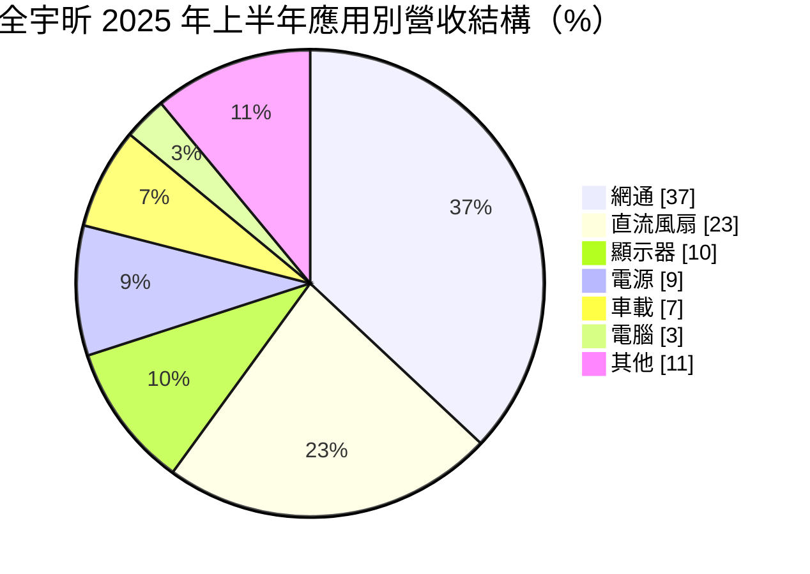
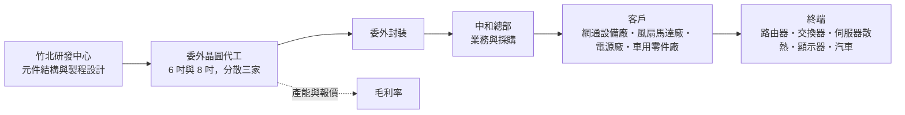
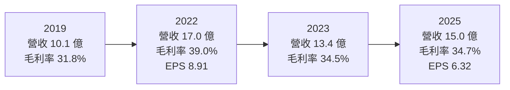
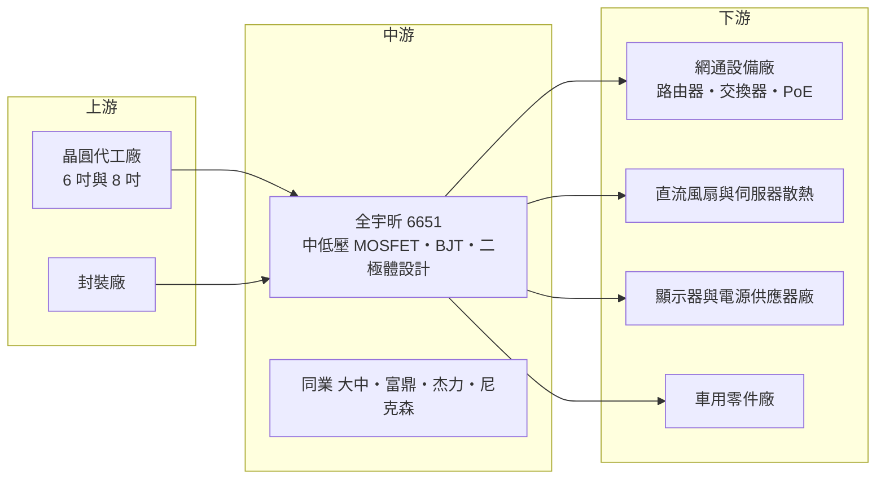

# 6651 全宇昕

> 上櫃｜[[產業索引-半導體業|半導體業]]｜上市（櫃）日期 2021/02/01

# 第一章：企業模式與商業藍圖

> [!info] 撰寫說明
> 本文由 Claude 依公開資料整理，架構比照 [[2330台積電]] 的四章研究，資料截至 2026-10-08。財務數字來源：Goodinfo 歷年經營績效與股利政策頁、富果研究 2025/08/29 法說會備忘錄、玉山證券 2026/07 產業文章、數位時代與工商時報 2021/01 報導、Yahoo 股市公司基本資料；產業描述為整理性內容，尚未逐條比對原始文件。#待校對

在評估單一個股的長期投資價值時，首要步驟是拆解企業的底層獲利邏輯。本章針對全宇昕科技（股票代號：6651，以下簡稱全宇昕）的商業模式進行定性分析，說明這家專注中低壓功率 MOSFET 的設計公司，如何在高度競爭的功率元件市場中維持多年獲利，以及它的成長來自哪裡。

## 一、核心定位：中低壓功率元件的設計公司

全宇昕成立於 2002 年，2021 年 2 月上櫃，是一家功率半導體元件設計公司，主要產品為 [[MOSFET]]，另有 [[BJT]] 與二極體。公司總部位於新北中和，負責業務與採購，研發中心位於新竹竹北。依 2021 年工商時報報導，總經理李徐華表示公司自成立以來每年都獲利，這在景氣循環明顯的功率元件產業中相當少見。

功率 MOSFET 是電子設備裡負責「開關電流」的元件，所有需要把電壓轉換、驅動馬達或控制電源的地方都會用到。它和處理器這類邏輯晶片不同，不追求最先進的製程，而是講究在特定電壓與電流下，如何降低[[導通電阻]]、減少發熱與損耗。全宇昕的產品集中在 60 至 200V 的中低壓範圍（依 2021 年數位時代報導），屬於網通設備、風扇馬達、顯示器與電源供應器最常用的規格。

全宇昕採 [[Fabless]] 型態經營：公司負責元件結構設計與製程參數開發，晶圓委由晶圓代工廠生產。依 2021 年報導，公司把訂單分散給三家晶圓代工廠，主要使用 6 吋與 8 吋晶圓。這種模式讓公司不需承擔工廠折舊，但在晶圓產能吃緊時，必須靠長期合作關係爭取產能。

## 二、終端應用／產品板塊：網通與直流風扇為兩大支柱

依產品別，2025 年上半年 MOSFET 占營收 85%、BJT 8%、二極體 6%。依應用別則以網通與直流風扇為兩大支柱：

* **網通（37%）：** 路由器、交換器與乙太網路供電（[[PoE]]）設備都需要 MOSFET 處理電源轉換。依 2021 年報導，每台網通交換器需要 4 至 6 顆 MOSFET。網通比重從 2024 年的 30% 提升到 37%，是近年成長最快的領域。
* **直流風扇（23%）：** 用於伺服器、電腦、家電的散熱風扇馬達驅動。公司強化 [[SGT]] P 型 MOSFET 產品線，目標鞏固在直流無刷風扇市場的地位。
* **顯示器（10%）與電源（9%）：** 顯示器背光與電源供應器的電壓轉換，比重從 2024 年的 14% 下滑到 10%。
* **車載（7%）：** 依 2021 年報導，主要用於汽車點火器、發電機內部控制線路與電壓調節器。

銷售區域方面，亞洲約占七成，台灣內銷約三成。客戶涵蓋中國、日本、台灣與歐美品牌，2021 年報導曾提及的客戶包括中國車用零件廠云意電氣與電子製造服務廠環旭電子。

## 三、資本轉化邏輯（營運模式）：設計加委外製造的輕資產模式

全宇昕的獲利模式可以拆成兩個環節。第一是設計附加價值：功率 MOSFET 雖然是標準化程度較高的元件，但不同的元件結構（例如溝槽式、遮蔽閘溝槽式 SGT）會帶來不同的導通電阻與切換效率，設計能力決定了產品在同規格下能否更省電、更小。第二是供應鏈管理：公司不擁有工廠，因此能否在晶圓代工產能吃緊時拿到產能、在報價上漲時轉嫁給客戶，直接影響毛利率。

2021 年的經驗是一個好例子。當時 6 吋與 8 吋晶圓產能全面吃緊，晶圓代工廠從 2020 年第四季開始漲價，全宇昕先吸收成本，再於 2021 年第一季起針對低毛利產品線調漲售價 5% 至 15%，並要求客戶提供半年期訂單預測以預約產能。結果 2021 年毛利率從 30.4% 提升到 35.8%，EPS 從 4.17 元增加到 7.77 元。這說明在供給吃緊時，具備長期代工關係的設計公司能把成本壓力轉為獲利機會。

## 四、企業長期藍圖：SGT、P 型元件與第三代半導體

全宇昕在 2025 年法說會提出的技術方向包括：

* **SGT N 型 MOSFET：** 第三代製程已導入顯示器與網通市場。SGT 結構能在相同晶片面積下降低導通電阻，是中低壓 MOSFET 的主流升級方向。
* **SGT P 型 MOSFET：** 2025 年已完成 40V 第一代製程，擴展到各應用領域。P 型元件在電路設計上可以簡化驅動，常用於風扇與負載開關，是公司在直流無刷風扇市場的利基。
* **[[SiC]] 與 [[GaN]]：** 碳化矽仍在開發階段；2021 年報導也提到公司研發氮化鎵製程。第三代半導體能進入更高電壓、更高效率的應用，但需要長期投入。

另外，依 2026 年玉山證券文章，在 AI 資料中心需求帶動下，MOSFET 因大量消耗 8 吋成熟製程產能，成為本輪漲價中最先缺貨的品項之一。全宇昕以網通與伺服器散熱為主要應用，屬於這一波需求的間接受惠者。

# 第二章：護城河深度與競爭優勢

在長期價值投資中，「護城河」指企業抵禦競爭、維持超額利潤的保護機制。本章分析全宇昕的競爭優勢來源、台灣與國際主要對手，以及這些優勢在功率元件價格循環中能守住多少。

## 一、護城河的核心組成要素

全宇昕的護城河屬於「窄護城河」，主要由以下三個要素組成：

* **1. 細分市場的產品專注：** 公司把資源集中在 60 至 200V 中低壓產品，並深耕網通、直流風扇等應用。專注讓公司能針對特定客戶需求快速開發規格，在大廠不重視的細分市場中建立份額。直流風扇的 P 型 MOSFET 就是這種利基策略的代表。
* **2. 長期代工關係與產能取得：** 功率元件設計公司最怕的是缺貨時拿不到晶圓。全宇昕與代工廠合作多年、分散三家，2021 年產能吃緊時仍能取得比前一年更多的產能。這種供應鏈韌性在景氣好時會轉化為市占與獲利。
* **3. 客戶驗證帶來的黏著度：** 網通、車用與工業客戶導入 MOSFET 時需要驗證規格與可靠度，一旦採用便會持續下單多年。全宇昕自成立以來每年獲利，代表其客戶基礎具備一定穩定性。

## 二、全球主要競爭對手格局

| 對手 | 定位 | 對全宇昕的威脅 |
|---|---|---|
| [[6435大中]] | 台灣中低壓 MOSFET 設計公司 | 產品與客戶群高度重疊 |
| [[8261富鼎]] | 台灣 MOSFET 設計公司，主板與顯卡比重高 | 在電腦與電源應用競爭 |
| [[5299杰力]] | 台灣 MOSFET 設計公司，筆電比重高 | 在消費性電子應用競爭 |
| [[3317尼克森]] | 台灣功率元件設計公司 | 在網通與電源應用競爭 |
| 英飛凌、安森美等國際大廠 | 全球功率元件龍頭，產品線完整、自有晶圓廠 | 在車用與高階工業市場占優勢 |
| 中國大陸 MOSFET 廠 | 政策支持、本土需求大 | 在中國市場以價格競爭 |

註：表中同業依玉山證券 2026 年文章所列同族群公司與產業結構整理，各公司與全宇昕的實際重疊程度為推估。

## 三、優勢轉化：守得住／守不住／觀察重點

* **守得住：** 網通與直流風扇這兩個公司已深耕多年的應用。網通設備的升級（Wi-Fi、5G、PoE）與伺服器散熱需求，提供穩定的成長基礎；客戶黏著度也較高。
* **守不住：** 顯示器、電腦等消費性應用。這些市場價格敏感，中國同業擴產後報價壓力大，顯示器比重已從 14% 降到 10%，顯示公司在這些領域的競爭力相對有限。
* **觀察重點：** 第一是 SGT 產品占比能否持續提升，這代表公司能否從標準品往高效率產品移動；第二是車載比重能否從 7% 提升，車用認證門檻高、生命週期長；第三是第三代半導體能否從研發走向量產。

# 第三章：財務體質與盈利規模

資料日期：2026-10-08。數字取自 Goodinfo 歷年經營績效與股利政策頁、富果研究法說會備忘錄，表格是撰寫當時的快照；最新月營收、毛利率、累計 EPS 由自動排程寫在本筆記的屬性欄位（月營收、毛利率、累計EPS 等）。#待校對

財務報表是檢驗護城河是否真實存在的最終標準。本章用多年度的三率、ROE、股利與資本報酬，檢視全宇昕在功率元件景氣循環中的獲利品質。

## 一、獲利能力的基石：三率

| 年度 | 營收（新台幣） | [[毛利率]] | [[營業利益率]] | EPS（元） | [[ROE]] |
|---|---|---|---|---|---|
| 2019 | 10.1 億 | 31.8% | 12.5% | 3.59 | 22.4% |
| 2020 | 11.9 億 | 30.4% | 13.8% | 4.17 | 23.9% |
| 2021 | 16.3 億 | 35.8% | 19.7% | 7.77 | 33.5% |
| 2022 | 17.0 億 | 39.0% | 20.5% | 8.91 | 28.8% |
| 2023 | 13.4 億 | 34.5% | 17.1% | 5.48 | 16.4% |
| 2024 | 14.5 億 | 35.4% | 18.7% | 8.22 | 23.2% |
| 2025 | 15.0 億 | 34.7% | 19.0% | 6.32 | 17.0% |

* **[[毛利率]]：** 7 年間毛利率維持在 30% 至 39% 之間，即使 2023 年營收下滑超過兩成，毛利率仍有 34.5%。對一家不擁有工廠、產品又屬於競爭激烈的功率元件公司而言，這是相當穩定的表現，代表產品組合與客戶結構具備一定的定價能力。
* **[[營業利益率]]：** 2021 年起穩定在 17% 至 21%，顯示公司費用控制良好。營業利益率在景氣谷底的 2023 年仍有 17.1%，說明公司沒有在景氣好時過度擴張人力與費用。
* **業外與匯率：** 2025 年上半年營收 7.99 億元、毛利率約 35% 至 36%，本業成長明顯，但約 6,000 萬元的匯兌損失使稅後淨利降到 8,510 萬元、EPS 2.46 元。公司表示不使用複雜避險工具，而是把現金約一半放台幣、一半放美元，因此匯率波動會直接反映在淨利上。

## 二、[[ROE]]：資本效率

以 2021 至 2025 年計算，近 5 年平均 ROE 約 23.8%（推算：33.5、28.8、16.4、23.2、17.0 的簡單平均），即使在 2023 年景氣谷底也有 16.4%。對一家幾乎不使用財務槓桿的公司來說，長期 ROE 維持在 15% 以上，代表本業本身就有很強的資本報酬能力。

營收方面，2019 年 10.1 億元到 2025 年 15.0 億元，6 年年複合成長率約 6.8%（推算）。成長速度不快，但穩定，且每一年都獲利。

## 三、資本支出與自由現金流

* **資本支出：** 全宇昕不擁有晶圓廠，主要資本支出為研發設備與辦公場所，本次未查得逐年金額，依營運模式判斷占營收比重低（推估）。
* **現金股利：** Goodinfo 資料顯示，股利所屬年度 2019 至 2025 年現金股利依序為 1、3、4、6、4、7、4 元。公司在 2025 年法說會表示，若無重大資本支出，傾向維持七成以上的發放率；2023 與 2024 年配息率分別約 73% 與 85%，2025 年 4 元約占 EPS 6.32 元的 63%。股利隨獲利波動，但從未中斷。
* **自由現金流：** 輕資產模式加上高配息率，推估長期自由現金流為正（逐年數字未查得）。

## 四、[[ROIC]] 與 [[WACC]]：價值創造利差

**ROIC 推算：** 全宇昕幾乎沒有有息負債（本次未查得借款數字，依高配息與輕資產模式推估），因此以股東權益作為投入資本近似值。2025 年營業利益約 2.85 億元（15.0 億 × 19.0%），以 20% 稅率計算稅後約 2.28 億元；股東權益以淨利 2.18 億 ÷ ROE 17.0% 推得約 12.8 億元，ROIC 推算約 18%。2021 至 2022 年營業利益率超過 19%、ROE 近三成，ROIC 推算約在 25% 至 30%。

**WACC 推算：** 採 CAPM，台灣 10 年期公債殖利率取 1.75%，市場風險溢酬 6%，β 取功率元件設計中小型股常見值約 1.2（未查得來源數字），股東權益成本約 1.75% + 1.2 × 6% = 8.95%。由於幾乎沒有有息負債，WACC 推算約 9%。

**結論：** 全宇昕的 ROIC 長期約在 18% 至 30%，比約 9% 的 WACC 高出 9 至 20 個百分點，是持續創造價值的企業。關鍵在於輕資產模式與穩定的營業利益率：公司不需大量資本投入就能維持營收成長，賺到的錢又以高比例發還股東。長期風險在於，若功率元件產業出現長期價格戰，營業利益率被壓到 10% 以下，ROIC 與 WACC 的利差才會明顯縮小。

# 第四章：總體風險與地緣政治

任何企業都無法脫離宏觀環境獨立存在。本章分析全宇昕長期必須面對的地緣政治、產業週期、營運與技術風險。

## 一、地緣政治

全宇昕約七成營收來自亞洲，客戶包括中國大陸品牌與製造商。中美科技競爭下，中國推動功率元件國產化，中國客戶可能逐步轉向本土 MOSFET 供應商，這是長期的市占風險。另一方面，美國對中國製產品加徵關稅，也促使部分客戶把生產移出中國，台灣設計、台灣製造的元件反而有機會成為非中國供應鏈的選項。公司晶圓委由台灣代工廠生產（推估），也面臨與其他台灣半導體廠相同的兩岸風險。

## 二、產業週期與市場結構

功率元件是典型的景氣循環產業，週期通常跟著晶圓代工產能與下游庫存波動。2021 至 2022 年缺貨時，報價與毛利率同步上升；2023 年下游庫存調整，營收年減約兩成。玉山證券 2026 年文章指出，AI 資料中心帶動 8 吋成熟製程產能吃緊，MOSFET 成為最先缺貨的品項之一，可能開啟新一輪漲價循環。投資人應理解，這類循環有上行就有下行，長期價值取決於公司在谷底時能否維持獲利，而全宇昕過去的紀錄在這方面相對良好。

## 三、營運環境的隱性風險

* **匯率：** 公司以美元計價銷售，又刻意持有約一半美元現金，2025 年上半年匯損約 6,000 萬元，使 EPS 年減約四成。這種會計波動不影響本業競爭力，但會造成短期獲利大幅起伏。
* **晶圓產能依賴：** 不擁有工廠，晶圓代工產能吃緊時可能無法滿足所有訂單；代工廠調漲價格時，若無法即時轉嫁，毛利率會受壓。
* **客戶與應用集中：** 網通與直流風扇合計占六成營收，這兩個市場的需求變化會直接影響公司營收。
* **規模：** 年營收約 15 億元，在研發資源上無法與國際大廠相比，新技術（如碳化矽）的開發速度可能落後。

## 四、科技或法規演進

功率元件的長期技術趨勢是更高效率與更高功率密度：資料中心電源往高壓直流架構演進、電動車與儲能需要更高電壓的元件，碳化矽與氮化鎵的滲透率會逐步提升。全宇昕目前以矽基中低壓 MOSFET 為主，在 SGT 等矽基技術上持續升級，但第三代半導體仍在開發階段。如果未來中低壓市場也被氮化鎵等新材料大量取代，公司需要及時轉型；反之，若矽基中低壓 MOSFET 仍維持主流，公司的專注策略將持續有效。各國能源效率法規趨嚴，則會提高高效率元件的需求，對所有功率元件廠都是長期助力。

# 專有名詞解析

## 半導體

- **[[MOSFET]]**：金屬氧化物半導體場效電晶體，功率 MOSFET 負責在電路中快速開關電流，是電源轉換與馬達驅動的核心元件。
- **[[BJT]]**：雙極性接面電晶體，較早期的電晶體結構，成本低，仍用於部分小功率放大與開關電路。
- **[[SGT]]**：遮蔽閘溝槽式 MOSFET，在溝槽中加入遮蔽電極，可在相同面積下降低導通電阻與切換損耗。
- **[[導通電阻]]**：MOSFET 導通時本身的電阻值，數值越低代表發熱與能量損失越少，是功率元件最重要的規格之一。
- **[[Fabless]]**：無晶圓廠的 IC 設計公司，只負責設計與銷售，製造委由晶圓代工廠與封測廠。
- **[[SiC]]**：碳化矽，一種第三代半導體材料，耐高壓、耐高溫、切換損耗低，用於電動車、充電樁與資料中心電源。
- **[[GaN]]**：氮化鎵，一種第三代半導體材料，切換速度快、體積小，常用於快充與高頻電源。

## 應用

- **[[PoE]]**：乙太網路供電，透過網路線同時傳輸資料與電力，常用於監視器、無線基地台與網路電話。
- **[[BLDC]]**：無刷直流馬達，以電子電路取代碳刷換向，效率高、壽命長，廣泛用於風扇、家電與伺服器散熱。

## 金融

- **[[配息率]]**：現金股利占每股盈餘的比例，反映公司把獲利發還股東的程度。
- **[[匯兌損失]]**：外幣資產或收入在本國貨幣升值時換算價值減少所產生的損失，屬業外項目。

## 產業

- **[[8 吋晶圓]]**：直徑 200 毫米的晶圓，多用於功率元件、類比與感測器等成熟製程產品。

# 核心供應鏈

## 1. 上游：晶圓代工與封裝
- 晶圓代工：公司分散委託三家晶圓代工廠，以 6 吋與 8 吋晶圓為主（依 2021 年報導，代工廠名稱未揭露）
- 封裝：委外封裝廠（未具名）

## 2. 中游：全宇昕本身與同業
- 台灣同業：[[6435大中]]、[[8261富鼎]]、[[5299杰力]]、[[3317尼克森]]
- 國際同業：英飛凌、安森美等功率元件大廠

## 3. 下游：主要客戶群
- 電子製造服務：環旭電子（依 2021 年報導）
- 車用零件：云意電氣（依 2021 年報導）
- 網通設備、直流風扇、顯示器與電源供應器製造商（未具名）

## 最新新聞
<!-- news:start -->
<!-- news:end -->

## 相關連結
- [公開資訊觀測站](https://mopsov.twse.com.tw/mops/web/t05st03?step=1&firstin=1&co_id=6651)
- [Goodinfo](https://goodinfo.tw/tw/StockDetail.asp?STOCK_ID=6651)
- [Yahoo 股市](https://tw.stock.yahoo.com/quote/6651)
- [鉅亨網新聞](https://www.cnyes.com/twstock/6651/news)
