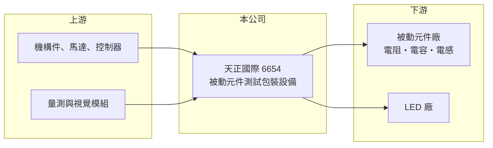

# 6654 天正國際

> 上櫃｜[[產業索引-其他電子業|其他電子業]]｜上市（櫃）日期 2018/10/23

# 第一章：企業模式與商業藍圖

> [!info] 撰寫說明
> 精簡版，由 Claude 依公開資料整理，架構比照 [[2330台積電]]，資料截至 2026-10-07。來源：winvest 天正國際 2026 年 6、7 月營收快訊。公開資料有限。#待校對

天正國際精密機械成立於 2012 年，2018 年掛牌，專做[[被動元件]]後段的測試包裝設備。

- **核心業務：** 開發製造電阻、電容與電感的測試包裝機、電感層間耐壓測試機、LED 分選機與打孔機，以及客製化機械自動化設備。
- **營收結構：** 公開資料未列出產品別比重，以被動元件測試包裝設備為主（推估）。
- **營運據點：** 以台灣為主，資本額約 4.1 億元。
- **長期方向：** 隨 AI 伺服器帶動高階 [[MLCC]] 與電感需求，擴大新設備出貨。

# 第二章：護城河深度與競爭優勢

天正的競爭力在被動元件後段設備的專業化，但規模小、受客戶擴產節奏牽動。

- **競爭優勢：** 專注被動元件測試與包裝，能依不同元件尺寸與規格客製設備，並跨足電感耐壓測試等利基機種。
- **主要對手：** [[6187萬潤]] 等台灣自動化設備廠，以及日系被動元件設備商。
- **觀察重點：** 2026 年營收倍增能否轉化為獲利，第一季仍虧損，需觀察下半年毛利率。

# 第三章：財務體質與盈利規模

資料日期：2026-10-07，以下數字是撰寫當時的快照；最新月營收、毛利率、累計 EPS 由自動排程寫在本筆記的屬性欄位（月營收、毛利率、累計EPS 等）。#待校對

天正 2026 年營收大幅成長，但獲利尚未跟上。

- **營收規模：** 2026 年 7 月營收 9,054.7 萬元、年增 203.54%，1 至 7 月累計 4.18 億元、年增 116.79%，公司說明是客戶需求增加與新設備出貨。
- **獲利：** 2025 年全年 EPS 0.01 元；2026 年第一季 EPS -0.2 元。
- **財務特色：** 市值約 73 億元，明顯高於目前獲利水準，股價反映的是市場對被動元件設備需求的預期。

# 第四章：總體風險與地緣政治

天正的風險在於訂單集中與被動元件景氣循環。

- **產業週期：** 被動元件是典型的景氣循環產業，客戶擴產停止時設備訂單會迅速減少。
- **營運風險：** 客戶集中在少數被動元件廠，新機種開發與交機驗收時點影響獲利。
- **其他風險：** 被動元件廠多在中國設廠，兩岸關係與出口管制可能影響出貨。

# 專有名詞解析

## 產業

- **[[被動元件]]**：電阻、電容、電感等不需外部電源就能運作的基礎電子元件。
- **[[MLCC]]**：積層陶瓷電容，用量最大的被動元件，AI 伺服器每台用量遠高於一般伺服器。
- **[[自動化設備]]**：以機械、感測與控制系統取代人工完成搬運、組裝或檢測的生產設備。

# 核心供應鏈

- 上游：機構件、馬達、控制器與量測模組供應商（推估）
- 下游／客戶：被動元件廠，如 [[2327國巨]]、[[2492華新科]] 等（推估，客戶名單未查得）
- 同業：[[6187萬潤]]

## 最新新聞
<!-- news:start -->
<!-- news:end -->

## 相關連結
- [公開資訊觀測站](https://mopsov.twse.com.tw/mops/web/t05st03?step=1&firstin=1&co_id=6654)
- [Goodinfo](https://goodinfo.tw/tw/StockDetail.asp?STOCK_ID=6654)
- [Yahoo 股市](https://tw.stock.yahoo.com/quote/6654)
- [鉅亨網新聞](https://www.cnyes.com/twstock/6654/news)
