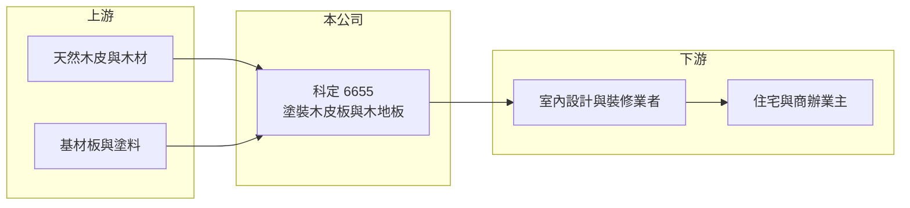

# 6655 科定

> 上市｜[[產業索引-其他業|其他業]]｜上市（櫃）日期 2018/11/28

# 第一章：企業模式與商業藍圖

> [!info] 撰寫說明
> 精簡版，由 Claude 依公開資料整理，架構比照 [[2330台積電]]，資料截至 2026-10-07。來源：nstock.tw 科定公司概況、winvest.tw 營收快訊。公開資料有限，產品與地區別比重、營運據點本次未查到。#待校對

科定是以[[塗裝木皮板]]為主的室內裝修建材廠，2018 年 11 月掛牌上市。

- **核心業務：** 科定製造與銷售塗裝木皮板、環保批批板、木地板及其他木材相關產品與塑膠製品。
- **營收結構：** 本次未查到產品或地區別比重；2025 年全年營收 26 億元，2026 年 1 至 8 月累計 21.02 億元，年增 27.9%。
- **營運據點：** 生產與銷售據點本次未查到，本文不推測。
- **長期方向：** 以免上漆、施工快速的預塗裝建材切入室內裝修市場，2026 年營收連月雙位數年增，顯示需求回溫。

# 第二章：護城河深度與競爭優勢

科定的優勢在於高毛利的品牌建材定位。

- **競爭優勢：** 2026 年第二季[[毛利率]]近五成，遠高於一般建材，顯示產品具設計與品牌溢價（推估）。
- **主要對手：** 國內外木皮板、系統板材與木地板廠商，本次未查到具體上市同業。
- **觀察重點：** 營收成長能否延續、毛利率是否守住，以及費用率能否下降帶動[[營業利益率]]提升。

# 第三章：財務體質與盈利規模

資料日期：2026-10-07，以下數字是撰寫當時的快照；最新月營收、毛利率、累計 EPS 由自動排程寫在本筆記的屬性欄位（月營收、毛利率、累計EPS 等）。#待校對

科定 2026 年營收與獲利同步成長。

- **營收規模：** 2026 年 7 月營收 3.07 億元、年增 32.73%；8 月 2.88 億元、年增 30.19%；1 至 8 月累計 21.02 億元。2025 年全年營收 26 億元。
- **獲利：** 2026 年第二季 EPS 1.67 元、年增 87.64%，上半年累計 2.62 元；第二季毛利率 49.36%、營業利益率 16.94%、淨利率 16.09%。2025 年全年 EPS 3.92 元。
- **財務特色：** 資本額約 8.06 億元；2025 年度配發現金股利 4.8 元，近五年平均現金股利 7.8 元，配息政策大方。

# 第四章：總體風險與地緣政治

科定的風險來自房市與裝修景氣。

- **產業週期：** 室內裝修需求跟隨房市交屋量與商辦裝修景氣，房市降溫會拖累建材銷售。
- **營運風險：** 高毛利來自品牌與設計，若同業推出低價替代品，價格壓力會侵蝕毛利；費用率偏高使營益率遠低於毛利率。
- **其他風險：** 木材原料價格與供應、森林資源相關法規，以及外銷市場的匯率風險（推估）。

# 專有名詞解析

## 金融

- **[[毛利率]]**：毛利占營收的比例，反映產品定價能力與成本控制。
- **[[營業利益率]]**：營業利益占營收的比例，反映本業扣除費用後的獲利能力。

## 產業

- **[[塗裝木皮板]]**：在基材表面貼上天然木皮並預先完成塗裝的板材，現場施工不需再上漆。
- **[[預塗裝建材]]**：出廠前已完成表面塗裝的建材，可縮短工期並減少現場油漆污染。

# 核心供應鏈

- 上游：木皮、木材、基材板與塗料供應商（推估）
- 下游／客戶：室內設計公司、裝修業者與建案業主，客戶名稱未揭露
- 同業：國內外木皮板、系統板材與木地板廠商

## 最新新聞
<!-- news:start -->
<!-- news:end -->

## 相關連結
- [公開資訊觀測站](https://mopsov.twse.com.tw/mops/web/t05st03?step=1&firstin=1&co_id=6655)
- [Goodinfo](https://goodinfo.tw/tw/StockDetail.asp?STOCK_ID=6655)
- [Yahoo 股市](https://tw.stock.yahoo.com/quote/6655)
- [鉅亨網新聞](https://www.cnyes.com/twstock/6655/news)
