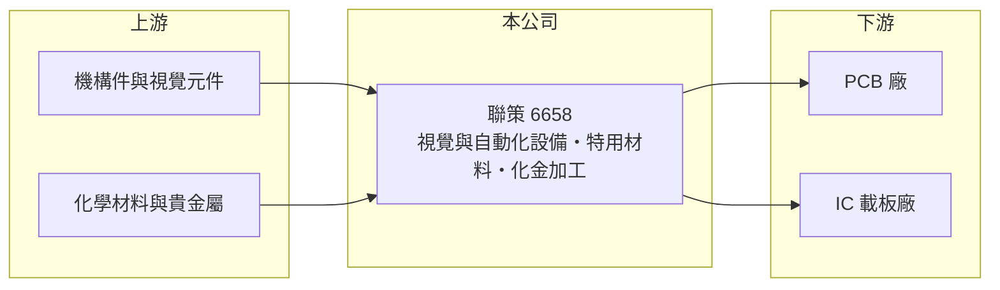

# 6658 聯策

> 上市｜[[產業索引-其他電子業|其他電子業]]｜上市（櫃）日期 2023/11/02

# 第一章：企業模式與商業藍圖

> [!info] 撰寫說明
> 精簡版，由 Claude 依公開資料整理，架構比照 [[2330台積電]]，資料截至 2026-10-07。來源：winvest 聯策 2026 年 7 月營收快訊、nStock 聯策公司簡介。#待校對

聯策科技成立於 2002 年，2023 年 11 月上市，主要服務 [[PCB]] 與載板產業的設備與材料需求。

- **核心業務：** 提供視覺檢測與自動化設備、特用材料，並經營印刷電路板[[化金]]加工業務。
- **營收結構：** 公開資料歸類為視覺與自動化設備、特用材料及其他三類，具體比重待查。
- **營運據點：** 以台灣為主，資本額約 3.64 億元。
- **長期方向：** 隨 AI 伺服器帶動高階 PCB 與 [[ABF載板]] 擴產，擴大設備出貨。

# 第二章：護城河深度與競爭優勢

聯策同時有設備、材料與加工服務，能從不同環節服務 PCB 客戶。

- **競爭優勢：** 設備與材料搭配銷售，加上化金加工服務，與 PCB 客戶的接觸點較多，有助於拿到擴產訂單（推估）。
- **主要對手：** PCB 設備同業 [[6664群翊]]、[[2467志聖]]、[[3455由田]]、[[6438迅得]]。
- **觀察重點：** 2026 年獲利大幅成長能否延續，以及設備交貨時程帶來的月營收波動。

# 第三章：財務體質與盈利規模

資料日期：2026-10-07，以下數字是撰寫當時的快照；最新月營收、毛利率、累計 EPS 由自動排程寫在本筆記的屬性欄位（月營收、毛利率、累計EPS 等）。#待校對

聯策 2026 年獲利明顯跳升，已超過 2025 年全年。

- **營收規模：** 2026 年 7 月營收 1.99 億元、年增 128.19%，1 至 7 月累計 15.23 億元、年增 17.82%；8 月營收 2.08 億元、年增 104.05%。
- **獲利：** 2025 年全年 EPS 1.38 元；2026 年第一季 EPS 1.63 元，上半年累計 3.05 元，第二季[[毛利率]] 23.22%、營業利益率 9.37%。
- **財務特色：** 2025 年配息 1.08 元，現金配發率 99.5%，配息政策大方。

# 第四章：總體風險與地緣政治

聯策的風險與 PCB 擴產週期高度相關。

- **產業週期：** 設備需求依賴 PCB 與載板廠擴產，AI 需求降溫時訂單可能快速下滑。
- **營運風險：** 營收依客戶交貨時程認列，單月與單季波動大。
- **其他風險：** 化金加工使用貴金屬，金價波動影響成本；客戶海外設廠帶來匯率與關稅風險。

# 專有名詞解析

## 半導體

- **[[ABF載板]]**：使用味之素增層膜的高階 IC 載板，用於 CPU、GPU 與 AI 晶片的封裝。

## 金融

- **[[毛利率]]**：毛利除以營收，反映產品售價扣除直接成本後的獲利空間。

## 產業

- **[[PCB]]**：印刷電路板，承載並連接電子零件的基板，是所有電子產品的基礎零組件。
- **[[化金]]**：在電路板銅墊表面鍍上鎳與金，防止氧化並提升焊接可靠度的表面處理製程。

# 核心供應鏈

- 上游：機構件、視覺元件、化學材料與貴金屬供應商（推估）
- 下游／客戶：PCB 與 IC 載板廠（具體客戶名單待查）
- 同業：[[6664群翊]]、[[2467志聖]]、[[3455由田]]、[[6438迅得]]

## 最新新聞
<!-- news:start -->
<!-- news:end -->

## 相關連結
- [公開資訊觀測站](https://mopsov.twse.com.tw/mops/web/t05st03?step=1&firstin=1&co_id=6658)
- [Goodinfo](https://goodinfo.tw/tw/StockDetail.asp?STOCK_ID=6658)
- [Yahoo 股市](https://tw.stock.yahoo.com/quote/6658)
- [鉅亨網新聞](https://www.cnyes.com/twstock/6658/news)
