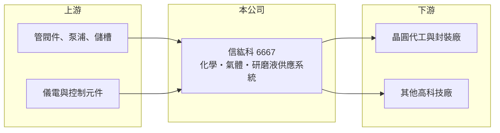

# 6667 信紘科

> 上櫃｜[[產業索引-其他電子業|其他電子業]]｜上市（櫃）日期 2018/11/13

# 第一章：企業模式與商業藍圖

> [!info] 撰寫說明
> 精簡版，由 Claude 依公開資料整理，架構比照 [[2330台積電]]，資料截至 2026-10-07。來源：winvest 信紘科 2026 年 8 月營收快訊、nStock 信紘科公司簡介。#待校對

信紘科於 2018 年 11 月上櫃，提供高科技廠製程附屬設備與[[廠務工程]]的系統整合。

- **核心業務：** 設計、製造與安裝[[化學品供應系統]]、氣體供應系統、[[CMP]] 研磨液供應系統、氣液混合設備與儀電控制系統，另提供製程機能水與特殊廢液處理。
- **營收結構：** 公開資料未列出產品別比重；營收依產品組合與案件進度認列。
- **營運據點：** 以台灣為主，資本額約 4.93 億元。
- **長期方向：** 跟隨晶圓廠先進製程與先進封裝擴產，擴大系統整合與廢液處理業務。

# 第二章：護城河深度與競爭優勢

信紘科的優勢在多種廠務系統的整合能力。

- **競爭優勢：** 同時具備化學品、氣體、研磨液與廢液處理系統，能提供客戶整合方案，客戶驗證後轉換成本高。
- **主要對手：** [[6613朋億]]、[[6725矽科宏晟]]，以及 [[2404漢唐]]、[[6196帆宣]] 等大型廠務工程商。
- **觀察重點：** 2026 年 8 月營收創新高後，下半年案件認列能否維持高檔。

# 第三章：財務體質與盈利規模

資料日期：2026-10-07，以下數字是撰寫當時的快照；最新月營收、毛利率、累計 EPS 由自動排程寫在本筆記的屬性欄位（月營收、毛利率、累計EPS 等）。#待校對

信紘科獲利穩定成長，配息率高。

- **營收規模：** 2026 年 8 月營收 8.02 億元創新高、年增 69.06%，1 至 8 月累計 44.73 億元、年增 10.53%。
- **獲利：** 2025 年全年 EPS 13.77 元；2026 年第二季 EPS 約 4.07 元，上半年 7.7 元、年增 14%；第二季[[毛利率]] 22.59%、淨利率 11.72%。
- **財務特色：** 2025 年度配發現金股利 11.71 元，近五年平均現金股利 6.78 元。

# 第四章：總體風險與地緣政治

信紘科的風險在半導體資本支出週期與專案執行。

- **產業週期：** 廠務系統需求來自晶圓廠擴產，資本支出放緩會影響新案。
- **營運風險：** 依案件進度認列，月營收波動大；客戶集中於少數晶圓廠。
- **其他風險：** 客戶海外擴廠帶來跨國施工、人力與匯率風險；環保法規趨嚴則同時是廢液處理業務的機會與成本。

# 專有名詞解析

## 半導體

- **[[CMP]]**：化學機械研磨，用研磨液與研磨墊把晶圓表面磨平，研磨液需專用供應系統輸送。

## 金融

- **[[毛利率]]**：毛利除以營收，反映產品售價扣除直接成本後的獲利空間。

## 產業

- **[[廠務工程]]**：晶圓廠、面板廠等的無塵室、氣體、化學品、水電等基礎設施工程。
- **[[化學品供應系統]]**：把酸、鹼、溶劑等製程化學品從儲槽經管路穩定輸送到生產機台的系統，需維持極高潔淨度。

# 核心供應鏈

- 上游：管閥件、泵浦、儲槽與儀電元件供應商（推估）
- 下游／客戶：晶圓代工、封裝與其他高科技廠（具體客戶名單待查）
- 同業：[[6613朋億]]、[[6725矽科宏晟]]、[[2404漢唐]]、[[6196帆宣]]

## 供應鏈關係
- 供應給 [[2330台積電]]：廠務供應系統與廢液處理（台積電供應鏈 › 上游：台灣建廠、無塵室與廠務系統）

## 最新新聞
<!-- news:start（自動產生，請勿手動編輯此範圍） -->
- 2026-10-07 📰 媒體 11:49｜《其他電》信紘科漲逾9%重返填權息路 登近3個半月高價｜[富聯網](https://news.google.com/rss/articles/CBMiiAFBVV95cUxQYlFjOTRScHFDTE5HcjV3ZGI0VVFGZTQwUTE1UWloU0o0b1h3WVVMdEgtekt1ekExeG04WXNqU2MycXVXbE5fdXdQTmlIaUFSRlR5RkozQl9zS2JSVGZSTE1TY0t6YlFtZFFHdU9WcDdTaGVIdC1KYzNXLTM3OEU3RE5rMlloVHFp?oc=5)
- 2026-10-06 📰 媒體 20:42｜焦點股》信紘科：突破盤整 帶量飆漲9％｜[自由時報](https://news.google.com/rss/articles/CBMiWEFVX3lxTE1oQXpaUEhOUGVKMzdXbEt2YTJtdmpBaGxKWmV2SDdUQm1vYzdTU0N1dVQ1SzVVa2hmMEszMFJMbXJCN0NsZ0pyZUtUdV9GRDJ6RWM2WVJhQnI?oc=5)

完整紀錄：[[6667信紘科 新聞]]
<!-- news:end -->

## 相關連結
- [公開資訊觀測站](https://mopsov.twse.com.tw/mops/web/t05st03?step=1&firstin=1&co_id=6667)
- [Goodinfo](https://goodinfo.tw/tw/StockDetail.asp?STOCK_ID=6667)
- [Yahoo 股市](https://tw.stock.yahoo.com/quote/6667)
- [鉅亨網新聞](https://www.cnyes.com/twstock/6667/news)
