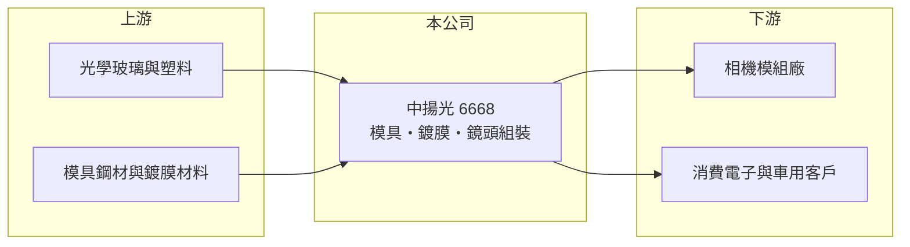

# 6668 中揚光

> 上市｜[[產業索引-光電業|光電業]]｜上市（櫃）日期 2018/12/12

# 第一章：企業模式與商業藍圖

> [!info] 撰寫說明
> 精簡版，由 Claude 依公開資料整理，架構比照 [[2330台積電]]，資料截至 2026-10-07。來源：nStock 中揚光公司簡介、winvest 營收快訊。#待校對

中揚光電從光學模具起家，延伸到鏡片鍍膜與數位鏡頭組裝，目前營收成長但仍處虧損。

- **核心業務：** 主要營業項目為[[精密模具]]製造與研發、數位[[光學鏡頭]]組裝，以及鏡片[[光學鍍膜]]。
- **營收結構：** 本次未查到產品別營收比重。
- **營運據點：** 公司 2013 年成立、2018 年上市，生產據點明細本次未查到。
- **長期方向：** 2026 年前 8 月營收年增 12.5%，公司仍在擴大鏡頭與鏡片業務規模，以攤提前期投資。

# 第二章：護城河深度與競爭優勢

中揚光的優勢在於從模具到鏡頭的垂直整合，但規模仍小，尚未轉化為穩定獲利。

- **競爭優勢：** 自製模具可縮短鏡片開發時間並掌握精度，鍍膜與組裝一條龍有利於接客製化訂單（推估）。
- **主要對手：** 光學鏡頭大廠 [[3008大立光]]、[[3406玉晶光]]，以及其他中小型光學廠如 [[6517保勝光學]]。
- **觀察重點：** 毛利率能否回升到足以支撐營業費用，以及營收成長能否帶動轉虧為盈。

# 第三章：財務體質與盈利規模

資料日期：2026-10-07，以下數字是撰寫當時的快照；最新月營收、毛利率、累計 EPS 由自動排程寫在本筆記的屬性欄位（月營收、毛利率、累計EPS 等）。#待校對

中揚光營收成長，但毛利率偏低使本業仍虧損。

- **營收規模：** 2025 年全年營收 11.66 億元；2026 年 1 至 8 月累計 7.9 億元，年增 12.5%；8 月營收 9,734.2 萬元，年減 1.1%。
- **獲利：** 2026 年第二季 EPS -0.22 元，上半年累計 EPS -0.83 元；第二季[[毛利率]] 16.63%、[[營業利益率]] -10.27%。
- **財務特色：** 近五年未配發現金股利，獲利改善前股東報酬主要取決於股價。

# 第四章：總體風險與地緣政治

中揚光的風險在於毛利率偏低與鏡頭產業的高度競爭。

- **產業週期：** 鏡頭需求跟隨手機、車用與安控等終端景氣，訂單易受[[長鞭效應]]放大。
- **營運風險：** 持續虧損會侵蝕資本，若營收擴張不如預期，可能需要再籌資。
- **其他風險：** 中國光學廠的價格競爭、光學玻璃等原料價格，以及匯率變動。

# 專有名詞解析

## 應用

- **[[光學鍍膜]]**：在鏡片表面鍍上薄膜，以降低反射、過濾特定波長或提高耐用度。

## 金融

- **[[毛利率]]**：營業毛利占營收的比例，反映產品的定價能力與成本控制。
- **[[長鞭效應]]**：終端需求的小幅變動沿供應鏈往上游傳遞時被逐級放大，造成上游庫存與訂單劇烈波動。

## 產業

- **[[精密模具]]**：製作鏡片、塑膠件或金屬件所用的高精度模具，決定產品的尺寸精度與良率。
- **[[光學鏡頭]]**：由多片鏡片組成、把影像聚焦到感測器上的元件。

# 核心供應鏈

- 上游：光學玻璃、光學塑料、模具鋼材與鍍膜材料供應商（推估）
- 下游／客戶：相機模組廠與消費電子、車用等終端客戶（推估）
- 同業：[[3008大立光]]、[[3406玉晶光]]、[[6517保勝光學]]

## 最新新聞
<!-- news:start -->
<!-- news:end -->

## 相關連結
- [公開資訊觀測站](https://mopsov.twse.com.tw/mops/web/t05st03?step=1&firstin=1&co_id=6668)
- [Goodinfo](https://goodinfo.tw/tw/StockDetail.asp?STOCK_ID=6668)
- [Yahoo 股市](https://tw.stock.yahoo.com/quote/6668)
- [鉅亨網新聞](https://www.cnyes.com/twstock/6668/news)
