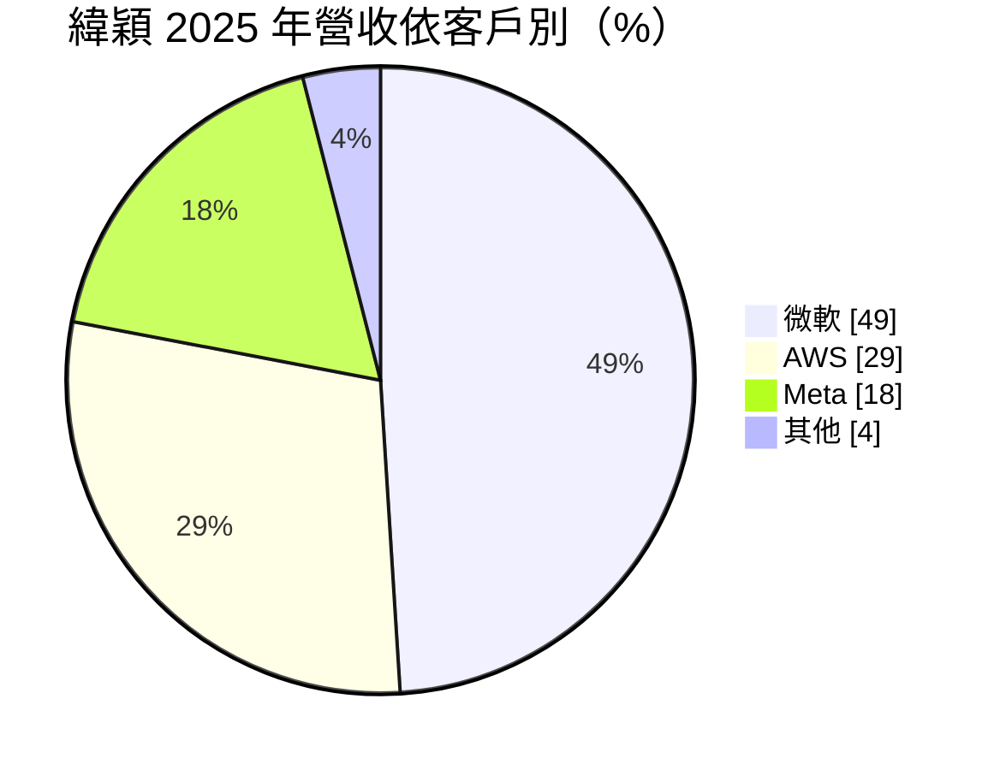
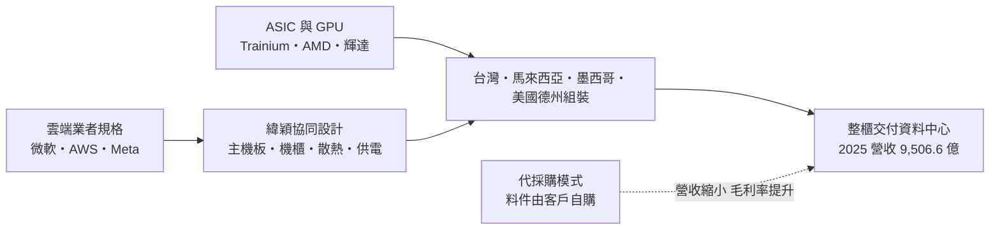
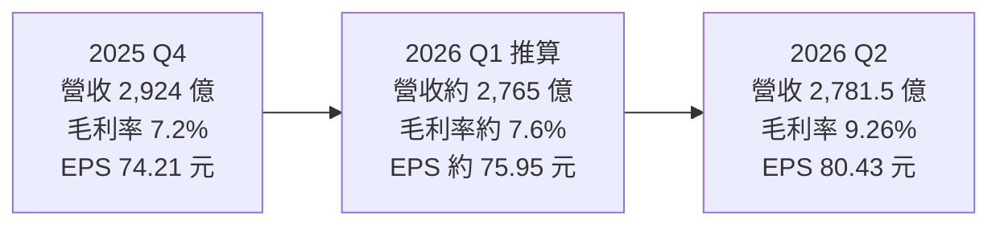
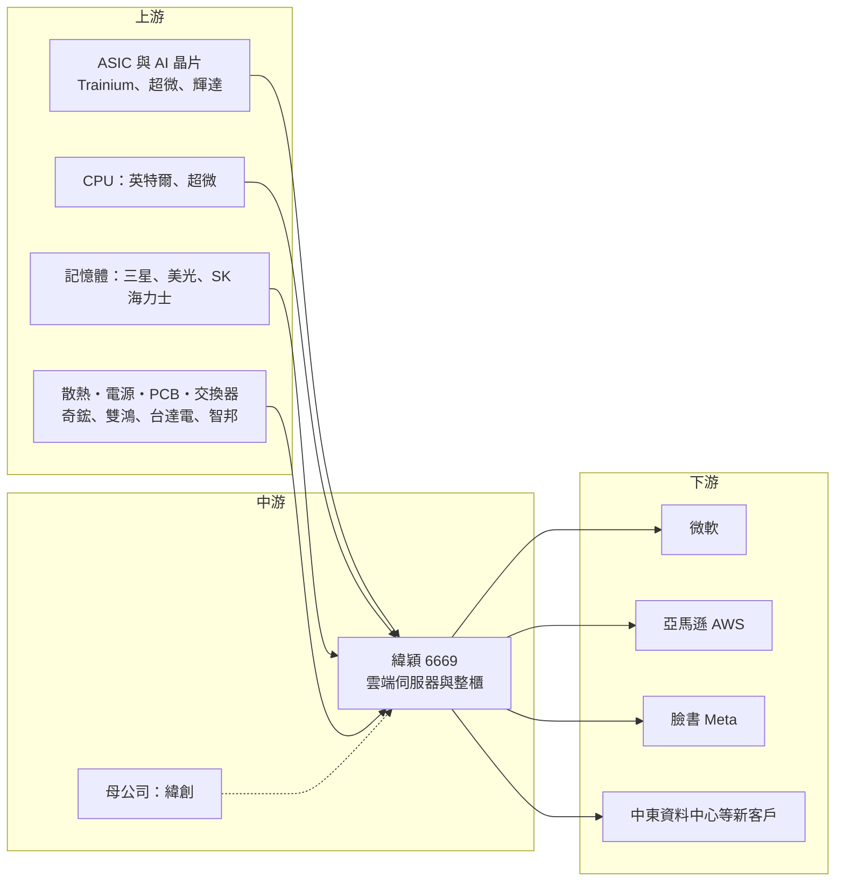

# 6669 緯穎

> 上市｜[[產業索引-電腦及週邊設備業|電腦及週邊設備業]]｜上市（櫃）日期 2019/03/27

# 第一章：企業模式與商業藍圖

> [!info] 撰寫說明
> 本文由 Claude 依公開資料整理，架構比照 [[2330台積電]] 的四章研究，資料截至 2026-10-07。財務數字來源：緯穎 2025 年第四季與 2026 年第二季法說會及財報報導（富果研究、優分析、科技新報、自由時報）、凱基證券 2026 年 7 月研究報告；產業描述為整理性內容，尚未逐條比對原始文件。#待校對

在評估單一個股的長期投資價值時，首要步驟是拆解企業的底層獲利邏輯。本章針對緯穎科技（股票代號：6669，以下簡稱緯穎）的商業模式進行定性分析，說明它為何能以極少數客戶撐起近兆元營收，以及在 AI 伺服器浪潮中，它押注雲端業者自研 [[ASIC]] 晶片的路線有何特殊之處。

## 一、核心定位：專做超大型雲端業者的資料中心伺服器

緯穎於 2012 年由 [[3231緯創]] 分拆成立，專門替超大型雲端服務業者（[[Hyperscaler]]）設計、製造資料中心用的伺服器、儲存設備與整櫃系統。和傳統 ODM 由品牌商轉單不同，緯穎直接面對雲端業者，參與規格制定，提供從主機板、伺服器、機櫃到散熱、供電的整套方案，也是 [[OCP]] 開放規格的重要參與者。

這個定位有兩個商業意義：

* **直接對接最終買家：** 不經品牌商轉手，能參與客戶下一代資料中心的設計，毛利率高於一般組裝同業。
* **客戶高度集中：** 依凱基證券 2026 年 7 月報告，2025 年 [[MSFT微軟]]、[[AMZN亞馬遜]]（AWS）、[[META臉書]] 三家合計約占營收 96%，任何一家的資本支出變化都會直接反映在緯穎的營收上。

## 二、產品與客戶板塊：通用伺服器打底，AI 伺服器以 ASIC 為主

依凱基證券報告，2025 年營收的客戶結構如下：

* **通用型伺服器：** 雲端業者的運算、儲存伺服器，2025 年約占一半營收。2026 年公司預估通用型伺服器出貨量成長 20% 至 30%，主因 AI 推論帶動 CPU 運算需求，以及舊機汰換。
* **AI 伺服器：** 2025 年約占一半營收，其中約九成為雲端業者自研 ASIC 晶片的伺服器，而非輝達 GPU 機種。最具代表性的是 AWS Trainium 系列，Trainium 3 伺服器於 2026 年 6 月開始出貨。凱基報告指出 2026 年第二季 AI 伺服器占比約 34%，預期第三季可望超過 50%。
* **新平台：** 法人報告提及 [[AMD超微]] 的 Helios 機櫃，預估 2027 年出貨量可達 4,000 至 5,000 櫃（屬券商預估）。
* **散熱與機櫃整合：** 緯穎自有[[液冷]]與[[浸沒式冷卻]]方案，配合高功率 AI 機櫃。

## 三、資本轉化邏輯：協同設計到整櫃交付

* **全球產能布局：** 緯穎在台灣、馬來西亞、墨西哥與美國設有生產與組裝據點。馬來西亞產線用來強化對中東等新市場的出貨；美國德州廠於 2025 年底開始提供產能，以因應關稅與在地化要求；墨西哥廠負責對北美雲端業者的就近組裝。
* **[[機櫃級整合]]：** 雲端業者偏好整櫃交付、到貨即上線，緯穎能交付含散熱、供電與網路的整櫃方案。
* **[[代採購模式]]：** 2026 年 4 月起部分客戶改採代採購，料件由客戶自購、不計入緯穎營收，營收數字會看起來放緩，但毛利率改善。

## 四、企業長期藍圖：擴大 ASIC 市占、分散客戶

* **深耕少數大客戶：** 擴大 ASIC 機櫃的市占，往機櫃級整合與液冷延伸。
* **分散客戶結構：** 引進 AMD 平台與中東資料中心等新客戶，凱基預估三大客戶比重 2027 年可能降至約 77%。
* **擴產與籌資：** 2026 年下半年董事會核准資本支出預算約 9.42 億美元（約新台幣 304 億元），主要投入電力設施、設備與土地廠房；並規劃發行最高 150 億元的無擔保[[可轉債]]，以及簽訂 15 億美元[[聯合授信]]，支應擴產與營運資金。

# 第二章：護城河深度與競爭優勢

在長期價值投資中，「護城河」指企業抵禦競爭、維持超額利潤的保護機制。本章分析緯穎與雲端業者深度綁定所形成的護城河、全球主要競爭對手，以及在客戶高度集中的情況下這些優勢能守住多少。

## 一、護城河的核心組成要素

緯穎的護城河屬於「中等偏窄」：與客戶的綁定很深，但客戶集中度極高，議價力仍在客戶手上。主要由四個要素組成：

* **1. 與雲端業者的深度協同設計：** 緯穎直接參與 Hyperscaler 的伺服器規格開發，從設計到量產的協作關係長達多年，轉換供應商需重新驗證整套機櫃，轉換成本高。
* **2. ASIC 伺服器的先行經驗：** AI 伺服器中 ASIC 機種約占九成，在 AWS Trainium 等自研晶片平台累積量產經驗，這是多數以輝達 GPU 為主的同業較少接觸的領域。
* **3. 機櫃級整合與液冷能力：** 能交付含散熱、供電與網路的整櫃方案，符合雲端業者整櫃交付的趨勢。
* **4. 多地生產：** 台灣、馬來西亞、墨西哥、美國同時具備產能。

## 二、全球主要競爭對手格局

| 對手 | 定位 | 對緯穎的威脅 |
|---|---|---|
| [[2382廣達]]（雲達科技） | 直接服務美系雲端業者 | 在 Meta、微軟、谷歌的伺服器與 AI 機櫃都有大量份額，是最直接的對手 |
| [[2317鴻海]] | 輝達 GB 系列整櫃最大供應商 | 積極爭取 [[CSP]] 的 ASIC 伺服器訂單 |
| [[2356英業達]]、[[4938和碩]] | 台灣伺服器 ODM | 在通用伺服器與部分 AI 專案競爭 |
| 美超微、Celestica | 美國與加拿大業者 | Celestica 在 ASIC 與網通機櫃與緯穎重疊 |

## 三、優勢轉化：哪些守得住、哪些守不住

* **守得住：** 已在量產中的 ASIC 平台，以及微軟、AWS 的長期專案。雲端業者通常不會在同一世代中途換供應商。
* **守不住：** 雲端業者每一世代都會重新分配訂單，且偏好多供應商策略；客戶也可以透過代採購模式掌握料件與成本，壓縮組裝廠的議價空間。
* **觀察重點：** Trainium 3 放量速度；AMD Helios 機櫃能否如期出貨；前三大客戶以外的新客戶貢獻；代採購模式擴大後營收與毛利率的變化。

# 第三章：財務體質與盈利規模

資料日期：2026-10-07。數字取自公司財報與法說會的財經媒體整理（富果研究、優分析），表格是撰寫當時的快照；最新月營收、毛利率、累計 EPS 由自動排程寫在本筆記的屬性欄位（月營收、毛利率、累計EPS 等）。#待校對

財務報表是檢驗護城河是否真實存在的最終標準。本章用三率、ROE、現金流與資本報酬，檢視緯穎在 AI 伺服器擴產期的獲利品質。

## 一、獲利能力的基石：三率

| 項目 | 2025 全年 | 2025 Q4 | 2026 Q1（推算） | 2026 Q2 |
|---|---|---|---|---|
| 營收（新台幣） | 9,506.6 億 | 2,924.4 億 | 約 2,765 億 | 2,781.5 億 |
| [[毛利率]] | 8.3% | 7.2% | 約 7.6% | 9.26% |
| [[營業利益率]] | 6.7% | 5.6% | 未查得 | 7.27% |
| 稅後淨利 | 511.2 億 | 未查得 | 約 141 億 | 149.7 億 |
| EPS（元） | 275.06 | 74.21 | 約 75.95 | 80.43 |

* **推算說明：** 2026 年第一季數字為上半年累計（營收 5,546.6 億元、毛利率 8.41%、營業利益率 6.79%、EPS 156.38 元）減去第二季後推算。
* **高成長：** 2025 年營收年增 163.7%、EPS 年增 117.3%。2026 年上半年營收年增 41.7%、淨利年增 32.7%。
* **毛利率回升：** 第二季毛利率回升至 9.26%，公司說明主要來自新產品導入，以及部分客戶自 4 月起改採代採購模式。
* **外部預估：** 凱基證券預估 2026 年營收約 1.36 兆元、EPS 約 370 元，非公司財測。

## 二、ROE：資本效率

緯穎資產周轉快、毛利率高於多數組裝同業，2025 年稅後[[淨利率]]約 5.4%，[[ROE]] 長期維持在高水準（確切數值未查得）。不過擴產加速，2026 年起資本支出與[[營運資金]]需求大幅上升，資本效率可能短期下滑。

## 三、資本支出、自由現金流與股利

* **[[CapEx]]：** 2025 年約 130 億元，公司表示 2026 年將顯著高於 2025 年；光是 2026 年下半年預算即約 9.42 億美元。
* **[[自由現金流]]：** 擴產與存貨墊款並行，推估 2026 年自由現金流承壓；最高 150 億元無擔保可轉債與 15 億美元聯合授信，顯示所需資金龐大。
* **股利：** 2025 年度配發現金股利每股 145 元、股票股利 20 元，以 EPS 275.06 元計算，現金配發率約五成三。配發股票股利會擴大股本，影響未來 EPS 比較基準。

## 四、[[ROIC]] 與 [[WACC]]：價值創造利差

緯穎以較低的固定資產創造近兆元營收，營業利益率又高於多數組裝同業，推估 ROIC 長期顯著高於 WACC（具體數值未查得）。2026 至 2027 年資本支出大增、可轉債與聯貸提高資金成本，若新產能與新客戶無法如期貢獻，利差會收窄，是未來兩年的主要觀察點。

# 第四章：總體風險與地緣政治

任何企業都無法脫離宏觀環境獨立存在。本章分析緯穎未來必須面對的地緣政治、雲端資本支出週期、營運與技術風險。

## 一、地緣政治風險

* **美國關稅：** 客戶多為美系雲端業者，美國對進口伺服器的關稅政策變化直接影響緯穎的成本與定價。德州廠與墨西哥廠是主要對沖手段，但美國廠營運成本較高。
* **墨西哥與 [[USMCA]]：** 墨西哥產能依賴美墨加協定的關稅優惠，若協定條件改變，北美布局需要再調整。
* **出口管制：** 對中東等地區出貨的 AI 伺服器，可能受到美國晶片出口管制規範。

## 二、產業週期與市場結構風險

* **客戶集中：** 前三大客戶約占九成以上營收，任何一家削減資本支出或轉單，都會對營收造成重大衝擊。
* **AI 資本支出週期：** 雲端業者的資本支出若因獲利壓力或電力不足而放緩，AI 與通用伺服器訂單都會受影響，[[長鞭效應]]會放大組裝廠的波動。
* **記憶體與零組件成本：** 通用型伺服器中記憶體約占成本三成，記憶體價格大漲時，若無法轉嫁就會壓縮毛利，或造成客戶延後拉貨。

## 三、營運環境的隱性風險

* **零組件短缺：** 高階 AI 機櫃所需的晶片、記憶體與光通訊零件若供不應求，出貨可能遞延。
* **新平台量產：** Trainium 3、AMD Helios 等新平台初期[[良率]]與工程問題，可能影響季度營收節奏。
* **代採購模式：** 營收認列方式改變，使營收年增率失真，評估時需同時看毛利金額。
* **資金壓力：** 擴產與存貨墊款需要大量資金，可轉債發行亦有稀釋效果。

## 四、科技演進風險

AI 機櫃功率快速提升，液冷、電源與高速互連設計的門檻不斷提高。若緯穎在液冷或機櫃設計上落後，或雲端業者改由晶片商（如輝達、AMD）主導整櫃參考設計，緯穎在規格制定上的角色可能被削弱。

# 專有名詞解析

## 半導體

- **[[ASIC]]**：特殊應用積體電路，為特定用途客製的晶片，雲端業者自研的 AI 加速器多屬此類。
- **[[良率]]**：合格產品占總產出的比例，新平台量產初期良率是出貨節奏的關鍵。

## 應用

- **[[Hyperscaler]]**：超大型雲端服務業者，如微軟、亞馬遜、谷歌、臉書，自建全球資料中心並大量採購伺服器。
- **[[CSP]]**：雲端服務供應商，如微軟、谷歌、亞馬遜、臉書，是 AI 伺服器最大的買家。

## 金融

- **[[可轉債]]**：可轉換公司債，持有人可依約定價格把債券轉換為股票，轉換後會稀釋原股東持股。
- **[[聯合授信]]**：由多家銀行共同提供的大額貸款，常用於企業擴產或併購。
- **[[營運資金]]**：流動資產減流動負債，主要是存貨與應收帳款，AI 伺服器料件昂貴使需求大增。
- **[[自由現金流]]**：營業活動現金流減去資本支出，代表企業可自由用於配息、還債或併購的現金。
- **[[長鞭效應]]**：終端需求的小幅變動，沿供應鏈往上游傳遞時被逐級放大，造成上游庫存與訂單劇烈波動。

## 產業

- **[[OCP]]**：開放運算計畫，由臉書發起的資料中心硬體開放規格社群，讓伺服器與機櫃設計標準化。
- **[[機櫃級整合]]**：把伺服器、交換器、電源與散熱整合成整座機櫃出貨，客戶到貨即可上線。
- **[[液冷]]**：以液體帶走晶片熱量的散熱方式，高功率 AI 機櫃已從氣冷轉向液冷。
- **[[浸沒式冷卻]]**：把整台伺服器浸泡在不導電冷卻液中散熱，散熱效率高於一般液冷。
- **[[代採購模式]]**：關鍵料件由客戶自行採購後交給代工廠組裝，料件金額不計入代工廠營收，營收縮小但毛利率提高。
- **[[USMCA]]**：美墨加協定，取代北美自由貿易協定，符合原產地規則的產品可享關稅優惠。

# 核心供應鏈

## 1. 上游：晶片與關鍵零組件
- ASIC 與 AI 晶片：[[AMZN亞馬遜]]（Trainium）、[[AMD超微]]、[[NVDA輝達]]
- CPU：[[INTC英特爾]]、[[AMD超微]]
- 記憶體：[[005930三星電子]]、美光、SK 海力士
- 散熱：[[3017奇鋐]]、[[3324雙鴻]]
- 電源：[[2308台達電]]、[[2301光寶科]]
- PCB 與 CCL：[[2368金像電]]、[[2383台光電]]
- 網路交換器：[[2345智邦]]

## 2. 中游：緯穎本身與集團
- 母公司：[[3231緯創]]

## 3. 下游：主要客戶
- 雲端業者：[[MSFT微軟]]、[[AMZN亞馬遜]]、[[META臉書]]
- 新興客戶：中東資料中心業者

## 4. 同業
- [[2382廣達]]、[[2317鴻海]]、[[2356英業達]]、[[4938和碩]]
- 美國：美超微、Celestica

## 最新新聞
<!-- news:start（自動產生，請勿手動編輯此範圍） -->
- 2026-10-08 📰 媒體 17:24｜營收速報 - 緯穎(6669)9月營收1,726.20億元年增率高達99.99％｜[鉅亨網](https://news.cnyes.com/news/id/6625036)

完整紀錄：[[6669緯穎 新聞]]
<!-- news:end -->

## 相關連結
- [公開資訊觀測站](https://mopsov.twse.com.tw/mops/web/t05st03?step=1&firstin=1&co_id=6669)
- [Goodinfo](https://goodinfo.tw/tw/StockDetail.asp?STOCK_ID=6669)
- [Yahoo 股市](https://tw.stock.yahoo.com/quote/6669)
- [鉅亨網新聞](https://www.cnyes.com/twstock/6669/news)
