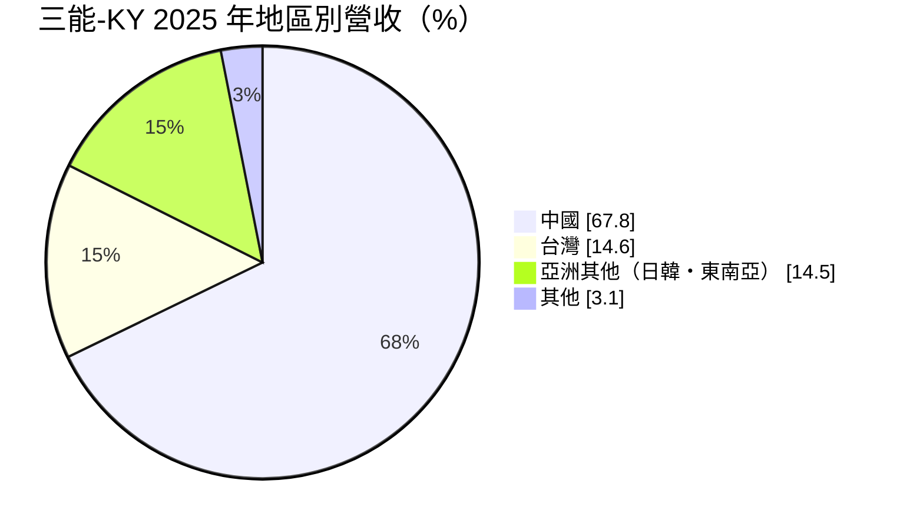
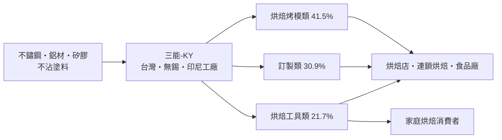
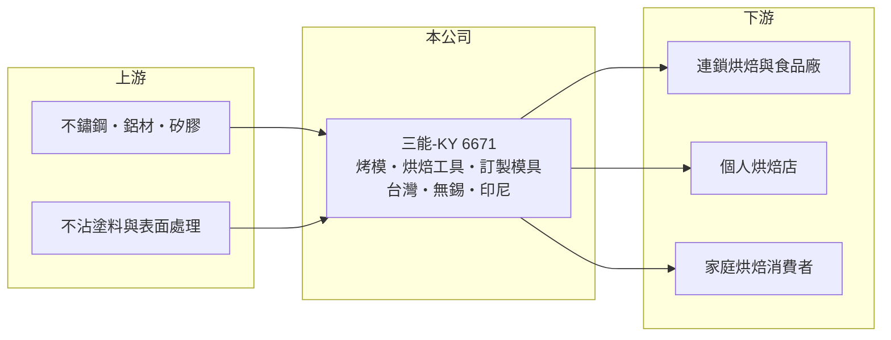

# 6671 三能-KY

> 上市｜[[產業索引-居家生活|居家生活]]｜上市（櫃）日期 2018/12/11

# 第一章：企業模式與商業藍圖

> [!info] 撰寫說明
> 本文由 Claude 依公開資料整理，架構比照 [[2330台積電]] 的四章研究，資料截至 2026-10-08。財務數字來源：Goodinfo 年度經營績效頁、富果研究 2026 年 4 月法說會整理（2025 年度）；產品別與地區別比重未列出的部分以「其他」表示，尚未逐條比對原始文件。#待校對

在評估單一個股的長期投資價值時，首要步驟是拆解企業的底層獲利邏輯。本章說明三能食品器具（股票代號：6671，以下簡稱三能-KY）如何以專業烘焙器具在亞洲建立品牌，以及它對中國市場的依賴。

## 一、核心定位：亞洲專業烘焙器具品牌

- **核心業務：** 三能-KY 是專業烘焙與食品器具的設計製造商，深耕產業超過 40 年，擁有超過 200 項專利、超過 2,000 種產品，從烤模、烤盤到各式烘焙工具，客戶涵蓋小型烘焙店到大型連鎖業者。品牌分為 B2B 的 San Neng 與高階的 SANNENG Premium，B2C 的 unopan 與家用系列，並跨足戶外用品。它的定位是「自有品牌的專業器具商」，而不是替他人代工的工廠。
- **營收結構：** 2025 年產品別營收中，烘焙烤模類占 41.5%、訂製類占 30.9%、烘焙工具類占 21.7%。地區別營收中，中國占 67.8%、台灣占 14.6%、亞洲其他地區（含日韓、東南亞）占 14.5%，外銷美國不到 1%。

- **營運據點：** 三大生產基地在台灣、中國無錫與印尼。印尼三能工業於 2025 年第四季開始量產，目前使用租賃廠房，2026 年啟動購地自建，目標成為輻射東協的第三個生產基地。

## 二、資本轉化邏輯：品牌加上客製化

- **毛利結構：** 烘焙工具類毛利率約 44.5%、烘焙烤模類約 40.3%，是主要獲利來源；訂製類毛利率約 31.2%，較低是因為大客戶議價力強、研發投入高。亞洲其他地區的毛利率約 45.1%，為各區最高，代表新市場的開拓同時提高了獲利品質。
- **上下游關係：** 公司與南僑、德麥、新麥等烘焙原料與設備業者合作，透過展演與冠軍師傅合作建立專業形象，並與迪士尼等 IP 合作開發客製化產品。

## 三、長期方向

- **長期方向：** 策略是「立足台灣、深耕亞洲、放眼全球」。南進東協以印尼為核心，2026 年初取得印尼 [[Halal 認證]]，被視為進入東南亞穆斯林市場的門票；北進日韓，深化日本企業合作。產品方向包括 [[PFAS]] Free 的環保塗層、PVD 鍍鈦抗菌，以及幫客戶提升生產效率的新品。這些布局的共同目的，是降低對中國市場近七成的依賴。

# 第二章：護城河深度與競爭優勢

「護城河」指企業抵禦競爭、維持超額利潤的保護機制。本章分析三能-KY 的品牌優勢與市場集中的問題。

## 一、護城河的核心組成

- **競爭優勢：** 第一是專業品牌。烘焙師傅對烤模的導熱均勻度、脫模效果與耐用度要求很高，三能在華人烘焙圈經營數十年，品牌就是品質保證，因此能維持約 38% 的毛利率。第二是產品廣度，超過 2,000 種品項讓連鎖業者可以一站採購，降低管理成本。第三是專利與客製化能力，200 多項專利與為大型連鎖客製模具的經驗，提高了客戶的轉換成本。
- **主要對手：** 中國本土的烘焙器具品牌與工廠數量多、價格低，是中國市場的主要競爭者；日本與歐美的專業廚具品牌則在高端市場競爭。台灣上市公司中沒有直接同業，烘焙產業鏈的 [[1702南僑]]、[[1264德麥]]、[[1580新麥]] 是合作夥伴而非對手。

## 二、優勢轉化：守得住／守不住／觀察重點

- **守得住：** 專業烘焙師傅與連鎖業者的品牌忠誠度，烤模與工具類的高毛利。
- **守不住：** 中國市場的成長。中國占營收近七成，當地出現「降級消費」，烘焙店展店放緩，營收在 2020 至 2025 年幾乎沒有成長。
- **觀察重點：** 亞洲其他地區占比能否持續提高、印尼工廠何時轉虧為盈，以及中國市場能否穩住。

# 第三章：財務體質與盈利規模

資料日期：2026-10-08。數字取自 Goodinfo 年度經營績效與富果研究法說會整理，表格是撰寫當時的快照；最新月營收、毛利率、累計 EPS 由自動排程寫在本筆記的屬性欄位（月營收、毛利率、累計EPS 等）。#待校對

財務報表是檢驗護城河是否真實存在的最終標準。本章用六年的數字檢視三能-KY 的獲利穩定度與資本效率。

## 一、多年度經營績效

| 年度 | 營收（新台幣） | [[毛利率]] | [[營業利益率]] | EPS（元） | [[ROE]] |
|---|---|---|---|---|---|
| 2020 | 19.1 億 | 40.1% | 14.4% | 3.66 | 13.3% |
| 2021 | 20.7 億 | 37.1% | 12.0% | 3.50 | 12.3% |
| 2022 | 18.6 億 | 36.3% | 10.5% | 2.43 | 8.6% |
| 2023 | 19.1 億 | 38.7% | 11.6% | 2.89 | 10.5% |
| 2024 | 20.4 億 | 37.8% | 10.8% | 3.18 | 11.2% |
| 2025 | 20.0 億 | 38.0% | 9.77% | 2.37 | 8.36% |

- **營收規模：** 2020 至 2025 年營收年複合成長率約 0.9%（推算），規模穩定在 19 億至 21 億元，缺乏成長。
- **獲利：** 毛利率穩定在 36% 至 40%，證明品牌定價力仍在；但營業利益率從 14.4% 緩步降到 9.8%，費用增加的速度快於營收。2025 年獲利下滑還包括印尼新廠初期虧損約 1,036 萬元、匯兌損失約 793 萬元，以及從無錫子公司匯回盈餘產生的所得稅約 865 萬元。
- **財務特色：** 2021 至 2025 年平均 ROE 約 10.2%（推算）。負債占資產比率約 21%，財務保守。2025 年度現金股利每股 1.2 元，[[配息率]]約 50.6%，低於過去水準，公司表示是為了保留印尼購地建廠的資金；Goodinfo 統計長期平均現金股利約 2.7 元。

## 二、[[ROIC]] 與 [[WACC]]

**ROIC 推算：** 2025 年營業利益約 1.95 億元，稅後約 1.56 億元。股東權益約 17.7 億元（每股淨值 29.05 元 × 約 0.608 億股），依 ROA 6.53% 推算總資產約 22 億元、總負債約 4.6 億元，多為營業負債，假設有息負債接近零（推估），ROIC 約 8.8%（推算）。2020 年同樣算法，稅後營業利益約 2.2 億元，ROIC 約 13%（推算）。

**WACC 推算：** 假設台灣 10 年期公債 1.75%、市場風險溢酬 6%、β 取中小型消費製造股常見值 0.8（推估），股東權益成本約 6.55%；幾乎全為權益資本，WACC 約 6.5%（推算）。

**結論：** 三能-KY 的 ROIC 仍高於 WACC，持續創造經濟價值，但利差從約 6 個百分點縮小到約 2 個百分點。長期價值取決於印尼與東南亞布局能否帶來新成長，把利差重新拉開。

# 第四章：總體風險與地緣政治

任何企業都無法脫離宏觀環境獨立存在。本章分析三能-KY 長期面對的風險。

## 一、產業與結構風險

- **產業週期：** 烘焙器具的需求來自烘焙店展店、連鎖業者更新設備與家庭烘焙風潮。這類需求受消費景氣影響，中國的消費降級直接減少了烘焙店的新開與設備更新。
- **營運風險：** 中國占營收近七成，是最大的單一市場風險。印尼新廠在初期會持續產生虧損與建廠支出，海外盈餘匯回也會增加稅負。

## 二、其他風險

- **地緣政治：** 作為以中國為主要市場、主要工廠在無錫的 [[KY股]]，兩岸關係與中國政策變動會影響營運與盈餘匯回，公司以印尼設廠分散風險。
- **法規與材料：** 歐美對 PFAS 等含氟化學品的管制趨嚴，不沾塗層需要改用替代配方，這既是成本壓力，也是推出環保新品的機會。
- **匯率與原物料：** 人民幣、新台幣與印尼盾的匯率變動影響報表獲利；不鏽鋼、鋁材價格波動影響成本。

# 專有名詞解析

## 金融

- **[[配息率]]**：現金股利占每股盈餘的比例，反映公司把多少獲利分給股東。
- **[[ROIC]]**：投入資本報酬率，稅後營業利益除以股東權益加有息負債，衡量本業運用資本的效率。
- **[[WACC]]**：加權平均資金成本，股東與債權人要求報酬的加權平均，ROIC 高於它才代表創造價值。

## 產業

- **[[KY股]]**：在台灣掛牌的境外註冊公司，代號後加 KY，主要營運據點多在海外。
- **[[PFAS]]**：全氟及多氟烷基物質，難以分解的含氟化學品，歐美正逐步管制，半導體材料需尋找替代配方。
- **[[Halal 認證]]**：伊斯蘭教清真認證，確認產品從原料到製程符合教規，是進入穆斯林市場的重要門檻。

# 核心供應鏈

## 1. 上游：原料
- 不鏽鋼、鋁材、矽膠與不沾塗料（具體供應商未查得）

## 2. 中游：三能-KY
- 品牌：San Neng、SANNENG Premium、unopan、SANNENG Outdoor

## 3. 下游與合作夥伴
- 烘焙原料與設備合作夥伴：[[1702南僑]]、[[1264德麥]]、[[1580新麥]]
- 客戶：中國、台灣、日韓與東南亞的烘焙店與連鎖業者

## 最新新聞
<!-- news:start -->
<!-- news:end -->

## 相關連結
- [公開資訊觀測站](https://mopsov.twse.com.tw/mops/web/t05st03?step=1&firstin=1&co_id=6671)
- [Goodinfo](https://goodinfo.tw/tw/StockDetail.asp?STOCK_ID=6671)
- [Yahoo 股市](https://tw.stock.yahoo.com/quote/6671)
- [鉅亨網新聞](https://www.cnyes.com/twstock/6671/news)
