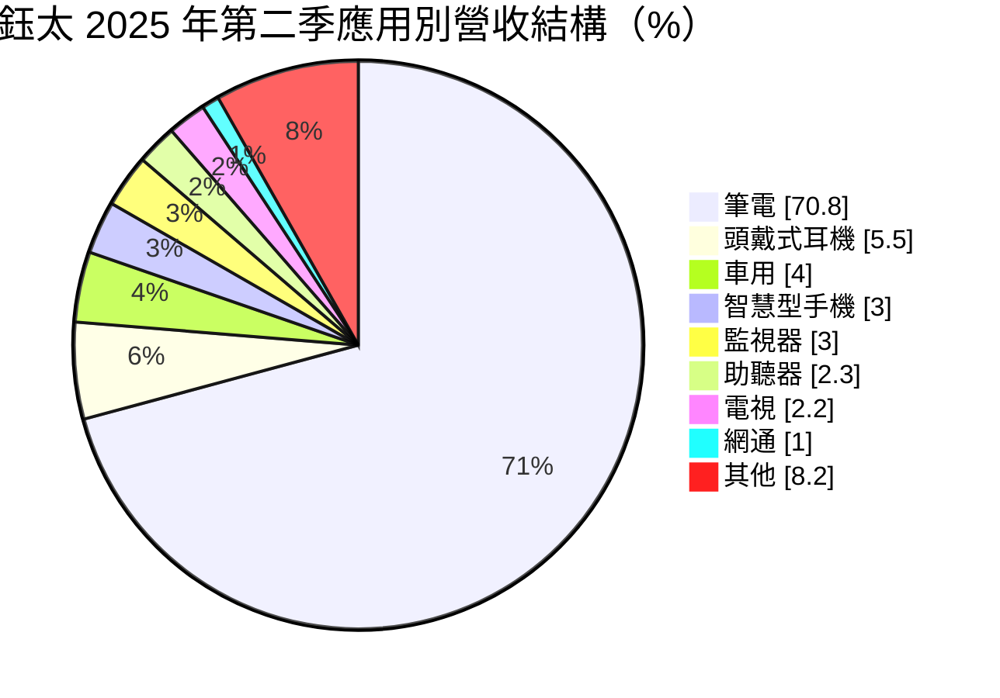
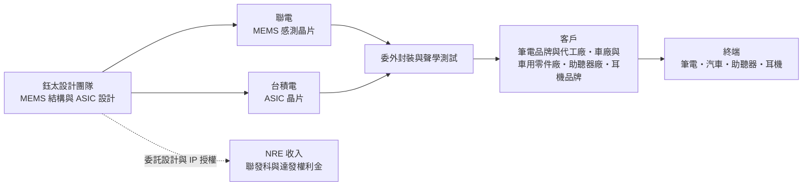
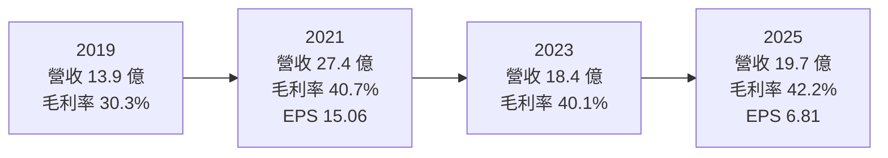
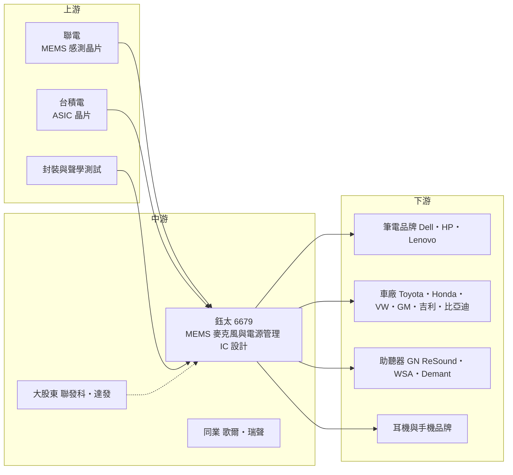

# 6679 鈺太

> 上櫃｜[[產業索引-半導體業|半導體業]]｜上市（櫃）日期 2019/05/09

# 第一章：企業模式與商業藍圖

> [!info] 撰寫說明
> 本文由 Claude 依公開資料整理，架構比照 [[2330台積電]] 的四章研究，資料截至 2026-10-08。財務數字來源：Goodinfo 歷年經營績效與股利政策頁、富果研究 2025/08/07 與 2026/06/01 法說會備忘錄、Yahoo 股市公司基本資料；產業描述為整理性內容，尚未逐條比對原始文件。#待校對

在評估單一個股的長期投資價值時，首要步驟是拆解企業的底層獲利邏輯。本章針對鈺太科技（股票代號：6679，以下簡稱鈺太）的商業模式進行定性分析，說明這家以筆電數位麥克風拿下全球過半市占的設計公司，如何刻意避開手機紅海，並把成長押在車用與助聽器等高毛利利基市場。

## 一、核心定位：高階 MEMS 麥克風的利基領導者

鈺太成立於 2005 年，2019 年上櫃，董事長兼總經理為邱景宏。公司專注於 [[MEMS 麥克風]]與電源管理 IC 的設計與銷售，產品分為[[數位麥克風]]（D-MIC）、類比麥克風（A-MIC）與電源管理晶片三大類。依 2025 年第二季法說會資料，數位麥克風占營收 78%、類比麥克風 13%、電源管理 8%。

MEMS 麥克風由兩個核心元件組成：一個是感測聲音振動的微機電（[[MEMS]]）振膜晶片，另一個是把振動訊號放大、轉換成數位訊號的 [[ASIC]]。鈺太的強項在後者，也就是讓麥克風在安靜環境下仍能清楚收音、抑制雜訊的類比與混合訊號設計。公司依 2025 年法說會說法，MEMS 感測元件委由 [[2303聯電]] 生產、ASIC 委由 [[2330台積電]] 生產，屬於 [[Fabless]] 模式。

鈺太最重要的市場地位在筆電。依 2026 年第一季法說會，數位麥克風應用以筆電為主，公司稱全球筆電數位麥克風市占約 55% 至 58%。不過以全體 MEMS 麥克風的出貨量計算，鈺太排名全球第四，前面是以手機為主力、出貨量龐大的歌爾、瑞聲等中國大廠。這個對比說明了鈺太的定位：不追求出貨量，而是在品質要求高、價格較好的應用中取得領導地位。

公司的大股東包括 [[2454聯發科]] 及其子公司 [[6526達發]]，雙方在聲學技術上合作，依 2026 年法說會說法，相關 IP 授權的權利金收入預計 2028 年起顯現。

## 二、終端應用／產品板塊：筆電為本，車用與助聽器為新動能

* **筆電（約七成）：** 遠距會議與 AI 語音助理普及後，筆電麥克風從一顆增加到多顆陣列，規格也從一般訊噪比提升到 68dB 的高[[訊噪比]]。依 2025 年法說會，Dell、HP、Lenovo 的 68dB 麥克風已完成設計導入，初期報價可提高 50% 至 60%。
* **車用（4% 至 7%）：** 一台車的主流配置為 5 顆麥克風，包括 1 顆用於緊急求救系統（[[eCall]]）與 4 顆用於車內降噪。客戶涵蓋 Toyota、Honda、Nissan、Volkswagen 集團與 GM，並切入吉利、理想、比亞迪等中國車廠。2026 年第一季車用比重升至 7%。
* **助聽器（2% 至 3%）：** 助聽器屬醫療級產品，生命週期 10 至 15 年，依法說會毛利率約 70% 至 85%。GN ReSound 已完成工廠稽核與產品測試，WSA、Demant 測試中。2026 年第一季助聽器營收年增近五成。
* **耳機與手機：** Dell 頭戴式耳機已量產，與 Beats、HP、Jabra 測試中；手機以三星新機種導入數位麥克風，但公司刻意不在手機市場打價格戰。

## 三、資本轉化邏輯（營運模式）：設計主導的高毛利模式

鈺太的獲利模式可以用「產品組合決定毛利率」來理解。依 2025 年法說會，各產品線毛利率大致為：助聽器 70% 至 85%、車用與頭戴式耳機 50% 至 60%、筆電與手機數位麥克風約 40%、手機類比麥克風約 30%。同業多以手機為主，毛利率僅約一至二成；鈺太長期毛利率維持在 40% 以上，正是因為它把產品集中在對品質要求高、價格較好的應用。

成本方面，公司不擁有工廠，主要投入是研發人力與光罩。2026 年晶圓代工與封裝成本上漲，公司表示已陸續轉嫁給客戶，這是具備市場地位的設計公司才有的議價能力。此外，公司還有委託設計（[[NRE]]）收入與未來的 IP 授權權利金，為營收增加不依賴出貨量的來源。

財務上最大的特點是大量現金。依 2026 年第一季法說會，公司現金、定存及金融資產合計約 44 億元，每股淨值約 105 元。這筆現金主要來自歷年獲利累積；另外 2022 年股本由約 4.24 億元增加到 5.49 億元（增加原因未查得），讓公司有能力長期投資車用與醫療這類驗證期很長的市場。

## 四、企業長期藍圖：降低筆電依賴，走向車用與醫療

鈺太管理層在法說會上給出明確的長期目標：

* **車用：** 目標在 2030 年達到全球車用麥克風市占 20% 至 25%。車用麥克風的驗證期長，但一旦導入可以出貨多年，且未來可能加入主動路噪消除功能，單車用量與價值都有提升空間。
* **助聽器：** 目標在 2028 至 2029 年市占達三成以上、2030 至 2032 年接近五成。助聽器市場由少數國際品牌主導，產品生命週期長、毛利率高，是公司最具價值的利基。
* **IP 授權：** 與聯發科、達發合作的 IP 授權，權利金預計 2028 年起貢獻。
* **TWS 改變模式：** 真無線耳機（[[TWS]]）業務改採晶圓銷售模式，降低在低價耳機市場的成本競爭。

整體而言，鈺太的長期策略是「用筆電的現金流，養車用與醫療的未來」。筆電市場成熟，成長有限，但高訊噪比升級帶來單價提升；車用與助聽器的營收規模雖小，卻是公司未來十年毛利率與成長的主要來源。

# 第二章：護城河深度與競爭優勢

在長期價值投資中，「護城河」指企業抵禦競爭、維持超額利潤的保護機制。本章分析鈺太的護城河構成、全球主要對手，以及這些優勢在不同應用市場中能守住多少。

## 一、護城河的核心組成要素

鈺太的護城河屬於「中等寬度、集中在利基市場」的類型，主要由以下三個要素組成：

* **1. 高訊噪比聲學設計能力：** 麥克風的品質取決於訊噪比、靈敏度一致性與可靠度，這些都需要 MEMS 結構與 ASIC 電路的共同設計。鈺太在筆電市場取得過半市占，並率先推出 68dB 高訊噪比產品，代表其設計能力獲得國際品牌認可。
* **2. 長驗證週期帶來的轉換成本：** 車用需要通過車規驗證，助聽器需要醫療等級的工廠稽核與產品測試，筆電品牌也要逐一完成設計導入。這些驗證動輒一至三年，客戶一旦採用便不會輕易更換，形成高轉換成本。
* **3. 集團綜效與財務實力：** 聯發科與達發為大股東，提供技術合作與 IP 授權的機會；約 44 億元的現金讓公司能長期投入驗證期長的市場，不必因短期獲利壓力而放棄布局。

## 二、全球主要競爭對手格局

| 對手 | 定位 | 對鈺太的威脅 |
|---|---|---|
| 歌爾（中國） | 全球 MEMS 麥克風出貨量龍頭，手機與耳機為主 | 規模大、成本低，在手機與 TWS 市場占優勢 |
| 瑞聲（中國） | 聲學元件大廠，手機為主 | 在手機麥克風與聲學模組直接競爭 |
| 美系聲學元件大廠（如 Knowles） | 高階麥克風與助聽器元件老牌供應商 | 在助聽器與高階應用擁有長期客戶關係 |
| 歐系半導體廠的 MEMS 晶片 | 提供 MEMS 感測晶片與 ASIC | 在車用與高階市場具品牌與認證優勢 |

註：歌爾、瑞聲為法說會提及的同業；其餘為依產業結構整理（推估）。依法說會，鈺太以出貨量排名全球第四，同業毛利率約一至二成。

## 三、優勢轉化：守得住／守不住／觀察重點

* **守得住：** 筆電高訊噪比數位麥克風與車用麥克風。前者已有過半市占與三大品牌設計導入，後者有日、美、德、韓、中多家車廠背書，兩者都有高轉換成本。
* **守不住：** 手機與低階 TWS 耳機市場。這兩個市場出貨量大但價格競爭激烈，中國大廠具成本優勢；鈺太已主動避開或改為晶圓銷售模式，等於承認這部分不具競爭優勢。
* **觀察重點：** 第一是車用比重能否從 7% 持續提升到兩位數；第二是助聽器國際大廠（GN、WSA、Demant）能否陸續量產；第三是 2028 年起的 IP 權利金規模。這三項決定鈺太能否把筆電的單一依賴轉化為多元的高毛利結構。

# 第三章：財務體質與盈利規模

資料日期：2026-10-08。數字取自 Goodinfo 歷年經營績效與股利政策頁、富果研究法說會備忘錄，表格是撰寫當時的快照；最新月營收、毛利率、累計 EPS 由自動排程寫在本筆記的屬性欄位（月營收、毛利率、累計EPS 等）。#待校對

財務報表是檢驗護城河是否真實存在的最終標準。本章用多年度的三率、ROE、股利與資本報酬，檢視鈺太從遠距需求高峰回到常態後的獲利品質。

## 一、獲利能力的基石：三率

| 年度 | 營收（新台幣） | [[毛利率]] | [[營業利益率]] | EPS（元） | [[ROE]] |
|---|---|---|---|---|---|
| 2019 | 13.9 億 | 30.3% | 14.3% | 4.06 | 18.6% |
| 2020 | 19.0 億 | 34.3% | 20.6% | 7.57 | 26.6% |
| 2021 | 27.4 億 | 40.7% | 27.6% | 15.06 | 40.3% |
| 2022 | 21.5 億 | 43.2% | 23.9% | 10.40 | 15.4% |
| 2023 | 18.4 億 | 40.1% | 19.5% | 6.95 | 7.53% |
| 2024 | 21.1 億 | 41.6% | 18.0% | 8.86 | 9.17% |
| 2025 | 19.7 億 | 42.2% | 17.8% | 6.81 | 6.91% |

* **[[毛利率]]：** 毛利率從 2019 年的 30% 提升到 2021 年後穩定在 40% 至 43%，即使營收從 2021 年高峰回落三成，毛利率也沒有下降。這說明毛利率提升來自產品組合升級（數位麥克風、高訊噪比、車用），而不是短期缺貨。2026 年第一季毛利率達 51.9%，部分來自 NRE 收入認列。
* **[[營業利益率]]：** 從 2021 年的 27.6% 降到 2025 年的 17.8%，主因是營收回落但研發與業務費用持續投入車用、助聽器等新市場。公司預估營業費用率約 21% 至 22%。
* **業外與匯率：** 公司持有大量外幣資產，匯率對淨利影響很大。2025 年第二季業外匯損 1.84 億元，使單季 EPS 為 -1.63 元，但同季營業利益仍有約 9,012 萬元。評估鈺太時應以營業利益而非單季 EPS 判斷本業。

## 二、[[ROE]]：資本效率

鈺太 ROE 在 2021 年達 40.3%，2023 至 2025 年則降到 7% 至 9%。以 2021 至 2025 年計算，近 5 年平均 ROE 約 15.9%（推算：40.3、15.4、7.53、9.17、6.91 的簡單平均）。ROE 下降的原因有二：第一是獲利從遠距需求高峰回落；第二是 2022 年股本由約 4.24 億元增加到 5.49 億元後，股東權益明顯擴大，而大部分資金以現金與金融資產形式持有。每股淨值約 105 元中，有相當比例是現金，這是 ROE 偏低的主要原因。

營收方面，2019 年 13.9 億元到 2025 年 19.7 億元，6 年年複合成長率約 6.0%（推算）。

## 三、資本支出與自由現金流

* **資本支出：** 鈺太為 Fabless 公司，資本支出主要為研發與測試設備，本次未查得逐年金額，依營運模式判斷占營收比重低（推估）。
* **現金股利：** Goodinfo 資料顯示，股利所屬年度 2019 至 2025 年現金股利依序約為 2.44、4.99、7.13、9.0、5.5、9.17、6.5 元（2025 年為目前查得的下半年股利）。2022 與 2024 年的現金股利接近或超過當年 EPS，顯示公司願意動用累積的現金回饋股東。股利隨獲利波動，但從未中斷。
* **自由現金流：** 輕資產模式加上現金部位持續累積到約 44 億元，推估長期自由現金流為正（逐年數字未查得）。

## 四、[[ROIC]] 與 [[WACC]]：價值創造利差

**ROIC 推算：** 鈺太幾乎沒有有息負債（本次未查得借款數字，依財務結構推估），以股東權益作為投入資本近似值。2025 年營業利益約 3.51 億元（19.7 億 × 17.8%），以 20% 稅率計算稅後約 2.81 億元；平均股東權益以淨利 3.65 億 ÷ ROE 6.91% 推得約 52.8 億元，帳面 ROIC 推算約 5.3%。但若扣除約 44 億元的現金、定存與金融資產（2026 年第一季底數字），實際營運使用的資本約 9 億元，營運資本報酬率推算約 30%。

**WACC 推算：** 採 CAPM，台灣 10 年期公債殖利率取 1.75%，市場風險溢酬 6%，β 取 IC 設計中小型股常見值約 1.2（未查得來源數字），股東權益成本約 1.75% + 1.2 × 6% = 8.95%。幾乎沒有有息負債，WACC 推算約 9%。

**結論：** 鈺太是「本業高報酬、帳面低報酬」的典型案例。帳面 ROIC 約 5%，低於約 9% 的 WACC；但扣除現金後的本業報酬率約 30%，遠高於資金成本，代表麥克風本業具有很強的價值創造能力。帳面數字被大量閒置現金稀釋，長期而言，公司如何運用這筆現金（投入新事業、併購或提高配息）是影響股東報酬的關鍵資本配置課題。

# 第四章：總體風險與地緣政治

任何企業都無法脫離宏觀環境獨立存在。本章分析鈺太長期必須面對的地緣政治、產業週期、營運與技術風險。

## 一、地緣政治

鈺太的晶圓由聯電與台積電生產，依 2025 年法說會說法，兩家都在美國設廠，公司預期半導體關稅影響有限。然而主要產能仍在台灣，與其他台灣半導體公司面臨相同的兩岸風險。客戶方面，筆電代工廠多在中國與東南亞生產，車用客戶則包括中國車廠；中美貿易摩擦若影響筆電與汽車的生產布局，會間接影響訂單節奏。另一方面，主要競爭對手為中國大廠，國際品牌在地緣政治考量下傾向分散供應來源，對鈺太是潛在的長期利多。

## 二、產業週期與市場結構

筆電占營收約七成，是鈺太最主要的週期性風險。筆電市場在 2020 至 2021 年遠距需求高峰後明顯衰退，鈺太營收也從 27.4 億元降到 18.4 億元。依 2026 年第一季法說會，下半年筆電可能因記憶體短缺而趨緩，但公司預期車用與助聽器可以抵銷。長期而言，筆電市場成熟、出貨量難有大幅成長，成長來源必須靠單價提升（高訊噪比、多麥克風陣列）與新市場。

## 三、營運環境的隱性風險

* **單一應用依賴：** 筆電比重過高，任何一家大型品牌改用其他供應商，對營收影響都很大。公司目標把非 PC 應用比重持續提高，以降低此風險。
* **匯率：** 大量外幣資產使淨利對匯率高度敏感，2025 年第二季的匯損就讓單季由盈轉虧。
* **代工成本：** 晶圓代工與封裝成本上漲時，需要轉嫁給客戶；若市場競爭加劇，轉嫁能力可能減弱。
* **新市場驗證時程：** 車用與助聽器的驗證期長，客戶專案延後（例如手機客戶因可靠性標準變更而延後）會使營收貢獻遞延。

## 四、科技或法規演進

麥克風技術的長期趨勢包括：更高的訊噪比、更低的功耗、內建語音辨識的智慧麥克風，以及骨傳導等新感測方式。AI 語音助理與即時翻譯若在筆電、汽車與耳機上普及，會提高對高品質麥克風的需求，對鈺太有利。另一方面，如果主晶片廠把麥克風訊號處理整合進主晶片，或新的感測技術取代傳統 MEMS 麥克風，鈺太的 ASIC 優勢可能被削弱。法規方面，歐盟等地區強制車輛配備 eCall 緊急求救系統，以及各國放寬非處方助聽器銷售，都會擴大鈺太的潛在市場。

# 專有名詞解析

## 半導體

- **[[MEMS]]**：微機電系統，在晶片上製作微小的機械結構，用來感測聲音、壓力、加速度等物理變化。
- **[[ASIC]]**：特定應用積體電路，為單一客戶或特定用途客製化設計的晶片，開發期長但量產後生命週期長。
- **[[Fabless]]**：無晶圓廠的 IC 設計公司，只負責設計與銷售，製造委由晶圓代工廠與封測廠。

## 應用

- **[[MEMS 麥克風]]**：以 MEMS 振膜感測聲音、搭配 ASIC 轉換訊號的微型麥克風，廣泛用於筆電、手機、耳機與汽車。
- **[[數位麥克風]]**：在麥克風內部直接把聲音轉為數位訊號輸出，抗干擾能力強，適合筆電等內部雜訊多的裝置。
- **[[eCall]]**：車輛發生事故時自動撥打緊急求救電話的系統，歐盟要求新車配備，需要專用麥克風。
- **[[TWS]]**：真無線藍牙耳機，左右耳機之間沒有線材連接，市場出貨量大但價格競爭激烈。
- **[[助聽器]]**：配戴在耳朵上放大聲音的醫療器材，需要極低功耗、高訊噪比的麥克風，產品生命週期長。

## 金融

- **[[NRE]]**：一次性工程費用，客戶委託設計晶片時支付的開發費用，與量產後的銷售收入分開計算。
- **[[權利金]]**：授權他人使用專利或技術而收取的費用，通常按對方產品出貨量或營收比例計算。

## 產業

- **[[訊噪比]]**：訊號強度與背景雜訊的比值，以 dB 表示，數值越高代表收音越清楚，是麥克風最重要的規格。
- **[[主動降噪]]**：以麥克風收集環境噪音，再產生反相聲波抵銷噪音的技術，用於耳機與車內。

# 核心供應鏈

## 1. 上游：晶圓代工與封裝
- MEMS 感測晶片：[[2303聯電]]
- ASIC 晶片：[[2330台積電]]
- 封裝與聲學測試：委外廠商（未具名）

## 2. 中游：鈺太本身、股東與同業
- 大股東與技術合作：[[2454聯發科]]、[[6526達發]]
- 中國同業：歌爾、瑞聲

## 3. 下游：筆電與耳機
- 筆電品牌：Dell、HP、Lenovo（68dB 麥克風設計導入，依 2025 年法說會）
- 耳機：Dell 頭戴式耳機量產；Beats、HP（Plantronics）、Jabra 測試或設計導入中
- 手機：三星新機種導入數位麥克風

## 4. 下游：車用與醫療
- 車廠：Toyota、Honda、Nissan、Volkswagen 集團、GM、Hyundai/Kia，以及吉利、理想、比亞迪
- 助聽器：GN ReSound、WSA、Demant

延伸閱讀：[[聯發科供應鏈]]、[[台積電供應鏈]]

## 最新新聞
<!-- news:start -->
<!-- news:end -->

## 相關連結
- [公開資訊觀測站](https://mopsov.twse.com.tw/mops/web/t05st03?step=1&firstin=1&co_id=6679)
- [Goodinfo](https://goodinfo.tw/tw/StockDetail.asp?STOCK_ID=6679)
- [Yahoo 股市](https://tw.stock.yahoo.com/quote/6679)
- [鉅亨網新聞](https://www.cnyes.com/twstock/6679/news)
