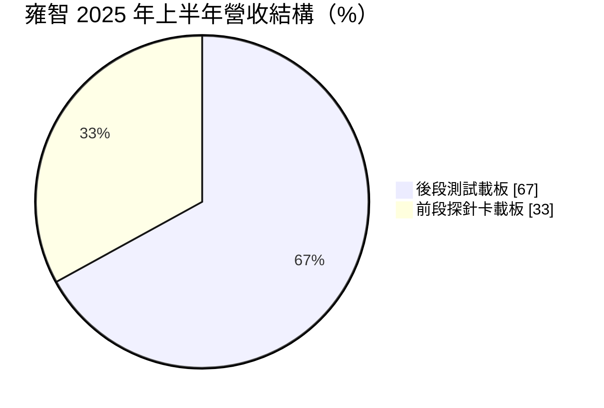
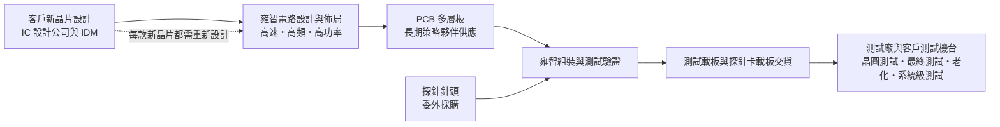
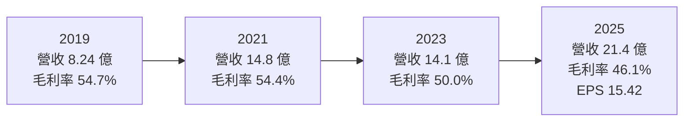
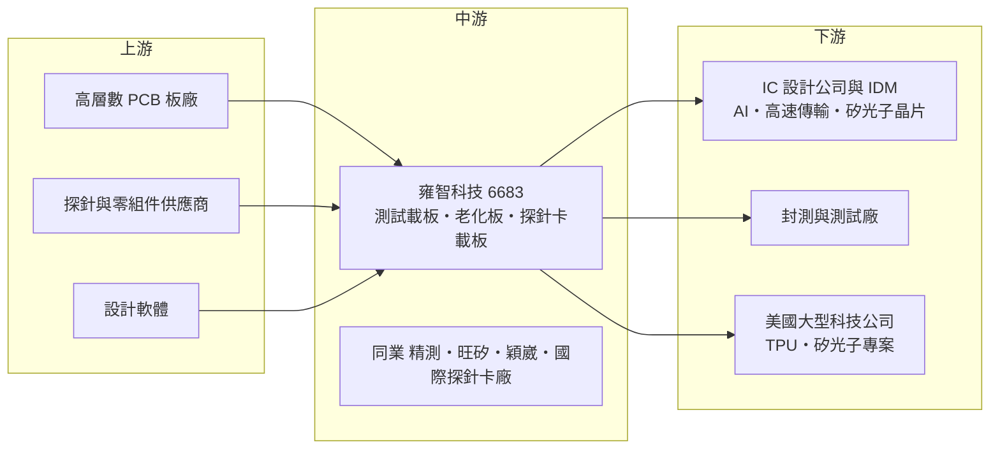

# 6683 雍智科技

> 上櫃｜[[產業索引-半導體業|半導體業]]｜上市（櫃）日期 2019/04/23

# 第一章：企業模式與商業藍圖

> [!info] 撰寫說明
> 本文由 Claude 依公開資料整理，架構比照 [[2330台積電]] 的四章研究，資料截至 2026-10-08。財務數字來源：Goodinfo 歷年經營績效頁、工商時報 2026/06/08 股東會報導、旺得富理財網 2023/09/07 與 2025/10/23 法說會報導、nStock 公司簡介、Yahoo 股市公司基本資料；產業描述為整理性內容，尚未逐條比對原始文件。#待校對

在評估單一個股的長期投資價值時，首要步驟是拆解企業的底層獲利邏輯。本章針對雍智科技（股票代號：6683，以下簡稱雍智）的商業模式進行定性分析，說明這家半導體測試介面公司如何在每一顆新晶片的開發與量產過程中收取「過路費」，以及它如何從後段測試板走向技術門檻更高的前段探針卡。

## 一、核心定位：晶片測試的客製化介面供應商

雍智成立於 2006 年，2019 年 4 月上櫃，董事長為李職民。2023 年起由 [[2449京元電子]] 前總經理劉安炫擔任總經理，這項人事安排讓公司在測試產業的經驗與人脈更加完整。

要理解雍智，得先理解晶片測試的流程。一顆晶片從晶圓廠出來後，要經過兩個主要測試階段：第一是[[晶圓測試]]，在晶圓還沒切割前，用[[探針卡]]的細針接觸每一顆晶粒，篩掉不良品；第二是封裝後的[[最終測試]]，把封裝好的晶片放上[[測試載板]]，模擬實際運作環境檢查功能。高階晶片還會經過[[老化測試]]（Burn-in），在高溫高壓下提前篩出早期失效的產品，以及[[系統級測試]]（SLT），模擬晶片裝進終端產品後的真實運作。

這些測試都需要一塊連接「測試機台」與「待測晶片」的電路板，也就是測試介面板。雍智就是專門設計與製造這類測試板的公司。它的特點是高度客製化：每一款新晶片的腳位、訊號速度、功耗都不同，必須重新設計一塊專用的測試板。換句話說，只要半導體產業持續推出新晶片，雍智就有生意，這讓它的商業模式帶有類似「研發過路費」的性質。

## 二、終端應用／產品板塊：後段為本，前段為成長引擎

* **後段測試載板：** 包括最終測試載板、老化測試載板與系統級測試載板，是公司的傳統主力。依 2025 年 10 月報導，過去兩年後段約占營收八成。這類產品技術成熟、毛利率穩定，主要應用於高速、高頻與高功率晶片。
* **前段探針卡載板：** 探針卡由兩大部分組成：一是接觸晶粒的細針頭，二是承載針頭、連接測試機台的多層電路板。雍智做的是後者，並向更完整的探針卡推進。前段比重從 2024 年上半年的 15% 提升到 2025 年上半年的 33%，營收年增約 2.04 倍；依 2026 年 6 月報導，管理層預期 2026 年初前段可提升到約五成。

應用面上，雍智的產品服務 AP、[[ASIC]]、射頻、電源管理與 AI 晶片。依 2025 至 2026 年報導，公司在 AI 相關的周邊高速傳輸晶片取得進展，[[矽光子]]測試用探針卡已出貨給美國大廠，並承接 [[TPU]] 相關的探針卡專案，預計 2026 年下半年小量生產、2027 年放量。

## 三、資本轉化邏輯（營運模式）：工程密集的客製化接單

雍智的核心資產是工程設計能力，而不是大型機器設備。每接到一款新晶片，工程師要依照晶片腳位、訊號速度與功耗設計電路佈局，確保測試訊號在高頻下不失真、大電流下不過熱，接著委由長期合作的 PCB 廠製作多層板，再由雍智組裝與驗證。依 2026 年股東會報導，公司在後段電路佈局導入 AI 自動化，以提高產出效率與品質。

這種模式有兩個財務特徵。第一是毛利率高：2019 至 2025 年毛利率介於 46% 至 57%，反映客製化設計的附加價值。第二是需求與「新晶片數量」高度相關，而不只是晶片出貨量。AI、高速傳輸與先進封裝帶來大量新設計案，雍智的營收在 2024 與 2025 年連續兩年成長逾兩成。

前段探針卡則帶來不同的成本結構。依 2025 年 10 月報導，前段產品的探針需要委外採購，成本較高，加上前段學習曲線仍陡，因此營收成長時毛利率反而下降，2025 年毛利率降到 46.1%。管理層預期隨著量產規模擴大、成本下降，毛利率可以回升。

## 四、企業長期藍圖：前段探針卡、海外市場與新測試需求

* **擴產與人才：** 依 2026 年 6 月報導，公司 2026 年產能預計增加 50% 以上，資本支出用於擴充前段探針卡載板的廠房與設備，並增加技術人力。
* **海外布局：** 2023 年設立上海分公司，並計畫與策略夥伴設立美國子公司；2025 年報導指出公司擴大中國在地化生產與人才招募，並預期美國業務因在新產品導入階段即參與而倍增。
* **新應用：** 矽光子測試、[[面板級封裝]]（PLP）等新技術帶來的測試需求，以及 TPU 等 AI 加速器的探針卡專案。

整體來看，雍智的長期藍圖是從「後段測試板供應商」升級為「前後段完整測試介面供應商」。前段探針卡市場由國際大廠主導、技術門檻更高，若能站穩，將大幅提升公司的市場規模與競爭地位。

# 第二章：護城河深度與競爭優勢

在長期價值投資中，「護城河」指企業抵禦競爭、維持超額利潤的保護機制。本章分析雍智的護城河構成、主要對手，以及這些優勢在測試介面市場中能守住多少。

## 一、護城河的核心組成要素

雍智的護城河屬於「中等寬度」，主要由以下三個要素組成：

* **1. 高速高功率設計的工程經驗：** 測試載板看似是電路板，真正的價值在設計：[[訊號完整性]]、電源完整性與散熱設計。AI 晶片的訊號速度與功耗不斷提高，設計難度隨之上升，累積大量案例的設計團隊才能在短時間內交出穩定可用的測試板。雍智長期維持約五成的毛利率，正反映這種工程價值。
* **2. 新產品導入階段的客戶綁定：** 測試板在晶片開發初期就要開始設計，供應商往往從新產品導入階段就與客戶工程團隊合作。一旦參與開發，後續量產的測試板與改版需求也會延續下去，形成自然的轉換成本。公司預期美國業務倍增，原因正是在新產品導入階段就已參與。
* **3. 交期與服務速度：** 新晶片的上市時程緊迫，測試板晚交貨就會延誤客戶量產。台灣廠商在交期與工程服務上有地理與文化優勢，這在競爭中是不容易被量化、但很實際的護城河。

## 二、全球主要競爭對手格局

| 對手 | 定位 | 對雍智的威脅 |
|---|---|---|
| [[6510精測]] | 台灣測試介面大廠，探針卡與測試載板皆有 | 產品線完整、規模較大，在手機與 AI 晶片測試直接競爭 |
| [[6223旺矽]] | 台灣探針卡大廠 | 在前段探針卡市場具規模與技術領先 |
| [[6515穎崴]] | 台灣測試座與探針卡廠 | 在後段測試介面與部分前段產品重疊 |
| FormFactor、Technoprobe、日本 MJC 等國際大廠 | 全球探針卡龍頭 | 握有國際大客戶，是雍智進軍高階探針卡的主要門檻 |
| 中國大陸測試載板廠 | 本土化需求 | 在中國市場以價格與在地服務競爭 |

註：法說會與報導未具名競爭對手，表中依產業結構整理（推估）。

## 三、優勢轉化：守得住／守不住／觀察重點

* **守得住：** 高速、高功率晶片的後段測試載板與老化測試板。這是雍智深耕多年的領域，客戶關係穩固，毛利率維持在高檔，且 AI 晶片的高功耗特性提高了老化測試的重要性。
* **守不住：** 一般規格、低技術門檻的測試板。這類產品容易被中國同業以價格取代，雍智的策略是持續把產品組合往高階移動，而不是在低價市場競爭。
* **觀察重點：** 第一是前段比重提升後，毛利率能否回到 50% 以上，這代表前段業務是否具備規模經濟；第二是 TPU 與矽光子探針卡能否在 2027 年如期放量；第三是 PCB 原物料供應是否持續吃緊，依 2026 年報導目前僅交期拉長、尚未影響產能。

# 第三章：財務體質與盈利規模

資料日期：2026-10-08。數字取自 Goodinfo 歷年經營績效頁、工商時報與旺得富理財網報導，表格是撰寫當時的快照；最新月營收、毛利率、累計 EPS 由自動排程寫在本筆記的屬性欄位（月營收、毛利率、累計EPS 等）。#待校對

財務報表是檢驗護城河是否真實存在的最終標準。本章用多年度的三率、ROE、股利與資本報酬，檢視雍智在半導體景氣循環與產品轉型中的獲利品質。

## 一、獲利能力的基石：三率

| 年度 | 營收（新台幣） | [[毛利率]] | [[營業利益率]] | EPS（元） | [[ROE]] |
|---|---|---|---|---|---|
| 2019 | 8.24 億 | 54.7% | 31.7% | 7.85 | 17.9% |
| 2020 | 12.3 億 | 57.4% | 35.5% | 12.34 | 22.8% |
| 2021 | 14.8 億 | 54.4% | 36.5% | 15.50 | 24.4% |
| 2022 | 15.3 億 | 48.9% | 29.2% | 15.01 | 20.7% |
| 2023 | 14.1 億 | 50.0% | 30.0% | 13.07 | 16.5% |
| 2024 | 17.4 億 | 53.0% | 28.5% | 17.69 | 20.1% |
| 2025 | 21.4 億 | 46.1% | 25.2% | 15.42 | 15.9% |

* **[[毛利率]]：** 7 年間毛利率介於 46% 至 57%，即使在 2023 年半導體庫存調整期也維持 50%。2025 年降到 46.1%，原因不是競爭惡化，而是前段探針卡比重提升、探針委外成本較高且仍在學習曲線上。
* **[[營業利益率]]：** 長期維持在 25% 至 37%。2025 年營業利益約 5.38 億元，創歷史新高或次高，但營業利益率因毛利率下降而降到 25.2%。
* **業外因素：** 雍智以外幣計價銷售，匯率影響明顯。2025 年上半年業外因匯損虧損約 7,700 萬元，使稅後淨利年減約四成；全年稅後淨利 4.19 億元、年減 12.67%，但營業利益仍成長 8.76%。評估本業時應以營業利益為準。

## 二、[[ROE]]：資本效率

以 2021 至 2025 年計算，近 5 年平均 ROE 約 19.5%（推算：24.4、20.7、16.5、20.1、15.9 的簡單平均），即使在景氣谷底的 2023 年也有 16.5%。依工商時報報導，公司已連續六年每股盈餘超過一個股本（EPS 大於 10 元）。

營收方面，2019 年 8.24 億元到 2025 年 21.4 億元，6 年年複合成長率約 17.2%（推算），而且 7 年中只有 2023 年營收小幅衰退，成長相當穩定。

## 三、資本支出與自由現金流

* **資本支出：** 雍智以工程設計為核心，PCB 委由長期合作廠商生產，資本支出主要用於組裝、測試設備與廠房。2026 年為擴充前段產能 50% 以上，資本支出將較過去增加（金額未查得）。
* **現金股利：** 2025 年度每股配發現金股利 9 元，[[配息率]] 58.37%，依報導為歷史次高金額與紀錄配息率。2025 年以前的逐年股利本次未查得。
* **自由現金流：** 以長期高營業利益率與相對輕的資本需求判斷，推估自由現金流長期為正（逐年數字未查得）。2026 年擴產期間自由現金流可能暫時下降。

## 四、[[ROIC]] 與 [[WACC]]：價值創造利差

**ROIC 推算：** 本次未查得雍智的有息負債數字，依其高獲利與配息能力推估借款不多，因此以股東權益作為投入資本近似值。2025 年營業利益約 5.38 億元，以 20% 稅率計算稅後約 4.30 億元；平均股東權益以淨利 4.19 億 ÷ ROE 15.9% 推得約 26.4 億元，ROIC 推算約 16%。2020 至 2021 年營業利益率超過 35%，ROIC 推算約在 20% 至 25%。

**WACC 推算：** 採 CAPM，台灣 10 年期公債殖利率取 1.75%，市場風險溢酬 6%，β 取半導體測試介面類股常見值約 1.3（未查得來源數字），股東權益成本約 1.75% + 1.3 × 6% = 9.55%。借款不多，WACC 推算約 9.5%。

**結論：** 雍智的 ROIC 長期約在 16% 至 25%，比約 9.5% 的 WACC 高出 6 至 15 個百分點，是持續創造價值的企業。2025 年利差縮小，主要來自前段業務的學習成本與匯損；如果前段探針卡在 2026 至 2027 年達到規模經濟、毛利率回到五成以上，ROIC 有機會回到 20% 以上。反之，若擴產後需求不如預期，新增資本會稀釋報酬率。

# 第四章：總體風險與地緣政治

任何企業都無法脫離宏觀環境獨立存在。本章分析雍智長期必須面對的地緣政治、產業週期、營運與技術風險。

## 一、地緣政治

雍智的客戶遍及台灣、中國與美國，並在中國擴大在地化生產、計畫在美國設立子公司。中美科技管制若進一步限制 AI 晶片的開發與測試，可能影響中國客戶的新晶片專案數量；反之，美國客戶要求供應鏈分散時，台灣廠商有機會受惠。公司主要生產與研發在台灣，與其他台灣半導體公司面臨相同的兩岸風險。

## 二、產業週期與市場結構

雍智的需求取決於「新晶片設計案數量」與「測試量」，兩者都隨半導體景氣循環波動。2023 年半導體庫存調整時，客戶延後新產品開發，雍智營收年減約 8%、前段訂單下滑約 25%。不過與晶圓代工或記憶體相比，測試介面的波動相對溫和，因為即使景氣低迷，晶片設計公司仍會持續開發新產品。AI 晶片的快速迭代則是長期的結構性利多，每一代新晶片都需要新的測試板與探針卡。

## 三、營運環境的隱性風險

* **原物料：** 高階測試板需要高層數、高頻的 PCB，依 2026 年報導 PCB 供應吃緊，目前僅交期拉長。若供應持續緊張，可能影響交貨時程與成本。
* **探針委外：** 前段探針卡的探針需要外購，成本與供應不在公司掌控之中，是前段毛利率較低的主因。
* **匯率：** 2025 年上半年匯損約 7,700 萬元，顯示外幣資產部位對淨利的影響不小。
* **人才與擴產執行：** 2026 年產能增加 50% 以上，需要同步擴充工程人才；設計人才若供應不足，可能限制擴產效益。

## 四、科技或法規演進

半導體測試的長期趨勢是測試難度持續上升：晶片的腳位越來越多、訊號越來越快、功耗越來越高，先進封裝與小晶片架構則讓測試需要在更多環節進行（已知良品晶粒測試）。這些趨勢整體而言對測試介面廠有利。風險在於，若國際探針卡大廠向下整合載板設計，或測試機台廠推出標準化介面減少客製化需求，雍智的設計價值可能被壓縮。矽光子、面板級封裝等新技術，則是公司必須持續投入才能跟上的新測試領域。

# 專有名詞解析

## 半導體

- **[[TPU]]**：張量處理器，Google 自行設計的 AI 加速晶片，專門處理深度學習運算。
- **[[矽光子]]**：在矽晶片上製作光學元件，以光取代電傳輸資料，可降低 AI 資料中心的傳輸耗電。
- **[[面板級封裝]]**：以大尺寸方形面板取代圓形晶圓進行封裝，可容納更多晶片、降低成本，英文簡稱 PLP。
- **[[ASIC]]**：特定應用積體電路，為單一客戶或特定用途客製化設計的晶片，開發期長但量產後生命週期長。

## 金融

- **[[配息率]]**：現金股利占每股盈餘的比例，反映公司把獲利發還股東的程度。

## 產業

- **[[測試載板]]**：連接測試機台與封裝後晶片的客製化電路板，每一款新晶片通常都需要重新設計，英文常稱 Load Board。
- **[[探針卡]]**：晶圓測試時用來接觸每顆晶粒的工具，由細針頭與承載電路板組成，技術門檻高於後段測試板。
- **[[晶圓測試]]**：晶圓切割前，用探針卡逐顆檢測晶粒功能，篩掉不良品以免浪費封裝成本。
- **[[最終測試]]**：晶片封裝完成後的功能測試，確認出貨前每顆晶片都符合規格。
- **[[老化測試]]**：讓晶片在高溫高壓下長時間運作，提前篩出早期失效產品，車用與 AI 晶片特別重視，英文為 Burn-in。
- **[[系統級測試]]**：把晶片放在模擬實際產品的環境中運作測試，可發現傳統測試抓不到的問題，英文簡稱 SLT。
- **[[訊號完整性]]**：高速訊號在電路板傳輸時保持波形不失真的能力，是高速測試板設計的核心課題。

# 核心供應鏈

## 1. 上游：電路板與零組件
- 高層數、高頻 PCB：長期策略夥伴供應（廠商名稱未揭露）
- 探針卡探針：委外採購（廠商名稱未揭露）

## 2. 中游：雍智本身與同業
- 台灣同業：[[6510精測]]、[[6223旺矽]]、[[6515穎崴]]
- 國際同業：FormFactor、Technoprobe、日本 MJC 等探針卡廠
- 經營團隊淵源：總經理劉安炫曾任 [[2449京元電子]] 總經理

## 3. 下游：晶片設計公司與測試廠
- AP、ASIC、射頻、電源管理與 AI 晶片設計公司（未具名）
- 封測與測試廠（未具名，推估包括台灣主要測試廠）
- 美國大廠：矽光子探針卡已出貨、TPU 相關探針卡專案（依 2026 年報導）

延伸閱讀：[[台積電供應鏈]]

## 最新新聞
<!-- news:start -->
<!-- news:end -->

## 相關連結
- [公開資訊觀測站](https://mopsov.twse.com.tw/mops/web/t05st03?step=1&firstin=1&co_id=6683)
- [Goodinfo](https://goodinfo.tw/tw/StockDetail.asp?STOCK_ID=6683)
- [Yahoo 股市](https://tw.stock.yahoo.com/quote/6683)
- [鉅亨網新聞](https://www.cnyes.com/twstock/6683/news)
