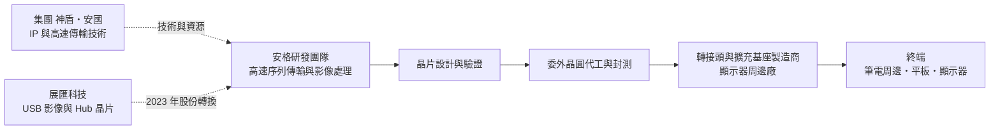
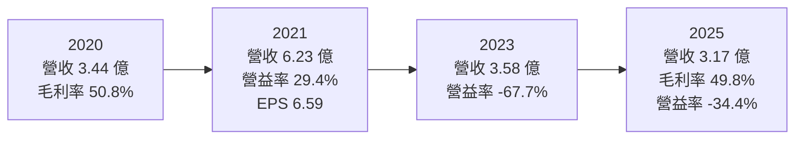
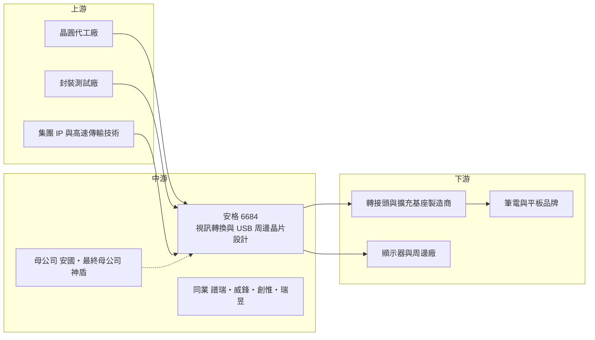

# 6684 安格

> 上櫃｜[[產業索引-半導體業|半導體業]]｜上市（櫃）日期 2021/08/11

# 第一章：企業模式與商業藍圖

> [!info] 撰寫說明
> 本文由 Claude 依公開資料整理，架構比照 [[2330台積電]] 的四章研究，資料截至 2026-10-08。財務數字來源：Goodinfo 歷年經營績效頁、理財周刊安國集團報導、工商時報 2021/08/12 與 2022 年合併案報導、nStock 公司簡介、Yahoo 股市公司基本資料；產業描述為整理性內容，尚未逐條比對原始文件。#待校對

在評估單一個股的長期投資價值時，首要步驟是拆解企業的底層獲利邏輯。本章針對安格科技（股票代號：6684，以下簡稱安格）的商業模式進行定性分析，說明這家影像傳輸介面晶片設計公司在遠距需求高峰後為何陷入虧損，以及它在神盾、安國集團中的角色。

## 一、核心定位：多媒體影像轉換晶片的小型設計公司

安格成立於 2010 年，2021 年 8 月上櫃，是一家 [[Fabless]] 型態的 IC 設計公司，主要產品是多媒體視訊轉換控制晶片。所謂視訊轉換，是指把一種影像介面的訊號轉成另一種，例如把筆電的 [[USB Type-C]] 或 [[DisplayPort]] 訊號轉成螢幕常用的 [[HDMI]] 或 VGA。這類晶片常見於轉接頭、擴充基座（[[Docking Station]]）、螢幕與平板周邊。

安格隸屬於神盾與安國集團。依 nStock 整理的公司資料，[[8054安國]] 及其子公司合計持有安格 31.51% 股權，為最大股東與母公司，[[6462神盾]] 為最終母公司；董事長羅森洲同時是神盾的董事長。神盾在 2021 年入主安國後，集團逐步把高速傳輸、介面晶片與 [[IP]] 授權整合為一個事業群，安格是其中負責影像轉換晶片的成員。

2023 年 4 月，安格以[[股份轉換]]方式取得同集團的展匯科技 100% 股權，展匯每 1 股換發安格 0.6 股，展匯隨後下櫃。展匯原本專注於 USB 影像控制、USB 集線器（Hub）與讀卡機控制晶片。依公司資料，這次交易被判定為[[反向併購]]，會計上以展匯為延續主體，因此合併後的歷年財務數字需要謹慎解讀。

## 二、終端應用／產品板塊：影像轉換加 USB 周邊

安格沒有公開揭露各產品線的營收比重，因此這裡不畫圓餅圖，改以產品線說明。合併展匯後，公司的產品可以分為兩大類：

* **視訊轉換控制晶片：** VGA、HDMI、DisplayPort 與 Type-C 之間的影像轉換晶片，是安格的本業。2023 年推出支援 4K/60Hz 的 USB Type-C 視訊轉換新產品，整合展匯的 USB 技術。
* **USB 周邊控制晶片：** 來自展匯的 USB 影像控制、USB 集線器與讀卡機晶片，以及公司持續開發的 [[USB4]] 相關產品線。

終端應用高度集中在 PC 與筆電周邊。依 2022 年工商時報報導，安格的 USB 產品高度依賴筆電及其配件，客戶群涵蓋筆電、平板、智慧型手機與顯示器的外接裝置製造商。這個集中度解釋了公司營收為何在遠距工作高峰時暴增、高峰過後又快速下滑。

## 三、資本轉化邏輯（營運模式）：高毛利、高研發占比的設計公司

安格的商業模式是典型的小型 IC 設計公司：毛利率高、研發費用占比高。2019 至 2025 年毛利率大多在 38% 至 59%，代表產品本身具有不錯的附加價值；但營收規模只有 3 至 6 億元，研發與管理費用相對固定，一旦營收下滑，營業利益就會迅速轉為虧損。

2021 年是這個模式的高峰：遠距工作與學習帶動筆電周邊需求，營收 6.23 億元、毛利率 58.7%、營業利益率 29.4%、EPS 6.59 元。之後 PC 市場進入庫存調整，加上合併展匯後費用擴大，2023 年營業利益率降到 -67.7%、2024 年 -55.6%。這組數字說明，小型設計公司的[[營運槓桿]]極高，營收規模是否能跨過損益兩平點，比毛利率本身更重要。

## 四、企業長期藍圖：USB4 與集團整合

依 2022 年合併案報導，安格與展匯合併後的目標是整合雙方技術、客戶與銷售通路，組成超過 100 名工程師的中型設計團隊，加速 USB 相關 IP 開發，並切入 Type-C 與 USB4 市場。USB4 整合了資料、影像與充電於單一 Type-C 介面，是未來筆電周邊的主流規格；安格若能在 USB4 擴充基座與轉換晶片取得一席之地，才有機會讓營收回到損益兩平以上。

從集團角度看，神盾、安國、安格與其他子公司的分工逐漸清楚：安國轉型為客製化晶片（[[ASIC]]）與 IP 授權公司，神盾則從指紋辨識延伸到 IP 與感測，安格負責影像與 USB 介面產品。集團整合能否帶來研發資源共享與客戶交叉銷售，是安格長期能否扭轉虧損的關鍵之一。

# 第二章：護城河深度與競爭優勢

在長期價值投資中，「護城河」指企業抵禦競爭、維持超額利潤的保護機制。本章分析安格的競爭條件、主要對手，以及它在影像與 USB 介面市場中的相對位置。

## 一、護城河的核心組成要素

安格目前的護城河很窄，連續虧損是最直接的證據。以下三點是公司可依賴的條件：

* **1. [[高速序列傳輸]]與影像轉換技術：** 視訊轉換晶片需要處理高速序列訊號、影像格式轉換與相容性問題。安格長年累積的相容性資料庫，以及仍維持在約五成的毛利率，顯示產品具有一定的技術附加價值。
* **2. 集團資源：** 神盾與安國集團擁有 IP、高速傳輸與 ASIC 能力，安格可以借用集團的技術與客戶關係，降低單打獨鬥的研發成本。
* **3. 周邊客戶的設計導入：** 轉接頭與擴充基座廠商一旦採用某款晶片，同一產品世代內通常不會更換，提供短期的訂單黏著度；但每一代新產品都會重新比價，黏著度有限。

## 二、全球主要競爭對手格局

| 對手 | 定位 | 對安格的威脅 |
|---|---|---|
| [[4966譜瑞-KY]] | 高速介面與顯示時序晶片大廠 | 在 DisplayPort 與 USB-C 轉換晶片擁有規模與品牌客戶 |
| [[6756威鋒電子]] | USB 集線器與 USB-C 控制晶片 | 在 USB Hub 與擴充基座市場直接競爭 |
| [[6104創惟]] | USB 集線器與讀卡機控制晶片 | 與展匯原有的 Hub 與讀卡機產品重疊 |
| [[2379瑞昱]] | 大型 IC 設計公司，產品線涵蓋影像與 USB | 可用整合方案與價格優勢搶單 |
| Analogix、Synaptics、中國龍迅等 | 國際與中國影像介面晶片廠 | 在轉換晶片市場以完整產品線或低價競爭 |

註：報導未具名競爭對手，表中依產業結構整理（推估）。

## 三、優勢轉化：守得住／守不住／觀察重點

* **守得住：** 需要特殊相容性或客製化的利基轉換晶片，以及集團內部可以協同開發的產品。這些產品的競爭者較少，毛利率可以維持。
* **守不住：** 標準化的 HDMI、USB Hub 與讀卡機晶片。這些市場已有大廠與中國業者以規模與價格競爭，小型設計公司很難取得足以覆蓋研發費用的營收。
* **觀察重點：** 第一是 USB4 相關產品何時量產並貢獻營收；第二是營業利益率能否從 2025 年的 -34.4% 持續收斂到損益兩平；第三是集團是否進一步整合安格與其他子公司的業務。

# 第三章：財務體質與盈利規模

資料日期：2026-10-08。數字取自 Goodinfo 歷年經營績效頁、理財周刊與工商時報報導，表格是撰寫當時的快照；最新月營收、毛利率、累計 EPS 由自動排程寫在本筆記的屬性欄位（月營收、毛利率、累計EPS 等）。#待校對

財務報表是檢驗護城河是否真實存在的最終標準。本章用多年度的三率、ROE 與資本報酬，檢視安格在遠距需求高峰後的獲利品質。由於 2023 年的股份轉換被判定為反向併購，合併財報以展匯為延續主體，2022 年以前的數字與不同來源可能存在口徑差異，閱讀時需特別留意。

## 一、獲利能力的基石：三率

| 年度 | 營收（新台幣） | [[毛利率]] | [[營業利益率]] | EPS（元） | [[ROE]] |
|---|---|---|---|---|---|
| 2021 | 6.23 億 | 58.7% | 29.4% | 6.59 | 23.5% |
| 2022 | 4.15 億 | 47.1% | 0.14% | 0.18（另有報導為 1.4） | 0.63% |
| 2023 | 3.58 億 | 32.4% | -67.7% | -6.38 | -20.6% |
| 2024 | 3.75 億 | 38.6% | -55.6% | -4.24 | -12.6% |
| 2025 | 3.17 億 | 49.8% | -34.4% | 1.57 | 3.39% |

註：表中數字取自 Goodinfo；理財周刊報導 2022 年營收 4.2 億元、EPS 1.4 元，與 Goodinfo 的 0.18 元不一致，推估與反向併購後的重編口徑有關。2019 與 2020 年營收分別為 2.52 億與 3.44 億元，EPS 0.06 與 2.00 元。

* **[[毛利率]]：** 2023 年降到 32.4% 的谷底，2025 年回升到 49.8%，代表庫存調整與產品組合已逐步改善。毛利率回升是正面訊號，但對規模小的設計公司而言，毛利率不是問題核心。
* **[[營業利益率]]：** 2023 至 2025 年連續三年大幅虧損。以 2025 年為例，營業虧損約 1.09 億元（3.17 億 × -34.4%），表示營收需要大幅成長才能覆蓋現有費用結構。合併展匯後的研發團隊擴大，提高了損益兩平門檻。
* **2025 年 EPS 轉正：** 2025 年本業仍虧損，但稅後淨利約 0.70 億元、EPS 1.57 元，代表業外收益約 1.8 億元（推算），具體來源本次未查得，不宜視為本業轉機。

## 二、[[ROE]]：資本效率

以 2021 至 2025 年計算，近 5 年平均 ROE 約 -1.1%（推算：23.5、0.63、-20.6、-12.6、3.39 的簡單平均）。高峰的 2021 年 ROE 23.5%，之後連續數年低於零或接近零，說明公司的獲利能力高度依賴短期需求，尚未建立穩定的資本報酬。

營收方面，2021 年 6.23 億元到 2025 年 3.17 億元，4 年年複合成長率約 -15.5%（推算）。若從 2019 年的 2.52 億元起算，6 年年複合成長率約 3.9%（推算），代表 2021 年的高峰屬於一次性需求，長期營收規模大致在 3 至 4 億元之間。

## 三、資本支出與自由現金流

* **資本支出：** 安格為 Fabless 公司，資本支出主要為研發設備與光罩，本次未查得逐年金額，依營運模式判斷占營收比重低（推估）。
* **自由現金流：** 2023 至 2025 年本業連續虧損，推估營業現金流偏弱（逐年數字未查得）。公司以上櫃募得資金與合併取得的資產支撐研發，股東權益以 2025 年淨利 0.70 億 ÷ ROE 3.39% 推算約 20.6 億元，相對營收規模仍有一定的財務緩衝。
* **現金股利：** 逐年現金股利本次未查得。Goodinfo 統計顯示 2019 至 2026 年股利發放年度的平均現金股利約 1.02 元，屬於不穩定的配息紀錄。

## 四、[[ROIC]] 與 [[WACC]]：價值創造利差

**ROIC 推算：** 安格 2023 至 2025 年營業利益為負，ROIC 為負值。以 2025 年為例，營業虧損約 1.09 億元，投入資本以推算的股東權益約 20.6 億元近似（有息負債未查得，推估不多），ROIC 推算約 -5.3%（虧損不計稅盾）。2023 年營業虧損約 2.42 億元，平均股東權益以淨損 2.40 億 ÷ ROE 20.6% 推得約 11.7 億元，ROIC 推算約 -21%。只有 2021 年營業利益約 1.83 億元、稅後約 1.46 億元，以淨利 1.48 億 ÷ ROE 23.5% 推得股東權益約 6.3 億元，ROIC 推算約 23%。

**WACC 推算：** 採 CAPM，台灣 10 年期公債殖利率取 1.75%，市場風險溢酬 6%，β 取 IC 設計中小型股常見值約 1.2（未查得來源數字），股東權益成本約 8.95%。借款不多，WACC 推算約 9%。

**結論：** 除了 2021 年的需求高峰，安格多數年度的 ROIC 都低於約 9% 的 WACC，近三年更是負值，代表公司尚未建立長期創造價值的能力。關鍵在於營收規模：以 2025 年約五成的毛利率估算，若營業費用維持在約 2.67 億元（3.17 億 × 49.8% 的毛利加上 1.09 億元營業虧損），營收需要達到約 5.4 億元、約為目前的 1.7 倍，營業利益才可能轉正（推算）。USB4 新產品與集團整合能否帶來這樣的成長，是評估安格的核心問題。

# 第四章：總體風險與地緣政治

任何企業都無法脫離宏觀環境獨立存在。本章分析安格長期必須面對的地緣政治、產業週期、營運與技術風險。

## 一、地緣政治

安格的客戶以轉接頭、擴充基座與顯示器周邊製造商為主，這些產品大多在中國生產。美國對中國製電子產品的關稅，以及品牌客戶把生產移往東南亞，可能改變客戶的採購節奏與供應鏈。另一方面，中國本土介面晶片廠在國產化政策支持下崛起，可能在中國市場以價格取代台灣晶片。公司的晶圓代工與封測主要在台灣（推估），與其他台灣半導體公司面臨相同的兩岸風險。

## 二、產業週期與市場結構

安格的需求高度跟著 PC 與筆電周邊週期走。2020 至 2021 年遠距需求使營收翻倍，2022 至 2024 年 PC 庫存調整又使營收大幅下滑。PC 市場成熟，長期出貨量大致持平，周邊轉換晶片的需求主要來自介面規格更新，例如從 USB-C 走向 USB4、顯示規格提高解析度與更新率。市場結構方面，轉換晶片的競爭者眾多，大型設計公司可用整合方案壓縮小廠的空間。

## 三、營運環境的隱性風險

* **規模不足：** 年營收約 3 億元，難以支撐大型研發團隊，新規格開發速度可能落後大廠。
* **財報口徑與治理：** 反向併購使歷年財務比較變得複雜，投資人需要閱讀原始財報附註才能正確判讀。集團持股集中，重大決策受集團策略影響。
* **業外收益依賴：** 2025 年由虧轉盈依賴業外收益，這類收益不具持續性。
* **匯率：** 以美元計價銷售，新台幣升值會壓縮營收與毛利。

## 四、科技或法規演進

影像與 USB 介面的長期趨勢是「整合」：USB4 與 Thunderbolt 把資料、影像與充電整合在單一 Type-C 介面，筆電主晶片也逐步內建更多介面功能，這可能減少對外接轉換晶片的需求。另一方面，歐盟要求電子產品統一使用 USB-C 充電介面，加速了 Type-C 周邊的普及，也帶來擴充基座與轉接產品的換機需求。安格能否在 USB4 世代推出具競爭力的產品，決定它在介面整合趨勢中是被淘汰，還是成為利基供應商。

# 專有名詞解析

## 半導體

- **[[Fabless]]**：無晶圓廠的 IC 設計公司，只負責設計與銷售，製造委由晶圓代工廠與封測廠。
- **[[IP]]**：矽智財，可重複授權使用的晶片設計模組，例如高速介面電路，授權方收取授權金與權利金。
- **[[ASIC]]**：特定應用積體電路，為單一客戶或特定用途客製化設計的晶片，開發期長但量產後生命週期長。
- **[[高速序列傳輸]]**：把資料以單一通道高速連續傳送的技術，是 USB、HDMI、DisplayPort 等介面的基礎，英文常稱 SerDes。

## 應用

- **[[HDMI]]**：高畫質多媒體介面，電視、螢幕與遊戲機最常用的影音傳輸規格。
- **[[DisplayPort]]**：由 VESA 制定的顯示介面規格，常見於電腦螢幕與筆電，可透過 USB-C 傳輸。
- **[[USB Type-C]]**：正反面皆可插入的 USB 接頭規格，可同時傳輸資料、影像與電力，已成為筆電與手機主流介面。
- **[[USB4]]**：新一代 USB 傳輸規格，以 Type-C 接頭提供最高 40Gbps 以上的傳輸速度，並整合影像與充電功能。
- **[[Docking Station]]**：擴充基座，透過一條線把筆電連接到多個螢幕、網路與 USB 裝置的周邊產品。

## 金融

- **[[反向併購]]**：名義上的收購方在會計上被視為被收購方的合併方式，合併後財報以實質主導的一方為延續主體。
- **[[股份轉換]]**：以發行新股交換目標公司全部股份的併購方式，目標公司成為百分之百子公司並下市櫃。
- **[[營運槓桿]]**：固定成本占比高的企業，營收小幅變動會造成獲利大幅變動的現象。

# 核心供應鏈

## 1. 上游：製造與技術來源
- 晶圓代工與封測：公司未揭露合作廠商名稱
- 集團技術資源：[[8054安國]]、[[6462神盾]] 的 IP 與高速傳輸技術

## 2. 中游：安格本身、集團與同業
- 母公司：[[8054安國]]（合計持股 31.51%）；最終母公司：[[6462神盾]]
- 2023 年股份轉換併入：展匯科技（原上櫃代號 6594，已下櫃）
- 台灣同業：[[4966譜瑞-KY]]、[[6756威鋒電子]]、[[6104創惟]]、[[2379瑞昱]]
- 國際與中國同業：Analogix、Synaptics、龍迅

## 3. 下游：周邊製造商與終端
- 轉接頭、擴充基座與顯示器周邊製造商（未具名）
- 終端：筆電、平板、智慧型手機與顯示器的外接裝置

## 最新新聞
<!-- news:start -->
<!-- news:end -->

## 相關連結
- [公開資訊觀測站](https://mopsov.twse.com.tw/mops/web/t05st03?step=1&firstin=1&co_id=6684)
- [Goodinfo](https://goodinfo.tw/tw/StockDetail.asp?STOCK_ID=6684)
- [Yahoo 股市](https://tw.stock.yahoo.com/quote/6684)
- [鉅亨網新聞](https://www.cnyes.com/twstock/6684/news)
