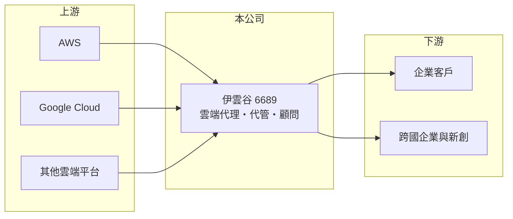

# 6689 伊雲谷

> 上市｜[[產業索引-數位雲端|數位雲端]]｜上市（櫃）日期 2022/09/13

# 第一章：企業模式與商業藍圖

> [!info] 撰寫說明
> 精簡版，由 Claude 依公開資料整理，架構比照 [[2330台積電]]，資料截至 2026-10-08。來源：證交所開放資料（基本資料、營益分析、資產負債、綜合損益、本益比殖利率）、Goodinfo 年度經營績效、MoneyDJ 公司基本資料（營收比重、股利）。合作雲端平台與海外據點為整理性描述，尚未逐條比對原始文件。#待校對

本章說明伊雲谷（6689）作為[[雲端代管服務商]]的商業模式。

- **核心業務：** 伊雲谷成立於 2013 年，2022 年 9 月上市，英文名稱 eCloudvalley。公司替企業代理採購公有雲資源（例如 [[AMZN亞馬遜]] 的 AWS、[[GOOGL谷歌]] 的 Google Cloud），並提供架構規劃、系統搬遷、帳務管理與維運服務。依 MoneyDJ 2025 年資料，雲端服務占營收 99.5%。
- **營收結構：** 公有雲的使用費會全額認列為伊雲谷的營收，因此營收規模很大（2025 年約 125 億元），但其中大部分要付給雲端原廠，[[毛利率]]只有約 10%。真正的附加價值來自顧問、搬遷與代管服務，以及原廠給予的回饋獎勵。
- **營運據點：** 總部在新北市三重，業務涵蓋台灣、中國大陸與東南亞市場（各地比重未查得）。跨國企業客戶需要在多個地區同時使用雲端，區域布局是承接這類客戶的基礎。
- **長期方向：** 企業上雲與 AI 應用推升雲端用量，是長期成長動能。伊雲谷的課題是提高高毛利的服務占比，例如資料分析、生成式 AI 導入與資安代管，避免淪為只賺轉售差價的通路商。

# 第二章：護城河深度與競爭優勢

本章分析伊雲谷在雲端服務市場的護城河。

- **競爭優勢：** 雲端原廠對合作夥伴有分級認證，高階認證需要累積大量通過考試的工程師與成功案例，取得後可以拿到較好的折扣與原廠商機轉介。企業一旦把系統交給代管商維運，更換廠商需要重新交接帳務與架構，具有一定的轉換成本。
- **主要對手：** 台灣的雲端代管同業包括 [[6214精誠]] 旗下團隊、[[2412中華電]] 的雲端服務、[[6811宏碁資訊]] 等，國際上則有大型系統整合商。雲端原廠也可能直接服務大型客戶，壓縮代理商空間。
- **觀察重點：** 第一是營業利益率能否從 2025 年的 0.7% 回升到 2021 年 2% 以上的水準。第二是 AI 相關服務能否帶動毛利率。第三是原廠夥伴政策的變化，例如回饋獎勵縮減或直售比例提高。

# 第三章：財務體質與盈利規模

資料日期：2026-10-08，表格是撰寫當時的快照；最新月營收、毛利率、累計 EPS 由自動排程寫在本筆記的屬性欄位（月營收、毛利率、累計EPS 等）。#待校對

本章用多年度數字檢視伊雲谷規模擴張與獲利率之間的落差。

| 年度 | 營收（新台幣） | [[毛利率]] | [[營業利益率]] | EPS（元） | [[ROE]] |
|---|---|---|---|---|---|
| 2021 | 101 億 | 10.6% | 2.44% | 3.40 | 12.1% |
| 2022 | 86.2 億 | 12.7% | 1.36% | 1.61 | 4.41% |
| 2023 | 98.2 億 | 12.9% | 1.35% | 2.70 | 5.91% |
| 2024 | 127 億 | 10.7% | 0.67% | 2.26 | 3.74% |
| 2025 | 125 億 | 10.5% | 0.74% | 2.31 | 4.26% |

- **營收規模：** 2020 年營收 70.3 億元，2020 至 2025 年營收年複合成長率約 12.2%。依證交所資料，2026 年上半年營收約 61.2 億元、EPS 0.71 元，營業利益率 0.65%。
- **獲利：** 營收成長，但營業利益率由 2021 年的 2.4% 降到 1% 以下，近五年平均 ROE 約 6.1%。2023 年後 EPS 高於本業所能支撐的水準，推估有利息收入等業外貢獻。
- **財務特色：** 2026 年第二季歸屬母公司權益約 28.9 億元，每股淨值 42.67 元；非流動負債約 2.4 億元。依 MoneyDJ，近年現金股利維持每股 2 元左右，配息穩定。
- **[[ROIC]] 與 [[WACC]]：** 2025 年營業利益約 0.93 億元（125 億 × 0.74%），稅後約 0.74 億元；投入資本以股東權益 28.9 億元加上以非流動負債 2.4 億元近似的有息負債，約 31.3 億元，ROIC 約 2.4%（推算）。WACC 以 CAPM 推估：無風險利率 1.75%、市場風險溢酬 6%、β 用常見值 1.0，股東權益成本約 7.75%；負債成本 2.5%、稅後 2.0%；股權權重約 92%，WACC 約 7.3%（推算）。ROIC 明顯低於 WACC，代表目前的本業報酬不足以涵蓋資金成本，提高服務毛利是關鍵。

# 第四章：總體風險與地緣政治

本章整理伊雲谷長期必須面對的風險。

- **產業週期：** 企業雲端支出與景氣相關，經濟轉弱時企業會優化雲端用量、砍掉閒置資源，代理商營收會跟著下降。2022 年營收衰退就是一例。
- **營運風險：** 公司高度依賴少數雲端原廠，原廠調整合作夥伴政策、折扣或回饋機制，會直接衝擊毛利。低毛利結構下，客戶倒帳或帳款延遲的影響會被放大。
- **其他風險：** 中國大陸業務面臨兩岸政策與資料在地化法規；跨國營運帶來匯率風險；雲端與 AI 人才競爭激烈，工程師流動率高會影響服務品質。

# 專有名詞解析

## 應用

- **[[雲端代管服務商]]**：代理公有雲資源並提供架構設計、搬遷與維運的服務商，英文常稱 MSP（Managed Service Provider）。
- **[[公有雲]]**：由 AWS、Google Cloud、Azure 等業者提供、依用量計費的共享運算與儲存資源。

## 金融

- **[[ROIC]]**：投入資本報酬率，稅後營業利益除以投入資本，衡量本業運用資金創造報酬的能力。
- **[[WACC]]**：加權平均資金成本，股東與債權人要求報酬率的加權平均，ROIC 高於 WACC 才代表創造價值。

# 核心供應鏈

- 上游：公有雲原廠 [[AMZN亞馬遜]]（AWS）、[[GOOGL谷歌]]（Google Cloud），以及其他雲端平台（實際合作清單請校對）。
- 下游／客戶：台灣、中國大陸與東南亞的企業客戶，涵蓋零售、遊戲、製造與金融等產業（實際比重未查得）。
- 同業：[[6214精誠]]、[[2412中華電]]、[[6811宏碁資訊]]。

## 最新新聞
<!-- news:start -->
<!-- news:end -->

## 相關連結
- [公開資訊觀測站](https://mopsov.twse.com.tw/mops/web/t05st03?step=1&firstin=1&co_id=6689)
- [Goodinfo](https://goodinfo.tw/tw/StockDetail.asp?STOCK_ID=6689)
- [Yahoo 股市](https://tw.stock.yahoo.com/quote/6689)
- [鉅亨網新聞](https://www.cnyes.com/twstock/6689/news)
