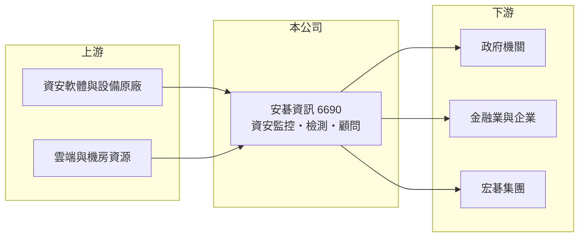

# 6690 安碁資訊

> 上櫃｜[[產業索引-數位雲端|數位雲端]]｜上市（櫃）日期 2019/10/30

# 第一章：企業模式與商業藍圖

> [!info] 撰寫說明
> 精簡版，由 Claude 依公開資料整理，架構比照 [[2330台積電]]，資料截至 2026-10-08。來源：櫃買中心開放資料（基本資料、資產負債、綜合損益、本益比殖利率）、Goodinfo 年度經營績效、MoneyDJ 公司基本資料（營收比重、股利；頁面部分亂碼）。服務內容與客戶結構為整理性描述，尚未逐條比對原始文件。#待校對

本章說明安碁資訊（6690）以資安監控為核心的服務模式。

- **核心業務：** 安碁資訊成立於 2000 年，2019 年 10 月上櫃，屬於 [[2353宏碁]] 集團（官網為 acercsi.com，持股比例請校對）。公司主要提供[[資安監控中心]]服務，也就是 24 小時監看客戶的網路與系統紀錄、偵測入侵並協助應變，另外也提供資安檢測、顧問與網路維運服務。
- **營收結構：** 依 MoneyDJ 2025 年資料，主要業務類別占營收約 88%，其他約 12%（頁面類別名稱亂碼，推估主要類別為資安與資訊服務）。資安監控多採年度或多年期合約，收入具有持續性，[[毛利率]]約 40%，明顯高於一般系統整合公司。
- **營運據點：** 總部在台北市南港。資安監控需要自建監控中心與分析平台，並維持大量值班分析人員，規模越大，單位客戶的監控成本越低。
- **長期方向：** 台灣《資通安全管理法》要求公務機關與關鍵基礎設施落實資安防護，金融業與上市櫃公司的資安要求也逐年提高，這是長期且由法規驅動的需求。安碁的課題是把監控能量延伸到雲端、AI 與營運技術（OT）場域。

# 第二章：護城河深度與競爭優勢

本章分析安碁資訊的護城河。

- **競爭優勢：** 資安監控的價值建立在長期累積的威脅情資與事件處理經驗，客戶一旦把監控交給服務商，更換時需要重新導入感測器與調校規則，轉換成本高。公部門客戶多要求服務商具備相關認證與實績，新進者不易取得資格。宏碁集團的背景也提供了品牌信用與企業客戶管道。
- **主要對手：** 國內資安服務同業包括 [[2412中華電]] 旗下的中華資安國際、[[6214精誠]]、[[6811宏碁資訊]] 的部分業務，以及 [[5410國眾]]、[[6416瑞祺電通]] 等資安整合商；國際資安廠商也直接提供託管服務。
- **觀察重點：** 第一是毛利率能否維持在 40% 上下。第二是營收成長能否延續 2020 至 2025 年約 25% 的年複合成長。第三是增資後的資金運用與 ROE 能否回升。

# 第三章：財務體質與盈利規模

資料日期：2026-10-08，表格是撰寫當時的快照；最新月營收、毛利率、累計 EPS 由自動排程寫在本筆記的屬性欄位（月營收、毛利率、累計EPS 等）。#待校對

本章用多年度數字檢視安碁資訊的成長與資本效率。

| 年度 | 營收（新台幣） | [[毛利率]] | [[營業利益率]] | EPS（元） | [[ROE]] |
|---|---|---|---|---|---|
| 2021 | 14.5 億 | 37.5% | 9.14% | 5.11 | 13.2% |
| 2022 | 16.0 億 | 40.1% | 11.6% | 7.92 | 13.4% |
| 2023 | 18.4 億 | 39.8% | 12.6% | 8.66 | 15.2% |
| 2024 | 21.5 億 | 41.5% | 13.7% | 10.13 | 10.5% |
| 2025 | 24.3 億 | 42.4% | 15.0% | 10.22 | 9.97% |

- **營收規模：** 2020 年營收 8.03 億元，2020 至 2025 年營收年複合成長率約 24.8%，是同業中成長較快的一家。依櫃買中心資料，2026 年上半年營收約 12.8 億元、EPS 5.10 元。
- **獲利：** 毛利率與營業利益率逐年改善，代表規模經濟正在發揮。近五年平均 ROE 約 12.5%，2024 年起 ROE 下滑但 EPS 仍成長，推估是增資使股東權益擴大（增資細節未查得）。
- **財務特色：** 2026 年第二季歸屬母公司權益約 30.2 億元，每股淨值 100.76 元，實收資本額約 3.0 億元。依 MoneyDJ，現金股利由 3.0 元逐年提高到最近一年的 9.0 元，配息率高且穩定成長。
- **[[ROIC]] 與 [[WACC]]：** 2025 年營業利益約 3.65 億元（24.3 億 × 15%），稅後約 2.92 億元；投入資本以股東權益 30.2 億元加上以非流動負債 5.8 億元近似的有息負債，約 36.0 億元，ROIC 約 8.1%（推算）。WACC 以 CAPM 推估：無風險利率 1.75%、市場風險溢酬 6%、β 用資訊服務業常見值 0.8，股東權益成本約 6.55%；負債成本 2.5%、稅後 2.0%；股權權重約 84%，WACC 約 5.8%（推算）。ROIC 高於 WACC，且因股東權益中含有大量現金，扣除後的本業 ROIC 實際更高，屬於持續創造價值的公司。

# 第四章：總體風險與地緣政治

本章整理安碁資訊長期必須面對的風險。

- **產業週期：** 資安支出屬於法規與風險驅動，景氣循環影響較小，但政府預算與企業 IT 預算緊縮時，新案導入可能延後。整體而言比一般資訊服務更具防禦性。
- **營運風險：** 資安分析人才稀缺、薪資上漲快，人力成本是最大的費用項目。若監控服務失誤導致客戶受害，除了賠償，也會嚴重影響商譽。
- **其他風險：** AI 自動化偵測工具可能降低監控服務的人力價值，迫使服務商轉型。對公部門與集團客戶的依賴、以及兩岸網路攻擊情勢的變化，都會影響需求與服務壓力。

# 專有名詞解析

## 應用

- **[[資安監控中心]]**：Security Operations Center（SOC），24 小時監看網路與系統紀錄、偵測入侵並啟動應變的服務中心。

## 金融

- **[[ROIC]]**：投入資本報酬率，稅後營業利益除以投入資本，衡量本業運用資金創造報酬的能力。
- **[[WACC]]**：加權平均資金成本，股東與債權人要求報酬率的加權平均，ROIC 高於 WACC 才代表創造價值。

## 產業

- **[[資通安全管理法]]**：台灣規範公務機關與關鍵基礎設施資安責任的法律，帶動政府與特定產業的資安支出。

# 核心供應鏈

- 上游：防火牆、端點防護、日誌分析等資安軟硬體原廠，以及雲端與機房資源（實際合作對象未查得）。
- 下游／客戶：政府機關、關鍵基礎設施、金融業與一般企業，以及 [[2353宏碁]] 集團（實際比重未查得）。
- 同業：[[2412中華電]]（中華資安國際）、[[6214精誠]]、[[5410國眾]]、[[6416瑞祺電通]]。

## 最新新聞
<!-- news:start -->
<!-- news:end -->

## 相關連結
- [公開資訊觀測站](https://mopsov.twse.com.tw/mops/web/t05st03?step=1&firstin=1&co_id=6690)
- [Goodinfo](https://goodinfo.tw/tw/StockDetail.asp?STOCK_ID=6690)
- [Yahoo 股市](https://tw.stock.yahoo.com/quote/6690)
- [鉅亨網新聞](https://www.cnyes.com/twstock/6690/news)
