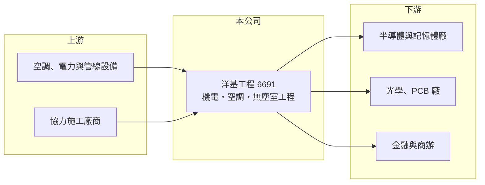

# 6691 洋基工程

> 上市｜[[產業索引-其他電子業|其他電子業]]｜上市（櫃）日期 2022/01/03

# 第一章：企業模式與商業藍圖

> [!info] 撰寫說明
> 精簡版，由 Claude 依公開資料整理，架構比照 [[2330台積電]]，資料截至 2026-10-07。來源：旺得富理財網（洋基工程 2026 年第一季與上半年營運）、自由時報財經（洋基接 200 億元大單）。#待校對

洋基工程是機電與空調系統整合廠商，承攬高科技廠房的[[廠務工程]]與[[無塵室]]。

- **核心業務：** 承攬廠房的[[機電工程]]、空調系統與無塵室工程，客戶涵蓋半導體、光學、PCB 與金融業。
- **營收結構：** 公開資料未列出產業別比重；近年營收主要來自半導體與記憶體廠房大型專案。
- **營運據點：** 以台灣為主，已設立泰國、馬來西亞子公司，美國子公司 2026 年開始貢獻，新加坡子公司籌設中。
- **長期方向：** 受惠 AI 帶動的擴廠潮與供應鏈分散，積極拓展美國與東南亞市場。

# 第二章：護城河深度與競爭優勢

洋基的優勢在高科技廠房實績，近年接單規模快速放大。

- **競爭優勢：** 客戶包括 [[2330台積電]]、[[3008大立光]]、[[2881富邦金]]、[[ASML艾司摩爾]] 與定穎，2025 年接下美系記憶體大廠逾 200 億元工程合約。
- **主要對手：** [[2404漢唐]]、[[6139亞翔]]、[[5536聖暉]]、[[6196帆宣]] 等無塵室與廠務工程商。
- **觀察重點：** 2026 年 3 月[[在手訂單]]約 517.7 億元，公司預期約七成在 2026 年認列，執行進度與毛利率是關鍵。

# 第三章：財務體質與盈利規模

資料日期：2026-10-07，以下數字是撰寫當時的快照；最新月營收、毛利率、累計 EPS 由自動排程寫在本筆記的屬性欄位（月營收、毛利率、累計EPS 等）。#待校對

洋基 2026 年營收大幅成長，單季獲利創新高。

- **營收規模：** 2025 年前三季營收 153.77 億元；2026 年第一季營收 69.77 億元、第二季 111.34 億元，上半年 181.11 億元、年增 84.29%。
- **獲利：** 2025 年前三季[[毛利率]] 18.9%、EPS 17.39 元；2026 年第一季稅後淨利 8.66 億元、EPS 7.19 元。
- **財務特色：** 專案型營收依[[完工比例法]]認列，在手訂單是判斷未來兩年營收的主要依據。

# 第四章：總體風險與地緣政治

洋基的風險在於專案規模放大後的執行壓力。

- **產業週期：** 營收連動半導體與記憶體資本支出，擴廠潮結束後新接單可能明顯下滑。
- **營運風險：** 單一大案金額高，工期延誤、材料與人力成本上升都會壓縮毛利；缺工是工程業共同問題。
- **其他風險：** 美國與東南亞專案面臨當地法規、工會、匯率與管理成本等挑戰。

# 專有名詞解析

## 產業

- **[[廠務工程]]**：晶圓廠、面板廠等的無塵室、氣體、化學品、水電等基礎設施工程。
- **[[無塵室]]**：控制空氣中微粒、溫濕度與壓力的密閉空間，半導體製程必須在高等級無塵室中進行。
- **[[機電工程]]**：廠房與建築的電力、空調、給排水、消防與管線系統的設計與施工。
- **[[在手訂單]]**：已簽約但尚未認列營收的訂單金額，可用來推估未來營收。
- **[[完工比例法]]**：依工程完成進度分期認列營收與成本的會計方法，常用於工程與設備業。

# 核心供應鏈

- 上游：空調、電力與管線設備商，以及協力施工廠商（推估）
- 下游／客戶：[[2330台積電]]、[[ASML艾司摩爾]]、美系記憶體大廠、[[3008大立光]]、定穎、[[2881富邦金]]
- 同業：[[2404漢唐]]、[[6139亞翔]]、[[5536聖暉]]、[[6196帆宣]]

## 供應鏈關係
- 供應給 [[2330台積電]]：高科技廠房無塵室統包（台積電供應鏈 › 上游：台灣建廠、無塵室與廠務系統）

## 最新新聞
<!-- news:start（自動產生，請勿手動編輯此範圍） -->
- 2026-10-08 📰 媒體 19:51｜營收速報 - 洋基工程(6691)9月營收45.95億元年增率高達114.28％｜[鉅亨網](https://news.cnyes.com/news/id/6625903)
- 2026-10-08 📰 媒體 04:51｜營收速報 - 洋基工程(6691)9月營收45.95億元年增率高達114.28％｜新聞快訊｜豐雲學堂｜[永豐金證券](https://news.google.com/rss/articles/CBMidkFVX3lxTE1xY3g3VGZ0UTNwNU9GMmx3RUV2V0QzZS1PQnJyOTB6cWEtVWl5cVVpU0pmZVdZRjVBYUp1d2QtR0Q5YWNEZ0NCODhFX1BlMjdiYjNEVzEyTUxNRjlVa3JhVFNES0t1NWpTRGE0M3I0b0JMMW1XMFE?oc=5)
- 2026-10-05 📰 媒體 16:44｜洋基工程在手訂單旺，鎖定美日半導體案｜[台視全球資訊網](https://news.google.com/rss/articles/CBMikgFBVV95cUxOMmhMc3JObXBlQThUclhXeGFGN0w2SEc1YWtMUUtpY09ZTW5xaGRHcmlESElSS1NRNENyVWUxdExmWWRMR1VkSXMyT1hjdlkyMTRlT0RyeEpxZmtGdDBkYjFyTGY1QVhXVFJwamNYWmEwQ0J2cUhBclo1U3Zjc2xpaUxXNk9pcGo0MWwxVl80VU5mZw?oc=5)
- 2026-10-05 📰 媒體 03:00｜洋基工程、聖暉權證來電- 日報｜[工商時報](https://news.google.com/rss/articles/CBMiX0FVX3lxTE8waE9QZ3VXZ1BrNElnaHpWNVFVZzdxdnZUZG5VYjNxX09kZG5FVWw0a3ZYZzFwSkNmeDNJUWJhT29QcUpDWTh4bkwzcXN3emJZc1VsZEFRYmR1U3VLMTFv?oc=5)

完整紀錄：[[6691洋基工程 新聞]]
<!-- news:end -->

## 相關連結
- [公開資訊觀測站](https://mopsov.twse.com.tw/mops/web/t05st03?step=1&firstin=1&co_id=6691)
- [Goodinfo](https://goodinfo.tw/tw/StockDetail.asp?STOCK_ID=6691)
- [Yahoo 股市](https://tw.stock.yahoo.com/quote/6691)
- [鉅亨網新聞](https://www.cnyes.com/twstock/6691/news)
