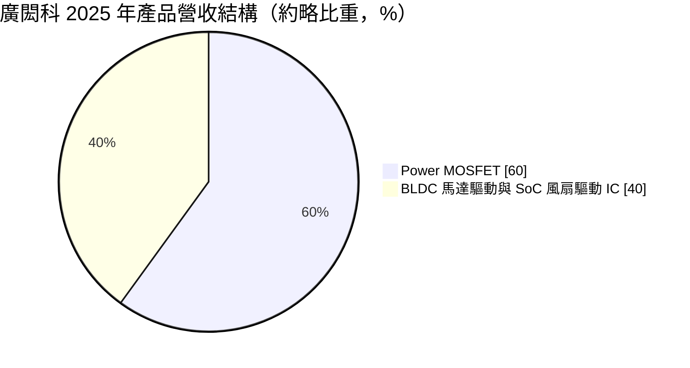
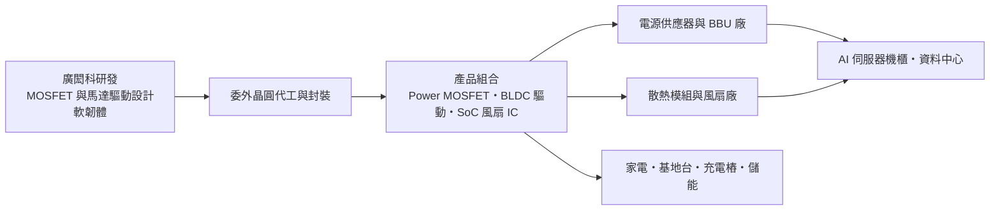
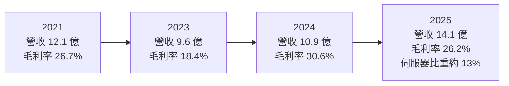
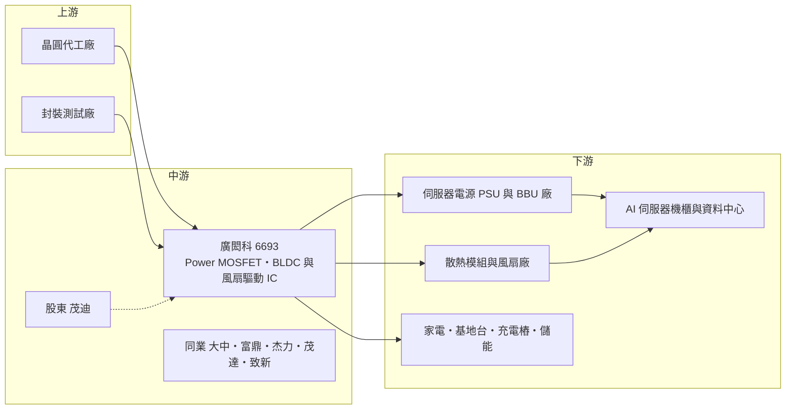

# 6693 廣閎科

> 上櫃｜[[產業索引-半導體業|半導體業]]｜上市（櫃）日期 2022/03/01

# 第一章：企業模式與商業藍圖

> [!info] 撰寫說明
> 本文由 Claude 依公開資料整理，架構比照 [[2330台積電]] 的四章研究，資料截至 2026-10-08。財務數字來源：Goodinfo 歷年經營績效與股利政策頁、富果研究 2026/03/20 與 2026/08/21 法說會備忘錄、優分析 2026/03 報導、旺得富理財網 2022/01/04 報導、Yahoo 股市公司基本資料；產業描述為整理性內容，尚未逐條比對原始文件。#待校對

在評估單一個股的長期投資價值時，首要步驟是拆解企業的底層獲利邏輯。本章針對廣閎科技（股票代號：6693，以下簡稱廣閎科）的商業模式進行定性分析，說明這家同時擁有功率元件與馬達驅動技術的節能 IC 設計公司，如何從消費性電子轉向 AI 伺服器電源與散熱市場。

## 一、核心定位：功率元件加馬達驅動的節能 IC 設計公司

廣閎科成立於 2007 年，2022 年第一季上櫃，總部位於新竹臺元科技園區，董事長兼總經理為林明璋。依旺得富理財網 2022 年報導，太陽能電池廠 [[6244茂迪]] 當時持有約 21.06% 股權，是重要股東。

廣閎科是一家 [[Fabless]] 型態的節能 IC 設計公司，產品分為兩大類。第一類是功率元件，主要是 Power [[MOSFET]]，負責在電源供應器與電池系統中開關電流；第二類是馬達驅動，包括無刷直流馬達（[[BLDC]]）驅動 IC 與散熱風扇用的單晶片（[[SoC]]）驅動 IC，負責控制風扇與馬達的轉速。這兩項技術乍看不同，實際上都屬於「電能轉換與控制」，在伺服器電源與散熱系統中經常一起出現。

廣閎科最獨特的地方，是同時具備功率元件與馬達驅動控制兩種能力，可以提供 IC、[[MCU]]、MOSFET 加上軟韌體的一站式散熱方案。一般功率元件公司只賣 MOSFET，一般驅動 IC 公司只賣控制晶片；廣閎科能把兩者整合成系統方案，對客戶而言可以縮短開發時間、減少相容性問題。

## 二、終端應用／產品板塊：從消費性電子走向 AI 伺服器

* **Power MOSFET（約六成）：** 主打中壓、高電流、低[[導通電阻]]產品，應用於資料中心與伺服器電源供應器（[[PSU]]）、電池備援單元（[[BBU]]）、電池管理系統、儲能、電動載具與工控電源。依 2026 年 8 月法說會，產品已進入 PSU 與 BBU 量產。
* **BLDC 馬達驅動：** 提供 IC、MCU、MOSFET 與軟韌體的完整方案，用於 AI 伺服器機櫃、5G 基地台與充電樁等較高瓦數的散熱系統，以及冰箱、掃地機器人等家電。
* **SoC 風扇驅動 IC：** 高度整合的單晶片方案，用於資料中心周邊、顯示卡與 CPU 散熱風扇等較低瓦數應用。

應用結構的轉變是廣閎科近年最重要的長期變化。依法說會資料，伺服器相關應用占營收比重從 2024 年約 2%，提升到 2025 年約 13%、2026 年第一季約 25%，再到 2026 年第二季約 47%。在約兩年間，公司從一家以消費性電子為主的元件設計公司，轉型為 AI 伺服器電源與散熱供應鏈的一員。2026 年 8 月法說會也提到，產品結構已調整為功率元件與馬達驅動約七比三。

## 三、資本轉化邏輯（營運模式）：系統方案帶動元件銷售

廣閎科的獲利模式有兩個層次。第一層是元件銷售：MOSFET 與驅動 IC 屬於量大、單價不高的產品，毛利率取決於產品規格與晶圓代工成本。2019 至 2025 年毛利率介於 18% 至 31%，低於多數 IC 設計公司，反映功率元件市場的激烈競爭。

第二層是系統方案。在 AI 伺服器散熱這類應用中，客戶需要的是一整套可靠的風扇控制與電源方案，而不是單一元件。廣閎科以驅動 IC 搭配自家 MOSFET 一起銷售，可以提高每個專案的出貨金額，也讓客戶更不容易更換供應商。依 2026 年 3 月法說會，12V 氣冷與 48V [[Sidecar]] 氣冷散熱櫃方案已量產。

晶圓代工成本是重要的變數。依 2026 年 3 月報導，晶圓代工廠已兩度調漲價格，公司也通知客戶調整售價，預計第二季起逐步反映。產品能否順利漲價，代表公司在 AI 伺服器供應鏈中的議價地位；2026 年第二季毛利率回升到約 32%，顯示轉嫁大致成功。

## 四、企業長期藍圖：第三代半導體與高壓直流架構

AI 資料中心的電力需求快速上升，單一機櫃功率從數十千瓦往數百千瓦甚至更高發展，供電架構也開始從傳統的 12V、48V 往高壓直流（[[HVDC]]）演進。依 2026 年法說會與報導，高壓直流系統會導入 400V 至 800V 的電壓，大量採用碳化矽（[[SiC]]）元件，也會增加散熱需求與功率元件數量。

廣閎科的長期布局正是針對這個趨勢：

* **SiC 產品系列：** 已開發並逐步導入客戶設計，目標為高功率機櫃的高效率電源，依 2026 年報導預計 2027 年開始貢獻業績。
* **高壓功率元件：** 針對高壓直流電源架構開始布局。
* **散熱方案升級：** 隨機櫃功率提升，高瓦數 BLDC 驅動方案的需求預期增加。

2026 年 7 月，公司發行 5 億元無擔保[[轉換公司債]]充實營運資金，反映營收快速成長下對存貨與應收帳款的資金需求。整體而言，廣閎科的長期藍圖是從消費性元件供應商，轉型為「AI 資料中心電源與散熱的節能元件供應商」。

# 第二章：護城河深度與競爭優勢

在長期價值投資中，「護城河」指企業抵禦競爭、維持超額利潤的保護機制。本章分析廣閎科的競爭優勢來源、主要對手，以及這些優勢在 AI 伺服器與傳統市場中分別能守住多少。

## 一、護城河的核心組成要素

廣閎科的護城河屬於「窄護城河」，正在形成中，主要由以下三個要素組成：

* **1. 功率元件加驅動控制的整合能力：** 同時掌握 MOSFET 與馬達驅動技術的公司不多，廣閎科能提供從控制 IC、MCU、MOSFET 到軟韌體的完整方案。對散熱客戶而言，整合方案可以減少相容性驗證、縮短開發時間，這是單一元件供應商難以提供的價值。
* **2. AI 伺服器供應鏈的驗證門檻：** 依 2026 年 3 月法說會，公司花了兩到三年才切入伺服器供應鏈。伺服器電源與散熱的可靠度要求遠高於消費性電子，驗證期長，一旦通過，客戶不會輕易更換。這讓先進入者具備時間上的優勢。
* **3. 高電流、低導通電阻的產品定位：** AI 伺服器電源需要承受大電流且發熱低的 MOSFET，廣閎科集中在中壓、高電流產品，與其 AI 伺服器策略一致。

## 二、全球主要競爭對手格局

| 對手 | 定位 | 對廣閎科的威脅 |
|---|---|---|
| [[6435大中]]、[[8261富鼎]]、[[5299杰力]]、[[6651全宇昕]] | 台灣中低壓 MOSFET 設計公司 | 在 MOSFET 標準品與部分伺服器應用直接競爭 |
| [[6138茂達]]、[[8081致新]] | 台灣類比 IC 設計公司，含風扇馬達驅動 IC | 在風扇驅動 IC 市場直接競爭 |
| 英飛凌、安森美等國際大廠 | 全球功率元件龍頭，產品線完整、自有晶圓廠 | 在伺服器高階電源與 SiC 擁有技術與規模優勢 |
| 中國大陸功率元件與驅動 IC 廠 | 政策支持、成本低 | 在家電與消費性應用以價格競爭 |

註：法說會未具名競爭對手，表中依產業結構整理（推估）。

## 三、優勢轉化：守得住／守不住／觀察重點

* **守得住：** AI 伺服器散熱的 BLDC 整合方案，以及已通過驗證的伺服器 PSU、BBU 用 MOSFET。這些應用的驗證門檻高、整合價值明確，是廣閎科目前最具競爭力的領域。
* **守不住：** 家電與一般消費性的 MOSFET 與驅動 IC。這些市場中國同業眾多、價格競爭激烈，廣閎科過去毛利率長期偏低，正是因為消費性比重高。
* **觀察重點：** 第一是 AI 伺服器營收比重提升後，毛利率能否穩定在 30% 以上；第二是 SiC 產品能否在 2027 年取得實質營收；第三是高壓直流架構普及時，公司能否從 12V、48V 世代延伸到 400V 至 800V 世代，而不被國際大廠取代。

# 第三章：財務體質與盈利規模

資料日期：2026-10-08。數字取自 Goodinfo 歷年經營績效與股利政策頁、富果研究法說會備忘錄，表格是撰寫當時的快照；最新月營收、毛利率、累計 EPS 由自動排程寫在本筆記的屬性欄位（月營收、毛利率、累計EPS 等）。#待校對

財務報表是檢驗護城河是否真實存在的最終標準。本章用多年度的三率、ROE、股利與資本報酬，檢視廣閎科從消費性電子轉向 AI 伺服器過程中的獲利品質。

## 一、獲利能力的基石：三率

| 年度 | 營收（新台幣） | [[毛利率]] | [[營業利益率]] | EPS（元） | [[ROE]] |
|---|---|---|---|---|---|
| 2019 | 7.51 億 | 20.7% | 1.79% | 0.33 | 3.53% |
| 2020 | 8.60 億 | 21.2% | 4.55% | 0.72 | 7.3% |
| 2021 | 12.1 億 | 26.7% | 12.6% | 2.91 | 25.1% |
| 2022 | 13.3 億 | 22.8% | 6.74% | 2.48 | 13.1% |
| 2023 | 9.60 億 | 18.4% | 2.16% | 0.36 | 1.43% |
| 2024 | 10.9 億 | 30.6% | 11.0% | 3.33 | 13.2% |
| 2025 | 14.1 億 | 26.2% | 4.56% | -0.09 | -0.35% |

* **[[毛利率]]：** 長期介於 18% 至 31%，波動跟著功率元件景氣與產品組合走。2023 年庫存調整時降到 18.4%，2024 年回升到 30.6%；2025 年降到 26.2%，下半年已逐步回升。2026 年第二季毛利率約 32%，反映伺服器比重提高與成本轉嫁。
* **[[營業利益率]]：** 2025 年營業利益約 6,446 萬元、年減 47%，營業利益率只有 4.56%。主因是營業費用年增 43% 至 3.05 億元，其中包括訴訟相關費用的提列。這類費用屬一次性質，但也說明公司在擴張期面臨的營運風險。
* **2025 年虧損原因：** 依 2026 年 3 月法說會，上半年提列訴訟相關費用，加上匯率波動產生匯損，使全年稅後淨損約 399 萬元、EPS -0.09 元；但第三、四季 EPS 已分別回到 0.62 元與 1.03 元。

## 二、[[ROE]]：資本效率

以 2021 至 2025 年計算，近 5 年平均 ROE 約 10.5%（推算：25.1、13.1、1.43、13.2、-0.35 的簡單平均）。ROE 波動很大，反映過去以消費性電子為主時，獲利容易受景氣與一次性費用影響。2021 年 ROE 25.1% 偏高，部分原因是上櫃前股本較小（推估）。

營收方面，2019 年 7.51 億元到 2025 年 14.1 億元，6 年年複合成長率約 11.1%（推算）。成長主要集中在 2021 年缺貨期與 2025 年 AI 伺服器導入期。

## 三、資本支出與自由現金流

* **資本支出：** 廣閎科為 Fabless 公司，主要支出為研發與測試設備，本次未查得逐年金額，依營運模式判斷占營收比重低（推估）。
* **營運資金：** 營收快速成長時，存貨與應收帳款需要先投入資金。依 2026 年 8 月法說會，存貨週轉天數已由 139 天降到 83 天，負債比率約 38.85%；同年 7 月發行 5 億元轉換公司債，轉換價格 228.1 元，用以充實營運資金。
* **現金股利：** Goodinfo 資料顯示，股利所屬年度 2019 至 2025 年現金股利依序約為 0、0.2、2.22、2.0、1.0、2.0、0.6 元。2025 年雖然 EPS 為負，仍配發 0.6 元，推估來自保留盈餘或資本公積。配息率長期偏中等，穩定度一般。
* **自由現金流：** 逐年數字未查得；以營收高速成長、需要增加營運資金並發行可轉債判斷，成長期的自由現金流可能偏弱（推估）。

## 四、[[ROIC]] 與 [[WACC]]：價值創造利差

**ROIC 推算：** 本次未查得有息負債數字，以負債比率約 39% 中有息負債約 3 億元推估（推估）。股東權益以 2024 年淨利 1.52 億 ÷ ROE 13.2% 推得約 11.5 億元，投入資本約 14.5 億元。2024 年營業利益約 1.20 億元（10.9 億 × 11.0%），稅後約 0.96 億元，ROIC 推算約 6.6%；2025 年營業利益約 0.64 億元，稅後約 0.52 億元，ROIC 推算約 3.6%。2021 年營業利益約 1.52 億元（12.1 億 × 12.6%）、稅後約 1.22 億元，當時股東權益以淨利 1.18 億 ÷ ROE 25.1% 推得僅約 4.7 億元，未計有息負債的 ROIC 推算約 20% 以上，屬缺貨期的特殊高點。

**WACC 推算：** 採 CAPM，台灣 10 年期公債殖利率取 1.75%，市場風險溢酬 6%，β 取功率元件中小型股常見值約 1.3（未查得來源數字），股東權益成本約 1.75% + 1.3 × 6% = 9.55%。負債成本假設 3%，稅後約 2.4%；以權益與有息負債約 8 比 2 估算，WACC 約 0.8 × 9.55% + 0.2 × 2.4% ≈ 8.1%（推算）。

**結論：** 除了 2021 年缺貨期，廣閎科多數年度的 ROIC 落在 3% 至 7%，低於約 8% 的 WACC，代表以消費性電子為主的舊業務並未穩定創造經濟價值。AI 伺服器轉型若讓營業利益率穩定在 10% 以上、資本周轉維持現狀，ROIC 才有機會長期高於 WACC。換言之，廣閎科的長期價值不在過去的財務紀錄，而在這次轉型能否把高毛利的伺服器業務變成常態。

# 第四章：總體風險與地緣政治

任何企業都無法脫離宏觀環境獨立存在。本章分析廣閎科長期必須面對的地緣政治、產業週期、營運與技術風險。

## 一、地緣政治

AI 伺服器供應鏈以台灣廠商為核心，但終端客戶多為美國雲端服務業者，美國對中國的 AI 晶片管制與關稅政策，會影響伺服器的生產地點與出貨節奏。台灣電源與散熱廠商近年把部分產能移往東南亞與墨西哥，上游元件供應商也需要配合在地交貨與認證。廣閎科的晶圓委外生產（推估以台灣代工廠為主），與其他台灣半導體公司面臨相同的兩岸風險。另一方面，家電與消費性業務若以中國客戶為主，則面臨中國功率元件國產化的壓力。

## 二、產業週期與市場結構

廣閎科的營收結構正從消費性電子轉向 AI 伺服器，週期特性也隨之改變。消費性電子的週期跟著家電與 PC 庫存走，2023 年營收年減約 28% 就是例子；AI 伺服器的週期則跟著雲端業者的資本支出走，目前處於擴張期，但若雲端業者縮減投資，伺服器相關訂單可能快速下滑。伺服器比重在兩年間從 2% 升到近五成，代表公司對單一產業的依賴度大幅提高，景氣反轉時的衝擊也會更集中。

## 三、營運環境的隱性風險

* **訴訟風險：** 2025 年提列訴訟相關費用，使全年由盈轉虧。訴訟細節本次未查得，後續若有判決或和解，可能再影響損益。
* **晶圓代工成本：** 晶圓代工廠已兩度調漲價格，若未來需求放緩、客戶不再接受漲價，毛利率會受壓。
* **營運資金與財務槓桿：** 營收快速成長需要大量營運資金，公司已發行可轉債；若成長不如預期，存貨與應收帳款可能成為負擔。可轉債轉換也會稀釋股權。
* **客戶集中：** AI 伺服器客戶多為少數大型電源與散熱廠，議價力強，客戶訂單變動對營收影響大。

## 四、科技或法規演進

資料中心電源架構正從 12V、48V 走向 400V 至 800V 的高壓直流，這會改變功率元件的需求結構：高壓應用將大量採用 SiC 與 GaN 等第三代半導體，而這正是國際大廠投入最多資源的領域。廣閎科若無法及時推出具競爭力的高壓與 SiC 產品，可能在下一代架構中失去目前的位置。散熱方面，AI 晶片功耗上升使液冷比重提高，氣冷風扇的角色可能部分被液冷取代，但液冷系統仍需要泵浦與風扇的馬達驅動，BLDC 技術仍有用武之地。各國的能源效率法規趨嚴，則長期有利於高效率電源與節能馬達驅動產品。

# 專有名詞解析

## 半導體

- **[[MOSFET]]**：金屬氧化物半導體場效電晶體，功率 MOSFET 負責在電路中快速開關電流，是電源轉換與馬達驅動的核心元件。
- **[[導通電阻]]**：MOSFET 導通時本身的電阻值，數值越低代表發熱與能量損失越少，是功率元件最重要的規格之一。
- **[[SoC]]**：系統單晶片，把控制器、驅動電路等多種功能整合在一顆晶片上，可縮小體積、降低成本。
- **[[MCU]]**：微控制器，內含處理器、記憶體與輸入輸出介面的小型晶片，負責控制家電、馬達等設備。
- **[[Fabless]]**：無晶圓廠的 IC 設計公司，只負責設計與銷售，製造委由晶圓代工廠與封測廠。
- **[[SiC]]**：碳化矽，一種第三代半導體材料，耐高壓、耐高溫、切換損耗低，用於電動車、充電樁與資料中心電源。

## 應用

- **[[BLDC]]**：無刷直流馬達，以電子電路取代碳刷換向，效率高、壽命長，廣泛用於風扇、家電與伺服器散熱。
- **[[PSU]]**：電源供應器，把市電轉換成伺服器或電腦可用的直流電，AI 伺服器 PSU 功率大幅提高。
- **[[BBU]]**：電池備援單元，在市電中斷時提供短時間電力，保護資料中心伺服器不當機。
- **[[HVDC]]**：高壓直流供電架構，以 400V 至 800V 直流電直接送到伺服器機櫃，可降低轉換損耗，是 AI 資料中心的新趨勢。
- **[[Sidecar]]**：放在 AI 伺服器機櫃旁的獨立散熱或供電機櫃，用來支援高功率機櫃的散熱與電力需求。

## 金融

- **[[轉換公司債]]**：可在約定條件下轉換為公司股票的債券，到期未轉換時公司須以現金還本。

# 核心供應鏈

## 1. 上游：晶圓代工與封裝
- 晶圓代工與封裝測試：公司未揭露合作廠商名稱；2026 年報導指出晶圓代工廠已兩度調漲價格

## 2. 中游：廣閎科本身、股東與同業
- 重要股東：[[6244茂迪]]（2022 年持股約 21.06%）
- MOSFET 同業：[[6435大中]]、[[8261富鼎]]、[[5299杰力]]、[[6651全宇昕]]
- 驅動 IC 同業：[[6138茂達]]、[[8081致新]]
- 國際同業：英飛凌、安森美

## 3. 下游：伺服器電源與散熱
- 伺服器電源與 BBU 廠：公司未具名；產業中主要伺服器電源廠包括 [[2308台達電]]、[[2301光寶科]]（是否為客戶未查得）
- 散熱模組與風扇廠：公司未具名；產業中主要散熱廠包括 [[3017奇鋐]]、[[3324雙鴻]]、[[2421建準]]（是否為客戶未查得）

## 4. 下游：其他應用
- 家電（冰箱、掃地機器人）、5G 基地台、充電樁、儲能與電動載具

## 最新新聞
<!-- news:start（自動產生，請勿手動編輯此範圍） -->
- 2026-10-06 📰 媒體 17:50｜營收速報 - 廣閎科(6693)9月營收2.46億元年增率高達102.23％｜[鉅亨網](https://news.cnyes.com/news/id/6622825)

完整紀錄：[[6693廣閎科 新聞]]
<!-- news:end -->

## 相關連結
- [公開資訊觀測站](https://mopsov.twse.com.tw/mops/web/t05st03?step=1&firstin=1&co_id=6693)
- [Goodinfo](https://goodinfo.tw/tw/StockDetail.asp?STOCK_ID=6693)
- [Yahoo 股市](https://tw.stock.yahoo.com/quote/6693)
- [鉅亨網新聞](https://www.cnyes.com/twstock/6693/news)
