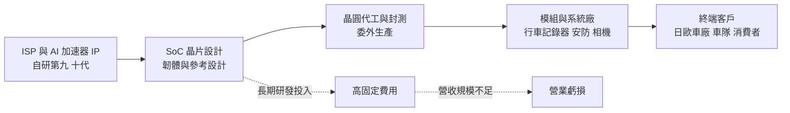
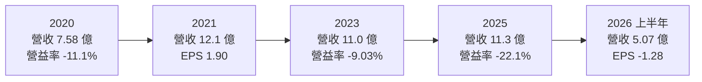
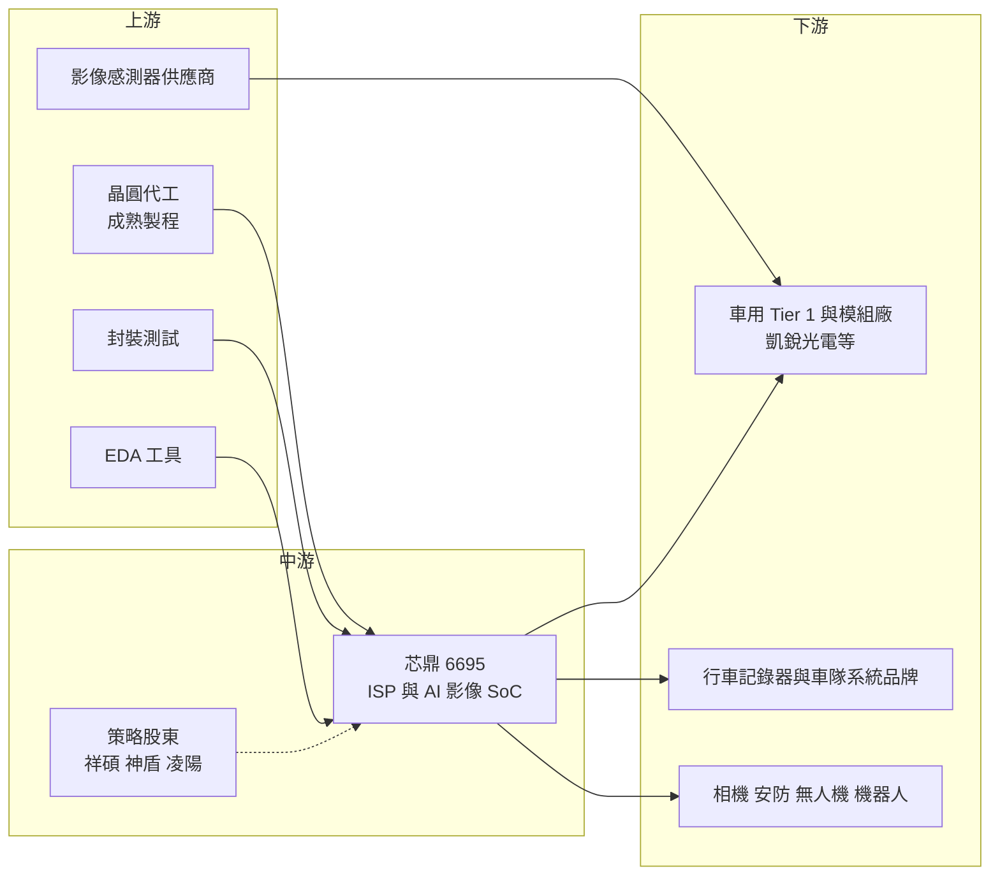

# 6695 芯鼎

> 上市｜[[產業索引-半導體業|半導體業]]｜上市（櫃）日期 2022/11/04

# 第一章：企業模式與商業藍圖

> [!info] 撰寫說明
> 本文由 Claude 依公開資料整理，架構比照 [[2330台積電]] 的四章研究，資料截至 2026-10-08。財務數字來源：Goodinfo 年度經營績效頁、nStock 公司概況頁、Yahoo 股市公司基本資料、優分析 2026 年 7 月法說會報導、經濟日報與科技新報 2026 年 7 月神盾處分持股報導、理財周刊芯鼎專題報導；產業描述為整理性內容，尚未逐條比對原始文件。#待校對

在評估單一個股的長期投資價值時，首要步驟是拆解企業的底層獲利邏輯。本章針對芯鼎科技（股票代號：6695，以下簡稱芯鼎）的商業模式進行定性分析，說明一家從數位相機晶片起家的影像處理 IC 設計公司，如何把核心技術轉向車用影像、安防監控與邊緣 AI，以及這個轉型為什麼到目前為止還沒有轉化為穩定獲利。

## 一、核心定位：以影像訊號處理器為核心的 IC 設計公司

芯鼎成立於 2009 年 12 月，前身是 [[2401凌陽]] 的多媒體數位相機（DSC）產品事業部門，分割獨立後承接了凌陽在數位相機晶片累積的技術與客戶。公司在 2018 年 12 月登錄興櫃，2022 年 11 月上市。芯鼎是典型的 [[Fabless]] 公司，本身不設晶圓廠，只負責晶片設計、韌體與參考設計，晶圓製造與封裝測試委外處理。

芯鼎的核心技術是影像訊號處理器（[[ISP]]）。相機鏡頭後方的影像感測器只能輸出原始的光電訊號，必須經過 ISP 做色彩還原、降噪、寬動態處理，才能變成人眼或 AI 模型可以使用的畫面。依優分析 2026 年 7 月的法說會報導，芯鼎的 ISP 已發展到第九、第十代，並在 2017 年率先把 AI 加速器放進自家的系統單晶片（[[SoC]]），形成「ISP 加 CPU 加 AI 加速器」的平台架構。這個定位的商業意義在於，芯鼎賣的不是單純的影像晶片，而是一套可以讓客戶直接在相機端做影像辨識的運算平台，產品價值會隨著 AI 功能增加而提高。

股權結構是理解芯鼎的另一個關鍵。現任董事長羅森洲同時是 [[6462神盾]] 的董事長，理財周刊報導曾指出神盾持有芯鼎約兩成股權、凌陽集團約兩成、[[5269祥碩]] 約 6.5%。2026 年 7 月，神盾宣布出售部分芯鼎持股，處分後仍持有約 12%；同時祥碩透過參與芯鼎[[私募]]成為最大股東（經濟日報、科技新報）。換句話說，芯鼎的主要股東從「影像感測與指紋辨識」的神盾集團，轉為「高速傳輸介面」的祥碩，這會影響芯鼎未來的產品方向與資源取得。

## 二、終端應用／產品板塊：車用、消費性影像與安防

芯鼎沒有在公開資料中揭露完整的應用別營收比重。理財周刊的專題報導提到車用產品約占營收 44%，毛利率也較高，並稱芯鼎在行車記錄器晶片的全球市占率最高約 17%，但這是某一時點的媒體數字，不代表目前結構，因此本文不畫營收圓餅圖。依 2026 年 7 月的法說會報導，三大板塊的定性描述如下：

* **車用影像監控：** 這是芯鼎營收最穩定的板塊，聚焦日本與歐洲車廠指定的「[[準前裝]]」行車記錄器，以及商用物流車隊管理系統。準前裝是指由車廠或經銷商指定、在出廠前後安裝的設備，認證要求比一般後裝產品嚴格，一旦導入，往往能跟著車款銷售好幾年，因此營收波動較小。
* **消費性影像產品：** 包含數位相機與穿戴式相機。數位相機市場長期被手機取代，但近年出現「復古數位相機」的消費潮流，讓這塊需求回溫。這類產品週期短、受潮流影響大，屬於彈性較高但不穩定的收入來源。
* **低功耗家用安防：** 以電池供電、免插電的安防相機為主，結合 AI 辨識特定動物或人體，鎖定野生動物監測等高單價利基市場。電池供電代表晶片必須極省電，這正是 ISP 加 AI 加速器整合架構的優勢所在。

在技術功能上，芯鼎強調單晶片處理多鏡頭同步（應用於行車記錄器與 360 度環景相機）、可見光與紅外線或熱影像融合、雙鏡頭連續變焦，以及以四顆相機產生深度點雲的[[立體視覺]]避障。這些功能都是為了讓相機「看懂」畫面，而不只是記錄畫面。

## 三、資本轉化邏輯：研發驅動、輕資產但規模不足

芯鼎的營運模式和多數 IC 設計公司相同：前端投入大量研發人力開發 IP 與晶片，晶片量產後交由晶圓代工廠製造，再賣給模組廠或系統廠。這種模式不需要蓋工廠，資本支出很低，但研發費用屬於固定成本，必須有足夠的營收規模才能攤提。

問題正出在規模。依 Goodinfo 數據，芯鼎近十年營收大致在 7.6 億至 12.1 億元之間，毛利率長期維持在 37% 至 46%，代表產品本身有一定的技術價值；但營業利益率只有 2021 至 2022 年兩年轉正，其餘年份都是負值，2025 年營業利益率更降到 -22.1%。也就是說，毛利不足以覆蓋研發與管理費用，問題不在單顆晶片賺不賺錢，而在於整體出貨量撐不起研發開銷。對影像 SoC 這類每一代都要重新投入大量設計資源的產品而言，營收停留在 10 億元上下，長期很難轉為穩定獲利。

## 四、企業長期藍圖：車用[[功能安全]]、[[Physical AI]] 與傳輸整合

* **深化車用：** 芯鼎已取得 ISO 26262 功能安全與 ISO 21434 車用資安的開發流程認證（優分析）。2025 年與 Tier 1 供應商凱銳光電合作推出 4K 車用 AI 影像方案，已通過歐洲車廠驗證，預計 2026 年第一季末上市。車用認證門檻高、生命週期長，若能從行車記錄器延伸到 [[ADAS]] 與電子後視鏡，平均單價與客戶黏著度都會提升。
* **跨入 Physical AI：** 2026 年起鎖定無人機與機器人的邊緣 AI（[[Edge AI]]）視覺平台，以立體視覺避障、多鏡頭同步作為切入點，公司表示相關專案預計 2027 年下半年開始貢獻（依法說會報導的「明年下半年」推估）。這是把既有的影像技術延伸到新的硬體平台，若成功，可以擺脫對行車記錄器與相機市場的依賴。
* **與祥碩結合「感測到傳輸」：** 經濟日報指出，芯鼎可借助祥碩在 USB、PCIe、SATA 等高速介面的技術與市場資源，形成從影像感測到資料傳輸的完整方案。芯鼎也在規劃影像橋接晶片，第二代目標傳輸速度 10 至 25 Gbps。這項整合是芯鼎近年最重要的結構性變化，長期效果仍待觀察。

# 第二章：護城河深度與競爭優勢

在長期價值投資中，「護城河」指企業抵禦競爭、維持超額利潤的保護機制。本章分析芯鼎的護城河構成、全球主要競爭對手，以及這些優勢能否轉化為可持續的獲利。

## 一、護城河的核心組成要素

芯鼎的護城河屬於「窄而尚未變現」的類型：技術累積是真實的，但還沒有轉成穩定的超額利潤。

* **1. 長期累積的 ISP 技術：** ISP 的畫質調校需要大量實拍資料與經驗，從凌陽時期算起，芯鼎在相機影像處理已累積二十年以上。寬動態、低照度、LED 閃爍抑制這類能力很難靠短期投入追上，這是芯鼎毛利率能長期維持在四成上下的原因。
* **2. 車用認證與準前裝客戶關係：** 車用影像產品要通過車廠的可靠度測試與功能安全流程，客戶導入後通常不會輕易更換晶片供應商。日本與歐洲車廠的準前裝案子一旦拿下，可以帶來數年的穩定出貨。
* **3. 低功耗 AI 影像整合：** 把 ISP、CPU 和 AI 加速器整合在一顆省電晶片上，適合電池供電的安防與穿戴裝置。這個利基市場的規模不大，但大廠較少專門經營，給了中小型設計公司生存空間。

## 二、全球主要競爭對手格局

| 對手 | 定位 | 對芯鼎的威脅 |
|---|---|---|
| 安霸（Ambarella） | 美國影像與 AI 視覺 SoC 大廠，產品涵蓋車用、安防、運動相機 | 高階車用與安防 AI 晶片的主要對手，研發規模遠大於芯鼎 |
| 聯詠 [[3034聯詠]] | 台灣大型 IC 設計公司，有行車記錄器與安防 SoC 產品線 | 以規模與成本優勢搶中高階影像 SoC 市場 |
| 中國影像 SoC 業者（如海思、星宸等） | 在安防監控與行車記錄器市場有龐大的中國客戶基礎 | 以低價與在地服務壓縮全球報價，中國客戶市場難以進入 |
| [[QCOM高通]]、[[NVDA輝達]] | 高階車用與機器人運算平台 | 在無人機、機器人與 ADAS 的高階 AI 運算平台占主導地位 |

上表中的對手是依產業結構整理的常見競爭者，芯鼎公開資料並未點名競爭對手，屬整理性內容（推估）。

## 三、優勢轉化：守得住／守不住／觀察重點

* **守得住：** 日本與歐洲車廠的準前裝行車記錄器、車隊管理系統，以及低功耗、需要特殊影像融合功能的利基產品。這些市場看重畫質穩定、認證與長期供貨，價格敏感度較低，也是芯鼎營收最穩定的部分。
* **守不住：** 一般消費性行車記錄器與安防相機的中低階市場。這類產品功能標準化，中國業者能以更低的價格和更快的客製服務取得訂單；芯鼎在這個市場的營收容易隨價格戰流失。2023 年以後營收停在 10 至 11 億元、虧損擴大，可以視為規模不足與價格競爭共同造成的結果（推估）。
* **觀察重點：** 第一，車用 4K AI 影像方案與歐洲車廠專案的實際放量速度；第二，無人機與機器人專案能否在 2027 年後帶來新的營收；第三，祥碩入主後雙方在產品整合與通路上的實際合作，是否讓芯鼎的營收規模跨過損益兩平門檻。

# 第三章：財務體質與盈利規模

資料日期：2026-10-08。數字取自 Goodinfo 年度經營績效頁與 nStock 公司概況頁，表格是撰寫當時的快照；最新月營收、毛利率、累計 EPS 由自動排程寫在本筆記的屬性欄位（月營收、毛利率、累計EPS 等）。#待校對

財務報表是檢驗護城河是否真實存在的最終標準。本章用近十年的三率、[[ROE]] 與資本報酬，檢視芯鼎的技術優勢是否已轉化為股東報酬。

## 一、獲利能力的基石：三率

| 年度 | 營收（新台幣） | [[毛利率]] | [[營業利益率]] | EPS（元） | [[ROE]] |
|---|---|---|---|---|---|
| 2016 | 9.39 億 | 41.5% | -8.62% | -1.52 | -15.7% |
| 2017 | 8.87 億 | 37.1% | -6.90% | -1.28 | -14.2% |
| 2018 | 8.16 億 | 38.6% | -13.3% | -1.82 | -19.5% |
| 2019 | 8.87 億 | 36.6% | -8.49% | -1.13 | -14.1% |
| 2020 | 7.58 億 | 41.3% | -11.1% | -1.07 | -14.8% |
| 2021 | 12.1 億 | 45.6% | 8.27% | 1.90 | 15.3% |
| 2022 | 10.9 億 | 44.7% | 1.27% | 0.80 | 4.57% |
| 2023 | 11.0 億 | 41.4% | -9.03% | -0.68 | -3.74% |
| 2024 | 10.2 億 | 42.2% | -12.1% | -0.41 | -2.27% |
| 2025 | 11.3 億 | 39.2% | -22.1% | -1.83 | -10.7% |
| 2026 上半年 | 5.07 億 | 37.6% | -36.1% | -1.28 | -14.9%（年化） |

這張表最重要的訊息是：芯鼎的毛利率十年來穩定落在 36% 至 46%，但營業利益率只在 2021 與 2022 年轉正。2021 年是全球晶片缺貨、車用與相機需求同時回補的特殊年份，營收跳升到 12.1 億元，研發費用被攤薄，才出現 15.3% 的 ROE。缺貨潮結束後，營收回到 10 至 11 億元，營業利益率又轉為負值，而且虧損逐年擴大。

* **[[毛利率]]：** 長期四成上下，代表 ISP 技術有定價能力，但 2025 年起降到 39% 以下，2026 年上半年為 37.6%，推估與產品組合中消費性產品比重提高、以及晶圓與封測成本上漲有關（推估）。
* **[[營業利益率]]：** 從 2024 年的 -12.1% 惡化到 2025 年的 -22.1%，2026 年上半年進一步到 -36.1%。營收沒有成長，而 AI、車用功能安全與 Physical AI 的研發投入持續增加，是虧損擴大的主因（推估）。
* **長期指標：** 2020 至 2025 年營收年複合成長率約 8.3%（推算），但主要來自 2021 年的跳升；2022 至 2025 年營收幾乎持平。近五年（2021 至 2025）平均 ROE 約 0.6%（推算），十年中有八年 ROE 為負。

## 二、[[ROE]]：資本效率

芯鼎過去十年只有兩年 ROE 為正，近五年平均約 0.6%（推算），代表股東投入的資本長期沒有得到報酬。以 2025 年稅後淨損 1.76 億元、ROE -10.7% 回推，平均股東權益約 16.4 億元（推算）。股本由 2020 年的 7.37 億元增加到 2026 年第二季的 10.7 億元，顯示公司這幾年靠增資與私募補充營運資金，而不是靠自身獲利累積權益。對股東來說，這代表每股價值的成長被稀釋，投資芯鼎主要是在押注轉型成功後的獲利翻轉，而不是現有的資本效率。

## 三、資本支出與自由現金流

芯鼎屬於輕資產 IC 設計公司，資本支出主要是研發設備、光罩與軟體授權，金額不大，具體數字未查得。由於營業利益連續多年為負，營業現金流推估多為負值或接近零（推估），[[自由現金流]]難以長期為正。

股利方面，依 nStock 頁面，芯鼎近五年沒有配發現金或股票股利。在虧損期間，公司以私募與增資維持研發，不適合作為存股標的。2026 年祥碩參與私募成為最大股東，短期內補充了資金，但長期仍需要本業轉虧為盈，才能擺脫依賴外部資金的模式。

## 四、[[ROIC]] 與 [[WACC]]：價值創造利差

**ROIC 推算：** 2025 年營業虧損約 2.50 億元（11.3 億 × -22.1%），因為虧損不計稅，稅後營業利益同樣約 -2.50 億元。投入資本以平均股東權益約 16.4 億元計算，有息負債未查得、IC 設計公司通常不重大，因此視為零（推估）。ROIC 約 -15%（推算）。對照 2021 年獲利最好的一年：營業利益約 1.00 億元（12.1 億 × 8.27%），稅後約 0.80 億元，權益約 8.95 億元（1.37 億 ÷ 15.3%），ROIC 約 8.9%（推算）。

**WACC 推算：** 權益成本以 CAPM 估計，假設台灣 10 年期公債殖利率 1.75%、市場風險溢酬 6%，β 未查得來源數字，採中小型 IC 設計股常見值 1.2，權益成本約 8.95%。有息負債視為不重大，WACC 約 9%（推算）。

**結論：** 芯鼎近十年只有 2021 年的 ROIC 接近 WACC，其他年份都明顯低於資金成本，2025 年的利差約為負 24 個百分點（推算）。這代表以目前的營收規模，芯鼎的本業正在消耗股東資本，而不是創造價值。芯鼎要成為長期創造價值的公司，至少要讓營收規模明顯放大，使四成上下的毛利能夠覆蓋研發費用；車用、Physical AI 與祥碩合作，是決定這件事能否發生的三個變數。

# 第四章：總體風險與地緣政治

任何企業都無法脫離宏觀環境獨立存在。本章分析芯鼎未來必須面對的地緣政治、產業週期、營運與技術風險。

## 一、地緣政治

* **中國市場的雙面影響：** 行車記錄器與安防相機的組裝與品牌大量集中在中國。中國業者在政策鼓勵下優先採用本土晶片，讓芯鼎難以擴大在中國的市占；但另一方面，歐美日客戶基於資安考量排除中國晶片，又為芯鼎這類台灣供應商創造機會。這種「去中國化」需求是芯鼎在安防與車用市場的潛在優勢。
* **美國關稅與供應鏈遷移：** 終端產品多在中國或東南亞組裝後銷往歐美，美國關稅政策改變時，客戶的生產地點與訂單節奏可能大幅調整，連帶影響芯鼎的出貨。
* **台灣生產集中：** 晶片製造仍依賴台灣的晶圓代工與封測產能，面臨與其他台灣半導體公司相同的兩岸風險。

## 二、產業週期與市場結構

* **消費性電子週期：** 數位相機、穿戴式相機與家用安防都屬於消費性產品，需求受景氣與潮流影響大。復古相機熱潮帶來的需求屬於流行性需求，無法假設會長期持續。
* **[[長鞭效應]]：** 行車記錄器與安防相機的通路層層轉手，終端需求小幅轉弱時，品牌與模組廠會同時降低庫存，傳到晶片端的訂單降幅會被放大。2022 年缺貨潮結束後的營收停滯，就有這個效應的影子（推估）。
* **市場結構：** 影像 SoC 市場呈現「高階由大廠掌握、低階由中國廠殺價」的兩端擠壓，中型設計公司必須找到明確利基才能生存。

## 三、營運環境的隱性風險

* **持續虧損與資金需求：** 營業虧損擴大，代表公司需要持續取得外部資金支應研發。增資與私募會稀釋既有股東的持股比例。
* **股權結構變動：** 主要股東由神盾集團轉為祥碩，經營方向與合作重心可能調整。新舊股東之間的資源分配、技術授權與人才留任，都是需要觀察的整合風險。
* **晶圓與封測成本：** 成熟製程與封測報價在 AI 需求排擠下上揚，芯鼎規模小、議價能力有限，成本上升時較難完全轉嫁給客戶，會壓縮毛利率。

## 四、科技或法規演進

* **AI 影像的運算需求升級：** 邊緣 AI 的模型越來越大，影像晶片需要更強的 AI 算力與更先進的製程，研發與光罩成本跟著提高。小型設計公司若無法負擔新製程的投入，產品競爭力可能落後。
* **車用法規：** 歐盟等地區推動車內外影像相關的安全法規（例如駕駛監控、電子後視鏡），長期會擴大車用影像晶片的需求；但相關產品須符合功能安全與資安標準，認證成本高、時間長。
* **手機取代相機：** 手機影像能力持續提升，會繼續壓縮獨立相機的市場。芯鼎能否把技術重心轉到手機無法取代的車用、安防、無人機與機器人，決定其長期市場空間。

# 專有名詞解析

## 半導體

- **[[ISP]]**：影像訊號處理器，把影像感測器輸出的原始訊號轉成可用畫面，負責色彩、降噪與寬動態等處理。
- **[[SoC]]**：系統單晶片，把處理器、記憶體控制、影像處理與 AI 加速器等功能整合在同一顆晶片上。
- **[[Fabless]]**：只做晶片設計、把製造委外給晶圓代工廠的商業模式。
- **[[Edge AI]]**：在終端裝置本身執行 AI 運算，而不是把資料傳到雲端處理，可降低延遲與傳輸成本。

## 應用

- **[[ADAS]]**：先進駕駛輔助系統，例如車道偏離警示、自動緊急煞車，需要大量鏡頭與影像辨識晶片。
- **[[準前裝]]**：由車廠或經銷商指定、在新車交車前後安裝的車用設備，認證要求介於原廠前裝與一般後裝之間。
- **[[功能安全]]**：車用電子須符合 ISO 26262 等標準，確保元件故障時系統仍能維持安全，認證流程長、門檻高。
- **[[Physical AI]]**：讓 AI 透過感測器與機械在真實世界中行動的應用，例如機器人與無人機，需要大量即時影像運算。
- **[[立體視覺]]**：用兩顆以上相機的視差計算物體距離，產生深度資訊，用於無人機避障與機器人導航。

## 金融

- **[[ROE]]**：股東權益報酬率，稅後淨利除以股東權益，衡量公司用股東的錢賺錢的效率。
- **[[ROIC]]**：投入資本報酬率，稅後營業利益除以股東權益加有息負債，衡量本業運用全部資本的效率。
- **[[WACC]]**：加權平均資金成本，股東與債權人要求報酬率的加權平均，ROIC 高於它才算創造價值。
- **[[私募]]**：公司向特定投資人發行新股籌資，通常有轉讓限制，常被用來引進策略股東。
- **[[自由現金流]]**：營業活動現金流減去資本支出，代表企業可自由用於配息、還債或併購的現金。
- **[[長鞭效應]]**：終端需求的小幅變動，沿供應鏈往上游傳遞時被逐級放大，造成上游庫存與訂單劇烈波動。

# 核心供應鏈

## 1. 上游：晶圓代工、封測與設計工具
- 晶圓代工：成熟製程晶圓代工廠，具體合作對象未查得
- 影像感測器（與芯鼎晶片搭配使用）：[[SONY索尼]] 等影像感測器供應商（屬產業常見搭配，個別合作未經公司證實）
- 設計工具：[[SNPS新思科技]]、[[CDNS益華電腦]]

## 2. 中游：芯鼎本身與策略股東
- 最大股東與高速傳輸介面合作：[[5269祥碩]]
- 原主要股東、影像感測合作：[[6462神盾]]
- 前身母公司：[[2401凌陽]]

## 3. 下游：主要客戶與應用
- 車用 Tier 1：凱銳光電（4K 車用 AI 影像方案合作夥伴）
- 日本與歐洲車廠的準前裝行車記錄器、商用車隊管理系統（個別客戶未揭露）
- 消費性相機、低功耗安防、無人機與機器人系統廠

## 4. 同業與競爭者
- 台灣：[[3034聯詠]]
- 國外：安霸（Ambarella）、中國影像 SoC 業者

## 最新新聞
<!-- news:start -->
<!-- news:end -->

## 相關連結
- [公開資訊觀測站](https://mopsov.twse.com.tw/mops/web/t05st03?step=1&firstin=1&co_id=6695)
- [Goodinfo](https://goodinfo.tw/tw/StockDetail.asp?STOCK_ID=6695)
- [Yahoo 股市](https://tw.stock.yahoo.com/quote/6695)
- [鉅亨網新聞](https://www.cnyes.com/twstock/6695/news)
