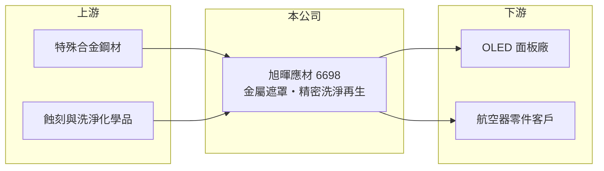

# 6698 旭暉應材

> 上市｜[[產業索引-其他電子業|其他電子業]]｜上市（櫃）日期 2019/11/25

# 第一章：企業模式與商業藍圖

> [!info] 撰寫說明
> 精簡版，由 Claude 依公開資料整理，架構比照 [[2330台積電]]，資料截至 2026-10-07。來源：winvest 旭暉應材 2026 年 8 月營收快訊、nStock 旭暉應材公司簡介。公開資料有限。#待校對

旭暉應材成立於 2007 年，2019 年上市，主要做 [[OLED]] 面板蒸鍍用的金屬遮罩與精密洗淨。

- **核心業務：** 製作與銷售[[精細金屬遮罩]]，並提供遮罩的精密洗淨與再生處理服務。
- **營收結構：** 公開資料未列出比重；另有鋼材二次加工、航空器零件製造等業務。
- **營運據點：** 以台灣為主，資本額約 6.64 億元。
- **長期方向：** 透過航空器零件與精密洗淨等業務分散對 OLED 面板客戶的依賴（推估）。

# 第二章：護城河深度與競爭優勢

旭暉的技術門檻在高精度遮罩製作，但營收規模小、客戶集中。

- **競爭優勢：** 具備金屬遮罩製作與洗淨再生能力，可提供面板廠一站式服務（推估）。
- **主要對手：** 遮罩領域以日本大日本印刷等大廠為主，台灣同業包括 [[6120達運]]。
- **觀察重點：** 營收連續年減，毛利率為負，需觀察何時止跌與新業務能否貢獻。

# 第三章：財務體質與盈利規模

資料日期：2026-10-07，以下數字是撰寫當時的快照；最新月營收、毛利率、累計 EPS 由自動排程寫在本筆記的屬性欄位（月營收、毛利率、累計EPS 等）。#待校對

旭暉營收大幅衰退，連續虧損。

- **營收規模：** 2026 年 8 月營收 6,851.9 萬元、年減 42.39%，1 至 8 月累計約 4.65 億元、年減 31.67%。
- **獲利：** 2025 年全年 EPS -1.65 元；2026 年第二季 EPS -0.95 元，上半年 -1.3 元；[[毛利率]]約 -32.21%。
- **財務特色：** 市值約 21 億元，曾配發 0.5 元現金股利；毛利率轉負代表營收不足以支應固定成本。

# 第四章：總體風險與地緣政治

旭暉的風險集中在面板客戶需求與持續虧損。

- **產業週期：** OLED 面板投資與稼動率波動大，客戶減產時遮罩與洗淨需求同步下滑。
- **營運風險：** 營收規模縮小、固定成本高，虧損若延續將侵蝕淨值。
- **其他風險：** 中國面板廠積極扶植本地供應鏈，可能排擠台灣供應商。

# 專有名詞解析

## 金融

- **[[毛利率]]**：毛利除以營收，反映產品售價扣除直接成本後的獲利空間。

## 產業

- **[[OLED]]**：有機發光二極體，每個像素自行發光，不需背光，用於手機、手錶與高階電視面板。
- **[[精細金屬遮罩]]**：OLED 蒸鍍時用來定位紅綠藍發光材料的超薄金屬遮罩，簡稱 FMM，精度要求極高。

# 核心供應鏈

- 上游：特殊合金鋼材與化學品供應商（推估）
- 下游／客戶：OLED 面板廠（客戶名單未查得）、航空器零件客戶
- 同業：[[6120達運]]、日本遮罩大廠

## 最新新聞
<!-- news:start -->
<!-- news:end -->

## 相關連結
- [公開資訊觀測站](https://mopsov.twse.com.tw/mops/web/t05st03?step=1&firstin=1&co_id=6698)
- [Goodinfo](https://goodinfo.tw/tw/StockDetail.asp?STOCK_ID=6698)
- [Yahoo 股市](https://tw.stock.yahoo.com/quote/6698)
- [鉅亨網新聞](https://www.cnyes.com/twstock/6698/news)
