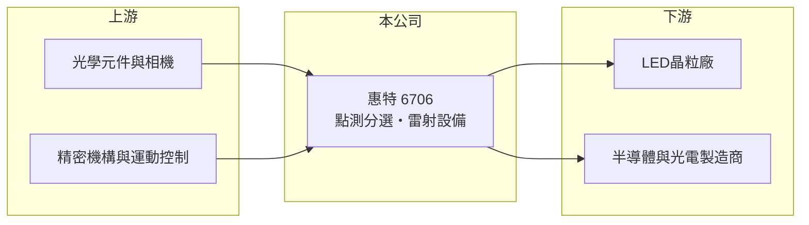

# 6706 惠特

> 上市｜[[產業索引-光電業|光電業]]｜上市（櫃）日期 2019/12/19

# 第一章：企業模式與商業藍圖

> [!info] 撰寫說明
> 精簡版，由 Claude 依公開資料整理，架構比照 [[2330台積電]]，資料截至 2026-10-07。來源：nStock 惠特公司簡介、winvest 營收快訊。產品細節部分為推估。#待校對

惠特是光電與精密機械設備商，2026 年營收大幅衰退並出現虧損，近月營收開始回升。

- **核心業務：** 公司登記主要經營機械設備、光學儀器與精密機械的製造與批發，並有軟體服務；依市場認知，主要產品為 [[LED晶粒]]點測與分選設備，以及[[雷射加工]]設備（推估）。
- **營收結構：** 本次未查到產品別營收比重。
- **營運據點：** 公司 2000 年 3 月成立，生產據點明細本次未查到。
- **長期方向：** 設備商的方向取決於客戶擴產週期，公司推估往 [[Micro LED]] 與半導體相關檢測設備延伸。

# 第二章：護城河深度與競爭優勢

惠特的優勢在於光學檢測與精密機械整合能力，但設備需求高度依賴客戶資本支出。

- **競爭優勢：** 檢測與分選設備需要光學、機構與軟體整合，並與客戶製程共同調校，具一定轉換成本（推估）。
- **主要對手：** 國內光電與半導體檢測設備同業（本次未查到具體名單），以及中國 LED 設備廠。
- **觀察重點：** 7、8 月營收年增逾 89% 與 120%，觀察回升能否延續並讓毛利率轉正。

# 第三章：財務體質與盈利規模

資料日期：2026-10-07，以下數字是撰寫當時的快照；最新月營收、毛利率、累計 EPS 由自動排程寫在本筆記的屬性欄位（月營收、毛利率、累計EPS 等）。#待校對

惠特 2026 年上半年營收萎縮並大幅虧損，下半年月營收回升。

- **營收規模：** 2026 年 1 至 8 月累計營收 4.81 億元，年減 34.99%；7 月營收 6,626.5 萬元（年增 89.25%）、8 月 7,762.8 萬元（年增 120.53%）。
- **獲利：** 2026 年第二季 EPS -1.89 元，[[毛利率]] -14.25%、[[營業利益率]] -92.06%，推估包含[[存貨跌價損失]]等一次性因素。
- **財務特色：** 資本額 7.85 億元，近五年平均現金股利 2.7 元，但最新年度未配息。

# 第四章：總體風險與地緣政治

惠特的風險集中在客戶擴產週期與產品轉型。

- **產業週期：** 設備需求跟隨 LED 與半導體客戶的資本支出循環，低谷時營收可能腰斬。
- **營運風險：** 負毛利顯示產品組合或存貨出現壓力，新產品若驗證不順，虧損可能延續。
- **其他風險：** 中國設備廠低價競爭與[[設備國產化]]政策，以及匯率變動。

# 專有名詞解析

## 半導體

- **[[LED晶粒]]**：由磊晶片切割而成的發光二極體晶片，是LED封裝的基本元件。

## 金融

- **[[存貨跌價損失]]**：存貨的可回收金額低於帳面成本時認列的損失，會直接壓低毛利率。

## 產業

- **[[雷射加工]]**：以雷射進行切割、鑽孔或剝離等加工，常用於半導體與面板製程。
- **[[Micro LED]]**：以微米級 LED 晶粒直接作為畫素的顯示技術，需要大量巨量轉移與檢測設備。
- **[[設備國產化]]**：中國推動以本土設備取代進口設備的政策，壓縮外資與台灣設備商的市場。

# 核心供應鏈

- 上游：光學元件、工業相機、精密機構與運動控制零件供應商（推估）
- 下游／客戶：LED 晶粒廠如 [[3714富采]]，以及半導體與光電製造商（推估）
- 同業：國內光電檢測設備商與中國 LED 設備廠（本次未查到具體名單）

## 最新新聞
<!-- news:start -->
<!-- news:end -->

## 相關連結
- [公開資訊觀測站](https://mopsov.twse.com.tw/mops/web/t05st03?step=1&firstin=1&co_id=6706)
- [Goodinfo](https://goodinfo.tw/tw/StockDetail.asp?STOCK_ID=6706)
- [Yahoo 股市](https://tw.stock.yahoo.com/quote/6706)
- [鉅亨網新聞](https://www.cnyes.com/twstock/6706/news)
