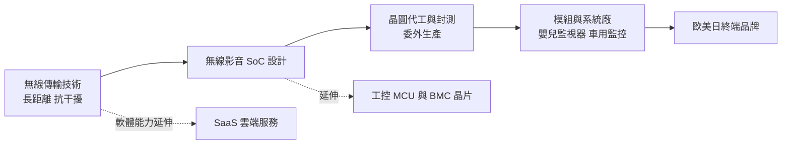
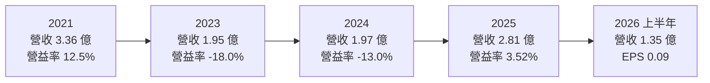
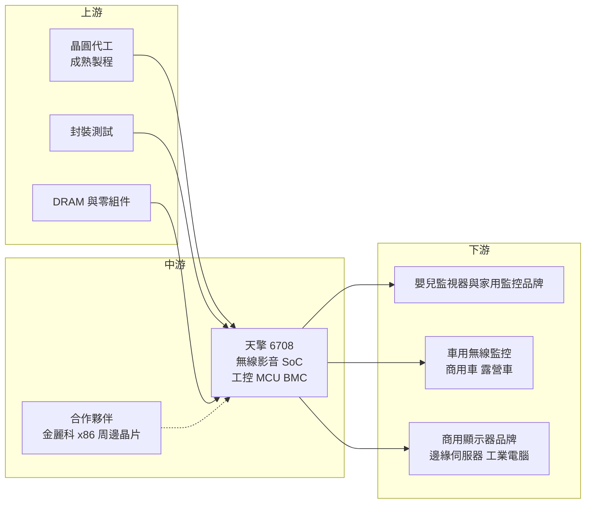

# 6708 天擎

> 上櫃｜[[產業索引-半導體業|半導體業]]｜上市（櫃）日期 2022/12/29

# 第一章：企業模式與商業藍圖

> [!info] 撰寫說明
> 本文由 Claude 依公開資料整理，架構比照 [[2330台積電]] 的四章研究，資料截至 2026-10-08。財務數字來源：Goodinfo 年度經營績效頁、nStock 公司概況頁、Yahoo 股市公司基本資料、富果研究 2025 年 12 月法說會整理、CMoney 投資快訊、工商時報 2026 年 10 月報導；產業描述為整理性內容，尚未逐條比對原始文件。#待校對

在評估單一個股的長期投資價值時，首要步驟是拆解企業的底層獲利邏輯。本章針對天擎積體電路（股票代號：6708，以下簡稱天擎）的商業模式進行定性分析，說明一家年營收約 2 至 3 億元的小型 IC 設計公司，如何在長距離無線影音傳輸的利基市場取得高市占，又為什麼必須另尋成長曲線。

## 一、核心定位：長距離、抗干擾的無線影音傳輸晶片

天擎成立於 2001 年 2 月，2022 年 12 月上櫃，董事長兼總經理為呂惠平。公司主要開發長距離、高頻寬、抗干擾的數位無線影音系統單晶片（[[SoC]]），讓攝影機的影像與聲音能以無線方式穩定傳到數十公尺外的螢幕上。這類晶片最早大量用在無線嬰兒監視器，後來延伸到家用監控與車用無線監控，例如貨車、拖車、露營車的倒車與盲區攝影機。

天擎的技術定位可以用一個詞概括：穩定。依富果研究整理的 2025 年 12 月法說會內容，天擎的毛利率較同業高，原因是其專有無線傳輸技術（公司稱為 pWiFi）在長距離傳輸的穩定度，而不是靠價格競爭。對嬰兒監視器和車用倒車攝影機來說，畫面中斷或延遲會直接影響安全，客戶願意為穩定性付出較高的價格，這也是天擎長期毛利率能維持在五成以上的原因。

除了 IC 晶片，天擎也經營 [[SaaS]] 雲端服務，包括宮廟光明燈的線上服務，以及鎖定台灣中小型金屬加工廠的工廠製造執行系統（[[MES]]）。這兩項業務與晶片本業關聯不大，比較像是運用既有軟體與系統整合能力的延伸，目前占營收比例有限。

## 二、終端應用／產品板塊

天擎沒有公開完整的營收比重數字，因此本文不畫營收圓餅圖。依 2025 年 12 月法說會，各板塊的定性狀況如下：

* **嬰兒監控：** 這是天擎起家的主力市場，但營收持續衰退。原因有三：嬰兒監視器不是剛性需求、少子化讓市場本身萎縮，以及網路攝影機（[[IP Cam]]）搭配手機 App 的方案取代了傳統的專用無線螢幕。這是結構性的衰退，不是短期景氣問題。
* **車用電子：** 表現最強的板塊，2025 年前三季營收已大幅超過 2024 全年，主要靠擴大客戶群與通路。董事長表示，天擎在車用無線監控的利基市場市占率達七至八成，但這個市場一年的總營收規模只有約 3 至 4 億元，成長空間有限。
* **安防監控：** 與前一年大致持平，屬於穩定但不成長的板塊。
* **工控 [[MCU]]：** 應用在商用顯示器的網路控制晶片，客戶是歐美日大型品牌，導入時間長，但一旦導入可以逐步累積出貨。
* **SaaS 雲端服務：** 宮廟服務與工廠 MES，金額小但成長率較高。

## 三、資本轉化邏輯：小規模利基市場的高毛利模式

天擎是 [[Fabless]] 公司，自己做晶片設計與參考方案，晶圓與封測委外。它的模式是在一個大廠不感興趣的小市場做到高市占，靠技術穩定性維持五成以上的毛利率。依 Goodinfo 數據，天擎近十年毛利率都在 51% 至 59% 之間，非常穩定。

這個模式的限制在於市場天花板。車用無線監控一年只有 3 至 4 億元的市場規模，即使天擎拿下七、八成，營收也只有 2 至 3 億元。依 Goodinfo，天擎 2017 至 2025 年營收在 1.95 億至 3.36 億元之間波動，營業利益率最好的年份也只有約 15.7%（2017 年）。營收規模太小，使研發與管理費用占營收比重偏高，景氣稍差就會轉為虧損。

## 四、企業長期藍圖：從利基無線傳輸轉向 x86 周邊與遠端管理晶片

天擎在 2025 年 12 月法說會提出明確的轉型方向：從 pWiFi 利基市場，轉向 x86 周邊晶片組與 [[BMC]]／eBMC 遠端管理晶片，目標市場是邊緣 AI（[[Edge AI]]）伺服器與工業電腦。

* **eBMC 遠端管理晶片：** BMC 是伺服器主機板上負責遠端開關機、監控溫度與電壓的獨立晶片。天擎規劃的 eBMC 鎖定邊緣伺服器與工業電腦，預計 2026 年 4 月完成設計定案（[[Tape out]]），並採開放式生態系，提供 SDK 與開發板，與亞馬遜、微軟等雲端平台整合。已有台灣與中國各一家 Beta Site 客戶。
* **x86 周邊晶片：** 與金麗科（RDC）合作開發，預計 2026 年第二季進入 PCIe 與 PHY 架構開發，2027 年規劃推出整合 [[PCIe]]、SATA、USB 等介面的擴充 IO 晶片。
* **無人機圖傳：** 依工商時報 2026 年 10 月報導，天擎也積極跨足無人機圖傳市場，這是把既有的長距離影像傳輸技術延伸到新應用。

這個轉型的意義在於擴大可服務的市場規模。BMC 市場目前由大廠主導，天擎要以小公司身分切入，技術驗證、客戶導入與生態系建立都需要時間，成果仍屬未知。

# 第二章：護城河深度與競爭優勢

在長期價值投資中，「護城河」指企業抵禦競爭、維持超額利潤的保護機制。本章分析天擎的護城河構成、主要競爭對手，以及這些優勢在利基市場與新市場的延續性。

## 一、護城河的核心組成要素

天擎的護城河屬於「利基型窄護城河」：在小市場內很深，但市場本身太小，無法支撐長期成長。

* **1. 無線傳輸穩定度的技術門檻：** 長距離、抗干擾的無線影音傳輸需要長期累積的射頻與通訊協定經驗。對車用倒車攝影機這種「畫面不能斷」的應用，客戶不會輕易為了省一點成本換掉穩定的方案，這讓天擎能以穩定性而非低價取得訂單。
* **2. 小市場的高市占：** 車用無線監控市場一年只有 3 至 4 億元，對大型 IC 設計公司來說不值得專門投入，天擎因此能以七至八成的市占率主導這個利基。市場小，反而成了一種保護。
* **3. 客戶認證與長期關係：** 工控 MCU 的客戶是歐美日大型商用顯示器品牌，導入期長，一旦採用就會持續多年。

## 二、全球主要競爭對手格局

| 對手 | 定位 | 對天擎的威脅 |
|---|---|---|
| Wi-Fi 與 IP Cam 晶片方案（如中國 SoC 業者） | 以標準 Wi-Fi 加手機 App 取代專用無線螢幕 | 直接取代嬰兒監視器的傳統專用方案，是嬰兒監控衰退主因 |
| [[5471松翰]] | 台灣影像與 MCU 設計公司，2025 年推出無線圖傳系統方案 | 在無人載具圖傳市場形成直接競爭 |
| 信驊 [[5274信驊]] | 全球伺服器 BMC 晶片龍頭 | 天擎進入 BMC 市場要面對的最大對手 |
| 新唐 [[4919新唐]] | 台灣 MCU 與 BMC 晶片業者 | 工控 MCU 與 BMC 市場的競爭者 |

上表中的對手是依產業結構整理的常見競爭者，天擎公開資料未點名競爭對手，屬整理性內容（推估）。

## 三、優勢轉化：守得住／守不住／觀察重點

* **守得住：** 車用無線監控與高穩定度的專用影像傳輸。這個市場的客戶重視穩定與認證，天擎的技術與高市占可以持續維持高毛利。
* **守不住：** 嬰兒監視器。手機 App 加網路攝影機的方案在功能與價格上更有彈性，專用無線螢幕的需求只會持續縮小。這部分的營收下滑是結構性的，不是天擎能靠技術扭轉的。
* **觀察重點：** 第一，eBMC 晶片在 2026 年設計定案後，能否在 2027 年後取得邊緣伺服器或工業電腦客戶的量產訂單；第二，與金麗科合作的 x86 周邊晶片能否如期推出；第三，無人機圖傳是否能成為新的利基市場。這些新產品若沒有放量，天擎的營收將長期停留在 2 至 3 億元。

# 第三章：財務體質與盈利規模

資料日期：2026-10-08。數字取自 Goodinfo 年度經營績效頁與 nStock 公司概況頁，表格是撰寫當時的快照；最新月營收、毛利率、累計 EPS 由自動排程寫在本筆記的屬性欄位（月營收、毛利率、累計EPS 等）。#待校對

財務報表是檢驗護城河是否真實存在的最終標準。本章用近九年的三率、[[ROE]] 與資本報酬，檢視天擎的高毛利能否轉化為股東報酬。

## 一、獲利能力的基石：三率

| 年度 | 營收（新台幣） | [[毛利率]] | [[營業利益率]] | EPS（元） | [[ROE]] |
|---|---|---|---|---|---|
| 2017 | 2.82 億 | 57.9% | 15.7% | 1.07 | 9.37% |
| 2018 | 2.06 億 | 58.2% | 1.33% | 0.76 | 6.55% |
| 2019 | 2.23 億 | 59.2% | 5.55% | 0.32 | 2.78% |
| 2020 | 2.35 億 | 57.9% | 8.05% | 0.40 | 3.57% |
| 2021 | 3.36 億 | 56.1% | 12.5% | 1.29 | 11.8% |
| 2022 | 3.14 億 | 53.0% | 5.24% | 1.31 | 8.77% |
| 2023 | 1.95 億 | 51.2% | -18.0% | -1.03 | -6.73% |
| 2024 | 1.97 億 | 51.8% | -13.0% | -0.31 | -2.25% |
| 2025 | 2.81 億 | 53.2% | 3.52% | 0.25 | 1.89% |
| 2026 上半年 | 1.35 億 | 53.2% | 1.28% | 0.09 | 1.41%（年化） |

天擎的財務呈現「高毛利、低營業利益」的典型小型利基 IC 設計公司特徵。毛利率九年來都在 51% 至 59% 之間，說明產品有定價能力；但營業利益率波動很大，從 2017 年的 15.7% 到 2023 年的 -18.0%。原因是營收規模只有 2 至 3 億元，研發與管理費用相對固定，營收少掉幾千萬元，營業利益就會由正轉負。

* **[[毛利率]]：** 從 2017 至 2020 年的 58% 上下，逐步降到 2023 年以後的 51% 至 53%。推估與高毛利的嬰兒監控產品衰退、產品組合改變有關（推估）。
* **[[營業利益率]]：** 2023 年營收從 3.14 億元降到 1.95 億元，營業利益率跌到 -18.0%，顯示營收規模對獲利的影響遠大於毛利率。2025 年車用成長帶動營收回到 2.81 億元，營業利益率才回到正值。
* **長期指標：** 2020 至 2025 年營收年複合成長率約 3.6%（推算），近五年（2021 至 2025）平均 ROE 約 2.7%（推算）。

## 二、[[ROE]]：資本效率

天擎近五年平均 ROE 約 2.7%（推算），最好的 2021 年也只有 11.8%。以 2025 年稅後淨利約 0.07 億元、ROE 1.89% 回推，股東權益約 3.7 億元（推算）。公司負債不高，ROE 偏低主要是本業獲利能力不足，而不是財務結構的問題。對股東而言，天擎的資本報酬長期低於一般資金成本。

## 三、資本支出與自由現金流

天擎是小型 IC 設計公司，不需要大型廠房設備，資本支出很低，具體金額未查得。但轉型開發 eBMC 與 x86 周邊晶片，需要投入光罩與研發人力，未來幾年研發費用可能增加，在新產品放量前會壓縮獲利（推估）。

股利方面，依 nStock，天擎近五年平均現金股利約 0.41 元，2023 年曾除息 0.9 元，2025 年度則未配息。股利隨獲利起伏，不屬於穩定配息的公司。

## 四、[[ROIC]] 與 [[WACC]]：價值創造利差

**ROIC 推算：** 2025 年營業利益約 0.099 億元（2.81 億 × 3.52%），以稅率 20% 計算，稅後營業利益約 0.079 億元。投入資本以股東權益約 3.7 億元計算，有息負債未查得、視為不重大（推估），ROIC 約 2.1%（推算）。2021 年營業利益約 0.42 億元（3.36 億 × 12.5%），稅後約 0.34 億元，權益約 2.8 億元（0.33 億 ÷ 11.8%），ROIC 約 12%（推算）。

**WACC 推算：** 權益成本以 CAPM 估計，假設台灣 10 年期公債殖利率 1.75%、市場風險溢酬 6%，β 未查得來源數字，採小型股常見值 1.0，權益成本約 7.75%。有息負債不重大，WACC 約 7.75%（推算）。

**結論：** 天擎只有在 2021 年這類營收衝高的年份，ROIC 才高於 WACC，其餘多數年份都低於資金成本。2025 年的利差約為負 5.6 個百分點（推算）。高毛利證明技術有價值，但市場規模太小，讓公司長期無法穩定創造經濟價值。轉型到 BMC 與 x86 周邊晶片，本質上就是為了擴大營收規模，讓高毛利能轉化成足夠的營業利益。

# 第四章：總體風險與地緣政治

任何企業都無法脫離宏觀環境獨立存在。本章分析天擎未來必須面對的地緣政治、產業週期、營運與技術風險。

## 一、地緣政治

* **關稅政策：** 天擎在法說會中將關稅政策變動列為主要風險。嬰兒監視器與車用監控的終端產品多在中國組裝後銷往歐美與日本，美國關稅提高時，客戶可能調整產地或延後下單，影響天擎出貨。
* **中國客戶的雙面性：** 天擎有中國的 eBMC Beta Site 客戶，其終端產品主要出口歐美日。中美科技管制若擴大到伺服器管理晶片等領域，與中國客戶的合作可能受限。
* **台灣生產集中：** 晶片製造依賴台灣的晶圓代工與封測，面臨與其他台灣半導體公司相同的兩岸風險。

## 二、產業週期與市場結構

* **消費性需求循環：** 嬰兒監控與家用安防屬於消費性產品，受景氣與庫存循環影響大。2023 年營收大減，就是消費性電子庫存調整與嬰兒監控結構性衰退同時發生的結果（推估）。
* **利基市場天花板：** 車用無線監控市場一年僅 3 至 4 億元，天擎已有高市占，本業的成長空間有限，這是比景氣循環更根本的限制。
* **伺服器市場的大廠結構：** 轉型目標的 BMC 市場由少數大廠主導，客戶傾向使用成熟、經過大量驗證的方案，新進者需要長時間累積信任。

## 三、營運環境的隱性風險

* **轉型執行風險：** 小公司同時開發 eBMC、x86 周邊晶片、無人機圖傳與 SaaS 服務，研發資源分散。若新產品延遲或客戶導入不如預期，研發投入將持續壓縮獲利。
* **DRAM 價格：** 法說會提到 DRAM 價格波動會影響成本。天擎的模組或方案若需要搭配記憶體，記憶體漲價會壓縮毛利。
* **晶圓與封測漲價：** 成熟製程產能被 AI 需求排擠時，小型 IC 設計公司議價能力較弱，取得產能與轉嫁成本都較困難。

## 四、科技或法規演進

* **Wi-Fi 與手機的替代：** 標準 Wi-Fi 晶片越來越便宜、延遲越來越低，加上手機 App 的普及，專用無線影音傳輸的需求會持續被侵蝕。天擎的長期價值取決於能否把技術應用到 Wi-Fi 無法取代的場景，例如長距離車用、無人機與工業環境。
* **車用法規：** 各國對車輛後方與盲區影像的安全規範，長期有利於車用攝影機需求；但前裝市場多採有線方案，無線方案主要在後裝與商用車市場。
* **開放式 BMC 生態：** 伺服器管理逐漸走向開放韌體與標準化介面，這降低了新晶片進入的軟體門檻，對天擎是機會；但也代表競爭者同樣容易進入。

# 專有名詞解析

## 半導體

- **[[SoC]]**：系統單晶片，把處理器、記憶體控制、影像處理與通訊等功能整合在同一顆晶片上。
- **[[Fabless]]**：只做晶片設計、把製造委外給晶圓代工廠的商業模式。
- **[[BMC]]**：基板管理控制器，伺服器主機板上負責遠端開關機、監控溫度與電壓的獨立晶片。
- **[[MCU]]**：微控制器，把處理器、記憶體與輸入輸出介面整合在一顆晶片上，用來控制家電、設備等。
- **[[PCIe]]**：PCI Express 高速匯流排標準，連接處理器與顯示卡、固態硬碟等元件。
- **[[Tape out]]**：晶片設計定案，把最終設計資料交給晶圓廠製作光罩，是晶片從設計進入試產的關鍵節點。

## 應用

- **[[IP Cam]]**：網路攝影機，透過 Wi-Fi 或有線網路傳輸影像，可用手機 App 遠端觀看。
- **[[Edge AI]]**：在終端或邊緣伺服器執行 AI 運算，而不是全部傳到雲端處理，可降低延遲與頻寬成本。
- **[[MES]]**：製造執行系統，記錄與管理工廠生產現場的工單、機台與品質資料。

## 金融

- **[[ROE]]**：股東權益報酬率，稅後淨利除以股東權益，衡量公司用股東的錢賺錢的效率。
- **[[ROIC]]**：投入資本報酬率，稅後營業利益除以股東權益加有息負債，衡量本業運用全部資本的效率。
- **[[WACC]]**：加權平均資金成本，股東與債權人要求報酬率的加權平均，ROIC 高於它才算創造價值。

## 產業

- **[[SaaS]]**：軟體即服務，客戶以訂閱方式透過網路使用軟體，不需自行安裝與維護。

# 核心供應鏈

## 1. 上游：晶圓代工、封測與零組件
- 晶圓代工與封測：成熟製程晶圓代工廠與封測廠，具體合作對象未查得
- 記憶體：DRAM 供應商（法說會提及 DRAM 價格影響成本）

## 2. 中游：天擎本身與合作夥伴
- x86 周邊晶片合作開發：金麗科（RDC）
- 雲端平台整合：[[AMZN亞馬遜]]、[[MSFT微軟]]（eBMC 生態系整合對象）

## 3. 下游：主要應用與客戶
- 嬰兒監視器、家用與車用無線監控的模組與品牌廠（個別客戶未揭露）
- 歐美日商用顯示器品牌（工控 MCU）
- 邊緣 AI 伺服器與工業電腦廠（eBMC Beta Site 客戶，台灣與中國各一家）

## 4. 同業與競爭者
- 影像與圖傳：[[5471松翰]]
- BMC 與 MCU：[[5274信驊]]、[[4919新唐]]

## 最新新聞
<!-- news:start（自動產生，請勿手動編輯此範圍） -->
- 2026-10-05 🏛️ 重訊 14:37｜本公司有價證券近期多次達公布注意交易資訊標準， 故公告相關訊息，以利投資人區別暸解｜[觀測站](https://mops.twse.com.tw/mops/#/web/t05st01)

完整紀錄：[[6708天擎 新聞]]
<!-- news:end -->

## 相關連結
- [公開資訊觀測站](https://mopsov.twse.com.tw/mops/web/t05st03?step=1&firstin=1&co_id=6708)
- [Goodinfo](https://goodinfo.tw/tw/StockDetail.asp?STOCK_ID=6708)
- [Yahoo 股市](https://tw.stock.yahoo.com/quote/6708)
- [鉅亨網新聞](https://www.cnyes.com/twstock/6708/news)
