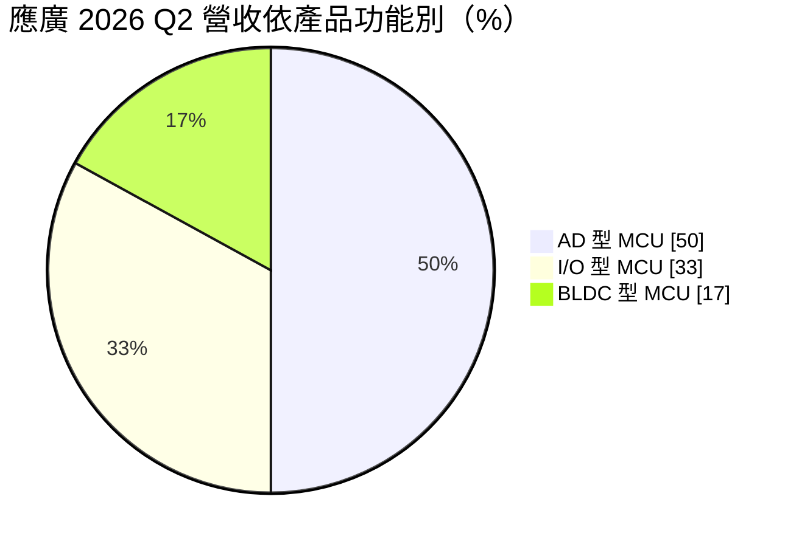
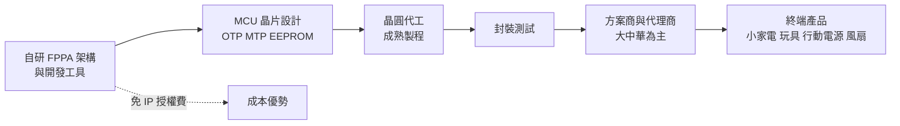
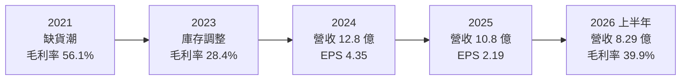
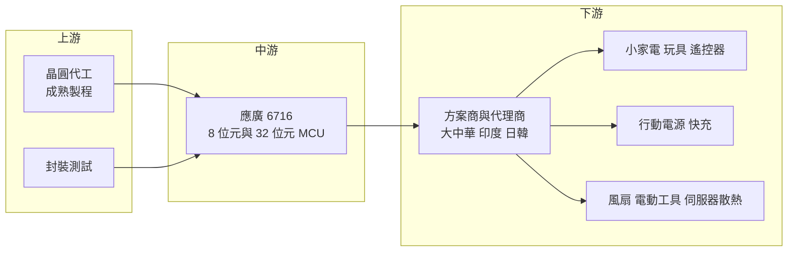

# 6716 應廣

> 上櫃｜[[產業索引-半導體業|半導體業]]｜上市（櫃）日期 2020/03/27

# 第一章：企業模式與商業藍圖

> [!info] 撰寫說明
> 本文由 Claude 依公開資料整理，架構比照 [[2330台積電]] 的四章研究，資料截至 2026-10-08。財務數字來源：Goodinfo 年度經營績效頁、nStock 公司概況頁、Yahoo 股市公司基本資料、富果研究與 poorstock 的 2026 年 8 月法說會整理；產業描述為整理性內容，尚未逐條比對原始文件。#待校對

在評估單一個股的長期投資價值時，首要步驟是拆解企業的底層獲利邏輯。本章針對應廣科技（股票代號：6716，以下簡稱應廣）的商業模式進行定性分析，說明一家專做低價 8 位元微控制器的小型 IC 設計公司，如何靠自有的處理器架構在消費性電子市場維持穩定獲利，以及它面對中國同業價格戰時的長期位置。

## 一、核心定位：自研架構的低成本 8 位元 MCU

應廣成立於 2005 年 2 月，2020 年 3 月上櫃，董事長兼總經理為唐燦弼。公司是 [[Fabless]] 型態的 IC 設計公司，主要產品是 8 位元微控制器（[[MCU]]）。MCU 是一顆把處理器、記憶體與輸入輸出介面整合在一起的小晶片，負責控制玩具、遙控器、小家電、行動電源、風扇等產品的基本功能。這類晶片單價往往只有幾元新台幣，但出貨量以億顆計，是電子產品裡用量最大的晶片之一。

應廣與一般 MCU 公司最大的不同，是使用自行研發的 [[FPPA]]（現場可程式處理器陣列）架構。依法說會整理，FPPA 在 8 位元領域以硬體多核心平行處理建立區隔，讓一顆低價 MCU 能同時處理多個工作，例如一邊偵測按鍵、一邊控制馬達。公司也強調從 CPU 核心到開發工具都是自主研發，不必支付處理器 IP 授權費，這是它能在低價市場維持三至四成毛利率的基礎。

產品依記憶體型態分為 [[OTP]]（一次性燒錄）、MTP（可多次燒錄）與 EEPROM 型。OTP MCU 成本最低，適合程式寫好後不再更改的大量消費性產品，是應廣的傳統強項。

## 二、終端應用／產品板塊

依 2026 年 8 月法說會，應廣把產品依功能分為三類，2026 年第二季營收結構如下：

* **AD 型 MCU：** 內建類比數位轉換器（[[ADC]]），可以讀取溫度、電壓、電量等類比訊號，常用於行動電源、鋰電池充電與家電。2026 年第二季營收約 2.32 億元，占約一半，是主力產品。其中鋰電充電用的 MCU 在 2025 年出貨超過 2,000 萬顆。
* **I/O 型 MCU：** 以數位輸入輸出控制為主，用於玩具、遙控器、居家監控等簡單控制，2026 年第二季約 1.5 億元，占約三分之一。
* **BLDC 型 MCU：** 用於無刷直流馬達（[[BLDC]]）控制，應用在電動工具、高壓風扇、吊扇與散熱風扇，2026 年第二季約 7,700 萬元，占約 17%。這是應廣近年刻意發展的較高附加價值產品線。

應用面涵蓋消費性電子（居家監控、玩具、行動電源、遙控器）、智慧家電、觸控（AI 眼鏡、家電面板）、智慧散熱風扇與無刷馬達。市場以大中華地區為基礎，公司正積極拓展印度、日本與韓國。

## 三、資本轉化邏輯：低單價、大量出貨、低費用

應廣的營運模式是「低單價、大量出貨、精簡費用」。MCU 單顆利潤很薄，必須靠大量出貨累積營收；同時公司規模小、產品線集中，研發與管理費用相對精簡，才能在營收約 10 億元的規模下維持正的營業利益。依 Goodinfo 數據，應廣 2016 至 2025 年每年都有獲利，營業利益率最低的 2025 年仍有 5.33%，這在小型 IC 設計公司中相當少見。

MCU 業務的另一個特性是客戶黏著度。消費性產品的方案商一旦用某家 MCU 寫好程式、建立開發環境，換晶片就要重寫程式，因此除非價格差距很大，客戶通常會延續使用。應廣自有開發工具與應用軟體平台，進一步強化這種黏著度。

## 四、企業長期藍圖：高壓、觸控、32 位元與海外市場

* **產品升級：** 公司聚焦高壓整合、觸控技術、32 位元 MCU 與馬達控制。32 位元產品採 [[RISC-V]] 架構整合 BLDC 控制，鎖定吊扇與小家電；觸控晶片強調抗干擾，用在 AI 眼鏡與家電面板。這些產品單價與毛利都高於傳統 8 位元 OTP MCU，是提高產品組合的關鍵。
* **伺服器散熱與快充：** 伺服器散熱風扇 MCU 與[[快充協議]] MCU 已陸續導入客戶。前者讓應廣接觸到 AI 伺服器帶來的散熱需求，後者跟著 USB 快充普及成長。
* **海外市場：** 鞏固大中華的同時，拓展印度、日本、韓國，以分散地緣政治風險。32 位元 MCU 已送樣日本客戶，進行工程導入。日本客戶認證嚴格，一旦導入，訂單通常較穩定、價格也較好。

# 第二章：護城河深度與競爭優勢

在長期價值投資中，「護城河」指企業抵禦競爭、維持超額利潤的保護機制。本章分析應廣的護城河構成、主要競爭對手，以及這些優勢在中國同業價格戰下能守住多少。

## 一、護城河的核心組成要素

應廣的護城河屬於「成本型窄護城河」，來自自有架構帶來的成本與服務優勢。

* **1. 自研處理器架構：** FPPA 架構與開發工具全部自主研發，不需支付處理器授權費，也能自由調整晶片設計來壓低成本。在單價只有幾元的市場，省下的授權費與晶片面積就是毛利。
* **2. 開發環境的轉換成本：** 方案商用應廣的工具寫好程式後，換用其他廠商的 MCU 要重新開發與驗證。對產品生命週期短、開發人力有限的小型方案商來說，延續使用原有平台是最省事的選擇。
* **3. 客製化技術服務：** 消費性產品客戶多半是中小型方案商，需要原廠協助寫程式與除錯。應廣長期累積的應用軟體平台與技術支援，是大型國際 MCU 廠不易提供的服務。

## 二、全球主要競爭對手格局

| 對手 | 定位 | 對應廣的威脅 |
|---|---|---|
| 盛群 [[6202盛群]] | 台灣最大的 8 位元消費性 MCU 廠 | 產品線更廣、規模更大，在家電與消費性市場直接競爭 |
| 九齊 [[6494九齊]] | 台灣低價 OTP MCU 與語音 IC 業者 | 在玩具與低價消費性 MCU 市場重疊 |
| 新唐 [[4919新唐]] | 台灣 8 位元與 32 位元 MCU 大廠 | 在 32 位元與馬達控制 MCU 市場具規模優勢 |
| 中國 MCU 業者 | 中國本土 8 位元與 32 位元 MCU 設計公司 | 以低價搶占中國消費性市場，是最主要的價格壓力來源 |

公司在法說會提到需留意中國成熟製程 MCU 同業的價格競爭；其餘對手為依產業結構整理的常見競爭者（推估）。

## 三、優勢轉化：守得住／守不住／觀察重點

* **守得住：** 已建立開發環境的既有方案商客戶、需要客製化服務的中小型消費性產品，以及鋰電充電、BLDC 這類需要類比與馬達控制技術的產品。這些產品的技術門檻與轉換成本較高，價格戰影響相對小。
* **守不住：** 最基本的 I/O 型 OTP MCU。這類產品技術門檻低，中國同業可以用更低的價格搶單。2023 年應廣毛利率降到 28.4%，反映的正是消費性電子庫存調整與價格競爭的雙重壓力。
* **觀察重點：** 第一，BLDC、觸控、32 位元與伺服器散熱等新產品占營收比重能否持續提高；第二，日本、印度、韓國等海外市場能否形成穩定營收；第三，晶圓代工漲價時，公司能否持續轉嫁成本，維持約四成的毛利率目標。

# 第三章：財務體質與盈利規模

資料日期：2026-10-08。數字取自 Goodinfo 年度經營績效頁、nStock 公司概況頁與 2026 年 8 月法說會整理，表格是撰寫當時的快照；最新月營收、毛利率、累計 EPS 由自動排程寫在本筆記的屬性欄位（月營收、毛利率、累計EPS 等）。#待校對

財務報表是檢驗護城河是否真實存在的最終標準。本章用十年的三率、[[ROE]] 與資本報酬，檢視應廣在消費性 MCU 週期中的獲利品質。

## 一、獲利能力的基石：三率

| 年度 | 營收（新台幣） | [[毛利率]] | [[營業利益率]] | EPS（元） | [[ROE]] |
|---|---|---|---|---|---|
| 2016 | 4.57 億 | 37.7% | 20.8% | 4.33 | 24.6% |
| 2017 | 4.76 億 | 39.7% | 22.3% | 4.20 | 22.5% |
| 2018 | 4.67 億 | 40.6% | 18.1% | 3.96 | 21.2% |
| 2019 | 5.22 億 | 39.2% | 16.5% | 3.57 | 18.1% |
| 2020 | 6.82 億 | 41.4% | 20.1% | 5.41 | 24.7% |
| 2021 | 9.66 億 | 56.1% | 35.4% | 11.52 | 41.1% |
| 2022 | 9.39 億 | 42.1% | 19.4% | 7.47 | 24.9% |
| 2023 | 10.6 億 | 28.4% | 7.93% | 2.00 | 7.85% |
| 2024 | 12.8 億 | 34.7% | 11.6% | 4.35 | 16.9% |
| 2025 | 10.8 億 | 33.3% | 5.33% | 2.19 | 8.34% |
| 2026 上半年 | 8.29 億 | 39.9% | 17.1% | 4.65 | 34.3%（年化） |

應廣的十年數據清楚呈現消費性 MCU 的週期特性。2016 至 2020 年是穩定期，毛利率約四成、營業利益率約兩成，ROE 維持在 18% 至 25%。2021 年全球晶片缺貨，MCU 供不應求、價格大漲，毛利率跳升到 56.1%，EPS 達 11.52 元。缺貨潮結束後，客戶消化庫存、中國同業降價，2023 年毛利率跌到 28.4%。2026 年上半年，AI 需求排擠成熟製程產能、晶圓漲價，應廣順勢調漲產品價格，毛利率回到約四成。

* **[[毛利率]]：** 長期中樞約 35% 至 40%，高點受缺貨推升、低點受價格戰壓抑。公司 2026 年全年目標約 40%。
* **[[營業利益率]]：** 費用結構精簡，十年來營業利益率從未轉負，但隨毛利率波動很大，從 5% 到 35% 都出現過。
* **長期指標：** 2020 至 2025 年營收年複合成長率約 9.6%（推算），近五年（2021 至 2025）平均 ROE 約 19.8%（推算），十年中每年都有獲利。

## 二、[[ROE]]：資本效率

應廣近五年平均 ROE 約 19.8%（推算），即使在 2023 年產業谷底也有 7.85%。以 2025 年稅後淨利 0.65 億元、ROE 8.34% 回推，股東權益約 7.8 億元（推算）。ROE 高的主要原因是輕資產與高配息：公司不需要廠房設備，獲利多以現金股利發還股東，股東權益不會持續膨脹，使 ROE 保持在較高水準。依法說會，2026 年 6 月底現金及約當現金約 6.26 億元，收現天數由 65 天降到 52 天，銷貨天數由 105 天降到 90 天，營運資金管理有所改善。

## 三、資本支出與自由現金流

應廣的資本支出主要是研發設備與光罩，金額小，具體數字未查得。由於長年獲利且資本支出低，[[自由現金流]]推估長期為正（推估），但會隨庫存增減波動，例如缺貨期間為了確保產能而提高庫存，會暫時吃掉營業現金流。

股利方面，依 nStock，應廣近五年平均現金股利約 3.8 元，2024 年度配發 3.38 元、[[配發率]]約 77.7%，2025 年度配發約 1.6 元。公司傾向把大部分盈餘以現金發放，股利金額隨獲利波動，但配發率維持在高水準。

## 四、[[ROIC]] 與 [[WACC]]：價值創造利差

**ROIC 推算：** 2025 年營業利益約 0.58 億元（10.8 億 × 5.33%），以稅率 20% 計算，稅後營業利益約 0.46 億元，投入資本以股東權益約 7.8 億元計算，有息負債未查得、IC 設計公司通常不重大，視為零（推估），ROIC 約 5.9%（推算）。2024 年營業利益約 1.49 億元（12.8 億 × 11.6%），稅後約 1.19 億元，權益約 7.6 億元（1.29 億 ÷ 16.9%），ROIC 約 15.6%（推算）。2021 年缺貨高峰時 ROIC 約 40%（推算，營業利益 3.42 億元、權益約 6.9 億元）。

**WACC 推算：** 權益成本以 CAPM 估計，假設台灣 10 年期公債殖利率 1.75%、市場風險溢酬 6%，β 未查得來源數字，採中小型 IC 設計股常見值 1.1，權益成本約 8.35%。有息負債不重大，WACC 約 8.35%（推算）。

**結論：** 應廣的 ROIC 在多數年份高於約 8.35% 的 WACC，2016 至 2022 年長期維持兩位數以上；只有 2023 與 2025 年這類價格戰或庫存調整年份落到資金成本附近或以下。整體而言，應廣是一家長期創造經濟價值的小型公司，但利差隨消費性週期大幅波動。若 2026 年上半年的毛利率能延續，年化 ROIC 推估可回到 25% 以上（推算），利差將重新擴大。

# 第四章：總體風險與地緣政治

任何企業都無法脫離宏觀環境獨立存在。本章分析應廣未來必須面對的地緣政治、產業週期、營運與技術風險。

## 一、地緣政治

* **大中華市場集中：** 應廣的客戶以大中華地區的方案商與代工廠為主。中國推動晶片國產化，本土 MCU 業者在政策與價格上都有優勢，長期可能壓縮台灣 MCU 廠在中國的空間。這是應廣積極拓展印度、日本、韓國的主要原因。
* **美中關稅：** 小家電、玩具、行動電源的終端產品多在中國生產後銷往歐美。美國關稅變動會讓品牌調整產地與下單節奏，連帶影響 MCU 的需求。
* **台灣生產集中：** 晶圓製造與封測多在台灣，面臨與其他台灣半導體公司相同的兩岸風險。

## 二、產業週期與市場結構

* **消費性 MCU 的強週期：** 從 2021 年毛利率 56.1% 到 2023 年 28.4%，應廣的獲利受晶片供需與客戶庫存影響很大。這類週期大約三到四年一輪，投資人不應把缺貨年份的獲利當成常態。
* **[[長鞭效應]]：** 消費性產品通路長、方案商多，終端需求小幅轉弱時，整條供應鏈會同時去庫存，傳到 MCU 端的訂單降幅被放大。2023 年就是典型例子。
* **低階市場的價格戰：** 8 位元 MCU 技術成熟，中國業者眾多，基本款產品的價格長期承壓。應廣必須持續推出 BLDC、觸控、32 位元等較高階產品，才能維持毛利率。

## 三、營運環境的隱性風險

* **晶圓產能取得：** 法說會指出，AI 應用擠壓晶圓廠產能，造成真實的供給不足，與 2021 年因市場搶貨造成的缺貨性質不同。公司已把確保產能列為首要目標。小型 IC 設計公司議價能力有限，產能吃緊時可能出現有訂單卻出不了貨的情況。
* **成本上升：** 晶圓代工、封測與關鍵材料成本上漲，若無法完全轉嫁，毛利率會受壓縮。
* **匯率：** 公司業外損益主要受匯兌影響，新台幣升值會造成匯兌損失。

## 四、科技或法規演進

* **8 位元轉向 32 位元：** 隨著 32 位元 MCU 價格下降，部分過去使用 8 位元 MCU 的應用會升級。應廣若在 32 位元市場無法建立競爭力，既有客戶可能轉向其他供應商。公司以 RISC-V 架構切入 32 位元，可避開授權費，但生態系與開發工具的成熟度仍需時間建立。
* **能效法規推動 BLDC：** 各國家電能效標準提高，推動風扇、吊扇與電器從傳統馬達轉向更省電的無刷馬達，長期有利於應廣的 BLDC MCU。
* **快充與 USB-C 標準化：** 歐盟統一充電介面等法規，帶動快充協議晶片需求，是應廣快充 MCU 的長期機會。

# 專有名詞解析

## 半導體

- **[[MCU]]**：微控制器，把處理器、記憶體與輸入輸出介面整合在一顆晶片上，用來控制家電、玩具等產品。
- **[[OTP]]**：一次性可程式記憶體，程式只能燒錄一次，成本最低，適合大量生產且不需改程式的消費性產品。
- **[[FPPA]]**：應廣自行研發的現場可程式處理器陣列架構，以硬體多核心平行處理多個控制工作。
- **[[RISC-V]]**：開放原始碼的處理器指令集架構，任何公司都可免授權費使用，常用於 MCU 與嵌入式晶片。
- **[[ADC]]**：類比數位轉換器，把溫度、電壓等連續的類比訊號轉成處理器可讀取的數位數值。
- **[[Fabless]]**：只做晶片設計、把製造委外給晶圓代工廠的商業模式。

## 應用

- **[[BLDC]]**：無刷直流馬達，以電子方式換向，比傳統有刷馬達更省電、更安靜、壽命更長，需要 MCU 控制。
- **[[快充協議]]**：手機與充電器之間協商電壓與電流的通訊規則，例如 USB PD，需要專用晶片判斷與控制。

## 金融

- **[[ROE]]**：股東權益報酬率，稅後淨利除以股東權益，衡量公司用股東的錢賺錢的效率。
- **[[ROIC]]**：投入資本報酬率，稅後營業利益除以股東權益加有息負債，衡量本業運用全部資本的效率。
- **[[WACC]]**：加權平均資金成本，股東與債權人要求報酬率的加權平均，ROIC 高於它才算創造價值。
- **[[配發率]]**：現金股利占每股盈餘的比例，反映公司把多少獲利以現金發還股東。
- **[[自由現金流]]**：營業活動現金流減去資本支出，代表企業可自由用於配息、還債或併購的現金。
- **[[長鞭效應]]**：終端需求的小幅變動，沿供應鏈往上游傳遞時被逐級放大，造成上游庫存與訂單劇烈波動。

# 核心供應鏈

## 1. 上游：晶圓代工與封測
- 晶圓代工：成熟製程晶圓代工廠，具體合作對象未查得
- 封裝測試：公司表示在產能吃緊時增加封裝廠產能，具體合作對象未查得

## 2. 中游：同業競爭
- 台灣 MCU：[[6202盛群]]、[[6494九齊]]、[[4919新唐]]、[[5471松翰]]
- 國外：中國本土 MCU 設計公司

## 3. 下游：主要應用
- 消費性電子：居家監控、玩具、行動電源、遙控器的方案商與代工廠（個別客戶未揭露）
- 智慧家電與觸控面板、AI 眼鏡
- 無刷馬達應用：電動工具、高壓風扇、吊扇、伺服器散熱風扇
- 海外：日本客戶工程導入中，印度與韓國市場拓展中

## 最新新聞
<!-- news:start -->
<!-- news:end -->

## 相關連結
- [公開資訊觀測站](https://mopsov.twse.com.tw/mops/web/t05st03?step=1&firstin=1&co_id=6716)
- [Goodinfo](https://goodinfo.tw/tw/StockDetail.asp?STOCK_ID=6716)
- [Yahoo 股市](https://tw.stock.yahoo.com/quote/6716)
- [鉅亨網新聞](https://www.cnyes.com/twstock/6716/news)
