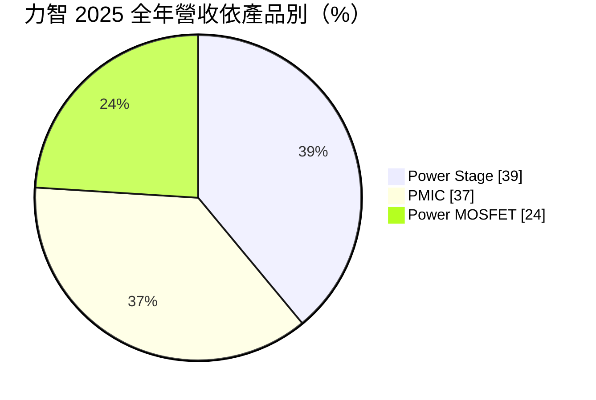
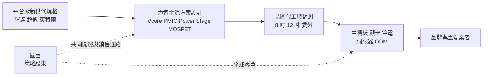
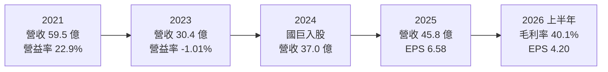
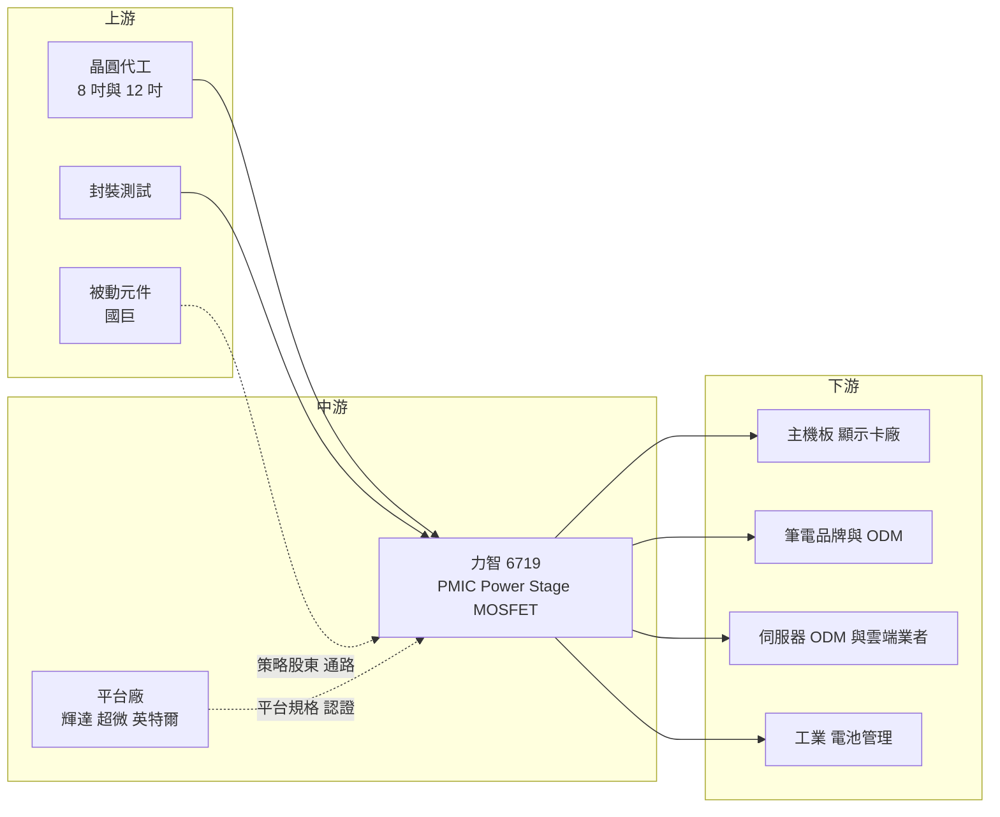

# 6719 力智

> 上市｜[[產業索引-半導體業|半導體業]]｜上市（櫃）日期 2022/01/13

# 第一章：企業模式與商業藍圖

> [!info] 撰寫說明
> 本文由 Claude 依公開資料整理，架構比照 [[2330台積電]] 的四章研究，資料截至 2026-10-08。財務數字來源：Goodinfo 年度經營績效頁、nStock 公司概況頁、Yahoo 股市公司基本資料、富果研究 2026 年 3 月法說會整理、經濟日報 2026 年報導、工商時報 2024 年 5 月國巨入股報導；產業描述為整理性內容，尚未逐條比對原始文件。#待校對

在評估單一個股的長期投資價值時，首要步驟是拆解企業的底層獲利邏輯。本章針對力智電子（股票代號：6719，以下簡稱力智）的商業模式進行定性分析，說明一家以筆電與顯示卡電源起家的電源管理 IC 設計公司，如何從 PC 週期走向 [[AI 伺服器]]與工業應用，以及國巨入股對它的長期意義。

## 一、核心定位：運算平台的核心電源方案供應商

力智成立於 2005 年 12 月，董事長為許先越、總經理為黃學偉。公司是 [[Fabless]] 型態的電源 IC 設計公司，產品涵蓋電源管理 IC（[[PMIC]]）、功率金氧半場效電晶體（Power [[MOSFET]]），以及把控制器、驅動器與 MOSFET 整合在一起的功率級模組（[[Power Stage]]）。

力智的核心市場是「運算平台的核心電源」。處理器與顯示晶片在運算時，電流需求會在極短時間內劇烈變化，必須由多相位的核心電壓控制器（[[Vcore]]）搭配多顆 Power Stage，把主機板上的 12 伏特電壓精準轉換成不到 1 伏特、數百安培的電流。這類電源方案要配合 [[NVDA輝達]]、[[AMD超微]]、[[INTC英特爾]] 每一代新平台重新設計與認證，技術門檻高，供應商不多。力智過去以筆電、主機板與顯示卡為主要戰場，是台灣少數能提供完整核心電源方案的業者。

力智的股權結構在 2024 年出現重大變化。依工商時報報導，[[2327國巨]] 在 2024 年 5 月宣布以不超過 53.13 億元認購力智[[私募]]普通股，持股約 20.23%，取代 [[2357華碩]] 成為力智最大的策略股東。國巨是全球被動元件大廠，力智則是主動電源晶片，雙方產品互補，計畫結合共同開發與全球銷售通路。

## 二、終端應用／產品板塊

依富果研究整理的 2026 年 3 月法說會，力智 2025 年全年營收依產品別如下：

* **Power Stage：** 2025 年占 39%，第四季升到 47%，是成長最快的產品。Power Stage 把驅動器與上下橋 MOSFET 封裝在一起，能承受更大電流、效率更高，是 CPU、GPU 核心電源的主流方案。力智正在推廣 90 安培的智慧型功率級（SPS）給全球重要客戶驗證，被視為未來毛利與獲利成長的主要引擎。
* **PMIC：** 2025 年占 37%，包括多相位 Vcore 控制器、一般降壓轉換器與電池管理 IC。新一代混合數位 Vcore 控制器已完成桌上型主機板與筆電客戶的設計導入，公司預期 2026 年營收較 2025 年倍數成長。
* **Power MOSFET：** 2025 年占 24%，由低壓延伸到中壓應用。MOSFET 是電源電路裡負責開關電流的功率元件，力智自有 MOSFET 產品可以與 PMIC、Power Stage 搭配成完整方案。

依應用別，2025 年第四季運算占 51%、通訊（含伺服器）27%、電池管理 12%、工業與消費性各 5%。法說會也提到，含 AI 與非 AI 在內的整體伺服器應用約占營收 20%，其中 AI 伺服器相關產品 2025 年只占低個位數，目標 2026 年提升到 5% 以上。此外，[[GaN]] 驅動 IC 已用於大型雲端服務商的 AI 加速器。

## 三、資本轉化邏輯：跟著平台換代賺取設計導入的紅利

力智的獲利模式是「跟著平台換代做設計導入」。每當處理器或顯示晶片推出新世代，主機板、顯示卡與伺服器廠就要重新選擇電源方案。力智若能在新平台初期取得設計導入（[[design-in]]）並被選用（design-win），就能在該平台的生命週期內持續出貨。反過來說，若錯過某一代平台，就要等下一代才有機會。

這種模式讓力智的營收與 PC、顯示卡的換代週期高度相關。依 Goodinfo 數據，力智 2021 至 2022 年受惠於疫情帶動的 PC 與挖礦顯卡需求，營收衝上 60 億元、營業利益率超過兩成；2023 年需求反轉，營收腰斬到 30.4 億元、營業利益轉為虧損；2024 至 2025 年才逐步回升。這說明力智的長期關鍵，是把營收重心從消費性 PC 移到成長更穩定的伺服器與工業應用。

## 四、企業長期藍圖：伺服器、高電流與國巨綜效

* **AI 伺服器電源：** 雲端資料中心與 AI 加速器需要大量高電流電源，力智以 90 安培 SPS、伺服器 Vcore 與 GaN 驅動 IC 切入。伺服器電源的認證週期長、單價高，若能打入，將大幅提高產品組合的價值。
* **擴大工業與車用：** 法說會揭示鞏固消費性、擴大工業應用，並以車用電池管理為中長期目標。工業與車用產品生命週期長、價格穩定，可以降低對 PC 週期的依賴。
* **國巨的通路與綜效：** 國巨是力智最大的單一策略股東，雙方已在運算平台與工業應用有技術與產品整合，力智也透過國巨的銷售平台出貨並帶來營收。國巨的全球客戶群（特別是歐美工業與車用客戶）是力智過去較難自行觸及的市場，這是入股最主要的長期價值。
* **供應鏈布局：** 公司在 2025 年下半年已與策略夥伴提前布局 8 吋與 12 吋產能，以因應晶圓代工與封測漲價及產能吃緊。

# 第二章：護城河深度與競爭優勢

在長期價值投資中，「護城河」指企業抵禦競爭、維持超額利潤的保護機制。本章分析力智的護城河構成、全球主要競爭對手，以及這些優勢能否從 PC 延伸到伺服器市場。

## 一、護城河的核心組成要素

力智的護城河屬於「技術認證型窄護城河」，建立在平台認證與完整產品組合上。

* **1. 平台認證與設計導入：** 核心電源方案必須通過處理器與顯示晶片平台廠的規格驗證，再由主機板、顯卡廠逐一設計導入。這個流程需要長期的技術合作關係，新進者很難在短時間內取得同等的認證資格。
* **2. 完整的電源產品組合：** 力智同時擁有控制器、MOSFET 與 Power Stage，可以提供整套核心電源方案。客戶向一家供應商買齊，可減少相容性問題與驗證時間，這是只做單一元件的業者無法提供的便利。
* **3. 國巨的策略支持：** 國巨入股後帶來資金、全球通路與被動元件整合能力。電源模組本來就需要大量電感、電容，主動與被動元件的搭配銷售，可以提高客戶的採購便利性。

## 二、全球主要競爭對手格局

| 對手 | 定位 | 對力智的威脅 |
|---|---|---|
| 芯源（Monolithic Power Systems） | 美國高效能電源 IC 大廠，AI 伺服器電源主要供應商 | 在 AI 伺服器與 GPU 電源市場領先，規模與技術都遠大於力智 |
| 英飛凌（Infineon）、瑞薩（Renesas） | 國際電源與功率半導體大廠 | 在伺服器 Vcore 與 Power Stage 市場占有率高 |
| 立錡（[[2454聯發科]]旗下） | 台灣最大的電源管理 IC 設計公司 | 在筆電、手機與消費性電源 IC 直接競爭 |
| [[6138茂達]] | 台灣電源與馬達驅動 IC 業者 | 在筆電與主機板電源 IC 市場重疊 |
| 台灣 MOSFET 業者（如 [[5299杰力]]、[[3317尼克森]]、[[8261富鼎]]） | 低壓 MOSFET 設計公司 | 在 Power MOSFET 產品線以價格競爭 |

上表為依產業結構整理的常見競爭者，力智公開資料未逐一點名，屬整理性內容（推估）。

## 三、優勢轉化：守得住／守不住／觀察重點

* **守得住：** 筆電、桌上型主機板與顯示卡的核心電源方案。力智在這個市場有長期的平台認證與客戶關係，新一代混合數位 Vcore 已取得設計導入，是穩定的基本盤。
* **守不住：** 最高階的 AI 伺服器 GPU 電源。這個市場目前由國際大廠主導，客戶對可靠度要求極高，力智的伺服器產品 2025 年只占營收低個位數，短期內難以撼動既有供應商。
* **觀察重點：** 第一，90 安培 SPS 與伺服器 Vcore 的認證進度，以及伺服器占營收比重能否從 2025 年的約 20%（含非 AI）持續提高；第二，混合數位 Vcore 的倍數成長能否實現；第三，國巨通路帶來的工業與車用營收是否逐年擴大。

# 第三章：財務體質與盈利規模

資料日期：2026-10-08。數字取自 Goodinfo 年度經營績效頁、nStock 公司概況頁與 2026 年 3 月法說會整理，表格是撰寫當時的快照；最新月營收、毛利率、累計 EPS 由自動排程寫在本筆記的屬性欄位（月營收、毛利率、累計EPS 等）。#待校對

財務報表是檢驗護城河是否真實存在的最終標準。本章用近九年的三率、[[ROE]] 與資本報酬，檢視力智在 PC 週期起伏與大額增資之後的資本效率。

## 一、獲利能力的基石：三率

| 年度 | 營收（新台幣） | [[毛利率]] | [[營業利益率]] | EPS（元） | [[ROE]] |
|---|---|---|---|---|---|
| 2017 | 26.6 億 | 26.0% | 4.13% | 1.46 | 12.7% |
| 2018 | 35.7 億 | 38.7% | 14.8% | 7.19 | 47.3% |
| 2019 | 28.2 億 | 32.5% | 2.88% | 1.03 | 5.50% |
| 2020 | 42.0 億 | 34.7% | 12.4% | 6.27 | 28.4% |
| 2021 | 59.5 億 | 41.9% | 22.9% | 15.75 | 47.7% |
| 2022 | 60.8 億 | 40.9% | 21.6% | 14.85 | 19.8% |
| 2023 | 30.4 億 | 27.5% | -1.01% | 0.63 | 0.60% |
| 2024 | 37.0 億 | 30.3% | 3.64% | 2.42 | 2.12% |
| 2025 | 45.8 億 | 34.8% | 14.6% | 6.58 | 5.01% |
| 2026 上半年 | 21.0 億 | 40.1% | 17.9% | 4.20 | 6.28%（年化） |

力智的數據有兩個重點。第一是週期性：2021 至 2022 年 PC 與顯卡需求高峰，營業利益率超過兩成；2023 年需求崩落，營收腰斬、營業利益轉負。這反映電源 IC 與 PC 換代、顯卡庫存的高度連動。第二是 ROE 與淨利的脫鉤：2025 年營業利益率回到 14.6%、EPS 6.58 元，但 ROE 只有 5.01%，原因是股東權益在幾年間大幅膨脹（見下節）。

* **[[毛利率]]：** 2025 年為 34.8%，2026 年上半年回到 40.1%，接近 2021 至 2022 年的高峰水準。法說會將毛利率改善歸因於產品組合優化，Power Stage 等高附加價值產品比重提高。
* **[[營業利益率]]：** 2025 年營業利益約 6.68 億元，營業利益率由 2024 年的 3.64% 回升到 14.6%，顯示營收回到 45 億元以上後，營運槓桿重新發揮。
* **長期指標：** 2020 至 2025 年營收年複合成長率約 1.7%（推算），代表力智過去五年營收幾乎沒有長期成長，只是在週期中上下波動；近五年（2021 至 2025）平均 ROE 約 15.0%（推算），但主要由 2021 年的 47.7% 撐起，2023 至 2025 年平均不到 3%。

## 二、[[ROE]]：資本效率

以稅後淨利除以 ROE 回推，力智的平均股東權益由 2021 年約 23 億元，擴大到 2025 年約 138 億元（推算）。股本則由 2021 年的 7.07 億元增加到 2025 年的 10.5 億元，其中 2024 年國巨私募 53.13 億元是最大一筆；其餘增幅推估來自高股價時期的現金增資（推估，細節未查得）。

權益膨脹的結果是：同樣賺 7 億元，ROE 從過去的四成以上降到約 5%。這些增資資金多數仍以現金形式留在公司，尚未轉化為營收與獲利。換句話說，力智目前帳上有大量閒置資本，ROE 偏低不是本業變差，而是資本運用尚未到位。未來 ROE 能否回升，取決於這些資金能否投入伺服器、工業與車用等新產品，並創造相應的獲利。

## 三、資本支出與自由現金流

力智是 IC 設計公司，資本支出主要是研發設備與測試設備，具體金額未查得。由於不需自建晶圓廠，營業現金流在獲利年份推估足以支應資本支出，[[自由現金流]]在 2025 年推估為正（推估），但 2023 年營業虧損期間推估偏弱（推估）。

股利方面，依 nStock，力智近五年平均現金股利約 5.15 元，2024 年度配發 1.7 元，2025 年度配發 4.6 元，配發率約七成（推算，4.6 ÷ 6.58）。股利隨獲利起伏，不屬於穩定配息的類型。

## 四、[[ROIC]] 與 [[WACC]]：價值創造利差

**ROIC 推算：** 2025 年營業利益約 6.68 億元，以稅率 20% 計算，稅後營業利益約 5.34 億元。投入資本以平均股東權益約 138 億元計算，有息負債未查得、IC 設計公司通常不重大，視為零（推估），ROIC 約 3.9%（推算）。這個數字包含大量閒置現金，若扣除超額現金，實際營運資本的報酬率會明顯較高，但現金餘額未查得，無法精算。對照 2021 年：營業利益約 13.6 億元（59.5 億 × 22.9%），稅後約 10.9 億元，權益約 23 億元，ROIC 約 47%（推算）。

**WACC 推算：** 權益成本以 CAPM 估計，假設台灣 10 年期公債殖利率 1.75%、市場風險溢酬 6%，β 未查得來源數字，採與 PC 週期高度相關的電源 IC 股常見值 1.2，權益成本約 8.95%。有息負債不重大，WACC 約 9%（推算）。

**結論：** 力智在 2021 至 2022 年的高峰期 ROIC 遠高於 WACC，是明確的價值創造期；2023 年以後，加上大額增資稀釋，以全部權益計算的 ROIC 約 4%，低於約 9% 的資金成本（推算）。力智的長期價值關鍵不在毛利率，而在資本配置：國巨入股與增資帶來的資金，若能轉化為伺服器、工業與車用的新營收，ROIC 才可能重新超過 WACC；若資金長期閒置，股東的資本效率將持續偏低。

# 第四章：總體風險與地緣政治

任何企業都無法脫離宏觀環境獨立存在。本章分析力智未來必須面對的地緣政治、產業週期、營運與技術風險。

## 一、地緣政治

* **美國對 AI 晶片的出口管制：** 力智的核心電源產品搭配 GPU 與 AI 加速器使用，美國對中國的 AI 晶片出口管制，會影響部分顯卡與伺服器的出貨地點與數量，間接影響力智的需求。
* **關稅與組裝地遷移：** 主機板、顯示卡與筆電多在中國與東南亞組裝。美國關稅政策促使客戶把產線移往越南、墨西哥等地，過渡期間訂單可能不穩定。
* **台灣生產集中：** 晶圓與封測主要依賴台灣，面臨與其他台灣半導體公司相同的兩岸風險。

## 二、產業週期與市場結構

* **PC 與顯示卡週期：** 力智的營收有一半以上來自運算應用，與 PC 換機潮、顯卡新世代推出及庫存調整高度相關。2023 年營收腰斬就是需求高峰後去庫存的結果。法說會也提到，顯卡世代交替時程的不確定性，以及記憶體漲價可能影響終端消費，都會影響出貨節奏。
* **[[長鞭效應]]：** 主機板與顯卡通路層層轉手，終端需求小幅轉弱時，品牌與通路同時砍庫存，傳到電源 IC 端的訂單降幅被放大。
* **伺服器市場的大廠結構：** AI 伺服器電源由國際大廠主導，客戶傾向使用大量驗證過的方案，新進者需要長時間累積信任與實績。

## 三、營運環境的隱性風險

* **晶圓與封測產能：** 法說會指出 8 吋與 12 吋晶圓部分產品已吃緊，晶圓代工與封測普遍漲價，AI 需求可能排擠電源 IC 產能。若無法確保產能或轉嫁成本，出貨與毛利都會受影響。
* **資本閒置與配置風險：** 增資後帳上資金龐大，若長期找不到合適用途，ROE 將持續偏低；若用於併購或大額投資，也有評價與整合風險。
* **策略股東關係：** 國巨與華碩都是重要股東，國巨的通路合作是成長來源，但也可能影響力智與其他客戶或通路的關係，需要觀察兩大股東的策略方向。

## 四、科技或法規演進

* **數位電源與高電流化：** 處理器功耗持續升高，電源方案朝向數位控制、更高電流、更高整合的方向發展。力智若在數位 Vcore 與 90 安培以上 Power Stage 的技術落後，將失去新平台的設計導入機會。
* **GaN 與新功率元件：** 氮化鎵等寬能隙元件在資料中心電源與充電器的滲透率提高，可能部分取代傳統矽 MOSFET。力智已有 GaN 驅動 IC，但功率元件本身的技術轉換仍是長期變數。
* **資料中心能效規範：** 各國對資料中心用電效率的要求提高，長期有利於高效率電源方案的需求，也會提高產品認證的門檻。

# 專有名詞解析

## 半導體

- **[[PMIC]]**：電源管理 IC，負責把電池或電源供應器的電壓轉換、分配給系統內各個元件。
- **[[MOSFET]]**：金氧半場效電晶體，是電源電路中負責開關與控制電流的功率元件。
- **[[Power Stage]]**：功率級模組，把驅動器與上下橋 MOSFET 整合封裝，用於 CPU、GPU 的高電流核心電源。
- **[[Vcore]]**：處理器核心電壓，由多相位控制器與多顆 Power Stage 共同供應，需隨運算負載快速調整。
- **[[GaN]]**：氮化鎵，一種寬能隙半導體材料，開關速度快、效率高，用於快充與資料中心電源。
- **[[Fabless]]**：只做晶片設計、把製造委外給晶圓代工廠的商業模式。

## 應用

- **[[design-in]]**：晶片在客戶新產品開發階段被納入設計，通過驗證後即可隨產品量產持續出貨。
- **[[AI 伺服器]]**：搭載 GPU 或 AI 加速器的伺服器，用電量與電流需求遠高於一般伺服器，帶動高階電源需求。

## 金融

- **[[私募]]**：公司向特定投資人發行新股籌資，通常有轉讓限制，常被用來引進策略股東。
- **[[ROE]]**：股東權益報酬率，稅後淨利除以股東權益，衡量公司用股東的錢賺錢的效率。
- **[[ROIC]]**：投入資本報酬率，稅後營業利益除以股東權益加有息負債，衡量本業運用全部資本的效率。
- **[[WACC]]**：加權平均資金成本，股東與債權人要求報酬率的加權平均，ROIC 高於它才算創造價值。
- **[[自由現金流]]**：營業活動現金流減去資本支出，代表企業可自由用於配息、還債或併購的現金。
- **[[長鞭效應]]**：終端需求的小幅變動，沿供應鏈往上游傳遞時被逐級放大，造成上游庫存與訂單劇烈波動。

# 核心供應鏈

## 1. 上游：晶圓代工、封測與策略夥伴
- 晶圓代工與封測：8 吋與 12 吋晶圓代工及後段封測廠，具體合作對象未查得
- 策略股東與被動元件：[[2327國巨]]（持股約 20.23%，依 2024 年報導）

## 2. 中游：平台廠與同業
- 平台規格與認證：[[NVDA輝達]]、[[AMD超微]]、[[INTC英特爾]]
- 台灣同業：[[6138茂達]]、[[5299杰力]]、[[3317尼克森]]、[[8261富鼎]]、立錡（[[2454聯發科]]旗下）
- 國際同業：芯源（Monolithic Power Systems）、英飛凌、瑞薩

## 3. 下游：主要客戶群
- 原策略股東與主機板、筆電品牌：[[2357華碩]]
- 主機板、顯示卡與筆電品牌及 ODM（個別客戶未揭露）
- 伺服器 ODM 與大型雲端服務商（GaN 驅動 IC 已用於 CSP 的 AI 加速器）

## 最新新聞
<!-- news:start -->
<!-- news:end -->

## 相關連結
- [公開資訊觀測站](https://mopsov.twse.com.tw/mops/web/t05st03?step=1&firstin=1&co_id=6719)
- [Goodinfo](https://goodinfo.tw/tw/StockDetail.asp?STOCK_ID=6719)
- [Yahoo 股市](https://tw.stock.yahoo.com/quote/6719)
- [鉅亨網新聞](https://www.cnyes.com/twstock/6719/news)
