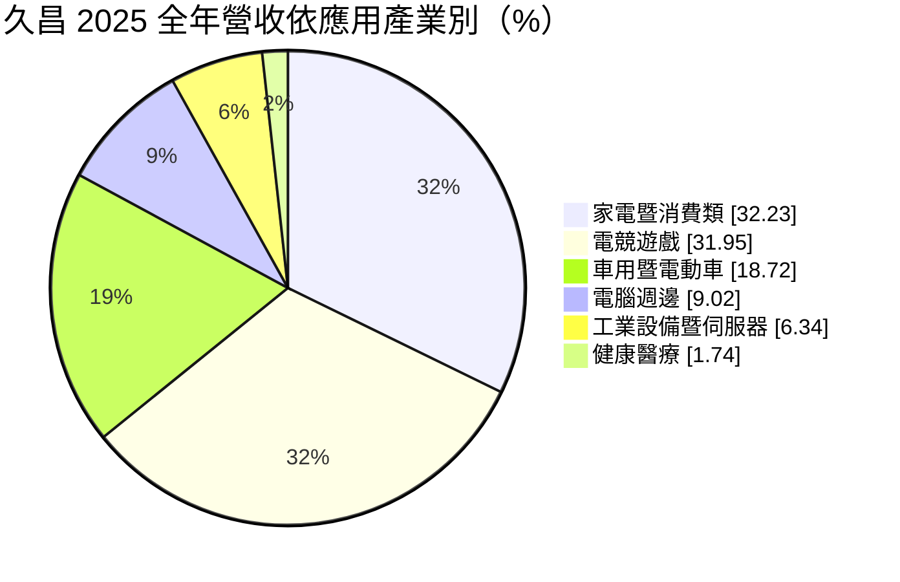
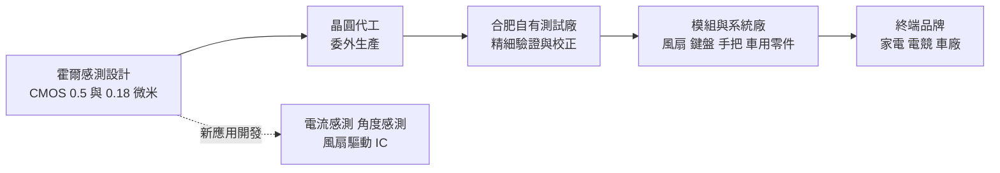
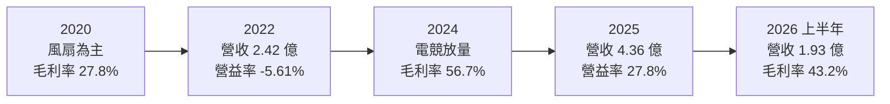
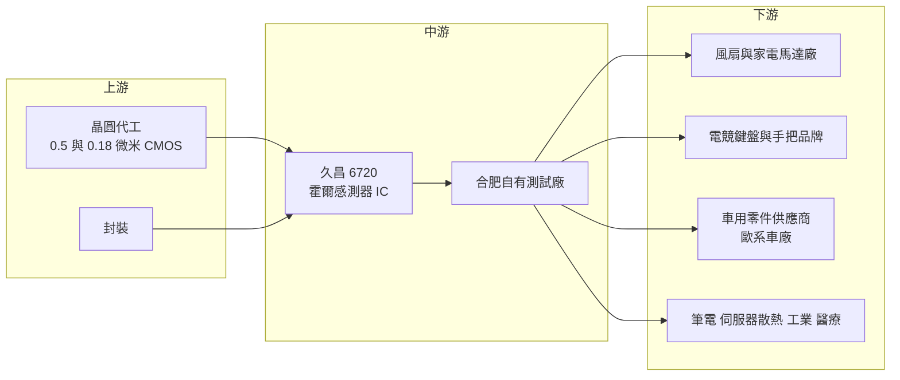

# 6720 久昌

> 上櫃｜[[產業索引-半導體業|半導體業]]｜上市（櫃）日期 2024/12/04

# 第一章：企業模式與商業藍圖

> [!info] 撰寫說明
> 本文由 Claude 依公開資料整理，架構比照 [[2330台積電]] 的四章研究，資料截至 2026-10-08。財務數字來源：Goodinfo 年度經營績效頁、nStock 公司概況頁、Yahoo 股市公司基本資料、富果研究 2025 年 3 月法說會整理、poorstock 2026 年 4 月法說會整理、科技新報 2024 年 7 月報導；產業描述為整理性內容，尚未逐條比對原始文件。#待校對

在評估單一個股的長期投資價值時，首要步驟是拆解企業的底層獲利邏輯。本章針對久昌科技（股票代號：6720，以下簡稱久昌）的商業模式進行定性分析，說明一家從電風扇霍爾晶片起家的小型類比 IC 設計公司，如何在中國同業殺價後轉進電競鍵盤與遊戲手把，把毛利率從約三成拉高到五成以上，以及它下一階段要靠什麼成長。

## 一、核心定位：專注霍爾磁性感測的類比 IC 設計公司

久昌成立於 2011 年 8 月，位於新竹科學園區，2024 年 12 月上櫃，董事長兼總經理為葉錦祥。依科技新報 2024 年 7 月報導，葉錦祥曾任職於同樣開發霍爾元件的公司，之後自行創業；最大股東為益鼎創投，投資時久昌成立僅兩年、只有八名員工。

久昌是 [[Fabless]] 型態的類比 IC 設計公司，核心產品是[[霍爾感測器]]（Hall IC）。霍爾感測器能偵測磁場的變化，藉此判斷磁鐵的位置、角度或轉速，最大的特點是「不需要接觸」就能感測。這讓它被廣泛用在風扇馬達換向、筆電開合偵測、遊戲搖桿與[[磁軸鍵盤]]等需要長時間反覆動作的地方，因為沒有機械接觸，就不會磨損。

依 poorstock 整理的 2026 年 4 月法說會，2025 年久昌營收中 Hall IC 占 97%、[[MOSFET]] 占 2%、電源 IC 占 1%。換句話說，久昌幾乎是一家單一產品線的公司，所有成長都押在霍爾感測技術能否擴展到更多應用。公司採用 CMOS 製程設計霍爾感測器，具有省電與低成本的優勢，並具備調整感測器製程、縮小誤差範圍的能力（富果研究整理）。

## 二、終端應用／產品板塊

依 2026 年 4 月法說會，2025 年久昌營收依應用產業別如下：

* **家電暨消費類：** 久昌起家的市場，以電風扇馬達的霍爾晶片為主。依 Hall IC 細項，風扇應用約占 53%。這個市場量大，但中國同業競爭激烈。依科技新報報導，大約 2019 年前後，中國業者讓風扇晶片價格砍半，迫使久昌尋找新市場。目前公司把家電布局轉向掃地機器人、吸塵器等高階產品。
* **電競遊戲：** 久昌轉型最成功的板塊。磁軸鍵盤利用[[線性霍爾]]感測器偵測按鍵按壓的深度，可以讓玩家自訂觸發點，在電競玩家間大受歡迎；遊戲手把搖桿則從電阻式改為磁性方案，以解決長期使用後的飄移問題。依富果研究，歐洲鍵盤客戶已量產線性鍵盤方案，手把搖桿晶片在中國副廠牌已量產出貨，主要遊戲機原廠的認證則仍在進行。
* **車用暨電動車：** 包括電動車與充電樁的電流監控，以及座椅、排檔桿、油門與煞車、空調、油箱液位等位置偵測。2023 年曾導入歐系車廠的電流安全感測 IC。
* **電腦週邊、工業與伺服器、醫療：** 筆電開合偵測、AI 伺服器與 PC 散熱模組的風扇驅動，以及醫療設備的位置感測。

## 三、資本轉化邏輯：小而專精的類比設計加自有測試

久昌的營運模式有兩個特點。第一是使用成熟製程：0.5 微米與 0.18 微米 CMOS 製程的晶圓成本低、產能相對容易取得，適合單價不高但出貨量大的感測器。第二是自有測試能力：依富果研究，久昌在中國合肥設有自有測試廠，可以依客戶要求做更細緻的驗證。霍爾感測器的精度很依賴出廠前的校正與篩選，自有測試廠讓久昌能控制品質與成本，是小公司少見的垂直整合。

毛利率的變化說明了產品組合的重要性。依法說會，2023 年毛利率約 40%，2024 年升到約 57%，主因是晶圓庫存去化完成、與晶圓廠議得較好的價格，以及高毛利的線性霍爾產品放量。也就是說，從風扇這類開關型產品，轉向電競鍵盤這類線性、高精度產品，是久昌獲利結構改變的關鍵。

## 四、企業長期藍圖：從電競延伸到車用、伺服器與機器人

* **車用前裝：** 公司策略是從後裝車燈等市場進入車用[[前裝市場]]。車用[[電流感測器]]已導入歐系車廠的零件供應商；電流感測集成 IC 預計 2026 年下半年推出。電動車的電池、馬達與充電系統都需要大量電流感測，車用前裝認證週期長，但一旦導入就能穩定出貨多年。
* **AI 伺服器與 PC 散熱：** 可程式化風扇驅動 IC 預計 2026 年第二季導入品牌客戶量產，下半年陸續增量。2026 年規劃還包括單相大電流可程式風扇 IC 與 [[FOC]] 三相馬達驅動 IC，把久昌從「感測」延伸到「驅動」。
* **機器人與角度感測：** 開發角度霍爾編碼器、高精度電流感測器與 2D/3D 角度感測器，鎖定人形機器人關節所需的角度、扭力與觸壓感測。這是長期、尚未產生營收的布局。
* **分散客戶：** 公司表示要擴大電競客戶來源，避免依賴單一客群，同時加強電源 IC 的高階產品開發。

# 第二章：護城河深度與競爭優勢

在長期價值投資中，「護城河」指企業抵禦競爭、維持超額利潤的保護機制。本章分析久昌的護城河構成、全球主要競爭對手，以及這些優勢在中國同業競爭下的延續性。

## 一、護城河的核心組成要素

久昌的護城河屬於「利基技術型窄護城河」：在特定應用上有先行優勢，但整體規模小，產品容易被模仿。

* **1. 線性霍爾的先行經驗：** 久昌約在 2019 年就投入電競鍵盤與手把，比多數同業更早累積線性霍爾在電競應用的調校經驗。磁軸鍵盤需要每一顆按鍵的感測都一致，精度與一致性決定使用體驗，早期打入歐洲知名鍵盤品牌，讓久昌在這個新興市場建立了口碑。
* **2. 製程調整與自有測試：** 久昌能調整感測器製程以縮小誤差範圍，並有合肥自有測試廠做細緻驗證。對高精度感測器而言，出廠前的校正與篩選能力，是維持品質一致的關鍵。
* **3. 車用認證的轉換成本：** 車用感測器一旦通過車廠與零件供應商的驗證，客戶很少更換。久昌已有歐系車廠的電流感測導入實績，這部分營收的黏著度較高。

## 二、全球主要競爭對手格局

| 對手 | 定位 | 對久昌的威脅 |
|---|---|---|
| Allegro MicroSystems | 美國磁性感測器大廠，車用電流與位置感測市占高 | 在車用前裝市場是主要對手，認證與產品線完整 |
| Melexis、英飛凌（Infineon） | 歐洲車用感測器大廠 | 車用角度、位置感測的主流供應商 |
| 旭化成電子（AKM） | 日本霍爾與電流感測器大廠 | 在電流感測與消費性霍爾市場競爭 |
| 中國霍爾 IC 業者 | 以低價切入風扇與消費性霍爾晶片 | 2019 年前後使風扇晶片價格砍半，也可能跟進電競應用 |

上表為依產業結構整理的常見競爭者，久昌公開資料未逐一點名，屬整理性內容（推估）。

## 三、優勢轉化：守得住／守不住／觀察重點

* **守得住：** 電競鍵盤與手把的高精度線性霍爾，以及已導入的車用電流感測。這些應用需要精度與一致性，客戶重視品質勝過價格，久昌的先行經驗與測試能力可以維持較高毛利。
* **守不住：** 一般風扇與家電的開關型霍爾晶片。技術門檻低、中國業者眾多，價格只會持續下滑。這部分營收占比仍大，是久昌毛利率的潛在拖累。
* **觀察重點：** 第一，電競需求是否只是一波產品潮流，或能成為長期的主流規格；第二，主要遊戲機原廠的認證是否成功，這將決定電競營收的規模上限；第三，車用電流感測與伺服器風扇驅動 IC 能否在 2026 年後明顯放量，讓營收不再高度依賴消費性產品。

# 第三章：財務體質與盈利規模

資料日期：2026-10-08。數字取自 Goodinfo 年度經營績效頁、nStock 公司概況頁與 2026 年 4 月法說會整理，表格是撰寫當時的快照；最新月營收、毛利率、累計 EPS 由自動排程寫在本筆記的屬性欄位（月營收、毛利率、累計EPS 等）。#待校對

財務報表是檢驗護城河是否真實存在的最終標準。本章用十年的三率、[[ROE]] 與資本報酬，檢視久昌轉型電競前後的獲利結構變化。

## 一、獲利能力的基石：三率

| 年度 | 營收（新台幣） | [[毛利率]] | [[營業利益率]] | EPS（元） | [[ROE]] |
|---|---|---|---|---|---|
| 2016 | 0.85 億 | 39.1% | 4.31% | 0.55 | 5.99% |
| 2017 | 1.25 億 | 38.3% | 6.75% | 0.49 | 4.88% |
| 2018 | 1.48 億 | 33.6% | 1.64% | 0.23 | 2.26% |
| 2019 | 1.69 億 | 32.8% | 0.21% | 0.47 | 4.76% |
| 2020 | 2.88 億 | 27.8% | 6.29% | 0.63 | 5.34% |
| 2021 | 3.62 億 | 35.5% | 12.8% | 2.40 | 18.0% |
| 2022 | 2.42 億 | 25.2% | -5.61% | 0.57 | 4.32% |
| 2023 | 3.61 億 | 39.6% | 13.7% | 1.96 | 14.4% |
| 2024 | 5.10 億 | 56.7% | 31.2% | 6.60 | 23.3% |
| 2025 | 4.36 億 | 55.8% | 27.8% | 3.89 | 12.2% |
| 2026 上半年 | 1.93 億 | 43.2% | 9.14% | 1.65 | 10.9%（年化） |

註：2024 年 EPS 依 Goodinfo 為 6.60 元，法說會簡報列 5.69 元，差異推估來自股票股利的追溯調整（推估）。

這張表清楚記錄了久昌的轉型。2016 至 2022 年，久昌是一家以風扇晶片為主、毛利率 25% 至 40%、營業利益率在零上下的小公司。2023 年起電競產品放量，毛利率在兩年內從約 25% 升到 56.7%，營業利益率達到 31.2%，2024 年 ROE 23.3%。2025 年營收回落到 4.36 億元，但毛利率仍維持在 55.8%。2026 年上半年營收僅 1.93 億元，毛利率降到 43.2%，顯示電競需求降溫或產品組合改變的影響（推估）。

* **[[毛利率]]：** 由產品組合決定。線性霍爾等高精度產品比重越高，毛利率越高；風扇等開關型產品比重高時，毛利率回到三成上下。
* **[[營業利益率]]：** 營收規模小，費用相對固定，營收增減對營業利益的影響很大。2024 年營收 5.10 億元時營業利益率 31.2%，2026 年上半年營收縮小後降到 9.14%。
* **長期指標：** 2020 至 2025 年營收年複合成長率約 8.6%（推算），近五年（2021 至 2025）平均 ROE 約 14.4%（推算）。

## 二、[[ROE]]：資本效率

久昌近五年平均 ROE 約 14.4%（推算），轉型前的 2016 至 2020 年平均只有約 4.6%（推算）。以 2025 年稅後淨利 1.17 億元、ROE 12.2% 回推，股東權益約 9.6 億元（推算）。2024 年上櫃前後的增資與股票股利，使股本由 2.58 億元增加到 3.01 億元，股東權益擴大，是 2025 年 ROE 下降的原因之一。久昌屬輕資產公司，ROE 主要取決於毛利率與營收規模。

## 三、資本支出與自由現金流

久昌除了合肥測試廠的設備外，不需要大型廠房，資本支出低，具體金額未查得。在 2023 年以後的高毛利期間，營業現金流推估足以支應資本支出與配息，[[自由現金流]]推估為正（推估）。

股利方面，依 nStock，久昌 2024 年度配發現金股利 3.8 元與股票股利 1.6 元，2025 年度配發現金股利 3.5 元，配發率約 90%（推算，3.5 ÷ 3.89）。上櫃後的配息政策以高配發率為主，但上櫃時間尚短，股利穩定度仍需更多年觀察。

## 四、[[ROIC]] 與 [[WACC]]：價值創造利差

**ROIC 推算：** 2025 年營業利益約 1.21 億元（4.36 億 × 27.8%），以稅率 20% 計算，稅後營業利益約 0.97 億元。投入資本以股東權益約 9.6 億元計算，有息負債未查得、IC 設計公司通常不重大，視為零（推估），ROIC 約 10.1%（推算）。2024 年營業利益約 1.59 億元（5.10 億 × 31.2%），稅後約 1.27 億元，權益約 6.4 億元（1.50 億 ÷ 23.3%），ROIC 約 19.8%（推算）。

**WACC 推算：** 權益成本以 CAPM 估計，假設台灣 10 年期公債殖利率 1.75%、市場風險溢酬 6%，β 未查得來源數字，採中小型 IC 設計股常見值 1.1，權益成本約 8.35%。有息負債不重大，WACC 約 8.35%（推算）。

**結論：** 久昌在 2023 年轉型成功後，ROIC 明顯高於 WACC，2024 年利差約 11 個百分點，2025 年縮小到約 2 個百分點（推算）。轉型前的久昌長期沒有創造經濟價值，轉型後則進入價值創造期，但利差高度依賴電競產品的需求。若 2026 年上半年的營收與毛利率下滑延續，ROIC 可能回到資金成本附近。久昌能否長期創造價值，取決於車用、伺服器散熱與機器人等新應用，能否接棒電競成為穩定的高毛利來源。

# 第四章：總體風險與地緣政治

任何企業都無法脫離宏觀環境獨立存在。本章分析久昌未來必須面對的地緣政治、產業週期、營運與技術風險。

## 一、地緣政治

* **中國營運與客戶：** 久昌在合肥設有自有測試廠，電競手把的主要量產客戶是中國副廠牌，風扇與家電客戶也多在中國。兩岸關係或美中科技管制若升溫，測試廠營運與中國客戶的出貨都可能受影響。
* **美國關稅：** 電競周邊、家電多在中國組裝後銷往歐美，美國關稅變動會讓品牌調整產地與下單節奏，影響久昌的訂單。
* **車用供應鏈在地化：** 歐美車廠推動供應鏈在地化，可能偏好本地或非中國供應商。久昌在歐系車用的導入，可受惠於「非中國」的需求，但也要面對歐洲本土感測器大廠的競爭。

## 二、產業週期與市場結構

* **電競產品的流行性：** 磁軸鍵盤與磁性搖桿是近年的新興規格，需求成長快，但也可能在滲透率達到一定程度後放緩。2025 年營收回落與 2026 年上半年的下滑，提醒投資人電競需求有其週期性。
* **遊戲機世代週期：** 遊戲手把需求與遊戲機新機推出時程高度相關，新機發表帶動一波換機與配件需求，之後逐漸平淡。原廠認證的進度也具有不確定性。
* **[[長鞭效應]]：** 消費性電子通路長，終端需求轉弱時，品牌與模組廠同時降低庫存，傳到感測晶片的訂單降幅被放大。

## 三、營運環境的隱性風險

* **產品集中：** Hall IC 占營收 97%，電源 IC 與 MOSFET 比重極低。任何影響霍爾感測需求的變化，都會直接衝擊整體營收。
* **規模小：** 年營收約 4 至 5 億元，研發資源有限，同時開發車用、伺服器、機器人等多條新產品線，資源分配需要謹慎。
* **晶圓成本：** 毛利率的提升部分來自與晶圓廠議得較好的價格，若晶圓代工漲價，可能侵蝕這部分優勢。

## 四、科技或法規演進

* **非接觸感測的長期趨勢：** 從機械式開關改為磁性感測，可以延長產品壽命、提高防水防塵能力，這個趨勢在鍵盤、搖桿、家電與車用都在發生，長期有利於霍爾感測器需求。
* **電動化與能效法規：** 電動車、充電樁、智慧電表與高效率馬達都需要大量電流感測與馬達控制，各國能效與電動化政策長期擴大久昌的可服務市場。
* **技術替代：** 部分高精度應用可能改用磁阻（TMR 等）或光學感測技術。霍爾感測若在精度與功耗上被其他技術超越，久昌需要持續投入新技術以免被替代。

# 專有名詞解析

## 半導體

- **[[霍爾感測器]]**：利用霍爾效應偵測磁場變化的感測晶片，可在不接觸的情況下判斷位置、角度、轉速或電流。
- **[[線性霍爾]]**：輸出隨磁場強弱連續變化的霍爾感測器，能偵測按鍵按壓深度或搖桿角度，而不只是開或關。
- **[[MOSFET]]**：金氧半場效電晶體，是電源電路中負責開關與控制電流的功率元件。
- **[[Fabless]]**：只做晶片設計、把製造委外給晶圓代工廠的商業模式。
- **[[電流感測器]]**：量測電路中電流大小的元件，電動車電池、充電樁與馬達控制都需要它來監控安全。

## 應用

- **[[磁軸鍵盤]]**：以磁鐵與霍爾感測器取代機械接點的鍵盤，可自訂按鍵觸發深度，受電競玩家歡迎。
- **[[FOC]]**：磁場導向控制，一種精確控制三相馬達轉矩與轉速的演算法，可讓馬達更安靜、更省電。
- **[[前裝市場]]**：車輛出廠前由車廠安裝的零組件市場，認證嚴格、週期長，與出廠後加裝的後裝市場相對。

## 金融

- **[[ROE]]**：股東權益報酬率，稅後淨利除以股東權益，衡量公司用股東的錢賺錢的效率。
- **[[ROIC]]**：投入資本報酬率，稅後營業利益除以股東權益加有息負債，衡量本業運用全部資本的效率。
- **[[WACC]]**：加權平均資金成本，股東與債權人要求報酬率的加權平均，ROIC 高於它才算創造價值。
- **[[自由現金流]]**：營業活動現金流減去資本支出，代表企業可自由用於配息、還債或併購的現金。
- **[[長鞭效應]]**：終端需求的小幅變動，沿供應鏈往上游傳遞時被逐級放大，造成上游庫存與訂單劇烈波動。

# 核心供應鏈

## 1. 上游：晶圓代工與封裝
- 晶圓代工：0.5 微米與 0.18 微米 CMOS 製程的成熟製程晶圓代工廠，具體合作對象未查得
- 封裝：具體合作對象未查得

## 2. 中游：久昌本身
- 霍爾感測器設計與合肥自有測試廠
- 主要股東：益鼎創投

## 3. 下游：主要應用與客戶
- 風扇、掃地機器人、吸塵器等家電馬達廠（個別客戶未揭露）
- 電競鍵盤品牌（歐洲鍵盤客戶已量產線性方案）與中國遊戲手把副廠牌
- 歐系車廠的零件供應商（電流感測導入）
- 筆電、AI 伺服器與 PC 散熱模組廠

## 4. 同業與競爭者
- 國際霍爾感測器業者：Allegro MicroSystems、Melexis、英飛凌、旭化成電子
- 中國霍爾 IC 設計公司

## 最新新聞
<!-- news:start -->
<!-- news:end -->

## 相關連結
- [公開資訊觀測站](https://mopsov.twse.com.tw/mops/web/t05st03?step=1&firstin=1&co_id=6720)
- [Goodinfo](https://goodinfo.tw/tw/StockDetail.asp?STOCK_ID=6720)
- [Yahoo 股市](https://tw.stock.yahoo.com/quote/6720)
- [鉅亨網新聞](https://www.cnyes.com/twstock/6720/news)
