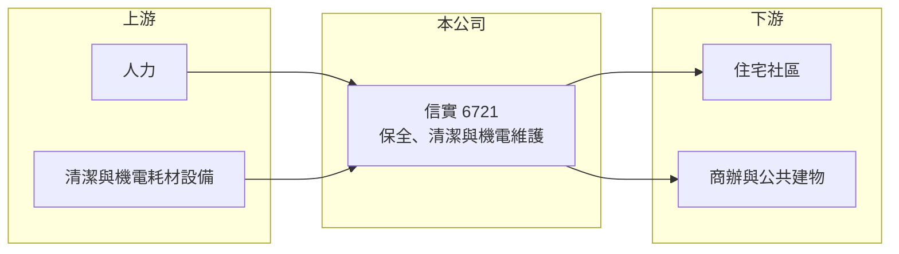

# 6721 信實

> 上櫃｜[[產業索引-其他業|其他業]]｜上市（櫃）日期 2022/04/29

# 第一章：企業模式與商業藍圖

> [!info] 撰寫說明
> 精簡版，由 Claude 依公開資料整理，架構比照 [[2330台積電]]，資料截至 2026-10-07。來源：nstock.tw 信實公司概況、winvest.tw 營收快訊。公開資料有限，服務別營收比重與營運據點本次未查到。#待校對

信實是提供保全、清潔與機電維護的[[物業管理]]服務公司，2022 年 4 月上櫃。

- **核心業務：** 信實提供駐衛保全、清潔服務及機電維護等勞務型服務，客戶多為社區、商辦與公共建物（推估）。
- **營收結構：** 本次未查到保全、清潔與機電維護的比重；2025 年全年營收 36.27 億元，2026 年 1 至 8 月累計 23.79 億元，與去年同期持平。
- **營運據點：** 服務據點本次未查到，本文不推測。
- **長期方向：** 物業管理屬於長期合約型生意，成長靠承接更多社區與商辦案場，以及提高附加服務比重（推估）。

# 第二章：護城河深度與競爭優勢

信實的優勢在於合約型的穩定收入，但產業進入門檻不高。

- **競爭優勢：** 服務合約多為長期續約，客戶黏著度高，營收相對穩定（推估）。
- **主要對手：** [[9917中保科]]、[[9925新保]] 以及眾多區域型物業管理與保全公司。
- **觀察重點：** 基本工資調整能否轉嫁到合約價格、[[毛利率]]能否維持，以及新案場承接進度。

# 第三章：財務體質與盈利規模

資料日期：2026-10-07，以下數字是撰寫當時的快照；最新月營收、毛利率、累計 EPS 由自動排程寫在本筆記的屬性欄位（月營收、毛利率、累計EPS 等）。#待校對

信實營收規模不小，但屬於低毛利的勞務型生意。

- **營收規模：** 2026 年 8 月營收 2.69 億元、年減 11.7%；6 月 2.83 億元、年減 6.69%；1 至 8 月累計 23.79 億元。2025 年全年營收 36.27 億元。
- **獲利：** 2026 年第二季 EPS 1.4 元、年增 26.13%；毛利率 6.04%、[[營業利益率]] 4.26%、淨利率 3.45%。
- **財務特色：** 資本額僅約 2.25 億元，股本小使 EPS 偏高；2025 年度配發現金股利 3.3 元，近五年平均現金股利 2.97 元，屬於高配息的輕資產公司。

# 第四章：總體風險與地緣政治

信實的風險集中在人力成本與合約價格。

- **產業週期：** 物業管理需求穩定，受景氣影響較小，但新建案交屋量會影響新合約來源。
- **營運風險：** 毛利率僅約 6%，基本工資上調或缺工若無法轉嫁，獲利容易被侵蝕；2026 年下半年月營收年減，需留意是否流失案場。
- **其他風險：** 勞動法規變動、職業安全事故與保全責任賠償。

# 專有名詞解析

## 金融

- **[[毛利率]]**：毛利占營收的比例，反映產品定價能力與成本控制。
- **[[營業利益率]]**：營業利益占營收的比例，反映本業扣除費用後的獲利能力。

## 產業

- **[[物業管理]]**：替社區、大樓提供保全、清潔、機電維護與行政管理等服務。
- **[[駐衛保全]]**：派保全人員常駐在社區或大樓執行門禁、巡邏與安全管理。

# 核心供應鏈

- 上游：保全與清潔人力、清潔耗材與機電設備供應商（推估）
- 下游／客戶：住宅社區管委會、商辦與公共建物，客戶名稱未揭露
- 同業：[[9917中保科]]、[[9925新保]] 與區域型物業管理公司

## 最新新聞
<!-- news:start -->
<!-- news:end -->

## 相關連結
- [公開資訊觀測站](https://mopsov.twse.com.tw/mops/web/t05st03?step=1&firstin=1&co_id=6721)
- [Goodinfo](https://goodinfo.tw/tw/StockDetail.asp?STOCK_ID=6721)
- [Yahoo 股市](https://tw.stock.yahoo.com/quote/6721)
- [鉅亨網新聞](https://www.cnyes.com/twstock/6721/news)
