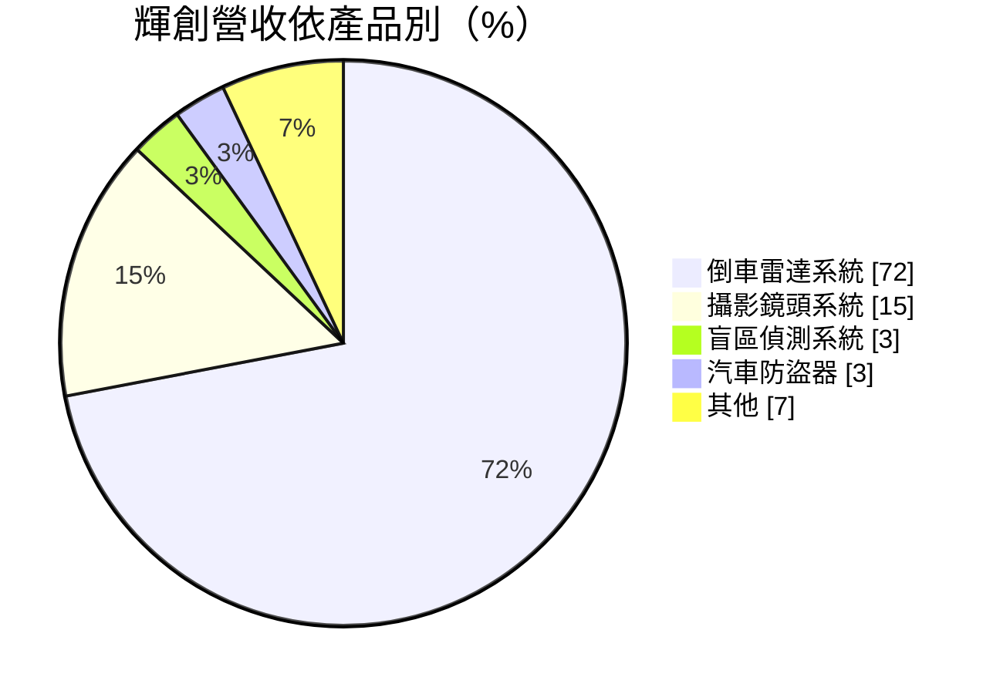
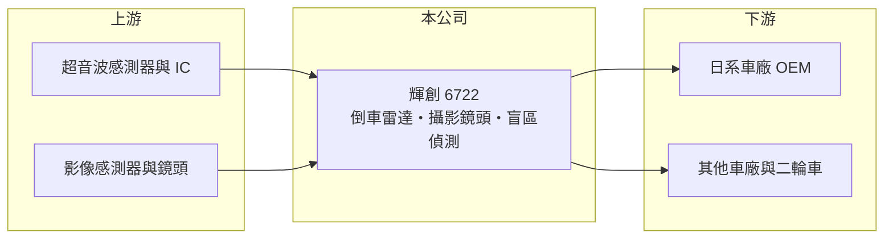

# 6722 輝創

> 上市｜[[產業索引-其他電子業|其他電子業]]｜上市（櫃）日期 2026/01/16

# 第一章：企業模式與商業藍圖

> [!info] 撰寫說明
> 精簡版，由 Claude 依公開資料整理，架構比照 [[2330台積電]]，資料截至 2026-10-07。來源：富果研究輝創 2026 年 5 月法說會筆記。#待校對

輝創是車用電子廠，以[[倒車雷達]]系統為主力，主要供應日系車廠的 OEM 市場。

- **核心業務：** 生產倒車雷達、攝影鏡頭、盲區偵測系統與汽車防盜器，屬[[ADAS]]相關的車用感測產品。
- **營收結構：** 倒車雷達系統占 72%、攝影鏡頭系統 15%、盲區偵測 3%、防盜器 3%、其他 7%；2026 年第一季地區別為中國 39%、台灣 28%、泰國 11%、美國 8%。
- **營運據點：** 台灣總部，生產與服務據點包括中國蘇州、泰國、馬來西亞、日本、印尼與印度合資，產品供應全球 25 個國家。
- **長期方向：** 泰國廠陸續投產，聚焦 ADAS 法規帶動的需求，並開發二輪與商用車市場。

# 第二章：護城河深度與競爭優勢

輝創的護城河在打入日系車廠 OEM 供應鏈，認證門檻高。

- **競爭優勢：** 服務超過 50 家 OEM 客戶，日系車廠占 82.4%，[[車規驗證]]週期長，供應關係穩定。
- **主要對手：** [[3552同致]]、[[2231為升]] 等台灣車用電子廠，以及日系與歐系一級供應商。
- **觀察重點：** 泰國廠投產後的產能利用率，以及新產品下半年能否帶動營收回到成長。

# 第三章：財務體質與盈利規模

資料日期：2026-10-07，以下數字是撰寫當時的快照；最新月營收、毛利率、累計 EPS 由自動排程寫在本筆記的屬性欄位（月營收、毛利率、累計EPS 等）。#待校對

輝創營收略減，獲利率偏低。

- **營收規模：** 2026 年第一季營收 12.39 億元、年減 4.6%，公司預期第二季與第一季持平、第三季後成長。
- **獲利：** 2026 年第一季[[毛利率]] 20.5%、[[營業利益率]] 1.5%、稅後淨利率 2.4%，EPS 0.34 元。
- **財務特色：** 每股淨值 30.4 元；車用 OEM 價格壓力大，毛利率偏低，營業費用吃掉大部分毛利。

# 第四章：總體風險與地緣政治

輝創的風險在日系車廠銷量與中國市場。

- **產業週期：** 營收與日系車廠的全球產量連動，車市景氣與車型改款會影響出貨。
- **營運風險：** 營業利益率僅 1.5%，車廠年度降價或匯率不利就可能虧損；新廠投產初期成本較高。
- **其他風險：** 中國占營收近四成，中國車市價格戰與日系品牌在中國銷量下滑是主要壓力；美國關稅也影響出口。

# 專有名詞解析

## 應用

- **[[ADAS]]**：先進駕駛輔助系統，用雷達、攝影機等感測器協助駕駛避撞、停車與維持車道。
- **[[倒車雷達]]**：裝在車尾的超音波感測器，偵測後方障礙物距離並發出警示。
- **[[車規驗證]]**：車用零件須通過 AEC-Q100 等可靠度測試與車廠認證，流程常需 2 至 3 年，因此轉換成本高。

## 金融

- **[[毛利率]]**：毛利除以營收，反映產品售價扣除直接成本後的獲利空間。
- **[[營業利益率]]**：營業利益除以營收，反映本業扣除營業費用後的獲利能力。

# 核心供應鏈

- 上游：超音波感測器、IC、影像感測器與鏡頭供應商（推估）
- 下游／客戶：超過 50 家 OEM 客戶，以日系車廠為主（占 82.4%）
- 同業：[[3552同致]]、[[2231為升]]

## 最新新聞
<!-- news:start -->
<!-- news:end -->

## 相關連結
- [公開資訊觀測站](https://mopsov.twse.com.tw/mops/web/t05st03?step=1&firstin=1&co_id=6722)
- [Goodinfo](https://goodinfo.tw/tw/StockDetail.asp?STOCK_ID=6722)
- [Yahoo 股市](https://tw.stock.yahoo.com/quote/6722)
- [鉅亨網新聞](https://www.cnyes.com/twstock/6722/news)
