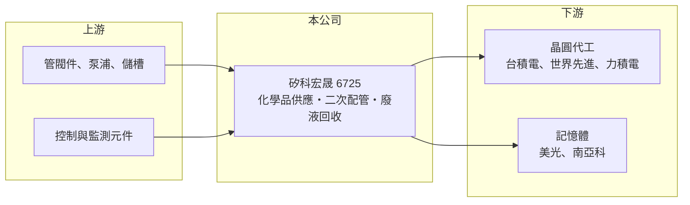

# 6725 矽科宏晟

> 上櫃｜[[產業索引-其他電子業|其他電子業]]｜上市（櫃）日期 2025/12/30

# 第一章：企業模式與商業藍圖

> [!info] 撰寫說明
> 精簡版，由 Claude 依公開資料整理，架構比照 [[2330台積電]]，資料截至 2026-10-07。來源：富果研究矽科宏晟 2026 年 6 月法說會筆記。#待校對

矽科宏晟是晶圓廠化學品供應系統與[[二次配管]]工程廠商，台積電是最主要客戶。

- **核心業務：** 提供[[化學品供應系統]]（CDS/CMS）、廢液收集與回收系統、二次配管工程、系統維護與零件供應，以及[[全面化學品管理]]人力支援。
- **營收結構：** 公開資料未列出各業務比重；新建廠的系統與配管工程為主要營收，維護與 TCM 提供較穩定的經常性收入。
- **營運據點：** 以台灣為主，投入約 800 萬美元在美國亞利桑那州設立據點，跟隨客戶赴美。
- **長期方向：** 拓展 [[2408南亞科]]、美光等非台積電客戶以分散集中度，並發展廢液回收等循環經濟業務。

# 第二章：護城河深度與競爭優勢

矽科宏晟的優勢在長期服務台積電建立的實績與驗證。

- **競爭優勢：** 客戶包括 [[2330台積電]]、美光、[[6770力積電]]、[[2408南亞科]]、[[5347世界先進]]，系統經客戶驗證後轉換成本高。
- **主要對手：** [[6613朋億]]、[[6667信紘科]]，以及 [[2404漢唐]]、[[6196帆宣]] 等大型廠務工程商。
- **觀察重點：** 公司目標 2026 年營收成長率優於 2025 年的 21%，美國據點的接單與獲利是關鍵。

# 第三章：財務體質與盈利規模

資料日期：2026-10-07，以下數字是撰寫當時的快照；最新月營收、毛利率、累計 EPS 由自動排程寫在本筆記的屬性欄位（月營收、毛利率、累計EPS 等）。#待校對

矽科宏晟營收穩定成長，毛利率維持在兩成出頭。

- **營收規模：** 2025 年營收 38.16 億元、年增 21%；2026 年第一季營收 9.38 億元、年增 33%。
- **獲利：** 2025 年 EPS 12.98 元、[[毛利率]] 23%；2026 年第一季 EPS 2.59 元、毛利率 23%。
- **財務特色：** 2025 年度擬配現金股利 7 元、配發率約 54%，公司目標配發率維持 50% 以上。

# 第四章：總體風險與地緣政治

矽科宏晟的風險在客戶集中與海外擴張。

- **產業週期：** 營收連動晶圓廠資本支出，擴產放緩時新建廠工程會減少。
- **營運風險：** 對台積電依賴度高，單一客戶的擴產節奏決定大部分營收。
- **其他風險：** 美國據點面臨人力成本、工會與當地法規挑戰，初期可能拉低獲利。

# 專有名詞解析

## 金融

- **[[毛利率]]**：毛利除以營收，反映產品售價扣除直接成本後的獲利空間。

## 產業

- **[[化學品供應系統]]**：把酸、鹼、溶劑等製程化學品從儲槽經管路穩定輸送到生產機台的系統，需維持極高潔淨度。
- **[[二次配管]]**：把廠務主系統的水、氣、化學品管線連接到個別生產機台的工程，英文稱 Hook-up。
- **[[全面化學品管理]]**：由廠商派駐人力替晶圓廠管理化學品進料、儲存與供應的服務，英文簡稱 TCM。

# 核心供應鏈

- 上游：管閥件、泵浦、儲槽與控制元件供應商（推估）
- 下游／客戶：[[2330台積電]]、美光、[[6770力積電]]、[[2408南亞科]]、[[5347世界先進]]
- 同業：[[6613朋億]]、[[6667信紘科]]、[[2404漢唐]]、[[6196帆宣]]

## 最新新聞
<!-- news:start（自動產生，請勿手動編輯此範圍） -->
- 2026-10-08 🏛️ 重訊 17:57｜本公司受邀參加寬量國際主辦之「20th QIC CEO Week」，向投資人說明本公司之營運概況、財務及業務相關資訊｜[觀測站](https://mops.twse.com.tw/mops/#/web/t05st01)
- 2026-10-08 🏛️ 重訊 17:53｜公告本公司背書保證&#12198;額達「公開發&#12175;公司 資&#12198;貸與及背書保證處理準則」第&#12038;&#12055;五條 第&#12032;項第四款之公告標準｜[觀測站](https://mops.twse.com.tw/mops/#/web/t05st01)

完整紀錄：[[6725矽科宏晟 新聞]]
<!-- news:end -->

## 相關連結
- [公開資訊觀測站](https://mopsov.twse.com.tw/mops/web/t05st03?step=1&firstin=1&co_id=6725)
- [Goodinfo](https://goodinfo.tw/tw/StockDetail.asp?STOCK_ID=6725)
- [Yahoo 股市](https://tw.stock.yahoo.com/quote/6725)
- [鉅亨網新聞](https://www.cnyes.com/twstock/6725/news)
