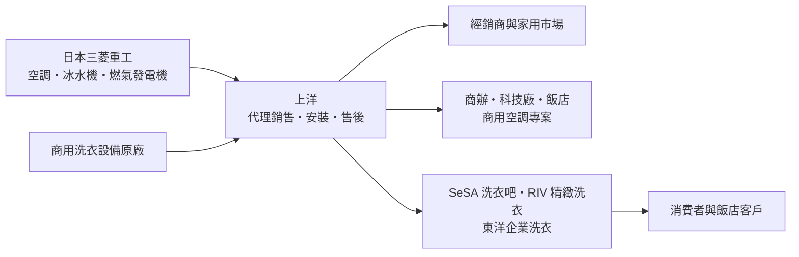
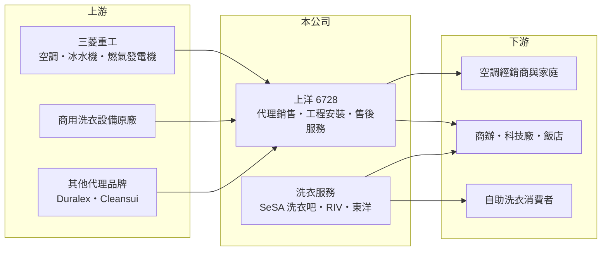

# 6728 上洋

> 上櫃｜[[產業索引-居家生活|居家生活]]｜上市（櫃）日期 2020/12/25

# 第一章：企業模式與商業藍圖

> [!info] 撰寫說明
> 本文由 Claude 依公開資料整理，架構比照 [[2330台積電]] 的四章研究，資料截至 2026-10-08。財務數字來源：Goodinfo 年度經營績效頁、自由時報 2026 年 3 月報導、旺得富 2025 年 11 月報導、優分析報導標題；各事業營收比重未查得，尚未逐條比對原始文件。#待校對

在評估單一個股的長期投資價值時，首要步驟是拆解企業的底層獲利邏輯。本章說明上洋產業（股票代號：6728，以下簡稱上洋）如何從商用洗衣起家，發展成以三菱重工空調與洗衣服務為雙主軸的設備通路商。

## 一、核心定位：空調與洗衣雙主軸的設備代理商

- **核心業務：** 上洋有兩大事業。第一是空調，以[[代理商]]身分在台灣銷售日本三菱重工的空調產品，分為家用空調、商用空調與[[冰水機]]三條產品線；第二是公司起家的洗衣事業，包括商用洗衣設備、[[自助洗衣]]連鎖品牌「SeSA 洗衣吧」、高端洗衣「RIV 精緻洗衣」，以及專攻飯店等企業客戶的子公司「東洋」。代理商的價值在於銷售通路、工程安裝與售後服務，而不是自己製造設備。
- **營收結構：** 公司未揭露各事業營收比重。依 2025 年報導，商用空調與冰水機專案是營收的主要動能，商用洗衣維持成長，家用空調則缺乏動能。2025 年營收 47.4 億元，是 2020 年 13.6 億元的三倍以上。
- **營運據點：** 以台灣為主要市場，自助洗衣已進入越南、泰國，並規劃拓展馬來西亞與美國、加拿大。近年持續擴充團隊與營業據點。

## 二、資本轉化邏輯：代理設備加上服務收入

- **獲利特性：** 毛利率在 2020 至 2025 年介於約 34% 至 40%，營業利益率在 2021 至 2022 年高達約 16% 至 18%，2025 年降到約 8%。代理商的毛利來自原廠授權的價差與工程服務，營業利益率則取決於擴張期間的人事與據點費用。
- **服務化：** 自助洗衣與企業洗衣把一次性的設備銷售，轉為持續性的服務收入。這類收入受景氣影響較小，也讓上洋不只是單純的設備經銷商。

## 三、長期方向

- **長期方向：** 上洋近年積極擴充代理品項，包括三菱燃氣發電機、法國玻璃餐具 Duralex、三菱化學淨水品牌 Cleansui，以及自有禮品品牌 Heartpicks。洗衣事業則往企業客戶（飯店、醫療、無塵衣）與海外自助洗衣延伸。公司把這些新事業定位為「長期策略性投資」，短期費用增加、獲利率下降，長期目標是建立多元的代理與服務組合。

# 第二章：護城河深度與競爭優勢

「護城河」指企業抵禦競爭、維持超額利潤的保護機制。本章分析上洋作為代理商的優勢與脆弱點。

## 一、護城河的核心組成

- **競爭優勢：** 第一是與三菱重工的長期代理關係，商用空調與冰水機需要設計、安裝與維修的工程能力，原廠通常仰賴有經驗的在地代理商。第二是工程與售後服務網絡，商用空調專案的客戶重視系統穩定，一旦安裝完成，後續的保養與更換多會回到原代理商。第三是洗衣事業的多年經驗，從設備到自助洗衣店經營，形成設備銷售與服務營運的雙重收入。
- **主要對手：** 空調市場有 [[1504東元]] 等本土品牌、大金（由和泰興業代理）、日立、松下等日系品牌，冰水機市場還有歐美大廠；自助洗衣市場則有許多連鎖與獨立業者。

## 二、優勢轉化：守得住／守不住／觀察重點

- **守得住：** 商用空調與冰水機的專案能力與售後市場，以及洗衣服務的持續性收入。
- **守不住：** 家用空調。家用空調品牌眾多、通路價格競爭激烈，且隨房市冷熱波動，2025 年已明顯缺乏動能。
- **觀察重點：** 代理商最大的結構性風險是原廠政策，三菱重工的代理關係是否穩定；新代理品項能否在幾年內獲利；以及營收擴張後營業利益率能否止跌。

# 第三章：財務體質與盈利規模

資料日期：2026-10-08。數字取自 Goodinfo 年度經營績效與財經媒體報導，表格是撰寫當時的快照；最新月營收、毛利率、累計 EPS 由自動排程寫在本筆記的屬性欄位（月營收、毛利率、累計EPS 等）。#待校對

財務報表是檢驗護城河是否真實存在的最終標準。本章用六年的數字檢視上洋的高速擴張與獲利率變化。

## 一、多年度經營績效

| 年度 | 營收（新台幣） | [[毛利率]] | [[營業利益率]] | EPS（元） | [[ROE]] |
|---|---|---|---|---|---|
| 2020 | 13.6 億 | 36.8% | 9.33% | 5.22 | 16.5% |
| 2021 | 19.4 億 | 39.8% | 17.6% | 11.74 | 33.0% |
| 2022 | 24.5 億 | 39.0% | 16.2% | 13.60 | 32.7% |
| 2023 | 27.3 億 | 36.7% | 11.0% | 10.28 | 23.4% |
| 2024 | 35.1 億 | 37.2% | 11.3% | 11.71 | 20.5% |
| 2025 | 47.4 億 | 33.7% | 8.24% | 9.77 | 14.8% |

- **營收規模：** 2020 至 2025 年營收年複合成長率約 28%（推算），是同類通路商中少見的高成長。
- **獲利：** 營收成長了三倍多，但稅後淨利只從 1.04 億元增加到 2.94 億元，且 2022 年後大致持平在 2.4 億至 3.1 億元。營業利益率從 2021 年的 17.6% 降到 2025 年的 8.2%，代表新增營收的獲利率較低，加上擴張帶來的費用增加。
- **財務特色：** 2021 至 2025 年平均 ROE 約 24.9%（推算），但逐年下滑。每股淨值在 2024 年由 44.08 元跳升到 64.79 元，股數也從約 0.23 億股增加到約 0.30 億股，推估 2024 年辦理過現金增資（推估）。ROA 從 23.8% 降到 7.5%，總負債明顯增加，資產負債表正在擴大。Goodinfo 統計長期平均現金股利約 5.95 元，逐年配息未查得。

## 二、[[ROIC]] 與 [[WACC]]

**ROIC 推算：** 2025 年營業利益約 3.91 億元（47.4 億 × 8.24%），稅後約 3.12 億元。股東權益約 20.1 億元（每股淨值 66.72 元 × 約 0.301 億股），依 ROA 7.48% 推算總資產約 39 億元、總負債約 19 億元，有息負債金額未查得。只以股東權益計算 ROIC 約 15.5%；若有息負債約 10 億元（推估），ROIC 約 10.4%（推算）。2022 年同樣只以權益計算，稅後營業利益約 3.17 億元、股東權益約 10.1 億元，ROIC 約 30%（推算）。

**WACC 推算：** 假設台灣 10 年期公債 1.75%、市場風險溢酬 6%、β 取通路股常見值 0.8（推估），股東權益成本約 6.55%；負債成本 2.5%、稅後 2.0%，權益約占資本 70%（推估），WACC 約 5.2%（推算）。

**結論：** 上洋的 ROIC 仍高於 WACC，持續創造經濟價值，但資本報酬率在擴張中明顯下降。代理與服務業的價值來自輕資產與高周轉，若擴張持續需要更多資本卻帶不來同比例的利潤，價值創造的速度會放慢。

# 第四章：總體風險與地緣政治

任何企業都無法脫離宏觀環境獨立存在。本章分析上洋長期面對的風險。

## 一、產業與結構風險

- **產業週期：** 家用空調需求跟著房市與氣溫走，新屋交屋與夏季高溫是主要旺季；商用空調與冰水機則取決於商辦、廠房與飯店的新建與更新。公司已點出國內房市降溫與耐久財買氣波動的影響。
- **營運風險：** 代理權集中於三菱重工，若原廠調整台灣代理策略，影響會很大。快速擴張的人事、據點與新事業費用若無法帶來足夠營收，營業利益率可能繼續下滑。

## 二、其他風險

- **匯率：** 代理的空調與設備多從日本進口，日圓與新台幣的匯率變動會影響進貨成本與毛利率。
- **法規與能源：** 冷媒法規逐步淘汰高溫室效應冷媒，空調產品需要配合更換；能源效率標準提高與電價政策會影響產品組合。燃氣發電機的需求則與天然氣價格及電力供應穩定度有關。
- **海外擴張：** 自助洗衣進入越南、泰國、馬來西亞與北美，面臨不同的法規、消費習慣與經營管理挑戰。

# 專有名詞解析

## 金融

- **[[ROIC]]**：投入資本報酬率，稅後營業利益除以股東權益加有息負債，衡量本業運用資本的效率。
- **[[WACC]]**：加權平均資金成本，股東與債權人要求報酬的加權平均，ROIC 高於它才代表創造價值。

## 產業

- **[[代理商]]**：取得國外原廠授權，在特定地區負責銷售、技術支援與售後服務的通路業者。
- **[[冰水機]]**：以冷卻水循環供應大型建築或廠房空調的中央空調主機，常用於商辦、醫院與科技廠。
- **[[自助洗衣]]**：由消費者自行操作投幣或行動支付洗衣機與烘衣機的門市，業者收入來自設備使用費。

# 核心供應鏈

## 1. 上游：原廠
- 日本三菱重工（空調、冰水機、燃氣發電機）、三菱化學（Cleansui 淨水）、Duralex（玻璃餐具）

## 2. 中游：上洋
- 空調代理、商用洗衣設備、自助洗衣連鎖、企業洗衣子公司東洋

## 3. 下游與同業
- 客戶：空調經銷商、商辦與科技廠、飯店、一般消費者
- 同業：[[1504東元]]、和泰興業（大金代理）、日立、松下等空調品牌

## 最新新聞
<!-- news:start -->
<!-- news:end -->

## 相關連結
- [公開資訊觀測站](https://mopsov.twse.com.tw/mops/web/t05st03?step=1&firstin=1&co_id=6728)
- [Goodinfo](https://goodinfo.tw/tw/StockDetail.asp?STOCK_ID=6728)
- [Yahoo 股市](https://tw.stock.yahoo.com/quote/6728)
- [鉅亨網新聞](https://www.cnyes.com/twstock/6728/news)
