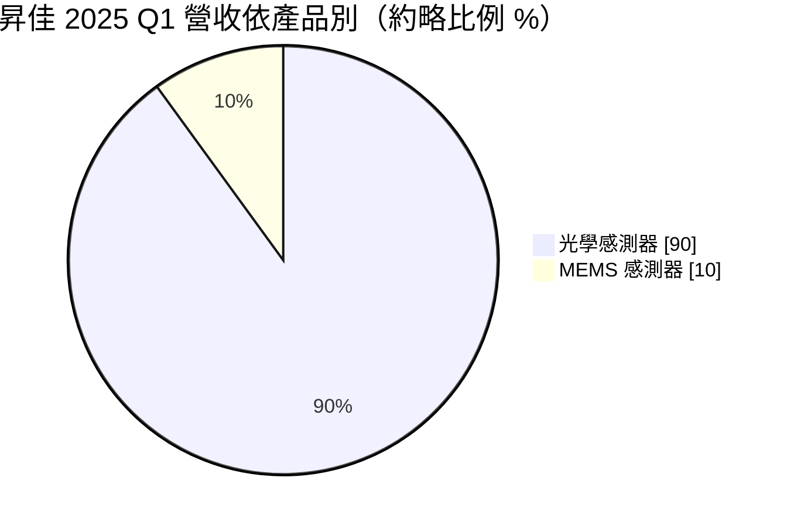
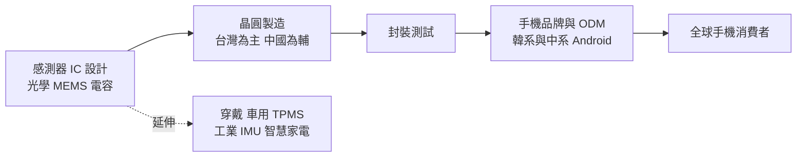
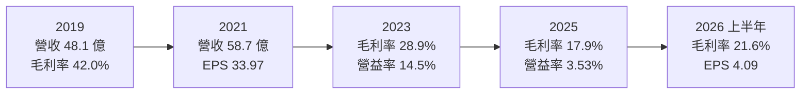
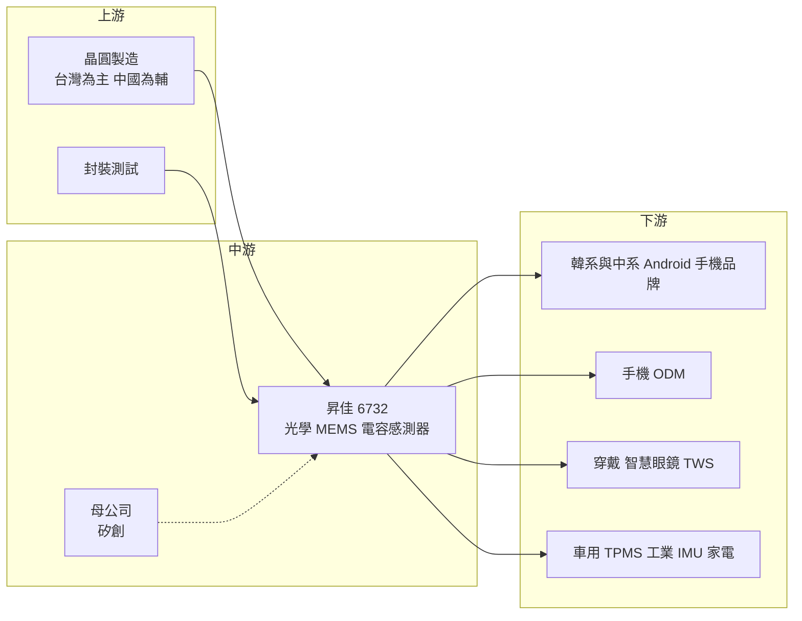

# 6732 昇佳電子

> 上櫃｜[[產業索引-半導體業|半導體業]]｜上市（櫃）日期 2020/06/08

# 第一章：企業模式與商業藍圖

> [!info] 撰寫說明
> 本文由 Claude 依公開資料整理，架構比照 [[2330台積電]] 的四章研究，資料截至 2026-10-08。財務數字來源：Goodinfo 年度經營績效頁、nStock 公司概況頁、Yahoo 股市公司基本資料、富果研究 2025 年 6 月與 2026 年 6 月法說會整理、鏡週刊 2020 年報導；產業描述為整理性內容，尚未逐條比對原始文件。#待校對

在評估單一個股的長期投資價值時，首要步驟是拆解企業的底層獲利邏輯。本章針對昇佳電子（股票代號：6732，以下簡稱昇佳）的商業模式進行定性分析，說明一家以手機光學感測器打入全球 Android 品牌的 IC 設計公司，如何在 2019 至 2021 年創造極高的資本報酬，又為什麼在中國手機市場的價格戰中，毛利率從四成以上一路降到約兩成。

## 一、核心定位：Android 手機感測晶片的主要供應商

昇佳成立於 2009 年 12 月，2020 年 6 月上櫃，董事長為李盛樞、總經理為楊祝原。依鏡週刊 2020 年報導，昇佳的母公司是驅動 IC 廠 [[8016矽創]]，被形容為矽創的「金雞母」。昇佳是 [[Fabless]] 型態的感測器 IC 設計公司，依法說會整理，公司定位為全球 Android 手機感測晶片的領導廠商。

昇佳的主力產品是手機裡看不見、但每支手機都需要的小型感測器：

* **[[近接感測器]]：** 偵測臉部是否靠近螢幕，通話時自動關閉螢幕，避免誤觸。
* **[[環境光感測器]]：** 偵測周圍光線強度，自動調整螢幕亮度。近年延伸出可偵測色溫的 RGB 感測器與閃爍偵測器，用來讓螢幕顏色與相機拍照更準確。
* **[[MEMS]] 感測器：** 包括加速度計、壓力計、[[SAR 感測器]]與六軸陀螺儀，用來偵測手機方向、高度、人體接近程度與運動狀態。

這類感測器單價不高，但每支手機都要用一到數顆，而全球 Android 手機一年出貨十億支以上，因此出貨量非常龐大。昇佳的價值在於能以小尺寸、低功耗的晶片，滿足手機品牌在螢幕越來越窄、機身越來越薄時對感測器的嚴格要求。

## 二、終端應用／產品板塊

依富果研究整理的 2025 年 6 月法說會，昇佳光學與 MEMS 感測器的營收比例約為 9 比 1，以下圓餅圖依此近似比例繪製：

* **光學感測器：** 營收主力，包括近接、環境光、RGB 色溫與閃爍偵測。2026 年第一季法說會提到，高階皮膚偵測感測器（用於穿戴裝置）與進階距離偵測感測器已開始出貨，光學占比較過去的約 90% 略為下降。
* **MEMS 感測器：** 公司近年刻意發展的第二支柱。加速度計占比最大，壓力計與 SAR 感測器已導入手機品牌，陀螺儀用於掃地機器人與真無線藍牙耳機。MEMS 被視為主要成長動能。
* **電容感測器：** 用於穿戴裝置與智慧眼鏡的觸控開關。

依客戶結構，2026 年第一季高階品牌客戶占營收約 60% 至 65%，韓系客戶屬於高階品牌；中階品牌占比下降，公司為維持獲利已逐步退出價格競爭激烈的市場；[[ODM]] 占比大致穩定。應用面以智慧型手機為大宗，其次為穿戴裝置、智慧家電與車用電子。

## 三、資本轉化邏輯：手機出貨量乘上滲透率

昇佳的營收公式很直接：手機出貨量乘上每支手機採用的感測器數量，再乘上昇佳的市占率與單價。2018 至 2021 年，昇佳在中國 Android 品牌快速提高市占，加上手機感測器數量增加，營收從 19.4 億元跳升到 58.7 億元，毛利率超過四成，ROE 一度超過 100%（Goodinfo，2019 年 110%）。

但這個公式也說明了昇佳的脆弱性。當手機出貨停滯、中國同業以低價搶單時，市占與單價同時受壓，營收與毛利率一起下滑。依 Goodinfo，昇佳毛利率從 2021 年的 45.8% 降到 2025 年的 17.9%，營業利益率從 32.4% 降到 3.53%。依法說會，主因是中國手機市場的價格內捲，加上 2025 年 5 至 7 月新台幣急升造成的匯率衝擊。依 2025 年 6 月法說會，感測器主要在台灣與中國投產，台灣占比較高。

## 四、企業長期藍圖：走向高階與非手機應用

* **聚焦高階品牌：** 退出中低階價格戰市場，深化與現有主要客戶的合作、增加供應品項，並開發新的手機品牌客戶。旗艦機的光學感測器規格較高，價格競爭也較緩和。
* **非手機應用：** 以 SAR 感測器切入智慧眼鏡、以陀螺儀與電容開關切入真無線耳機、以 G-sensor 用於車用胎壓偵測器（[[TPMS]]）、壓力計導入車用市場，環境光感測器用於平板、筆電與車用顯示器。
* **工業與航太 IMU：** 高階慣性量測單元（[[IMU]]）開發中，預計 2026 年下半年進入驗證，可用於無人機與工業設備。IMU 單價與毛利遠高於手機感測器，若成功是產品組合升級的重要一步。
* **供應鏈優化：** 透過更好的供應鏈組合與在地生產，提升成本競爭力。

# 第二章：護城河深度與競爭優勢

在長期價值投資中，「護城河」指企業抵禦競爭、維持超額利潤的保護機制。本章分析昇佳的護城河構成、全球主要競爭對手，以及這些優勢在中國手機價格戰下能守住多少。

## 一、護城河的核心組成要素

昇佳的護城河屬於「客戶關係型窄護城河」，在毛利率持續下滑的過程中，已證明不足以完全抵擋價格競爭。

* **1. 一線 Android 品牌的認證與關係：** 手機感測器要配合每一款新機的機構、玻璃與螢幕設計做調校，品牌通常只認證少數供應商。昇佳長期供應韓系與中系一線品牌，熟悉這些客戶的開發流程，能在新機開案時優先取得規格。
* **2. 小尺寸、低功耗的設計能力：** 手機螢幕邊框越來越窄，近接與環境光感測器必須放在螢幕下方或極小的開孔中，對晶片尺寸與靈敏度要求很高。持續開發更小、更薄的下一代產品，是昇佳在價格戰中維持市占的方式。
* **3. 光學加 MEMS 的組合銷售：** 同時供應光學與 MEMS 感測器，可以讓客戶一次採購多種感測器，降低驗證成本。這是昇佳把單一客戶的產品滲透率提高的主要手段。

## 二、全球主要競爭對手格局

| 對手 | 定位 | 對昇佳的威脅 |
|---|---|---|
| ams OSRAM | 歐洲光學感測器大廠，高階手機環境光與近接感測主要供應商 | 在旗艦機光學感測器市場與昇佳直接競爭 |
| 意法半導體（STMicroelectronics）、博世（Bosch） | 全球 MEMS 感測器龍頭 | MEMS 加速度計、陀螺儀的主要供應商，規模遠大於昇佳 |
| 中國感測器設計公司 | 以低價切入中國中低階手機 | 是昇佳毛利率下滑的主要壓力來源 |
| [[3227原相]] | 台灣光學感測 IC 設計公司 | 在光學感測與穿戴裝置應用有部分重疊 |

上表為依產業結構整理的常見競爭者，昇佳法說會只提到中國廠商的價格競爭，其餘未逐一點名，屬整理性內容（推估）。

## 三、優勢轉化：守得住／守不住／觀察重點

* **守得住：** 韓系與中系旗艦機的光學感測器，以及高階皮膚偵測等穿戴感測器。這些產品規格高、驗證嚴格，客戶不會只看價格，昇佳的設計能力與客戶關係能發揮作用。
* **守不住：** 中低階手機的標準化感測器。中國同業以低價搶單，昇佳已主動退出部分市場。毛利率由 2021 年的 45.8% 降到 2025 年的 17.9%，說明這部分的護城河已經失守。
* **觀察重點：** 第一，高階品牌占比能否維持在六成以上並帶動毛利率回升；第二，工業 IMU、車用 TPMS、智慧眼鏡等非手機應用能否在 2027 年後形成有意義的營收；第三，在不參與價格戰的前提下，營收能否止跌。

# 第三章：財務體質與盈利規模

資料日期：2026-10-08。數字取自 Goodinfo 年度經營績效頁、nStock 公司概況頁與法說會整理，表格是撰寫當時的快照；最新月營收、毛利率、累計 EPS 由自動排程寫在本筆記的屬性欄位（月營收、毛利率、累計EPS 等）。#待校對

財務報表是檢驗護城河是否真實存在的最終標準。本章用近九年的三率、[[ROE]] 與資本報酬，檢視昇佳從高成長期到價格戰期的獲利品質變化。

## 一、獲利能力的基石：三率

| 年度 | 營收（新台幣） | [[毛利率]] | [[營業利益率]] | EPS（元） | [[ROE]] |
|---|---|---|---|---|---|
| 2017 | 10.5 億 | 17.1% | 0.83% | 0.24 | 2.05% |
| 2018 | 19.4 億 | 33.6% | 18.9% | 13.53 | 77.6% |
| 2019 | 48.1 億 | 42.0% | 31.2% | 35.10 | 110% |
| 2020 | 53.0 億 | 40.2% | 29.0% | 28.81 | 42.9% |
| 2021 | 58.7 億 | 45.8% | 32.4% | 33.97 | 34.2% |
| 2022 | 40.3 億 | 38.8% | 22.1% | 17.23 | 17.5% |
| 2023 | 45.4 億 | 28.9% | 14.5% | 13.81 | 15.1% |
| 2024 | 49.4 億 | 23.7% | 10.3% | 11.05 | 12.2% |
| 2025 | 45.6 億 | 17.9% | 3.53% | 6.22 | 7.06% |
| 2026 上半年 | 20.4 億 | 21.6% | 4.50% | 4.09 | 9.03%（年化） |

這張表呈現一條清楚的下坡。2019 至 2021 年是昇佳的黃金期，營收在 48 億至 59 億元之間，毛利率四成以上，營業利益率三成以上。2022 年起，營收雖維持在 40 至 50 億元，但毛利率每年下滑約 5 至 6 個百分點，到 2025 年只剩 17.9%。營收沒有崩跌，代表昇佳仍保有出貨量與市占；毛利率持續下滑，代表它失去了定價能力。

* **[[毛利率]]：** 2021 年 45.8%、2025 年 17.9%，2026 年上半年回升到 21.6%。法說會將 2026 年初的回升歸因於擺脫 2025 年 5 至 7 月的匯率衝擊。
* **[[營業利益率]]：** 從 32.4% 降到 3.53%，2026 年上半年為 4.50%。2026 年上半年 EPS 4.09 元明顯高於本業獲利所能支撐的水準，推估有相當部分來自匯兌收益等業外項目（推估）。
* **長期指標：** 2020 至 2025 年營收年複合成長率約 -3.0%（推算），近五年（2021 至 2025）平均 ROE 約 17.2%（推算），但逐年下滑。

## 二、[[ROE]]：資本效率

昇佳的 ROE 由 2019 年的 110% 一路降到 2025 年的 7.06%，近五年平均約 17.2%（推算）。以 2025 年稅後淨利 3.04 億元、ROE 7.06% 回推，股東權益約 43 億元（推算）。股本自 2020 年起維持在 4.89 億元，沒有大額增資，ROE 的下滑完全來自獲利能力下降，而非資本稀釋。這是判斷昇佳時最重要的一點：它的資本報酬下滑是本業問題，不是財務結構問題。

## 三、資本支出與自由現金流

昇佳屬於輕資產 IC 設計公司，資本支出主要是研發與測試設備，具體金額未查得。長年獲利、資本支出低，[[自由現金流]]推估長期為正（推估）。

股利方面，依 nStock，昇佳近五年平均現金股利約 14.6 元，2024 年度配發 10 元、[[配發率]]約 90.5%，2025 年度配發 5.5 元。公司長期維持高配發率，但股利金額隨獲利下滑而明顯減少。對以股利為主要考量的投資人來說，昇佳的配息是「高配發率、但金額不穩定」的類型。

## 四、[[ROIC]] 與 [[WACC]]：價值創造利差

**ROIC 推算：** 2025 年營業利益約 1.61 億元（45.6 億 × 3.53%），以稅率 20% 計算，稅後營業利益約 1.29 億元。投入資本以股東權益約 43 億元計算，有息負債未查得、IC 設計公司通常不重大，視為零（推估），ROIC 約 3.0%（推算）。對照 2021 年：營業利益約 19.0 億元（58.7 億 × 32.4%），稅後約 15.2 億元，權益約 48.5 億元（16.6 億 ÷ 34.2%），ROIC 約 31%（推算）。

**WACC 推算：** 權益成本以 CAPM 估計，假設台灣 10 年期公債殖利率 1.75%、市場風險溢酬 6%，β 未查得來源數字，採手機零組件 IC 設計股常見值 1.1，權益成本約 8.35%。有息負債不重大，WACC 約 8.35%（推算）。

**結論：** 昇佳在 2019 至 2022 年的 ROIC 遠高於 WACC，是明確的價值創造期；2024 年起利差逐步收斂，2025 年 ROIC 約 3%，已低於約 8.35% 的資金成本（推算）。這代表以目前的毛利率水準，昇佳的本業已無法覆蓋資金成本。昇佳要重新創造價值，關鍵在於讓毛利率回到三成以上，而這需要高階產品與非手機應用的比重明顯提高。

# 第四章：總體風險與地緣政治

任何企業都無法脫離宏觀環境獨立存在。本章分析昇佳未來必須面對的地緣政治、產業週期、營運與技術風險。

## 一、地緣政治

* **中國手機市場的集中：** 昇佳的主要客戶包括中國 Android 手機品牌。中國推動晶片國產化，手機品牌傾向扶植本土感測器供應商，這是昇佳在中國市場長期面對的結構性壓力。
* **美國關稅與產地遷移：** 法說會提到，高關稅可能促使手機供應鏈從中國與東南亞移往印度，公司視之為潛在機會，但產地轉移期間的訂單節奏可能不穩定。
* **兩岸生產布局：** 感測器在台灣與中國都有投產，兩岸關係與美中管制的變化，可能影響生產與出貨的彈性。

## 二、產業週期與市場結構

* **智慧型手機成熟：** 全球手機出貨已進入低成長期，手機感測器的總需求難再大幅擴張。昇佳的營收成長只能靠提高單機用量、搶市占或擴展新應用。
* **價格內捲：** 中國手機市場競爭激烈，品牌把成本壓力往上游轉嫁，感測器這類標準化零件首當其衝。2022 至 2025 年毛利率的連續下滑就是結果。
* **[[長鞭效應]]：** 手機品牌的庫存調整會沿供應鏈放大，傳到感測器端的訂單變化更劇烈。

## 三、營運環境的隱性風險

* **匯率：** 2025 年 5 至 7 月新台幣急升，對昇佳的毛利率與業外損益造成明顯衝擊。產品以美元計價、費用以新台幣支出，使昇佳對匯率特別敏感。
* **客戶集中：** 高階品牌客戶占營收六成以上，單一大客戶的機種成敗或供應商策略改變，都會明顯影響營收。
* **新產品放量的不確定：** 工業 IMU、TPMS、皮膚偵測感測器等新產品仍在驗證或初期出貨階段，能否如期放量仍是未知數。

## 四、科技或法規演進

* **螢幕下感測與整合：** 手機設計朝全螢幕發展，感測器必須放到螢幕下方，技術門檻提高。若昇佳在螢幕下光學感測的技術落後，將失去高階機種的規格。另一方面，部分感測功能可能被整合進其他晶片，減少獨立感測器的需求。
* **穿戴與健康監測：** 智慧手錶、智慧眼鏡與健康監測裝置對光學與 MEMS 感測器的需求持續增加，是手機以外的長期機會。
* **車用與工業標準：** 胎壓偵測器在多國為法規強制配備，車用感測器需求穩定；但車規與工業認證週期長，對昇佳是新的學習曲線。

# 專有名詞解析

## 半導體

- **[[MEMS]]**：微機電系統，在晶片上製作微小的機械結構，用來感測加速度、旋轉、壓力等物理量。
- **[[近接感測器]]**：偵測物體是否靠近的感測器，手機用來在通話時自動關閉螢幕以避免誤觸。
- **[[環境光感測器]]**：偵測周圍光線強度的感測器，手機用來自動調整螢幕亮度。
- **[[SAR 感測器]]**：偵測人體是否接近天線的電容式感測器，讓手機在貼近人體時降低發射功率以符合電磁波法規。
- **[[IMU]]**：慣性量測單元，結合加速度計與陀螺儀，量測物體的運動與姿態，用於無人機、機器人與工業設備。
- **[[Fabless]]**：只做晶片設計、把製造委外給晶圓代工廠的商業模式。

## 應用

- **[[TPMS]]**：胎壓偵測系統，在輪胎內安裝感測器監測胎壓與溫度，多國法規要求新車配備。
- **[[ODM]]**：原廠委託設計製造，替品牌設計並生產產品的廠商，在手機產業負責大量中低階機種。

## 金融

- **[[ROE]]**：股東權益報酬率，稅後淨利除以股東權益，衡量公司用股東的錢賺錢的效率。
- **[[ROIC]]**：投入資本報酬率，稅後營業利益除以股東權益加有息負債，衡量本業運用全部資本的效率。
- **[[WACC]]**：加權平均資金成本，股東與債權人要求報酬率的加權平均，ROIC 高於它才算創造價值。
- **[[配發率]]**：現金股利占每股盈餘的比例，反映公司把多少獲利以現金發還股東。
- **[[自由現金流]]**：營業活動現金流減去資本支出，代表企業可自由用於配息、還債或併購的現金。
- **[[長鞭效應]]**：終端需求的小幅變動，沿供應鏈往上游傳遞時被逐級放大，造成上游庫存與訂單劇烈波動。

# 核心供應鏈

## 1. 上游：晶圓製造與封測
- 晶圓製造與封測：台灣與中國的晶圓代工及封測廠，具體合作對象未查得

## 2. 中游：昇佳本身與集團
- 母公司：[[8016矽創]]（依 2020 年報導）

## 3. 下游：主要客戶
- 韓系一線手機品牌：[[005930三星電子]]（法說會稱韓系客戶屬高階品牌，個別客戶名稱未經公司證實）
- 中系 Android 手機品牌與手機 ODM（個別客戶未揭露）
- 穿戴裝置、智慧眼鏡、真無線耳機、智慧家電與車用顯示器廠

## 4. 同業與競爭者
- 台灣：[[3227原相]]
- 國外：ams OSRAM、意法半導體、博世、中國感測器設計公司

## 最新新聞
<!-- news:start -->
<!-- news:end -->

## 相關連結
- [公開資訊觀測站](https://mopsov.twse.com.tw/mops/web/t05st03?step=1&firstin=1&co_id=6732)
- [Goodinfo](https://goodinfo.tw/tw/StockDetail.asp?STOCK_ID=6732)
- [Yahoo 股市](https://tw.stock.yahoo.com/quote/6732)
- [鉅亨網新聞](https://www.cnyes.com/twstock/6732/news)
