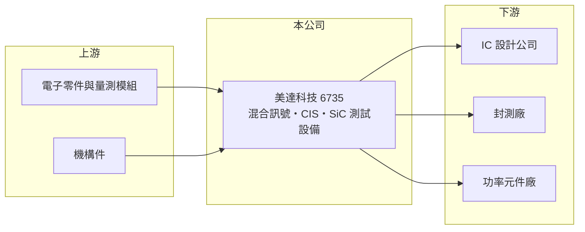

# 6735 美達科技

> 上櫃｜[[產業索引-其他電子業|其他電子業]]｜上市（櫃）日期 2022/04/29

# 第一章：企業模式與商業藍圖

> [!info] 撰寫說明
> 精簡版，由 Claude 依公開資料整理，架構比照 [[2330台積電]]，資料截至 2026-10-07。來源：工商時報（美達科技 2026 年 4 月營運報導）、nStock 美達科技公司簡介。#待校對

美達科技 2022 年 4 月上櫃，製造與銷售半導體測試儀器，聚焦類比、影像感測與功率元件測試。

- **核心業務：** 生產混合訊號與 [[CIS]] 測試設備、高壓大電流與光達產品測試設備，以及 [[SiC]] 晶圓級[[燒機測試]]系統。
- **營收結構：** 公開資料未列出產品別比重；應用涵蓋 5G、Wi-Fi 6、光通訊、電源管理晶片、功率放大器、3D 感測與電動車。
- **營運據點：** 以台灣為主（海外據點細節待查）。
- **長期方向：** 聚焦能源與感測領域，瞄準電動車、AI 伺服器、第三代半導體、AR/VR 與車用 ADAS 測試需求。

# 第二章：護城河深度與競爭優勢

美達的利基在特定類比與功率元件測試，避開與國際大廠的通用型測試機正面競爭。

- **競爭優勢：** 在 CIS、高壓大電流與 SiC 燒機等利基測試領域有自有設備，可配合客戶客製（推估）。
- **主要對手：** 國際測試設備大廠 Teradyne、Advantest，以及台灣的 [[2360致茂]]。
- **觀察重點：** 公司預期下半年[[毛利率]]恢復正常，SiC 與電動車相關測試設備能否帶動新成長。

# 第三章：財務體質與盈利規模

資料日期：2026-10-07，以下數字是撰寫當時的快照；最新月營收、毛利率、累計 EPS 由自動排程寫在本筆記的屬性欄位（月營收、毛利率、累計EPS 等）。#待校對

美達 2025 年獲利大減，2026 年營收回升。

- **營收規模：** 2025 年營收 3.43 億元、年減 4.81%；2026 年第一季營收 9,368 萬元、年增 45.66%，1 至 8 月累計 2.38 億元、年增 30.71%。
- **獲利：** 2025 年稅後淨利 0.15 億元、年減 83.96%，EPS 0.33 元；2026 年上半年 EPS 0.52 元，第二季毛利率 52.39%、營業利益率 8.48%。
- **財務特色：** 設備業毛利率高，但營收規模小，營業費用占比高，營收波動對獲利影響大。

# 第四章：總體風險與地緣政治

美達的風險在營收規模小與客戶投資週期。

- **產業週期：** 測試設備需求取決於 IC 設計與封測廠的擴產，消費性電子與電動車需求轉弱時訂單會延後。
- **營運風險：** 單月營收僅數千萬元，少數訂單的交機時點就會造成獲利大幅波動。
- **其他風險：** SiC 與電動車市場面臨中國廠商低價競爭，可能影響客戶投資意願。

# 專有名詞解析

## 半導體

- **[[CIS]]**：CMOS影像感測器，把光線轉為電子訊號的晶片，用於手機鏡頭、車用攝影與監控。
- **[[SiC]]**：碳化矽，耐高壓、高溫的第三代半導體材料，用於電動車與充電樁的功率元件。
- **[[燒機測試]]**：在高溫高壓下長時間運作晶片，提前篩出早期失效產品的可靠度測試。

## 金融

- **[[毛利率]]**：毛利除以營收，反映產品售價扣除直接成本後的獲利空間。

# 核心供應鏈

- 上游：電子零件、量測模組與機構件供應商（推估）
- 下游／客戶：IC 設計、封測與功率元件廠（具體客戶名單未查得）
- 同業：[[2360致茂]]、Teradyne、Advantest

## 最新新聞
<!-- news:start -->
<!-- news:end -->

## 相關連結
- [公開資訊觀測站](https://mopsov.twse.com.tw/mops/web/t05st03?step=1&firstin=1&co_id=6735)
- [Goodinfo](https://goodinfo.tw/tw/StockDetail.asp?STOCK_ID=6735)
- [Yahoo 股市](https://tw.stock.yahoo.com/quote/6735)
- [鉅亨網新聞](https://www.cnyes.com/twstock/6735/news)
