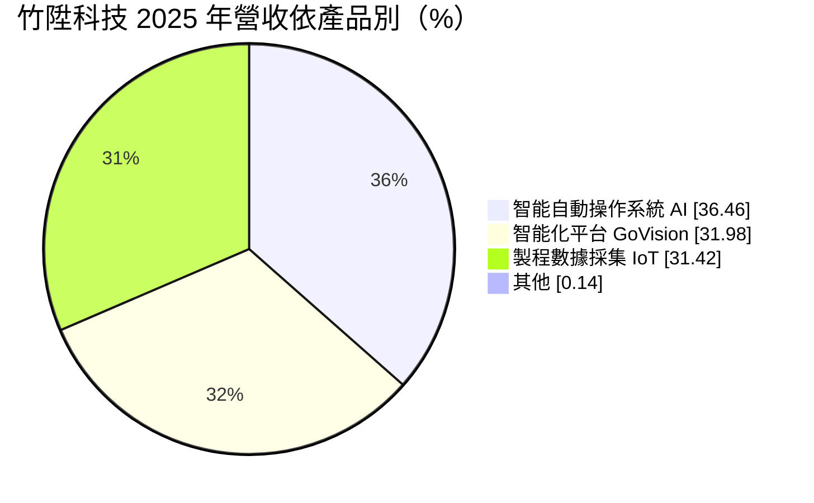
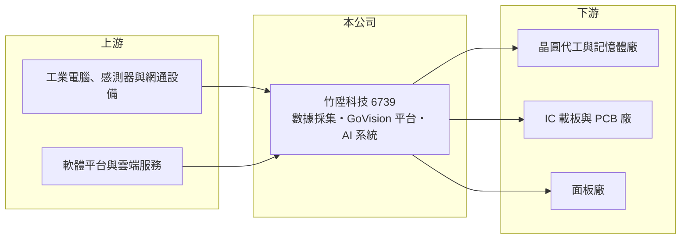

# 6739 竹陞科技

> 上櫃｜[[產業索引-其他電子業|其他電子業]]｜上市（櫃）日期 2024/09/02

# 第一章：企業模式與商業藍圖

> [!info] 撰寫說明
> 精簡版，由 Claude 依公開資料整理，架構比照 [[2330台積電]]，資料截至 2026-10-08。來源：MoneyDJ 理財網（富邦證券站）竹陞科技年度損益表、財務比率與基本資料；優分析 2026 年 6 月報導；winvest 公司簡介；櫃買中心 2026 年第二季資產負債資料。客戶名稱未公開。#待校對

竹陞科技是一家替晶圓廠、記憶體廠與載板廠建置產線監控與 AI 系統的軟體整合公司，賺的是「讓工廠看得見、管得住」的錢。

- **核心業務：** 竹陞 2017 年成立於新竹竹北，2024 年 9 月上櫃，主要提供半導體、面板與 [[PCB]] 產線的自動化監控、製程數據採集、遠端控制與 AI 系統開發。它的角色接近[[工廠自動化]]的「神經系統」：把機台資料收集起來、即時判讀異常，並把結果回饋給製程與良率管理，屬於[[智慧製造]]的核心環節。
- **營收結構：** 依 MoneyDJ 2025 年資料，三條產品線各占約三分之一：智能自動操作系統（AI）36.46%、智能化平台 GoVision 31.98%、製程數據採集系統（IoT）31.42%。三者彼此串連，數據採集是入口，平台與 AI 應用是加值，客戶導入越深，後續擴充的機會越多。
- **營運據點：** 總部在竹北，客戶集中在台灣的半導體與載板聚落，系統建置與維運需要工程師長期進駐客戶廠區。這種貼身服務模式讓竹陞熟悉客戶的設備與製程，但也意味著擴張速度受限於工程人力。
- **長期方向：** 公司把[[代理式 AI]]與 [[Physical AI]] 導入製程監控，目標是從「發現異常」進一步走到「自動判斷並處置」。隨著先進製程與先進封裝越來越複雜，良率管理對數據與 AI 的依賴只會增加，這是竹陞長期需求的來源。

# 第二章：護城河深度與競爭優勢

竹陞的護城河來自「已經長在客戶產線裡」：系統綁定設備與製程資料，換掉的成本與風險都很高。

- **競爭優勢：** 依優分析報導，竹陞是晶圓代工大廠與國際記憶體廠的標準配備監控系統供應商，也供應台灣最大載板廠。晶圓廠產線一旦採用某套監控系統，所有機台介面、警報規則與歷史資料都建立在上面，更換供應商等於重建整套流程，因此客戶黏著度高。
- **獲利結構：** 2025 年[[毛利率]] 65.82%、[[營業利益率]] 52.87%，比多數硬體設備商高出許多。原因是營收以軟體授權與系統整合為主，硬體占比低，客戶擴產時多半是複製既有方案，邊際成本很低。
- **主要對手：** 國內外製造執行系統（MES）與工廠自動化軟體商，以及大型客戶自建的 IT 團隊（推估）。大客戶自行開發是長期最大的替代威脅，竹陞必須持續證明外包比自建更快、更便宜。
- **觀察重點：** 長期要看兩件事：一是能否把半導體的成功經驗複製到 PCB、面板以外的新產業，降低客戶集中度；二是 AI 功能能否成為可重複銷售的標準產品，而不是每案客製。

# 第三章：財務體質與盈利規模

資料日期：2026-10-08，表格是撰寫當時的快照；最新月營收、毛利率、累計 EPS 由自動排程寫在本筆記的屬性欄位（月營收、毛利率、累計EPS 等）。#待校對

竹陞過去五年從年營收兩億多元的小公司，成長為營收八億、營業利益率過半的高獲利企業，2024 年起的成長尤其明顯。

| 年度 | 營收（億元） | [[毛利率]] | [[營業利益率]] | EPS（元） | [[ROE]] |
|---|---|---|---|---|---|
| 2021 | 2.17 | 49.79% | 6.71% | 0.62 | 4.83% |
| 2022 | 2.19 | 54.93% | 14.70% | 1.73 | 12.26% |
| 2023 | 2.55 | 60.83% | 27.20% | 2.56 | 15.97% |
| 2024 | 4.10 | 58.88% | 34.10% | 6.03 | 22.97% |
| 2025 | 8.06 | 65.82% | 52.87% | 16.13 | 42.10% |

- **營收與獲利趨勢：** 2020 至 2025 年營收年複合成長率約 26.7%（推算），營業利益率由個位數一路升到五成以上。這是典型的軟體型營運槓桿：人力與研發費用相對固定，營收放大後多數直接轉為利潤。
- **財務特色：** 2025 年負債比率約 21%，幾乎沒有借款，股本僅約 2.34 億元。近五年平均 ROE 約 19.6%（推算），現金股利由 2022 年度的 1 元、2023 年度的 2.02 元，提高到 2024 年度 5 元與 2025 年度 13 元，配息隨獲利同步提升。
- **[[ROIC]] 與 [[WACC]]：** 以 2025 年營業利益 4.26 億元乘以（1－20%）得稅後營業利益約 3.41 億元，除以股東權益約 10.32 億元加上非流動負債約 0.04 億元（作為有息負債的近似），ROIC 約 33%（推算）。WACC 以 CAPM 推估：無風險利率 1.75%、市場風險溢酬 6%、β 取 MoneyDJ 的 1.33，股權成本約 9.7%，公司幾乎無負債，WACC 約 9.5% 至 10%（推算）。ROIC 遠高於 WACC，代表每投入一元資本都創造明顯超額報酬；但這種高報酬建立在少數大客戶的擴產週期上，需要觀察能否在景氣下行時維持。

# 第四章：總體風險與地緣政治

竹陞的主要風險不在財務，而在客戶集中與半導體資本支出的週期性。

- **產業週期：** 竹陞的新案多來自客戶擴廠與產線升級，晶圓廠、記憶體廠與載板廠的[[CapEx]]一旦放緩，新系統的需求會跟著下降。雖然維運與擴充收入能提供一部分緩衝，營收成長率仍會隨半導體景氣明顯起伏。
- **營運風險：** 主要客戶集中在少數晶圓代工、記憶體與載板大廠，單一客戶的擴產節奏或採購政策改變，就足以影響全年營收。系統整合仰賴熟悉製程的工程師，人才招募與留任是擴張的實際瓶頸。
- **其他風險：** 大客戶自建 IT 團隊或改用國際軟體平台，是長期的替代風險。另外，客戶若往海外設廠，竹陞需要跟著建立海外服務能力，否則可能錯失新產能的訂單。

# 專有名詞解析

## 應用

- **[[代理式 AI]]**：能依目標自行規劃步驟、呼叫工具並執行任務的 AI 系統，而非只回答問題。
- **[[Physical AI]]**：讓 AI 感知並操作實體世界的技術，例如機器人與自動化設備。

## 金融

- **[[營業利益率]]**：營業利益占營收的比率，反映扣除營業費用後本業的獲利能力。

## 產業

- **[[工廠自動化]]**：以設備連線、監控軟體與機器人取代人工操作，讓產線自動生產與回報資料。
- **[[智慧製造]]**：結合設備資料、軟體分析與 AI，讓工廠能即時調整製程、提高良率與效率。
- **[[PCB]]**：印刷電路板，用銅箔線路連接電子零件的基板，是所有電子產品的基礎零組件。

# 核心供應鏈

- 上游：工業電腦、感測器、網通設備與軟體平台供應商（推估）
- 下游／客戶：晶圓代工大廠、國際記憶體廠、台灣最大載板廠（名稱未公開）、面板廠
- 同業：國內外工廠自動化與 MES 系統整合商（推估）

## 最新新聞
<!-- news:start -->
<!-- news:end -->

## 相關連結
- [公開資訊觀測站](https://mopsov.twse.com.tw/mops/web/t05st03?step=1&firstin=1&co_id=6739)
- [Goodinfo](https://goodinfo.tw/tw/StockDetail.asp?STOCK_ID=6739)
- [Yahoo 股市](https://tw.stock.yahoo.com/quote/6739)
- [鉅亨網新聞](https://www.cnyes.com/twstock/6739/news)
