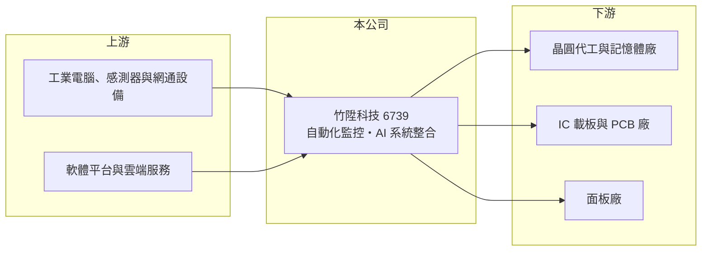

# 6739 竹陞科技

> 上櫃｜[[產業索引-其他電子業|其他電子業]]｜上市（櫃）日期 2024/09/02

# 第一章：企業模式與商業藍圖

> [!info] 撰寫說明
> 精簡版，由 Claude 依公開資料整理，架構比照 [[2330台積電]]，資料截至 2026-10-07。來源：winvest 營收快訊（2026 年 8 月）、優分析 2026 年 6 月營收報導。公開資料有限，產品別營收比重與客戶名稱未查到。#待校對

竹陞科技是替晶圓廠、記憶體廠與載板廠做產線自動化監控與 AI 系統整合的軟體型公司，2024 年 9 月掛牌後營收與獲利快速成長。

- **核心業務：** 竹陞成立於 2017 年，提供半導體、面板與 [[PCB]] 產線的自動化監控、遠端控制與 AI 系統開發，屬於[[工廠自動化]]與[[智慧製造]]的軟硬整合服務。
- **營收結構：** 本次未查到產品別比重；依優分析報導，主要客戶涵蓋晶圓代工大廠、國際記憶體廠與台灣最大載板廠。
- **營運據點：** 公司 2024 年 9 月上櫃，資本額約 2.34 億元，營運以台灣客戶廠區為主（推估）。
- **長期方向：** 公司正把[[代理式 AI]]與 [[Physical AI]] 技術導入製程監控，鎖定良率與製程複雜度提升帶來的客製化需求。

# 第二章：護城河深度與競爭優勢

竹陞的競爭力來自長期進駐大廠產線、熟悉製程與設備資料的整合經驗。

- **競爭優勢：** 依優分析報導，竹陞是晶圓代工大廠與國際記憶體廠的「標配」監控系統供應商，系統一旦導入產線，客戶更換供應商的成本高。
- **獲利特性：** 2026 年第一季[[毛利率]]達 68.38%，顯示以軟體與系統整合為主的高附加價值模式。
- **主要對手：** 國內外工廠自動化與製造執行系統（MES）軟體廠，以及客戶自建的 IT 團隊（推估）。
- **觀察重點：** 營收能否持續跟著客戶擴產與產線升級成長，以及 AI 解決方案能否擴展到半導體以外的客戶。

# 第三章：財務體質與盈利規模

資料日期：2026-10-07，以下數字是撰寫當時的快照；最新月營收、毛利率、累計 EPS 由自動排程寫在本筆記的屬性欄位（月營收、毛利率、累計EPS 等）。#待校對

竹陞 2026 年營收接近倍增，獲利同步大幅成長。

- **營收規模：** 2026 年 6 月營收 1.29 億元，連續 13 個月創新高；8 月營收 1.48 億元、年增 96.73%；1 至 8 月累計 9.30 億元，年增 97.06%。
- **獲利：** 2025 年全年 EPS 16.13 元；2026 年第一季 EPS 5.76 元、第二季 7.55 元，上半年 13.31 元、年增 132%。
- **財務特色：** 股本僅約 2.34 億元、市值約 265 億元，股本小使 EPS 高，市場給予高評價；毛利率接近七成，屬輕資產模式。

# 第四章：總體風險與地緣政治

竹陞的風險主要在於客戶集中與半導體資本支出週期。

- **產業週期：** 營收來自客戶擴產與產線升級，晶圓廠與記憶體廠資本支出放緩時，新案需求可能減少。
- **營運風險：** 主要客戶集中在少數半導體與載板大廠，單一客戶擴產計畫變動就會影響營收；系統整合人才的招募也是擴張瓶頸。
- **其他風險：** 股本小、評價高，營收成長若放緩，股價波動可能放大。

# 專有名詞解析

## 應用

- **[[代理式 AI]]**：能依目標自行規劃步驟、呼叫工具並執行任務的 AI 系統，而非只回答問題。
- **[[Physical AI]]**：讓 AI 感知並操作實體世界的技術，例如機器人與自動化設備。

## 金融

- **[[毛利率]]**：營收扣除銷貨成本後的毛利占營收比例，反映產品本身的獲利能力。

## 產業

- **[[工廠自動化]]**：以設備連線、監控軟體與機器人取代人工操作，讓產線自動生產與回報資料。
- **[[智慧製造]]**：結合設備資料、軟體分析與 AI，讓工廠能即時調整製程、提高良率與效率。
- **[[PCB]]**：印刷電路板，用銅箔線路連接電子零件的基板，是所有電子產品的基礎零組件。

# 核心供應鏈

- 上游：工業電腦、感測器、網通設備與軟體平台供應商（推估）
- 下游／客戶：晶圓代工大廠、國際記憶體廠、台灣最大載板廠（名稱未揭露）、面板廠
- 同業：國內外工廠自動化與 MES 系統整合商（推估）

## 最新新聞
<!-- news:start -->
<!-- news:end -->

## 相關連結
- [公開資訊觀測站](https://mopsov.twse.com.tw/mops/web/t05st03?step=1&firstin=1&co_id=6739)
- [Goodinfo](https://goodinfo.tw/tw/StockDetail.asp?STOCK_ID=6739)
- [Yahoo 股市](https://tw.stock.yahoo.com/quote/6739)
- [鉅亨網新聞](https://www.cnyes.com/twstock/6739/news)
