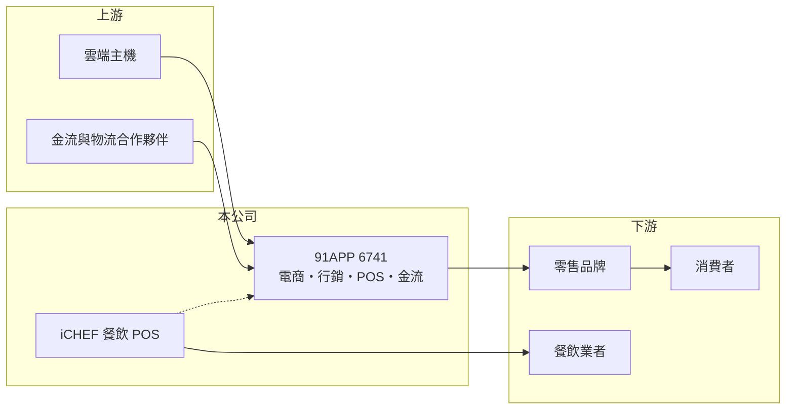

# 6741 91APP-KY

> 上櫃｜[[產業索引-數位雲端|數位雲端]]｜上市（櫃）日期 2021/05/25

# 第一章：企業模式與商業藍圖

> [!info] 撰寫說明
> 精簡版，由 Claude 依公開資料整理，架構比照 [[2330台積電]]，資料截至 2026-10-08。來源：櫃買中心開放資料（基本資料、資產負債、綜合損益、本益比殖利率）、MoneyDJ 年度財務比率、富果研究 2025 年 12 月法說會摘要（含 2024、2025 年營收）。2023 年以前營收未直接查得。#待校對

本章說明 91APP（6741）以[[SaaS]]服務零售品牌的商業模式。

- **核心業務：** 91APP 是在開曼註冊的控股公司，營運主體在台北南港，2021 年 5 月上櫃，董事長何英圻。公司替[[D2C]]品牌（直接面對消費者的零售品牌）提供線上開店、會員經營與門市整合的系統，協助品牌把官網、App 與實體門市的會員和訂單打通，也就是所謂的[[OMO]]。
- **產品結構：** 依富果整理的法說會內容，目前有電商、行銷、[[POS]]與金流四大解決方案，經常性收入超過九成。2025 年 12 月完成收購台灣餐飲 POS 業者 iCHEF，金額約 10 億元；iCHEF 2024 年營收約 4 億元、客戶超過 1.5 萬家，讓 91APP 從零售品牌延伸到中小型餐廳。
- **營收結構：** 收入主要來自月費訂閱、依交易額計算的服務費與金流手續費，因此和品牌客戶的業績連動。2025 年前三季行銷方案的訂閱費年增 18%、服務費年增 54%，是主要成長引擎（各方案營收比重未查得）。
- **長期方向：** 品牌經營從平台流量轉向自有會員，是 91APP 的長期需求基礎。公司的策略是用 AI 提升行銷工具價值，並透過 iCHEF 把金流與 POS 擴大到餐飲業，提高每位客戶的貢獻。

# 第二章：護城河深度與競爭優勢

本章分析 91APP 的護城河。

- **競爭優勢：** 品牌一旦把官網、會員資料、門市 POS 與行銷自動化都建在同一套系統上，更換供應商需要搬遷會員資料、重新訓練門市人員，轉換成本很高。經常性收入超過九成，加上[[毛利率]]長期在 72% 至 75%，顯示這是典型的高黏著度軟體生意。
- **主要對手：** 台灣的開店與 OMO 平台同業包括 SHOPLINE、Cyberbiz、[[6763綠界科技]] 的金流與開店服務，以及 [[6870騰雲]] 等 POS 與金流服務商；大型電商平台如 momo、蝦皮則是品牌另一個銷售選項。
- **觀察重點：** 第一是 iCHEF 整合後的金流交易量與交叉銷售成效。第二是營業利益率能否維持在 30% 以上。第三是有無新的海外市場布局，這方面的計畫目前未查得。

# 第三章：財務體質與盈利規模

資料日期：2026-10-08，表格是撰寫當時的快照；最新月營收、毛利率、累計 EPS 由自動排程寫在本筆記的屬性欄位（月營收、毛利率、累計EPS 等）。#待校對

本章用多年度數字檢視 91APP 的成長與獲利品質。

| 年度 | 營收（新台幣） | [[毛利率]] | [[營業利益率]] | EPS（元） | [[ROE]] |
|---|---|---|---|---|---|
| 2021 | 未查得 | 75.4% | 33.4% | 2.58 | 18.3% |
| 2022 | 未查得 | 75.1% | 32.5% | 2.83 | 13.8% |
| 2023 | 約 13.8 億（推算） | 75.0% | 30.5% | 3.37 | 15.0% |
| 2024 | 16.2 億 | 74.4% | 32.7% | 4.22 | 16.4% |
| 2025 | 18.1 億 | 74.2% | 32.6% | 4.40 | 15.8% |

- **營收規模：** 2024 年營收年增 17%、2025 年年增 12%（2023 年數字由 2024 年增率回推）。依櫃買中心資料，2026 年上半年營收約 11.0 億元，已併入 iCHEF；EPS 2.30 元。
- **獲利：** 毛利率穩定在 74% 上下，營業利益率維持 30% 以上，EPS 由 2020 年的 1.92 元逐年成長到 2025 年的 4.40 元。近五年平均 ROE 約 15.8%。
- **財務特色：** 2026 年第二季歸屬母公司權益約 29.9 億元，每股淨值 26.95 元；流動負債約 20.6 億元，推估包含代收的金流款項，非流動負債僅約 0.5 億元，幾乎沒有長期借款。依櫃買中心資料，最近一年每股股利約 2.05 元。
- **[[ROIC]] 與 [[WACC]]：** 2025 年營業利益約 5.90 億元（18.1 億 × 32.6%），稅後約 4.72 億元；投入資本以股東權益 29.9 億元加上以非流動負債 0.5 億元近似的有息負債，約 30.4 億元，ROIC 約 15.5%（推算，股東權益已含 iCHEF 收購產生的商譽）。WACC 以 CAPM 推估：無風險利率 1.75%、市場風險溢酬 6%、β 用軟體業常見值 1.0，股東權益成本約 7.75%；幾乎無有息負債，WACC 約 7.6%（推算）。ROIC 約為 WACC 的兩倍，屬於長期創造價值的公司。

# 第四章：總體風險與地緣政治

本章整理 91APP 長期必須面對的風險。

- **產業週期：** 收入與品牌客戶的線上業績連動，零售景氣轉弱時，交易服務費與行銷預算都會下降。不過訂閱費提供一定的底盤，波動比一般零售業小。
- **營運風險：** iCHEF 收購金額約 10 億元，若整合不如預期，可能產生商譽減損。金流業務涉及代收付款，需要遵守電子支付相關法規與資安要求，系統中斷會直接影響客戶營業。
- **其他風險：** 大型電商平台與國際 SaaS 業者的競爭，可能壓縮定價空間；AI 工具降低開發門檻，也可能讓新進者更容易推出替代方案。公司為開曼註冊的 KY 股，資訊揭露與股東權益保障的制度和本國公司略有不同。

# 專有名詞解析

## 應用

- **[[SaaS]]**：Software as a Service，軟體即服務，客戶以月費或年費透過網路使用軟體，不需自行安裝維護。
- **[[D2C]]**：Direct to Consumer，品牌透過自有官網、App 與門市直接面對消費者，而非只透過通路商銷售。
- **[[OMO]]**：Online Merge Offline，把線上與實體門市的會員、訂單與庫存整合成同一套經營體系。
- **[[POS]]**：銷售時點情報系統，門市結帳與記錄銷售資料的系統，現多與會員、庫存與金流整合。

## 金融

- **[[ROIC]]**：投入資本報酬率，稅後營業利益除以投入資本，衡量本業運用資金創造報酬的能力。
- **[[WACC]]**：加權平均資金成本，股東與債權人要求報酬率的加權平均，ROIC 高於 WACC 才代表創造價值。

# 核心供應鏈

- 上游：雲端主機服務（如 [[GOOGL谷歌]]、[[AMZN亞馬遜]] 等，實際採用平台請校對），以及金流、物流合作夥伴。
- 下游／客戶：服飾、美妝、生活用品等零售品牌，以及 iCHEF 服務的中小型餐廳。
- 同業：SHOPLINE、Cyberbiz、[[6763綠界科技]]、[[6870騰雲]]。

## 最新新聞
<!-- news:start -->
<!-- news:end -->

## 相關連結
- [公開資訊觀測站](https://mopsov.twse.com.tw/mops/web/t05st03?step=1&firstin=1&co_id=6741)
- [Goodinfo](https://goodinfo.tw/tw/StockDetail.asp?STOCK_ID=6741)
- [Yahoo 股市](https://tw.stock.yahoo.com/quote/6741)
- [鉅亨網新聞](https://www.cnyes.com/twstock/6741/news)
