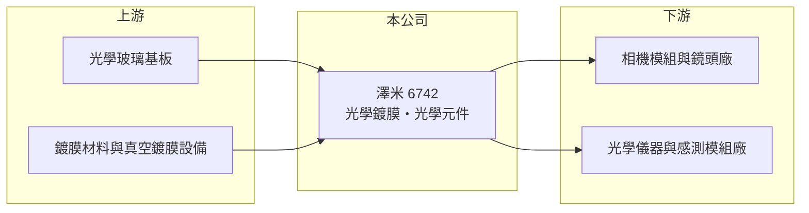

# 6742 澤米

> 上市｜[[產業索引-光電業|光電業]]｜上市（櫃）日期 2023/12/05

# 第一章：企業模式與商業藍圖

> [!info] 撰寫說明
> 精簡版，由 Claude 依公開資料整理，架構比照 [[2330台積電]]，資料截至 2026-10-07。來源：nStock 澤米公司簡介、winvest 營收快訊。公開資料有限。#待校對

澤米科技是光學鍍膜與光學元件廠，2023 年底上市，近兩年營收下滑並出現虧損。

- **核心業務：** 主要經營[[光學鍍膜]]與光學元件的生產與銷售，產品推估包含濾光片等鍍膜元件。
- **營收結構：** 本次未查到產品別或應用別營收比重。
- **營運據點：** 公司 2004 年成立，2022 年 11 月登錄興櫃，2023 年 12 月上市；生產據點明細本次未查到。
- **長期方向：** 公司需要找到新的應用與客戶，讓營收回到 2025 年以前的水準。

# 第二章：護城河深度與競爭優勢

澤米的技術核心在鍍膜製程，但目前營收萎縮顯示客戶或應用出現變化。

- **競爭優勢：** 光學鍍膜需精準控制膜層厚度與材料，量產良率與設備調校需長期累積（推估）。
- **主要對手：** 國內光學鍍膜與元件同業如 [[6668中揚光]]、[[6517保勝光學]]，以及中國濾光片廠。
- **觀察重點：** 毛利率何時轉正、月營收能否止跌，以及是否有新客戶或新產品導入。

# 第三章：財務體質與盈利規模

資料日期：2026-10-07，以下數字是撰寫當時的快照；最新月營收、毛利率、累計 EPS 由自動排程寫在本筆記的屬性欄位（月營收、毛利率、累計EPS 等）。#待校對

澤米營收明顯衰退，毛利率已轉為負值。

- **營收規模：** 2025 年全年營收 5.36 億元；2026 年 1 至 8 月累計 2.43 億元，年減 39.38%；8 月營收 3,164.5 萬元，年減 6.89%。
- **獲利：** 2025 年 EPS -1.52 元；2026 年上半年 EPS -0.87 元，[[毛利率]] -15.33%。
- **財務特色：** 營收縮小後設備折舊等固定成本無法攤提，形成負毛利；2024 年曾配發現金股利 0.3 元。

# 第四章：總體風險與地緣政治

澤米的風險在於營收持續萎縮與虧損延續。

- **產業週期：** 光學元件需求跟隨手機、安控與工業應用景氣，訂單有[[長鞭效應]]。
- **營運風險：** [[產能利用率]]偏低造成負毛利，若無新訂單填補，虧損可能延續並侵蝕淨值。
- **其他風險：** 中國光學鍍膜廠低價競爭、鍍膜材料價格，以及匯率變動。

# 專有名詞解析

## 應用

- **[[光學鍍膜]]**：在鏡片表面鍍上薄膜，以降低反射、過濾特定波長或提高耐用度。

## 金融

- **[[產能利用率]]**：實際產量占可生產量的比例，偏低時固定成本難以攤提。
- **[[毛利率]]**：營業毛利占營收的比例，反映產品的定價能力與成本控制。
- **[[長鞭效應]]**：終端需求的小幅變動沿供應鏈往上游傳遞時被逐級放大，造成上游庫存與訂單劇烈波動。

# 核心供應鏈

- 上游：光學玻璃基板、鍍膜材料與真空鍍膜設備供應商（推估）
- 下游／客戶：相機模組、鏡頭與感測模組廠（推估）
- 同業：[[6668中揚光]]、[[6517保勝光學]]、中國濾光片廠

## 最新新聞
<!-- news:start -->
<!-- news:end -->

## 相關連結
- [公開資訊觀測站](https://mopsov.twse.com.tw/mops/web/t05st03?step=1&firstin=1&co_id=6742)
- [Goodinfo](https://goodinfo.tw/tw/StockDetail.asp?STOCK_ID=6742)
- [Yahoo 股市](https://tw.stock.yahoo.com/quote/6742)
- [鉅亨網新聞](https://www.cnyes.com/twstock/6742/news)
