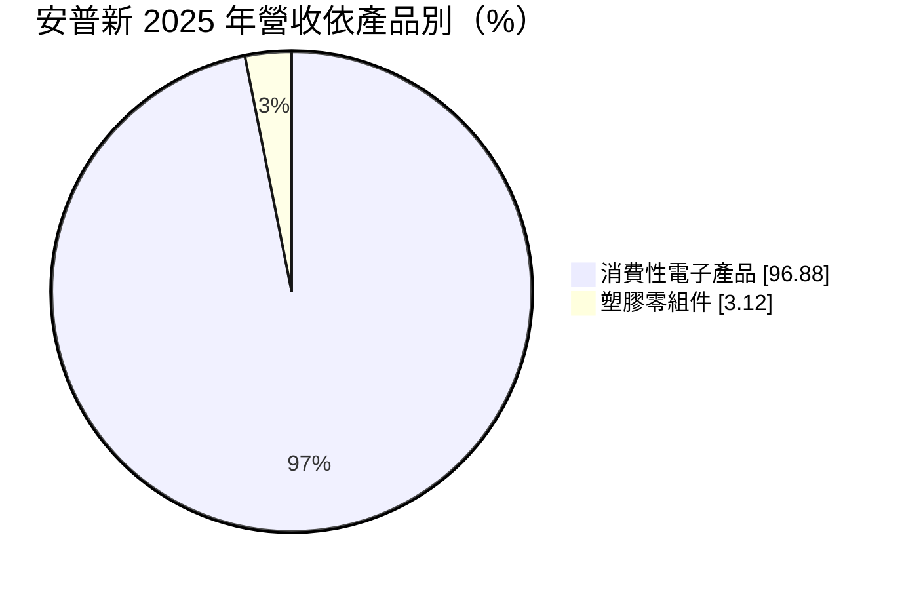
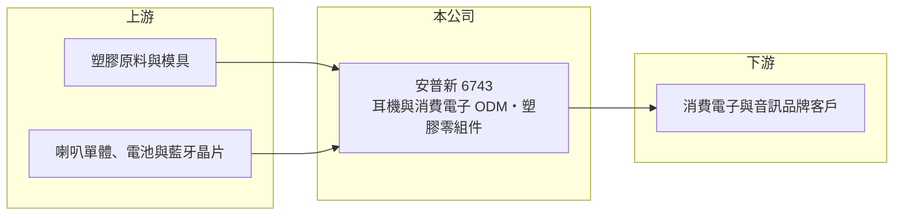

# 6743 安普新

> 上市｜[[產業索引-其他電子業|其他電子業]]｜上市（櫃）日期 2020/12/14

# 第一章：企業模式與商業藍圖

> [!info] 撰寫說明
> 精簡版，由 Claude 依公開資料整理，架構比照 [[2330台積電]]，資料截至 2026-10-08。來源：MoneyDJ 理財網（富邦證券站）安普新年度損益表、財務比率與基本資料；nStock 公司概況；winvest 公司簡介；證交所 2026 年第二季資產負債資料。公開資料有限，客戶名稱與生產據點未查到。#待校對

安普新是以耳機為主的消費性電子代工廠，營收規模約五十億元，但屬於毛利率不到兩成、獲利起伏很大的組裝型生意。

- **核心業務：** 安普新 1998 年成立，2020 年 12 月上市，從事耳機產品與消費性電子塑膠零組件的設計及製造。公司以 [[ODM]] 方式替品牌客戶開發與生產產品，自己不經營品牌，獲利來自設計能力與生產效率。
- **營收結構：** 依 MoneyDJ 2025 年資料，消費性電子產品占 96.88%、塑膠零組件僅 3.12%，代表公司已從零件供應商轉型為以成品組裝為主。成品營收規模大，但附加價值較低，毛利率長期落在 12% 至 25% 之間。
- **營運據點：** 總部在台北南港，生產據點本次未查到；消費性電子組裝多在中國或東南亞進行（推估）。生產地點的選擇會直接影響關稅成本與客戶接單意願。
- **長期方向：** 營收高度跟隨品牌客戶的新品週期，2024 年營收年增 78% 後，2025 年又年減 19%，顯示專案進出對公司影響很大。長期能否爭取更多元的客戶與產品線，是穩定獲利的關鍵。

# 第二章：護城河深度與競爭優勢

安普新的競爭力在於從[[塑膠射出]]機構件延伸到耳機整機的設計製造能力，但消費電子代工的進入門檻不高，護城河偏窄。

- **競爭優勢：** 同時具備塑膠機構件與耳機成品能力，可承接客戶從外殼設計到整機組裝的整案，縮短客戶開發時程（推估）。這類一條龍能力在中小型品牌客戶間較有吸引力。
- **主要對手：** nStock 列出的同業包括 [[2317鴻海]]、[[2312金寶]]、[[2354鴻準]]；耳機代工另有 [[2439美律]] 與中國大型代工廠。這些對手規模更大、採購成本更低，使安普新在價格上很難佔優勢。
- **觀察重點：** 長期要看客戶與產品是否分散、毛利率能否穩定在兩成附近，以及高負債結構能否改善。若營收繼續大起大落，獲利與股利也會跟著波動。

# 第三章：財務體質與盈利規模

資料日期：2026-10-08，表格是撰寫當時的快照；最新月營收、毛利率、累計 EPS 由自動排程寫在本筆記的屬性欄位（月營收、毛利率、累計EPS 等）。#待校對

安普新近五年營收在 39 億到 69 億元之間大幅擺盪，獲利率偏低，ROE 多數年份在個位數。

| 年度 | 營收（億元） | [[毛利率]] | [[營業利益率]] | EPS（元） | [[ROE]] |
|---|---|---|---|---|---|
| 2021 | 56.79 | 11.81% | -0.33% | -0.33 | -1.55% |
| 2022 | 50.52 | 13.58% | 1.88% | 0.50 | 2.65% |
| 2023 | 38.61 | 18.90% | 4.56% | -0.05 | -0.30% |
| 2024 | 68.81 | 18.37% | 8.59% | 2.10 | 11.01% |
| 2025 | 55.40 | 19.01% | 7.92% | 0.71 | 3.74% |

- **營收與獲利趨勢：** 2020 至 2025 年營收年複合成長率僅約 2.1%（推算），近五年平均 ROE 約 3.1%（推算）。2025 年營業利益 4.39 億元，但稅後淨利只剩 1.05 億元，代表利息、匯兌等業外項目吃掉大部分本業獲利。
- **財務特色：** 負債比率由 2020 年約 54% 升到 2025 年約 71%，是本批公司中最高的，營運資金多靠應付帳款與借款支應（推估）。現金股利不穩定，2021 至 2023 年度各 0.5 元，2024 年度 1.5 元，2025 年度 3 元高於當年 EPS，資金來源需以年報確認。
- **[[ROIC]] 與 [[WACC]]：** 以 2025 年營業利益 4.39 億元乘以（1－20%）得稅後營業利益約 3.51 億元，除以 2026 年第二季股東權益約 22.81 億元加非流動負債約 7.82 億元，ROIC 約 11.5%（推算）；但短期借款未查得、未納入分母，實際 ROIC 應更低。WACC 以 CAPM 推估：無風險利率 1.75%、市場風險溢酬 6%、β 未查得，取消費電子代工同業常見值 1.0，股權成本約 7.75%；稅後負債成本約 2.4%（假設利率 3%），以負債與權益各半估算，WACC 約 5% 至 6%（推算）。本業 ROIC 雖可能高於 WACC，但 ROE 長期偏低，股東實際拿到的報酬並不理想，關鍵在於降低業外損失與負債。

# 第四章：總體風險與地緣政治

安普新的風險集中在消費電子需求、客戶集中與高負債三者疊加。

- **產業週期：** 耳機與消費電子需求季節性明顯，通常上半年淡、下半年旺，品牌客戶調整庫存時，訂單波動會沿供應鏈被放大。營收在一年內增減兩三成並不罕見，獲利因此很難預測。
- **營運風險：** 代工毛利率不到兩成，良率、稼動率或客戶議價只要稍有變化，營業利益就會明顯縮水。營收多來自少數品牌客戶的專案（推估），一旦專案結束或轉單，營收缺口很難在短期補上。
- **其他風險：** 負債比率偏高，利率上升與匯率波動會直接侵蝕淨利；美國關稅與生產基地轉移也會帶來額外成本。塑膠原料與電子零件價格變動，則會影響產品成本。

# 專有名詞解析

## 金融

- **[[ROE]]**：股東權益報酬率，稅後淨利除以股東權益，衡量公司運用股東資本賺錢的效率。

## 產業

- **[[ODM]]**：原廠委託設計製造，代工廠負責產品設計與生產，產品掛品牌客戶的名稱銷售。
- **[[塑膠射出]]**：把加熱融化的塑膠注入模具冷卻成形，用來大量生產外殼與機構件。

# 核心供應鏈

- 上游：塑膠原料、模具、喇叭單體、電池與藍牙晶片供應商（推估）
- 下游／客戶：消費電子與音訊品牌（名稱未查到）
- 同業：[[2317鴻海]]、[[2312金寶]]、[[2354鴻準]]、[[2439美律]]

## 最新新聞
<!-- news:start -->
<!-- news:end -->

## 相關連結
- [公開資訊觀測站](https://mopsov.twse.com.tw/mops/web/t05st03?step=1&firstin=1&co_id=6743)
- [Goodinfo](https://goodinfo.tw/tw/StockDetail.asp?STOCK_ID=6743)
- [Yahoo 股市](https://tw.stock.yahoo.com/quote/6743)
- [鉅亨網新聞](https://www.cnyes.com/twstock/6743/news)
