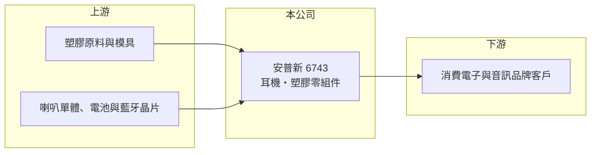

# 6743 安普新

> 上市｜[[產業索引-其他電子業|其他電子業]]｜上市（櫃）日期 2020/12/14

# 第一章：企業模式與商業藍圖

> [!info] 撰寫說明
> 精簡版，由 Claude 依公開資料整理，架構比照 [[2330台積電]]，資料截至 2026-10-07。來源：winvest 營收快訊（2026 年 8 月）、nStock 安普新公司概況。公開資料有限，產品別營收比重、客戶與生產據點未查到。#待校對

安普新是耳機與消費性電子塑膠零組件的設計製造廠，營收規模約 55 億元，但獲利率偏薄。

- **核心業務：** 安普新 1998 年成立，2020 年 12 月上市，從事耳機產品與消費性電子產品[[塑膠射出]]零組件的設計及製造，屬於[[ODM]]／代工型態。
- **營收結構：** 本次未查到耳機與塑膠零組件的營收比重；2025 年全年營收 55.41 億元。
- **營運據點：** 生產據點本次未查到；消費性電子代工多在中國或東南亞生產（推估）。
- **長期方向：** 公司營收隨品牌客戶新品週期起伏，2026 年下半年進入旺季，後續看能否把營收成長轉為獲利成長。

# 第二章：護城河深度與競爭優勢

安普新的競爭力在於耳機與塑膠件的設計加製造一條龍，但產業同質性高。

- **競爭優勢：** 同時具備耳機成品組裝與塑膠機構件能力，可承接客戶從外殼到成品的整案（推估）。
- **主要對手：** nStock 列出的同業包括 [[2317鴻海]]、[[2312金寶]]、[[2354鴻準]]；耳機代工另有 [[2439美律]] 等廠商。
- **觀察重點：** 下半年旺季營收能否帶動毛利率回升，以及新客戶或新產品的導入情況。

# 第三章：財務體質與盈利規模

資料日期：2026-10-07，以下數字是撰寫當時的快照；最新月營收、毛利率、累計 EPS 由自動排程寫在本筆記的屬性欄位（月營收、毛利率、累計EPS 等）。#待校對

安普新 2026 年營收成長約一成，但上半年獲利僅打平。

- **營收規模：** 2026 年 6 月營收 5.81 億元、7 月 7.92 億元（年增 50.24%）、8 月 7.18 億元（年增 12.68%）；1 至 8 月累計 39.48 億元，年增 10.16%。
- **獲利：** 2025 年全年 EPS 0.71 元；2026 年第一季 EPS 約 -0.19 元（推算），第二季 0.19 元，上半年累計 0 元；第二季[[毛利率]] 16.69%、營業利益率 5.97%、淨利率 2.05%。
- **財務特色：** 資本額 15 億元；依 nStock，近五年平均現金股利 1.2 元，最近一次配息 3 元，高於 2025 年 EPS，股利來源待確認。

# 第四章：總體風險與地緣政治

安普新的風險在於消費電子需求波動與代工毛利偏低。

- **產業週期：** 耳機與消費電子需求季節性明顯，上半年淡季容易虧損，品牌客戶庫存調整會放大訂單波動。
- **營運風險：** 代工產品毛利率不到兩成，客戶議價、良率或稼動率變化都會明顯影響獲利；客戶集中度本次未查到。
- **其他風險：** 塑膠原料價格、匯率，以及美國關稅與生產基地轉移的成本。

# 專有名詞解析

## 金融

- **[[毛利率]]**：營收扣除銷貨成本後的毛利占營收比例，反映產品本身的獲利能力。

## 產業

- **[[ODM]]**：原廠委託設計製造，代工廠負責產品設計與生產，產品掛品牌客戶的名稱銷售。
- **[[塑膠射出]]**：把加熱融化的塑膠注入模具冷卻成形，用來大量生產外殼與機構件。

# 核心供應鏈

- 上游：塑膠原料、模具、喇叭單體、電池與藍牙晶片供應商（推估）
- 下游／客戶：消費電子與音訊品牌（名稱未查到）
- 同業：[[2317鴻海]]、[[2312金寶]]、[[2354鴻準]]、[[2439美律]]

## 最新新聞
<!-- news:start -->
<!-- news:end -->

## 相關連結
- [公開資訊觀測站](https://mopsov.twse.com.tw/mops/web/t05st03?step=1&firstin=1&co_id=6743)
- [Goodinfo](https://goodinfo.tw/tw/StockDetail.asp?STOCK_ID=6743)
- [Yahoo 股市](https://tw.stock.yahoo.com/quote/6743)
- [鉅亨網新聞](https://www.cnyes.com/twstock/6743/news)
