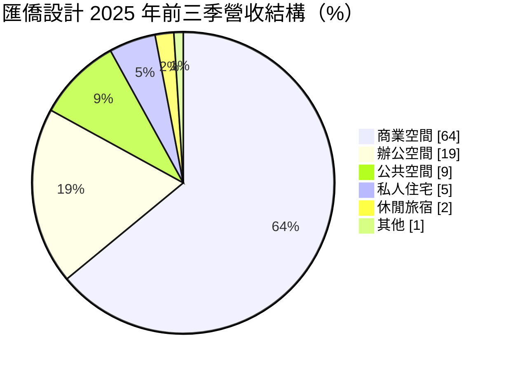
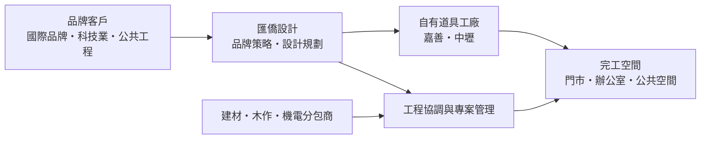
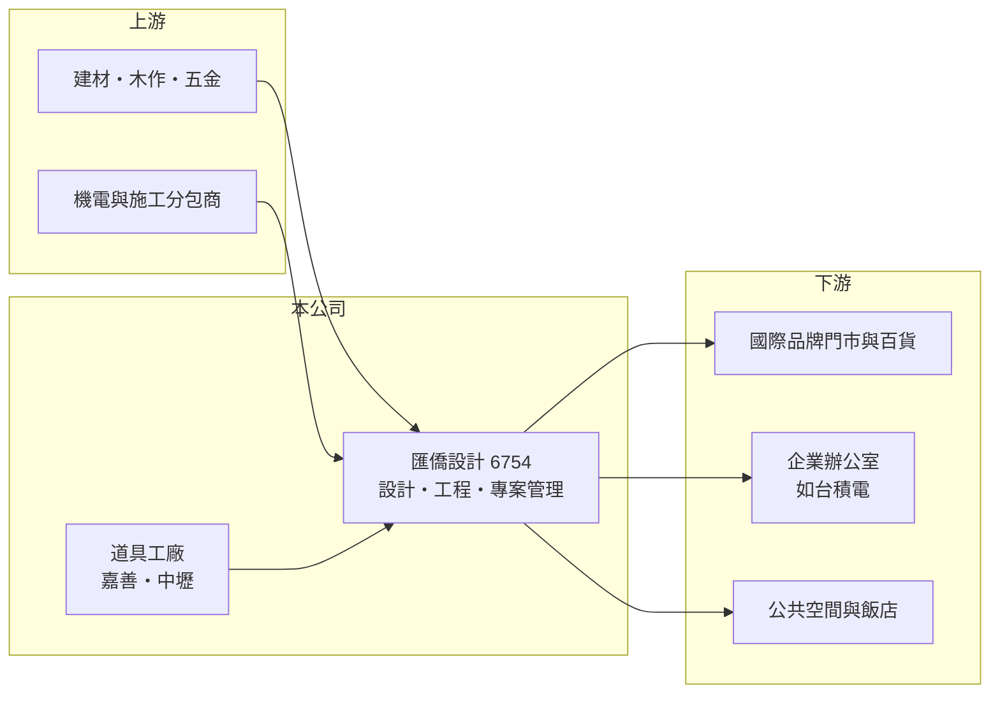

# 6754 匯僑設計

> 上市｜[[產業索引-居家生活|居家生活]]｜上市（櫃）日期 2020/08/25

# 第一章：企業模式與商業藍圖

> [!info] 撰寫說明
> 本文由 Claude 依公開資料整理，架構比照 [[2330台積電]] 的四章研究，資料截至 2026-10-08。財務數字來源：Goodinfo 年度經營績效頁、富果研究 2025 年 11 月法說會整理、nStock 公司簡介、優分析與 Yahoo 股市報導標題；與 [[2904匯僑]] 的集團關係為推估，尚未逐條比對原始文件。#待校對

在評估單一個股的長期投資價值時，首要步驟是拆解企業的底層獲利邏輯。本章說明匯僑設計（股票代號：6754）這家台股少見的室內設計公司，如何以「設計加工程加製作」的一站式服務承接商業空間專案。

## 一、核心定位：一站式商業空間設計與裝修

- **核心業務：** 匯僑設計於 2014 年 12 月在台北設立，從事室內裝潢與裝修、景觀及室內設計，被媒體稱為台股首家以室內設計為主業的掛牌公司，客戶包括 [[2330台積電]]。它提供的不只是設計圖，而是從品牌策略、設計規劃、工程協調、道具製作到專案管理的整套服務，屬於[[室內裝修統包]]的模式。2025 年完成超過 400 件專案，其中超過 300 件是跨境案件。
- **營收結構：** 2025 年前三季營收中，商業空間占 64%（約 17.6 億元）、辦公空間占 19%、公共空間占 9%、私人住宅占 5%、休閒旅宿占 2%。商業空間包括國際品牌門市、百貨專櫃與展示空間，這類客戶在全球展店時需要統一的設計標準與快速施工，正是匯僑設計的主要市場。

- **營運據點：** 公司在台北、上海、浙江嘉善與桃園中壢設有據點，員工約 610 人。嘉善與中壢設有道具製作工廠，為大中華、亞洲、歐洲、北美、非洲與中東的客戶生產展示道具與門市裝置。

## 二、資本轉化邏輯：設計帶動工程與製作

- **價值鏈整合：** 一般室內設計公司只收設計費，匯僑設計則把設計、工程與道具製作整合在一起，營收規模因此遠大於純設計事務所。設計是接案的入口，工程與製作才是營收主體；自有工廠讓它能在多個國家複製同一品牌的門市，品質與交期更可控。
- **[[在手訂單]]：** 2025 年第三季時，未完工合約金額接近 26 億元，延續到 2028 年（含高鐵相關專案），其中約 17 億元預計在 2026 年認列。專案型公司的營收取決於接單節奏，在手訂單是判斷未來一兩年營收的主要依據。

## 三、長期方向

- **長期方向：** 公司的長期策略包括一站式整合服務、導入 AI 與 [[BIM]]（含 BIM to CAM 製造）、發展低碳材料與模組化施工，以及培養跨國專案管理人才。市場面上，台灣未來幾年有大量新商場、A 級辦公室與國際品牌飯店開幕，是重要的接案來源；中國則採保守策略，把部分產能轉向國際品牌與台灣專案。

# 第二章：護城河深度與競爭優勢

「護城河」指企業抵禦競爭、維持超額利潤的保護機制。本章分析匯僑設計在分散的室內裝修產業中的位置。

## 一、護城河的核心組成

- **競爭優勢：** 第一是跨國執行能力。國際品牌在多國同時展店，需要一家能統一設計標準、跨境施工並準時交付的合作夥伴，匯僑設計每年三百多件跨境案件的經驗是小型設計公司難以複製的。第二是自有道具工廠，從設計到製作一手掌握，可以控制品質與交期。第三是大型客戶的信任，能承接科技大廠與公共工程專案，代表公司具備完整的專案管理與財務能力。
- **主要對手：** 室內設計與裝修產業高度分散，對手包括眾多本土設計公司、營造與機電工程公司的室內裝修部門，以及國際設計事務所。中國市場還有大量當地裝修公司以低價競爭。

## 二、優勢轉化：守得住／守不住／觀察重點

- **守得住：** 國際品牌的跨國展店需求與大型專案的專案管理能力，這些客戶重視可靠度勝於價格。
- **守不住：** 專案的毛利與規模穩定度。專案型業務的營收受接單時點影響，2025 年營收從 51.1 億元降到 35.3 億元，公司說明與市場狀況及在中國更嚴格篩選客戶有關。
- **觀察重點：** 在手訂單是否持續補充、台灣商場與飯店開幕潮能否轉化為訂單，以及中國業務縮減後的營收結構。

# 第三章：財務體質與盈利規模

資料日期：2026-10-08。數字取自 Goodinfo 年度經營績效與富果研究法說會整理，表格是撰寫當時的快照；最新月營收、毛利率、累計 EPS 由自動排程寫在本筆記的屬性欄位（月營收、毛利率、累計EPS 等）。#待校對

財務報表是檢驗護城河是否真實存在的最終標準。本章用六年的數字檢視匯僑設計的專案型營收波動與資本效率。

## 一、多年度經營績效

| 年度 | 營收（新台幣） | [[毛利率]] | [[營業利益率]] | EPS（元） | [[ROE]] |
|---|---|---|---|---|---|
| 2020 | 31.2 億 | 26.4% | 11.4% | 3.43 | 12.1% |
| 2021 | 41.4 億 | 21.4% | 8.36% | 3.52 | 11.7% |
| 2022 | 51.0 億 | 20.3% | 8.60% | 5.23 | 16.7% |
| 2023 | 46.5 億 | 22.3% | 8.35% | 4.25 | 13.1% |
| 2024 | 51.1 億 | 23.6% | 10.1% | 6.40 | 18.7% |
| 2025 | 35.3 億 | 23.8% | 6.82% | 3.41 | 9.58% |

- **營收規模：** 2020 至 2025 年營收年複合成長率約 2.5%（推算），但每年波動很大，從 31 億元到 51 億元不等，反映專案型業務的特性。
- **獲利：** 毛利率穩定在 20% 至 26%，營業利益率多在 7% 至 11%，屬於工程服務業的正常水準。2025 年營收大減使營業利益率降到 6.8%，EPS 3.41 元。業外損益每年為正，但新台幣升值時美元部位會產生匯損。
- **財務特色：** 2021 至 2025 年平均 ROE 約 14.0%（推算）。2024 年現金股利 4.0 元，2025 年擬配發 3.5 元、超過當年 EPS，公司表示要維持穩定的股利政策。負債占資產約 52%，多為專案相關的預收款與應付款。

## 二、[[ROIC]] 與 [[WACC]]

**ROIC 推算：** 2025 年營業利益約 2.41 億元（35.3 億 × 6.82%），稅後約 1.93 億元。股東權益約 23.3 億元（每股淨值 35.28 元 × 約 0.66 億股），負債多為營業負債，有息負債金額未查得、假設接近零（推估），ROIC 約 8.3%（推算）。2024 年同樣算法，稅後營業利益約 4.13 億元、股東權益約 23.8 億元，ROIC 約 17%（推算）。

**WACC 推算：** 假設台灣 10 年期公債 1.75%、市場風險溢酬 6%、β 取工程服務股常見值 0.9（推估），股東權益成本約 7.15%；幾乎全為權益資本，WACC 約 7%（推算）。

**結論：** 匯僑設計在正常接單年度的 ROIC 明顯高於 WACC，屬於創造價值的輕資產服務公司；但在接單低谷時，利差會縮小到接近零。長期價值取決於在手訂單的穩定度，以及能否降低單一市場（中國）與單一大案對營收的影響。

# 第四章：總體風險與地緣政治

任何企業都無法脫離宏觀環境獨立存在。本章分析匯僑設計長期面對的風險。

## 一、產業與結構風險

- **產業週期：** 商業空間裝修跟著零售品牌的展店、商辦新供給與飯店開發走，景氣轉弱時品牌會延後展店、企業會延後辦公室翻新。專案型營收的高低起伏，是這門生意的本質。
- **營運風險：** 大型專案的成本控管、工期延誤與追加變更都可能侵蝕毛利。人才是核心資產，台灣設計人才被東南亞市場挖角，跨國專案管理人才也難以快速培養。

## 二、其他風險

- **地緣政治：** 上海與嘉善據點讓公司暴露在中國市場的景氣與政策風險下，公司已採保守策略，把部分中國產能轉向國際品牌與台灣專案。
- **匯率：** 跨境專案多以美元計價，新台幣升值會產生匯兌損失，2025 年第二季就曾因此認列大額未實現匯損。
- **原物料與法規：** 木材、建材與人工成本上漲會影響專案毛利；建築與消防法規、綠建材與碳排要求的提高，會改變設計與施工方式。

# 專有名詞解析

## 金融

- **[[ROIC]]**：投入資本報酬率，稅後營業利益除以股東權益加有息負債，衡量本業運用資本的效率。
- **[[WACC]]**：加權平均資金成本，股東與債權人要求報酬的加權平均，ROIC 高於它才代表創造價值。

## 產業

- **[[室內裝修統包]]**：由同一家公司負責室內設計、施工與材料採購的一條龍服務，業主只需面對單一窗口。
- **[[BIM]]**：建築資訊模型，以 3D 模型整合建築、結構與機電資料，可在施工前找出管線衝突。
- **[[在手訂單]]**：已簽約但尚未完成認列的合約金額，是專案型公司預測未來營收的依據。

# 核心供應鏈

## 1. 上游：材料與分包
- 建材、木作、五金與機電施工分包商（具體廠商未查得）

## 2. 中游：匯僑設計
- 推估集團：[[2904匯僑]]
- 據點：台北、上海、浙江嘉善、桃園中壢

## 3. 下游：客戶
- 國際品牌零售門市、百貨商場
- 企業辦公室：[[2330台積電]]（依媒體報導）
- 公共空間（含高鐵相關專案）、國際品牌飯店

## 最新新聞
<!-- news:start -->
<!-- news:end -->

## 相關連結
- [公開資訊觀測站](https://mopsov.twse.com.tw/mops/web/t05st03?step=1&firstin=1&co_id=6754)
- [Goodinfo](https://goodinfo.tw/tw/StockDetail.asp?STOCK_ID=6754)
- [Yahoo 股市](https://tw.stock.yahoo.com/quote/6754)
- [鉅亨網新聞](https://www.cnyes.com/twstock/6754/news)
